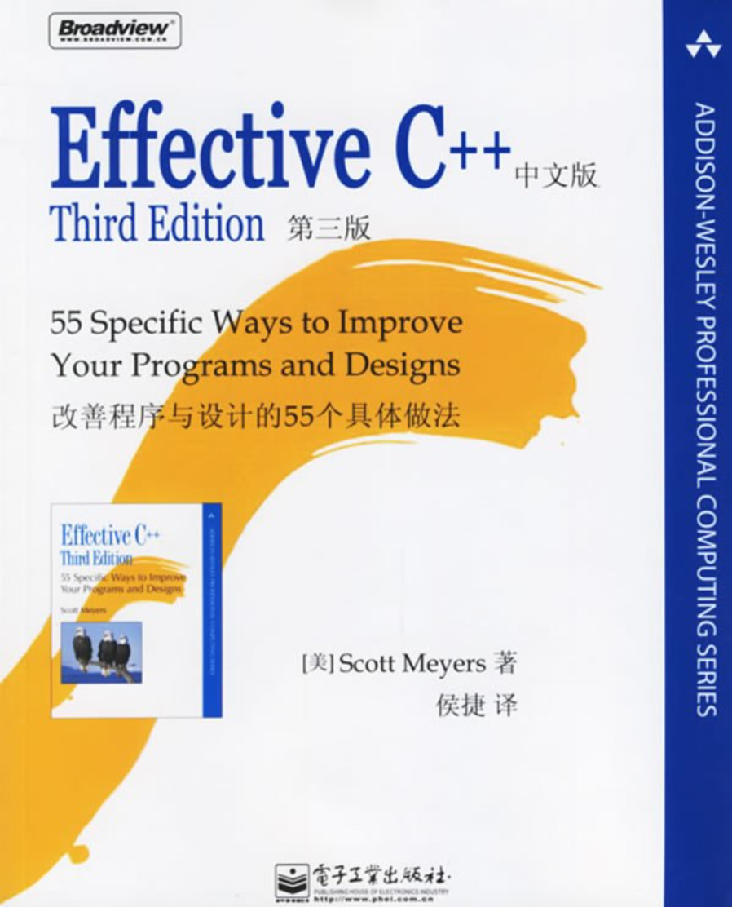

# Effective C++（第三版）



[TOC]


# [Part-1.让自己习惯C++](#contents)

## [条款01.视C++为一个语言联邦](#contents)

c++是多重范型编程语言，视c++包括4种次语言： 

1：C； 

2：Object-Oreinted C++；

3：Template C++；

4：STL（template程序库，包括容器、迭代器、算法和函数对象）

## [条款02.尽量以const，enum，inline替换 #define](#contents)

**const**

1.#define直接替换导致名称未被编译器看到

2.#define不重视作用域，所以无法提供封装性

**enum**

1.取一个const的地址是合法的，但是取enum的地址不合法

**inline**

1.#define定义函数可能导致误用，最好用inline函数替换

**注意**

对于单纯常量，最好以const对象或enums替换#defines；

对于形似函数的宏，最好改用inline函数替换#defines。

## [条款03.尽可能使用const](#contents)

1.令函数返回一个常量值，可以预防无意义的赋值动作（例：p19）

**const成员函数**

1.const对象只能访问const成员函数,而非const对象可以访问任意的成员函数

2.const成员函数不能修改对象的数据成员，const对象的成员变量不可以修改（mutable修饰的数据成员除外）

**注意**

1.两个成员函数如果只是常量性不同（有无const），是可以被重载的

2.当const和non-const成员函数有着实质等价的实现时，令non-const版本调用const版本避免代码重复（使用转型，条款27提及）

## [条款04.确认对象被使用前已经被初始化](#contents)

1.为内置对象进行手工初始化；对于类类型，构造函数负责初始化

2.构造函数最好使用初始化列表进行初始化，而不是使用赋值操作；最好总是以声明次序为其初始化次序

3.不同编译单元的non-local static对象初始化相对次序并无明确定义，以local对象替换得以免除问题，例：
```C++
class Example { ... };
Example& emp()
{
    static Example emp;
    return emp;
}
```

**注意**

函数内的local static对象会在“该函数调用期间” “首次遇上该对象之定义式”时被初始化

# [Part-2.构造/析构/赋值运算](#contents)

## [条款05：了解C++默默编写并调用了哪些函数](#contents)

编译器会主动为编写的任何类**声明**一个拷贝构造函数、拷贝复制操作符和一个析构函数，同时如果你没有声明任何构造函数，编译器也会为你声明一个默认的的拷贝构造函数，这些函数都是public且inline的。注意，上边说的是声明，只有当这些函数有调用需求的时候，编译器才会帮你去实现它们。但是编译器替你实现的函数可能在类内引用、类内指针、有const成员以及类型有虚属性的情形下会出问题。

- 对于拷贝构造函数，要考虑到类内成员有没有**深拷贝**的需求，如果有的话就需要自己编写拷贝构造函数/操作符，而不是把这件事情交给编译器来做。
- 对于拷贝构造函数，如果类内有**引用成员或const成员**，需要自己定义拷贝行为，因为编译器实现的拷贝行为在上述两个场景很有可能是有问题的。
- 对于析构函数，如果该类有多态需求，请主动将析构函数声明为virtual，具体请看条款07 。

除了这些特殊的场景以外，如果不是极其简单的类型，编写好构造、析构、拷贝构造和赋值操作符、移动构造和赋值操作符（C++11、如有必要）这六个函数

## [条款06：若不想使用编译器自动生成的函数，就该明确拒绝。](#contents)

承接上一条款，如果你的类型在语义或功能上需要明确禁止某些函数的调用行为，比如禁止拷贝行为，那么就应该禁止编译器去自动生成它。作者在这里给出了两种方案来实现这一目标：

1. 将被禁止生成的函数声明为**private**并**省略实现**，这样可以禁止来自类外的调用。但是如果类内不小心调用了（成员函数、友元），那么会得到一个链接错误。
2. 将上述的可能的链接错误转移到编译期间。设计一个不可拷贝的工具基类，将真正不可拷贝的基类私有继承该基类型即可，但是这样的做法过于复杂，对于已经有继承关系的类型会引入多继承，同时让代码晦涩难懂
3. 对于C++11，我们可以直接使用= delete来声明拷贝构造函数，显示禁止编译器生成该函数。

## [条款07：为多态基类声明virtual](#contents)

该条款的核心内容为：**带有多态性质的基类必须将析构函数声明为虚函数，防止指向子类的基类指针在被释放时只局部销毁了该对象**。如果一个类有多态的内涵，那么几乎不可避免的会有基类的指针（或引用）指向子类对象，因为非虚函数没有动态类型，所以如果基类的析构函数不是虚函数，那么在基类指针析构时会直接调用基类的析构函数，造成子类对象仅仅析构了基类的那一部分，有内存泄漏的风险。除此之外，还需注意：

1. 普通的基类无需也不应该有虚析构函数，因为虚函数无论在时间还是空间上都会有代价，详情《More Effective C++》条款24
2. 如果一个类型没有被设计成基类，又有被误继承的风险，请在类中声明为final（C++11中用于禁止该类被继承），这样禁止派生可以防止误继承造成上述问题。
3. 编译器自动生成的析构函数是非虚的，所以多态基类必须将析构函数显示声明为virtual。

## [条款08：别让异常逃离析构函数](#contents)

**析构函数一般情况下不应抛出异常**，因为很大可能发生各种未定义的问题，包括但不限于内存泄露、程序异常崩溃、所有权被锁死等。

一个直观的解释：析构函数是一个对象生存期的最后一刻，负责许多重要的工作，如线程，连接和内存等各种资源所有权的归还。如果析构函数执行期间某个时刻抛出了异常，就说明**抛出异常后的代码无法再继续执行**，这是一个非常危险的举动——因为析构函数往往是为类对象兜底的，甚至是在该对象其他地方出现任何异常的时候，析构函数也有可能会被调用来给程序擦屁股。在上述场景中，如果在一个异常环境中执行的析构函数又抛出了异常，很有可能会让程序直接崩溃，这是每一个程序员都不想看到的。

如果某些操作真的很容易抛出异常，如资源的归还等，并且你又不想把异常吞掉，那么就请把这些操作移到析构函数之外，提供一个普通函数做类似的清理工作，在析构函数中只负责记录，我们需要时刻保证析构函数能够执行到底。

## [条款09：绝不在构造和析构过程中调用virtual函数。](#contents)

在多态环境中，我们需要重新理解构造函数和析构函数的意义，这两个函数在执行过程中，涉及到了对象类型从基类到子类，再从子类到基类的转变。

一个子类对象开始创建时，首先调用的是基类的构造函数，在调用子类构造函数之前，该对象将一直保持着“基类对象”的身份而存在，自然**在基类的构造函数中调用的虚函数——将会是基类的虚函数版本**。在子类的构造函数中，原先的基类对象变成了子类对象，这时子类构造函数里调用的是子类的虚函数版本。这是一件有意思的事情，这说明在构造函数中虚函数并不是虚函数，在不同的构造函数中，调用的虚函数版本并不同，因为随着不同层级的构造函数调用时，对象的类型在实时变化。那么相似的，析构函数在调用的过程中，子类对象的类型从子类退化到基类。

因此，如果指望在基类的构造函数中调用子类的虚函数，那就趁早打消这个想法。但很遗憾的是，你可能并没有意识到自己做出了这样的设计，例如将构造函数的主要工作抽象成一个init()函数以防止不同构造函数的代码重复是一个很常见的做法，但是在init()函数中是否调用了虚函数，就要好好注意一下了，同样的情况在析构函数中也是一样。

## [条款10：令operator =返回一个reference to *this](#contents)

简单来说：这样做可以让赋值操作符实现“连等”的效果：
````c++
x = y = z = 10;
````
在设计接口时一个重要的原则是，让自己的接口和内置类型相同功能的接口尽可能相似，所以如果没有特殊情况，就让赋值操作符的返回类型为`ObjectClass&`类型并在代码中返回`*this`。

## [条款11：在operator=中处理“自我赋值”](#contents)

自我赋值指的是将自己赋给自己。这是一种看似愚蠢无用但却在代码中出现次数比任何人想象的多得多的操作，这种操作常常需要借指针来实现：

````C++
*pa = *pb;		 		//pa和pb指向同一对象，便是自我赋值。
arr[i] = arr[j];		//i和j相等，便是自我赋值
````

那么对于管理一定资源的对象重载的operator= 中，一定要对是不是自我赋值格外小心并且增加预判，因为无论是深拷贝还是资源所有权的转移，原先的内存或所有权一定会被清空才能被赋值，如果不加处理，这套逻辑被用在自我赋值上会发生**先把自己的资源给释放掉了，然后又把已释放掉的资源赋给了自己**这样的错误。

第一种做法是在赋值前增加预判，但是这种做法没有异常安全性，试想如果在删除掉原指针指向的内存后，在赋值之前任何一处跑出了异常，那么原指针就指向了一块已经被删除的内存。

````C++
SomeClass& SomeClass::operator=(const SomeClass& rhs) {
      if (this == &rhs) 
		return *this;  
      delete ptr;	
      ptr = new DataBlock(*rhs.ptr);				//如果此处抛出异常，ptr将指向一块已经被删除的内存。
      return *this;
    }
````

如果把异常安全性也考虑在内，那么我们就会得到如下方法，令人欣慰的是这个方法也解决了自我赋值的问题。

````C++
SomeClass& SomeClass::operator=(const SomeClass& rhs) {
  DataBlock* pOrg = ptr;
  ptr = new DataBlock(*rhs.ptr);				//如果此处抛出异常，ptr仍然指向之前的内存。
  delete pOrg;
  return *this;
}
````

另一个使用copy and swap技术的替代方案将在条款29中作出详细解释。

## [条款12：复制对象时别忘了它的每一个成分](#contents)

1. 当给类多加了成员变量时，请不要忘记在拷贝构造函数和赋值操作符中对新加的成员变量进行处理。但如果你忘记处理，编译器也不会报错。
2. 如果你的类有继承，那么在你为子类编写拷贝构造函数时一定要格外小心复制基类的每一个成分，这些成分往往是private的，所以你无法访问它们，你应该让**子类使用子类的拷贝构造函数去调用相应基类的拷贝构造函数**：

````C++
//在成员初始化列表显示调用基类的拷贝构造函数
ChildClass::ChildClass(const ChildClass& rhs) : BaseClass(rhs) {		
  	// ...
}
````

除此之外，拷贝构造函数和拷贝赋值操作符，他们两个中任意一个不要去调用另一个，这虽然看上去是一个避免代码重复好方法，但是是荒谬的。其根本原因在于拷贝构造函数在构造一个对象——这个对象在调用之前并不存在；而赋值操作符在改变一个对象——这个对象是已经构造好了的。因此前者调用后者是在给一个还未构造好的对象赋值；而后者调用前者就像是在构造一个已经存在了的对象。不要这么做！

# [Part-3.资源管理](#contents)

## [条款13：以对象管理资源](#contents)

问题：以面向流程的方式管理资源（的获取和释放），总是会在各种意外出现时，丢失对资源的控制权并造成资源泄露。以面向过程的方式管理资源意味着，资源的获取和释放都分别被封装在函数中。这种管理方式意味着资源的索取者肩负着释放它的责任，但此时我们就要考虑一下以下几个问题：调用者是否总是会记得释放呢？调用者是否有能力保证合理地释放资源呢？不给调用者过多义务的设计才是一个良好的设计。

会造成释放资源出问题的原因有：

1. 一句简单的delete语句并不会一定执行，例如一个过早的return语句或是在delete语句之前某个语句抛出了异常
2. 谨慎的编码可能能在这一时刻保证程序不犯错误，但无法保证软件接受维护时，其他人在delete语句之前加入的return语句或异常重复第一条错误。

为了保证资源的获取和释放一定会合理执行，我们把获取资源和释放资源的任务封装在一个对象中。**当我们构造这个对象时资源自动获取，当我们不需要资源时，我们让对象析构**。这便是“Resource Acquisition Is Initialization; RAII”的想法，因为我们总是在获得一笔资源后于同一语句内初始化某个管理对象。无论控制流如何离开区块，一旦对象被销毁（比如离开对象的作用域）其析构函数会自动被调用。

具体实践请参考C++11的shared_ptr<T>。

## [条款14：在资源管理类小心copy行为](#contents)

一般资源管理类复制时可以选择以下做法：

1. 禁止复制（复制不合理）
2. “引用计数法”（使用tr1::shared_ptr指定“删除器”阻止引用次数为0时的删除行为）
3. 复制底层资源（“深度拷贝”）
4. 转移底部资源的拥有权（auto_ptr）


## [条款15：在资源管理类中提供对原始资源的访问](#contents)

- get成员函数实现显式转换（安全，受欢迎）
- 隐式转换函数（方便），例：

````C++
class Tmp{
public:
    ...
    operator TmpConvertType() const  //隐式转换函数
    { return t; }
    ...
private:
    TmpConvertType t;
};
````

## [条款16：成对使用new和delete要采用相同的格式](#contents)

对于下面这段代码

````C++
std::string *strArr = new std::string[100]; //动态分配100元素的字符串数组
...             //使用
delete strArr;  //释放
````

看起来new与delete似乎是对应了，可是这样只会释放数组的第一个元素，其他99个对象则不会被释放，因为它们的析构函数没有被调用。

new和delete的工作原理：当使用new运算符的时候会发生两件事，所申请的内存空间会先被分配出来，然后一个或者多个对象的构造函数被调用来填满这些空间;当使用delete的时候，则是先调用这些对象的析构函数，最后释放内存资源。

delete要删除多少个对象取决于在当前内存空间中调用多少个析构函数，那么编译器就需要知道到底是删除单个对象还是一个数组，因为单个对象和一个数组的对象有不同的内存布局：数组的内存除了它所包含的对象，还包括了一个额外的数，即数组的大小，用来告诉编译器调用多少个析构函数。以下是内存示意图:

````C++
单个对象：       |对象|
一个数组的对象： 	| n | 对象 | 对象 | 对象 | 对象 |...  //n即为数组的大小
````

所以需要告诉编译器具体是删除单个对象还是一个数组，即使用delete还是delete[]:

````C++
std::string strPtr1 = new std::string;  //分配单个对象
std::string strPtr2 = new str::string[100];  //分配一个数组
...
delete strPtr1;   //使用delete删除单个对象
delete[] strPtr2; //使用delete[]删除数组
````

但是如果我们使用delete[]来释放单个对象会发生什么？未定义，因为决定于不同的编译器，delete[]可能会读取一些内存作为上面的n，然后调用析构函数n次，这就可能会损坏到其他数据，或者它根本就调用不了任何析构函数，因为它读取对象的地址是不正确的。

总之，结论很简单，如果在new里分配了数组，就要确保delete也释放数组，如果没有在new里分配数组，就不要在delete里释放数组。同样如果一个类含有动态分配的数组成员，并且支持多个构造函数，就要确保每个构造函数都使用数组版本的new，否则析构函数就可能不会使用正确版本的delete。

## [条款17：以单独的语句创建智能指针](#contents)

假设有如下函数

```C++
int priority();  //返回处理优先级
void processWidget(std::shared_ptr<Widget> pw, int priority); //处理对象根据不同优先级
````

现在用如下语句调用函数

````C++
processWidget(new Widget, priority());
````

这句调用必然会导致编译器报错，因为除非定义过隐式转换的运算符，裸指针对象不能被隐式转换为智能指针对象，下面才是语法正确的调用方式:

````C++
processWidget(std::shared_ptr<Widget>(new Widget), priority());
````

但是，即使这里使用了智能指针，也可能发生内存泄漏。

**编译器的工作原理**：编译器在生成对processWidget函数的调用之前，必须先解析其中的参数。这里我们有两个参数，分别是智能指针的构造函数和整型的函数priority()。在调用智能指针的构造函数之前，编译器又必须先要解析其中的new Widget语句，因此解析该函数的参数分为三步:

- 调用priority()函数
- 执行new语句
- 调用智能指针构造函数

不像Java或者C#的编译器只会以固定的顺序解析参数，C++编译器多种多样，而且根据优化选项的不同，编译器可能会改变这三步的执行顺序，以此利用指令流水线停顿的周期(pipeline stall)，获得更高效率的代码。但不论如何改变，**底线是new语句必须提前于智能指针的构造函数**，所以假设我们的编译器生成的机器代码实际执行了这样的顺序:

1. 执行new语句
2. 调用priority()函数
3. 调用智能指针函数

如果priority()函数抛出了异常呢？那么**从new语句动态分配的资源在到达智能指针构造函数之前就会泄露了**。解决方法也很简单，使用一个单独的语句来创建智能指针对象:

````C++
std::shared_ptr<Widget> pw(new Widget); //放在单独的语句里
processWidget(pw,priority());  //这样就不会泄露资源了
````

编译器是逐语句编译的，通过使用一个单独的语句来构造智能指针对象，编译器就不会随意改动解析顺序，保证了生成的机器代码顺序是异常安全的，以及这样的代码写出来也更加美观。

# [Part-4.设计与声明](#contents)

## [条款18：让接口容易被正确使用，不易被误用](#contents)

在设计接口时，我们常常会错误地假设，接口的调用者**拥有某些必要的知识来规避一些常识性的错误**。但事实上，接口的调用者并不总是像正在设计接口的我们一样“聪明”或者知道接口实现的”内幕信息“，结果就是，我们错误的假设使接口表现得不稳定。这些不稳定因素可能是由于调用者缺乏某些先验知识，也有可能仅仅是代码上的粗心错误。接口的调用者可能是别人，也可能是未来的你。所以**一个合理的接口，应该尽可能的从语法层面并在编译之时运行之前，帮助接口的调用者规避可能的风险**

- 使用外覆类型（wrapper）提醒调用者传参错误检查，将参数的附加条件限制在类型本身，例如：

当调用者试图传入数字“13”来表达一个“月份”的时候，你可以在函数内部做运行期的检查，然后提出报警或一个异常，但这样的做法更像是一种责任转嫁——调用者只有在尝试过后才发现自己手残把“12”写成了“13”。如果在设计参数类型时就把“月份”这一类型抽象出来，比如使用enum class（强枚举类型），就能帮助客户在编译时期就发现问题，把参数的附加条件限制在类型本身，可以让接口更易用。

- 接口应表现出与内置类型的一致性

让自己的类型和内置类型的一致性，比如自定义容器的接口在命名上和STL应具备一致性，可以有效防止调用者犯错误。或者你有两个对象相乘的需求，那么你最好**重载operator***而并非设计名为”multiply”的成员函数。

- 从语法层面限制调用者不能做的事，例：

接口的调用者往往无意甚至没有意识到自己犯了个错误，所以接口的设计者必须在语法层面做出限制。一个比较常见的限制是**加上const**，比如在operate*的返回类型上加上const修饰，可以防止无意错误的赋值if (a * b = c)。

- 从语法层面限制调用者必须做的事

别让接口的调用者总是**记得做某些事情**，接口的设计者应在假定他们总是忘记这些条条框框的前提下设计接口。比如**用智能指针代替原生指针**就是为调用者着想的好例子。如果一个核心方法需要在使用前后设置和恢复环境（比如获取锁和归还锁），更好的做法是将设置和恢复环境设置成纯虚函数并要求调用者继承该抽象类，强制他们去实现。在核心方法前后对设置和恢复环境的调用，则应由接口设计者操心。

当方法的调用者（我们的客户）责任越少，他们可能犯的错误也就越少。

## [条款19：设计class犹如设计type](#contents)

设计class需要注意的细节，但并没有给每一个细节提出解决方案，只是提醒而已。

- 对象该如何创建销毁：包括构造函数、析构函数以及new和delete操作符的重构需求。
- 对象的构造函数与赋值行为应有何区别：构造函数和赋值操作符的区别，重点在资源管理上。
- 对象被拷贝时应考虑的行为：拷贝构造函数。
- 对象的合法值是什么？最好在语法层面、至少在编译前应对用户做出监督。
- 新的类型是否应该符合某个继承体系，这就包含虚函数的覆盖问题。
- 新类型和已有类型之间的隐式转换问题，这意味着类型转换函数和非explicit函数之间的取舍。
- 新类型是否需要重载操作符。
- 什么样的接口应当暴露在外，而什么样的技术应当封装在内（public和private）
- 新类型的效率、资源获取归还、线程安全性和异常安全性如何保证。
- 这个类是否具备template的潜质，如果有的话，就应改为**模板类**。

## [条款20：宁以pass-by-reference-to-const（const引用形式传参）替换pass-by-value（值传参）](#contents)

函数接口应该以**const引用**的形式传参，而不应该是按值传参，否则可能会有以下问题：

- 按值传参涉及大量**参数的复制**，这些副本大多是没有必要的。
- 如果拷贝构造函数设计的是**深拷贝**而非浅拷贝，那么拷贝的成本将远远大于拷贝某几个指针。
- 对于**多态**而言，将父类设计成按值传参，如果传入的是子类对象，仅会对子类对象的父类部分进行拷贝，即部分拷贝，而所有属于子类的特性将被丢弃，造成不可预知的错误，同时虚函数也不会被调用。
- **小的类型并不意味着按值传参的成本就会小**。首先，类型的大小与编译器的类型和版本有很大关系，某些类型在特定编译器上编译结果会比其他编译器大得多。小的类型也无法保证在日后代码复用和重构之后，其类型始终很小。

尽管如此，面对内置类型和STL的迭代器与函数对象，我们通常还是会选择按值传参的方式设计接口。

## [条款21：必须返回对象时，别妄想返回其reference（引用）](#contents)

这个条款的核心观点在于，**不要把返回值写成引用类型**，作者在条款内部详细分析了各种可能发生的错误，无论是返回一个stack对象还是heap对象，在这里不再赘述。作者最后的结论是，如果必须按值返回，那就让他去吧，多一次拷贝也是没办法的事，最多就是指望着编译器来优化。

但是对于C++11以上的编译器，我们可以采用给类型编写“转移构造函数”以及使用**std::move()函数更加优雅地消除由于拷贝造成的时间和空间的浪费**。

## [条款22：将成员变量声明为private](#contents)

结论——请**对class内所有成员变量声明为private**，private意味着对变量的封装。但本条款提供的更有价值的信息在于不同的属性控制——public, private和protected——代表的设计思想。

简单的来说，把所有成员变量声明为private的好处有两点。首先，所有的变量都是private了，那么所有的public和protected成员都是函数了，用户在使用的时候也就无需区分，这就是**语法一致性**；其次，对变量的封装意味着，**可以尽量减小因类型内部改变造成的类外外代码的必要改动**。

一旦所有变量都被封装了起来，外部无法直接获取，那么所有类的使用者（我们称为客户，客户也可能是未来的自己，也可能是别人）想利用私有变量实现自己的业务功能时，就必须通过我们留出的接口，这样的接口便充当了一层缓冲，将类型内部的升级和改动尽可能的对客户不可见——不可见就是不会产生影响，不会产生影响就不会要求客户更改类外的代码。因此，一个设计良好的类在内部产生改动后，对整个项目的影响只应是需要重新编辑而无需改动类外部的代码。

我们接着说明，**public和protected属性在一定程度上是等价的**。一个自定义类型被设计出来就是供客户使用的，那么客户的使用方法无非是两种——**用这个类创建对象**或者**继承这个类以设计新的类**——以下简称为第一类客户和第二类客户。那么从封装的角度来说，一个public的成员说明了类的作者决定对类的第一种客户不封装此成员，而一个protected的成员说明了类的作者对类的第二种客户不封装此成员。也就是说，当我们把类的两种客户一视同仁了以后，public、protected和private三者反应的，即类设计者对类成员封装特性的不同思路——对成员封装还是不封装，如果不封装是对第一类客户不封装还是对第二类客户不封装。

## [条款23：宁以non-member, non-friend替换member函数](#contents)

在一个类里，我愿把需要直接访问private成员的public和protected成员函数称为**功能颗粒度较低的函数**，原因很简单，他们涉及到对private成员的直接访问，说明他们处于封装表面的第一道防线。由若干其他public（或protected）函数集成而来的public成员函数，我愿称之为**颗粒度高的函数**，因为他们集成了若干颗粒度较低的任务，这就是**本条款所针对的对象——那些无需直接访问private成员，而只是若干public函数集成而来的member函数**。本条款告诉我们：**这些函数应该尽可能放到类外**。


如果高颗粒度函数设置为类内的成员函数，那么一方面他会破坏类的封装性，另一方面降低了函数的包裹弹性。

1. 类的封装性

**封装的作用是尽可能减小被封装成员的改变对类外代码的影响—**—我们希望类内的改变只影响有限的客户。**一个量化某成员封装性好坏的简单方法是**：看类内有多少（public或protected）函数直接访问到了这个成员，这样的函数越多，该成员的封装性就越差——该成员的改动对类外代码的影响就可能越大。回到我们的问题，高颗粒度函数在设计之时，设计者的本意就是它不应直接访问任何私有成员，而只是公有成员的简单集成，这样会最大程度维护封装性，但很可惜，这样的愿望并没有在代码层面体现出来。这个类未来的维护者（有可能是未来的你或别人）很可能忘记了这样的原始设定，而在此本应成为“高颗粒度”函数上大肆添加对私有成员的直接访问，这也就是为什么封装性可能会被间接损坏了。但设计为非成员函数就从语法上避免了这种可能性。

2. 函数的包裹弹性

````C++
class WebBrowser {						// 一个浏览器类
public:ß
  	void clearCache();					// 清理缓存，直接接触私有成员
  	void clearHistory();				// 清理历史记录，直接接触私有成员
  	void clearCookies();				// 清理cookies，直接接触私有成员
  
  	void clear();							// 颗粒度较高的函数，在内部调用上边三个函数，不直接接触私有成员，本条款告诉我们这样的函数应该移至类外.
}
````

将高颗粒度函数提取至类外部可以允许我们从更多维度组织代码结构，并优化编译依赖关系。我们用上边的例子说明什么是“更多维度”。clear（）函数是代码的设计者最初从浏览器的角度对低颗粒度函数做出的集成，但是如果从“cache”、“history”、和“cookies”的角度，我们又能够做出其他的集成。比如将“搜索历史记录”和“清理历史记录”集成为“定向清理历史记录”函数，将“导出缓存”和“清理缓存”集成为“导出并清理缓存”函数，这时，我们在浏览器类外做这样的集成会有更大的自由度。通常利用一些工具类如class CacheUtils、class HistoryUtils中的static函数来实现；又或者采用不同namespace来明确责任，将不同的高颗粒度函数和浏览器类纳入不同namespace和头文件，当我们使用不同功能时就可以include不同的头文件，而不用在面对cache的需求时不可避免的将cookies的工具函数包含进来，降低编译依存性。这也是namespace可以跨文件带来的好处。

````C++
// 头文件 webbrowser.h		针对class WebBrowserStuff自身
namespace WebBrowserStuff {
class WebBrowser { ... };		//核心机能
}

// 头文件 webbrowsercookies.h		针对WebBrowser和cookies相关的功能
namespace WebBrowserStuff {
	...												//与cookies相关的工具函数
}

// 头文件 webbrowsercache.h		针对WebBrowser和cache相关的功能、
namespace WebBrowserStuff {
	...												//与cache相关的工具函数
}
````

## [条款24：若所有参数皆需类型转换，请为此采用non-member函数](#contents)

如果我们在使用操作符时希望**操作符的任意操作数都可能发生隐式类型转换**，那么应该**把该操作符重载成非成员函数**。

我们首先说明：**如果一个操作符是成员函数，那么它的第一个操作数（即调用对象）不会发生隐式类型转换。**

首先简单讲解一下当操作符被重载成员函数时，第一个操作数特殊的身份。操作符一旦被设计为成员函数，它在被使用时的特殊性就显现出来了——**单从表达式你无法直接看出是类的哪个对象在调用这个操作符函数**，不是吗？例如下方的有理数类重载的操作符”+”，当我们在调用Rational z = x + y;时，调用操作符函数的对象并没有直接显示在代码中——这个操作符的this指针指向x还是y呢？

````C++
class Rational {
public:
  //...
  Rational operator+(const Rational rhs) const; 
pricate:
  //...
}
````

作为成员函数的操作符的第一个隐形参数”this指针”总是指向第一个操作数，所以上边的调用也可以写成**Rational z = x.operator+(y)**;，这就是操作符的更像函数的调用方法。那么，做为成员函数的操作符默认操作符的第一个操作数应当是正确的类对象——**编译器正式根据第一个操作数的类型来确定被调用的操作符到底属于哪一个类的**。因而**第一个操作数是不会发生隐式类型转换的**，第一个操作数是什么类型，它就调用那个类型对应的操作符。

我们举例说明：当Ratinoal类的构造函数允许int类型隐式转换为Rational类型时，Rational z = x + 2;是可以通过编译的，因为操作符是被Rational类型的x调用，同时将2隐式转换为Ratinoal类型，完成加法。但是Rational z = 2 + x;却会引发编译器报错，因为由于操作符的第一个操作数不会发生隐式类型转换，所以加号“+”实际上调用的是2——一个int类型的操作符，因此编译器会试图将Rational类型的x转为int，这样是行不通的.

因此在编写诸如加减乘除之类的（但不限于这些）操作符、并假定允许每一个操作数都发生隐式类型转换时，**请不要把操作符函数重载为成员函数**。因为**当第一个操作数不是正确类型时，可能会引发调用的失败**。解决方案是，请将操作符声明为类外的非成员函数，你可以选择友元让操作符内的运算更便于进行，也可以为私有成员封装更多接口来保证操作符的实现，这都取决于你的选择。

题外话：如果想**禁止隐式类型转换的发生**，请把你每一个**单参数构造函数**后加上关键字**explicit**。

## [条款25：考虑写出一个不抛出异常的swap函数](#contents)

- 当std::swap对自定义类型效率不高时(例如深拷贝)，提供一个swap成员函数，并确定不会抛出异常
- 如果提供一个member swap，也该提供一个non-member swap用来调用前者（对class而言，需特化std::swap;对class template而言，添加一个重载模板到非std命名空间内）

**注意**：不可以添加新东西到std内

- 调用swap时应该针对std::swap使用using声明式，然后调用swap不带任何”命名空间修饰”

# [Part-5.实现](#contents)

## [条款26：尽可能延后变量定义式出现的时间](#contents)

不只应该延后变量定义直到非得使用该变量的前一刻为止，甚至应该尝试延后这份定义直到能够给它初值实参为止，这样可增加程序的清晰度并改善程序效率

## [条款27：尽量少做转型动作](#contents)

四种新式转型：

- static_cast：适用范围最广的，适用于很多隐式转换，基本数据类型的转换，基类指针与子类指针的相互转换,或者添加const属性，任何类型转换为void类型
- dynamic_cast：主要用来执行“安全向下转型”，决定某对象是否归属继承体系中的某个类型。static_cast在下行转换时不安全，是因为即使转换失败，它也不返回NULL ，而dynamic_cast转换失败会返回NULL；对于上行转换，dynamic_cast和static_cast是一样的
- const_cast：通常用来将对象的常量性消除
- reinterpret_cast：在比特位级别上进行转换。它可以把一个指针转换成一个整数，也可以把一个整数转换成一个指针，不能将非32bit的实例转成指针。最普通的用途就是在函数指针类型之间进行转换，不可移植

- 如果可以，尽量避免转型，特别是在注重效率的代码中避免dynamic_cast；试着发展无需转型的替代设计
- 如果转型是必要的，试着将它隐藏于某个函数后
- 宁可使用C++style转型，不要使用旧式转型（新式转型很容易辨识出来，而分门别类）

## [条款28：避免返回handles指向对象内部成分）](#contents)

避免返回handles（包括references、指针、迭代器）指向对象内部（包括成员变量和不被公开的成员函数），否则会**破坏封装性**，使const成员函数的行为矛盾，以及发生“空悬虚吊号牌码”

## [条款29：为“异常安全”而努力是值得的](#contents)

“异常安全函数”即使发生异常也不会有泄漏资源或允许任何数据结构破坏，区分为以下三种保证：

- 基本承诺：异常抛出，程序内的任何事物仍然保持在有效状态下
- 强烈保证：异常抛出，程序状态不改变，回复到调用函数之前的状态（往往能够以copy-and-swap实现出来）
- 不抛掷保证：绝不抛出异常（如内置类型）

可能的话提供“nothrow保证”，当“强烈保证”不切实际时，就必须提供“基本保证”

函数提供的“异常安全保证”通常最高只等于其所调用之各个函数的“异常安全保证”中的最弱者

## [条款30：透彻了解inline函数的里里外外）](#contents)

- 将大多数inlining限制在小型、被频繁调用的函数身上
- Template的具现化与inlining无关（Template放在头文件只是因为一般在编译器完成具现化动作）

注：

- inline只是给编译器的建议，大部分的编译器拒绝将太过复杂的函数inlining，隐喻方式是将函数定义于class定义式内
- 构造函数和析构函数内部不要使用inline
- 随着程序库的升级，inline函数需要重新编译，而non-inline函数只需重新连接

## [条款31：将文件的编译依存关系降到最低](#contents)

编译依存最小化的设计策略：

- 1、如果使用object references或object pointers可以完成任务，就不要用objects
- 2、如果能够，以class声明式替换class定义式
- 3、为声明式和定义式提供不同的头文件

# [Part-6.继承与面对对象设计](#contents)

在设计一个与继承有关的类时，有很多事情需要提前考虑，例如：

- 什么类型的继承？
- 接口是虚函数还是非虚的？
- 缺省参数如何设计？

想要得到以上问题的合理答案，需要考虑的事情就更多了：各种类型的继承到底意味着什么？虚函数的本质需求是什么？继承会影响名称查找吗？虚函数是否是必须的呢？有哪些替代选择？这些问题都在本章做出解答。

## [条款32：确定你的public继承保证了is-a关系](#contents)

public继承的意思是：**子类是一种特殊的父类**，这就是所谓的“is-a”关系。但是本条款指出了其更深层次的意义：在使用public继承时，**子类必须涵盖父类的所有特点，必须无条件继承父类的所有特性和接口**。之所以单独指出这一点，是因为如果单纯偏信生活经验，会犯错误。

- 比如**鸵鸟是不是鸟**这个问题，如果我们考虑飞行这一特性（或接口），那么鸵鸟类在继承中就绝对不能用public继承鸟类，因为鸵鸟不会飞，我们要在编译阶段消除调用飞行接口的可能性；但如果我们关心的接口是下蛋的话，按照我们的法则，鸵鸟类就可以public继承鸟类。
- 同样的道理，面对**矩形和正方形**，生活经验告诉我们正方形是特殊的矩形，但这并不意味着在代码中二者可以存在public的继承关系，矩形具有长和宽两个变量，但正方形无法拥有这两个变量——没有语法层面可以保证二者永远相等，那就不要用public继承。

所以在确定是否需要public继承的时候，我们首先要搞清楚**子类是否必须拥有父类每一个特性**，**如果不是，则无论生活经验是什么，都不能视作”is-a”的关系**。public继承关系不会使父类的特性或接口在子类中退化，只会使其扩充。

## [条款33：避免遮掩继承而来的名称](#contents)

这个条款研究的是继承中**多次重载**的虚函数的名称遮盖问题

例如，在父类中，虚函数foo()被重载了两次，可能是由于参数类型重载（foo(int)），也可能是由于const属性重载(foo() const)。如果子类仅对父类中的foo()进行了覆写，那么在子类中父类的另外两个实现(foo(int) ,foo() const)也无法被调用，这就是名称遮盖问题——**名称在作用域级别的遮盖是和参数类型以及是否虚函数无关的**，即使子类重载了父类的一个同名，父类的所有同名函数在子类中都被遮盖。

如果想要重启父类中的函数名称，需要在**子类**有此需求的作用域中（可能是某成员函数中，可能是public 或private内）**加上using Base::foo**;，即可把父类作用域汇总的同名函数拉到目标作用域中，需要注意的是，此时父类中的foo(int)和foo() const都会被置为可用。

如果只想把父类某个在子类中某一个已经不可见的同名函数复用，可使用inline forwarding function。

## [条款34：区分接口继承和实现继承](#contents)

该条款指出在public继承体系中，不同类型的接口——纯虚函数、虚函数和非虚函数——背后隐藏的设计逻辑。

首先需要明确的是，成员函数的接口总是会被继承，而public继承保证了，如果某个函数可施加在父类上，那么他一定能够被施加在子类上。**不同类型的函数代表了父类对子类实现过程中不同的期望。**

- 在父类中声明纯虚函数，是为了强制子类拥有一个接口，并强制子类提供一份**实现**。
- 在父类中声明虚函数，是为了强制子类拥有一个接口，并为其提供一份**缺省实现**。
- 在父类中声明非虚函数，是为了强制子类拥有一个接口以及**规定好的实现**，并**不允许子类对其做任何更改**（条款36要求我们**不得覆写父类的非虚函数**）。

在这其中，有可能出现问题的是普通虚函数，这是因为父类的缺省实现并不能保证对所有子类都适用，因而当子类忘记实现某个本应有定制版本的虚函数时，父类应从__代码层面提醒子类的设计者做相应的检查__，很可惜，普通虚函数无法实现这个功能。一种解决方案是，在父类中为纯虚函数提供一份实现，作为需要主动获取的缺省实现，当子类在实现纯虚函数时，检查后明确缺省实现可以复用，则只需调用该缺省实现即可，这个主动调用过程就是在代码层面提醒子类设计者去检查缺省实现的适用性。

从这里我们可以看出，将纯虚函数、虚函数区分开的并不是在父类有没有实现——**纯虚函数也可以有实现**，**其二者本质区别在于父类对子类的要求不同**，前者在于从**编译层面**提醒子类主动实现接口，后者则侧重于**给予子类自由度对接口做个性化适配**。非虚函数则没有给予子类任何自由度，而是要求子类坚定的遵循父类的意志，保证所有继承体系内能有其一份实现。

## [条款35：考虑virtual函数以外的其他选择](#contents)


## [条款36：绝不重新定义继承而来的non-virtual函数](#contents)

意思就是，如果你的函数有多态调用的需求，一定记得把它设为虚函数，否则在**动态调用（基类指针指向子类对象）**的时候是不会调用到子类重载过的函数的，很可能会出错。

反之同理，如果一个函数父类没有设置为虚函数，你千万千万不要在子类重载它，也会犯上边类似的错误。

理由就是，多态的动态调用中，只有虚函数是动态绑定，非虚函数是静态绑定的——指针（或引用）的静态类型是什么，就调用那个类型的函数，和动态类型无关。

话说回来，虚函数的意思是“接口一定被继承，但实现可以在子类更改”，而非虚函数的意思是“接口和实现都必须被继承”，这就是“虚”的实际意义。

## [条款37：绝不重新定义继承而来的缺省参数值](#contents)

这个条款包含双重意义，在继承中：

1. 不要更改父类非虚函数的缺省参数值，其实不要重载父类非虚函数的任何东西，不要做任何改变！
2. 虚函数不要写缺省参数值，子类自然也不要改，虚函数要从始至终保持没有缺省参数值。

第一条在条款36解释过了，第二条的原因在于，**缺省参数值是属于__静态绑定__的，而虚函数属于动态绑定**。虚函数在大多数情况是供动态调用，而在动态调用中，子类做出的缺省参数改变其实并没有生效，反而会引起误会，让调用者误以为生效了。

缺省参数值属于静态绑定是为了提高运行时效率。

如果真的想让某一个虚函数在这个类中拥有缺省参数，那么就把这个虚函数设置成private，在public接口中重制非虚函数，让非虚函数这个“外壳”拥有缺省参数值，当然，这个外壳也是一次性的——在被继承后不要被重载。

## [条款38：通过复合塑膜出has-a关系，或“根据某物实现出”](#contents)

两个类的关系除了继承之外，还有“一个类的对象可以作为另一个类的成员”，我们称这种关系为“类的复合”，这个条款解释什么情况下我们应该用类的复合。

第一种情况，非常简单，说明某一个类“拥有”另一个类对象作为一个属性，比如学生拥有铅笔、市民拥有身份证等，不会出错。

第二种情况被讨论的更多，即“一个类根据另一个类实现”。比如“用stack实现一个queue”，更复杂一点的情况可能是“用一个老版本的Google Chrome内核去实现一个红芯浏览器”。

这里重点需要区分第二种情形和public继承中提到的”is-a”的关系。请牢记“is-a”关系的唯一判断法则，一个类的全部属性和接口是否必须全部继承到另一个类当中？

另一方面，“用一个工具类去实现另一个类”这种情况，是需要对工具类进行隐藏的，比如人们并不关心你使用stack实现的queue，所以就藏好所有stack的接口，只把queue的接口提供给人们用就好了，而红芯浏览器的开发者自然也不希望人们发现Google Chrome的内核作为底层实现工具，也需要“藏起来”的行为。

## [条款39：明智而审慎地使用private继承](#contents)

与类的复合关系相似，private继承正是表达“通过某工具类实现另一个类”。那么相似的，工具类在目标类中自然应该被隐藏——所有接口和变量都不应对外暴露出来。这也解释了private继承的内涵，它本质是一种__技术封装__，和public继承不同的是，private继承表达的是“只有实现部分被继承，而接口部分应略去”的思想。

与private继承的内涵相对应，在private继承下，**父类的所有成员都转为子类私有变量——不提供对外访问的权限，外界也无需关心子类内有关父类的任何细节**。

当我们拥有“用一个类去实现另一个类”的需求的时候，如何在类的复合与private继承中做选择呢？

- 尽可能用**复合**，除非必要，不要采用private继承。
- 当我们需要对工具类的某些方法（虚函数）做重载时，我们应选择private继承，这些方法一般都是工具类内专门为继承而设计的调用或回调接口，需要用户自行定制实现。

如果使用private继承，我们无法防止当前子类覆写后的虚函数被它的子类继续覆写，这种要求类似于对__某个接口（函数）加上关键字final一样__。为了实现对目标类的方法的防覆写保护，我们的做法是，在目标类中声明一私有嵌套类，该嵌套类public继承工具类，并在嵌套类的实现中覆写工具类的方法。

````C++
class TargetClass {							//目标类
private:
	class ToolHelperClass : public ToolClass {		//嵌套类，public继承工具类
public:
    void someMethod() override;						//本应被目标类覆写的方法在嵌套类中实现，这样TargetClass的子类就无法覆写该方法。
    }  
}
````

如此一来，目标类的子类就无法再次覆写我们想要保护的核心方法。

## [条款40：明智而审慎地使用多继承](#contents)

原则上不提倡使用多继承，因为多继承可能会引起多父类共用父类，导致在底层子类中出现多余一份的共同祖先类的拷贝。为了避免这个问题C++引入了虚继承，但是虚继承会使子类对象变大，同时使成员数据访问速度变慢，这些都是虚继承应该付出的代价。

在不得不使用多继承时，请慎重地设计类别，尽量不要出现菱形多重继承结构（“B、C类继承自A类，D类又继承自B、C类”），即尽可能地避免虚继承，一个完好的多继承结构不应在事后被修改。虚基类中应尽可能避免存放数据。

# [Part-7.模板与泛型编程](#contents)

## [条款41：了解隐式接口和编译期多态](#contents)

- classe和template都支持接口和多态
- 对class而言接口是**显式**的，由函数签名式构成；多态是通过virtual函数发生于运行期
- 对template而言接口是**隐式**的，由有效表达式组成；多态是通过template具现化和函数重载解析发生于编译期

## [条款42：了解typename的双重意义](#contents)

- 声明template参数时，前缀关键字class和typename可以互换
- 使用typename标识嵌套从属类型名称（如果编译器在template中遭遇一个嵌套从属名称，它便假设这名称不是个类型），但是不得在base class lists或member initialization list内作为base class修饰符

## [条款43：学习处理模板化基类内的名称](#contents)

为了令c++不进入templatized base classes观察的行为失效，可以：

- 在调用动作之前加上“this->”
- 使用using声明式（using baseclass::func;）
- 明白指出被调用的函数位于base class内（baseclass::func()）

## [条款44：将参数无关代码抽离template](#contents)

- 非类型模板参数造成的代码膨胀，以函数参数或者class成员变量替换template参数
- 类型模板参数造成的代码膨胀，可以让具有完全相同二进制表述的具现类型共享实现码

## [条款45：运用成员函数模版接收所有兼容类型](#contents)

使用成员函数模版生成“可接受所有兼容类型”的函数

````C++

temmplate<typename T>
class SmartPtr{
public:
    template<typename U>
    SmartPtr(const SmartPtr<U>& other)     //泛化copy构造函数
        ： heldPtr(other.get()){...}       //只有当“存在某个隐式转换可将U*                      
                                           //转换为T*”时才能通过编译，从而
                                           //约束转换行为
    T* get() const {return heldPtr;}
    ...
private:
    T* heldPtr;                            //持有的内置指针
};
````

即使声明了“泛化拷贝构造函数”和“泛化的赋值操作符”，仍然需要声明正常的拷贝构造函数和拷贝赋值操作符

## [条款46：需要类型转换时请为模版定义非成员函数](#contents)

当我们编写一个class template，而它所提供之“与此template相关的”函数支持“所有参数之隐式类型转换”时，请将那些函数定义为“class template内部的friend函数”，例如：

````C++
template <typename T>
class Rational{
public:
    …
    friend const Rational<T> operator* (const Rational<T>& lhs, 
                                        const Rational<T>& rhs)
    {                                                           //定义体
        return Rational (lhs.numerator() * rhs.numerator(),
                         lhs.denominator() * rhs.denominator());
    }
    …
}
````

在一个class template内，template名称可被用来作为“template”的简略表达方式

**注**：
template实参推导过程中从不将隐式类型转换函数纳入考虑，而class template并不依赖template实参推导，在生成模板类时就可推导出函数而非函数模板.

## [条款47：请使用traits classes表现类型信息](#contents)

## [条款48：认识模板元编程](#contents)

模板元编程可将工作由运行期移至**编译期**，因而得以实现早期错误侦测和更高的执行效率，可能导致较小的可执行文件，较短的运行期，较少的内存需求，可以解决不少问题.

# [Part-8.定制new和delete](#contents)

## [条款49：了解new-handler的行为](#contents)

- 当operator new无法满足某一内存分配需求时，它会抛出异常；抛出异常之前，也可以先调用一个客户指定的错误处理函数（new-handler），调用set_new_handler可以指定该函数
- Nothrow（在无法分配足够内存时返回NULL）是一个颇为局限的工具，它只适用于内存分配，后继的构造函数调用还是可能抛出异常.

## [条款50：了解new和delete的合理替换时机](#contents)

有许多理由需要写个自定的new和delete，包括检测错误、改善效能，以及收集使用上的统计数据等等.

## [条款51：编写符合常规的new和delete](#contents)

- operator new应该内含一个无限循环，并在其中尝试分配内存，如果它无法满足内存需求，就该调用new-handler。它也应该有能力处理0 bytes申请。class专属版本则还应该处理“比正确大小更大的（错误）申请”
- operator delete应该在收到null指针时不做任何事。class专属版本则还应该处理“比正确大小更大的（错误）申请”（如果大小错误，调用标准版本的operator new和delete）

## [条款52：写了placement new也要写相应的placement delete](#contents)

- new表达式先后调用operator new和default构造函数
- 当你写一个placement operator new,请确定也写出了对应的placement operator delete.如果没有这样做,你的程序可能会发生隐微而时断时续的内存泄漏（运行期系统寻找“参数个数和类型都与operator new相同”的某个operator delete，如果一个带额外参数的operator new没有“带相同额外参数”的对应版operator delete，那么当new的内存分配动作需要取消并恢复旧观时就没有任何operator delete会被调用）
- 当你声明placement new和placement delete,请确定不要无意识地遮掩了它们的正常版本

# [Part-9.杂项讨论](#contents)

## [条款53：不要轻忽编译器的警告](#contents)

- 严肃对待编译器发出的警告信息，努力在你的编译器的最高(最严苛)警告级别下争取“无任何警告”的荣誉（在你打发某个警告信息之前，请确定你了解它意图说出的精确意义）
- 不要过度依赖编译器的报警能力,因为不同的编译器对待事情的态度并不相同。一旦移植到另一个编译器上,你原本依赖的警告信息有可能消失

## [条款54：让自己熟悉包括TR1在内的标准程序库](#contents)

- 标准委员会于1998年核准了C++ standard，该标准程序库包括：**STL**（容器、迭代器、算法、函数对象等）、**iostreams**、**国际化支持**、**数值处理**、**异常阶层体系**以及**C89标准程序库**
- TR1详细叙述了14个新组件，放在std命名空间内（std::tr1）包括：智能指针、tr1::function、tr1::bind、Hash tables（用来实现sets、multisets、maps和multi-maps）、正则表达式、Tuples（变量组）、tr1::array、tr1::mem_fn（语句构造上与成员函数指针一致）、tr1::reference_wrapper（使容器“犹如持有references”）、随机数生成工具、数学特殊函数、C99兼容扩充以及Type traits（一组traits classes）、tr1::result_of（推导函数调用的返回类型）

## [条款55：让自己熟悉Boost](#contents)

Boost提供许多TR1组件实现品，以及其他许多程序库

# [Reference]()
[1](https://blog.csdn.net/a245705313/article/details/81783455) and [2](https://normaluhr.github.io/2020/12/31/Effective-C++/).
