# 目录

[TOC]


# 1.C++

## 1.1 C语言和C++的区别

**注意：一定不能单纯的认为C语言面向过程，C++面向对象。**

C++是至少四种编程范式的集合体（面向过程，面向对象，泛型编程和元编程，[函数式编程](https://www.zhihu.com/search?q=函数式编程&search_source=Entity&hybrid_search_source=Entity&hybrid_search_extra={"sourceType"%3A"answer"%2C"sourceId"%3A1698735362})等，实际可能不止4种）。说C++是面向对象语言，是一种很瞧不起C++的说法，因为面向对象仅仅是C++的多种范式之一；在面向对象方面，C语言提供的语法支持比较薄弱，但这不表示C是面向过程的语言。用C语言写面向对象程序不仅不弱，甚至会有一些优势。世界上有很多非常重要的、大量使用面向对象技术的软件是用纯C写的。例如Linux的图形界面GNOME。

１. C++ 有**新增的语法和关键字**，语法的区别有**头⽂件的不同**和**命名空间的不同**：

C++ 允许⾃⼰定义⾃⼰的空间，C 中不可以。

关键字⽅⾯⽐如 C++ 与 C 动态管理内存的⽅式不同，C++ 中在 malloc 和 free 的基础上增加了 new和 delete。

C++ 在指针的基础上增加了引⽤的概念。

关键字例如 C++中还增加了 auto，explicit 体现显式和隐式转换上的概念要求，还有 dynamic_cast 增加类型安全⽅⾯的内容。

２. 函数⽅⾯ **C++** 中有**重载**和**虚函数**的概念：C++ ⽀持函数重载⽽ C 不⽀持，是因为 C++ 函数的名字修饰与 C 不同，C++ 函数名字的修饰会将参数加在后⾯，例如，int func(int,double)经过名字修饰之后会变成_func_int_double，⽽ C 中则会变成 _func，所以 C++ 中会⽀持不同参数调⽤不同函数。

**C++** 还有虚函数概念，⽤以实现多态。

３. **类⽅⾯**，**C** 的 **struct** 和 **C++** 的类也有很⼤不同：C++ 中的 struct 不仅可以有成员变量还可以有成员函数，⽽且对struct 增加了权限访问的概念，struct 的默认成员访问权限和默认继承权限都是 public；C++ 中除了 struct 还有class 表示类，struct 和 class 还有⼀点不同在于 class 的默认成员访问权限和默认继承权限都是 private。

４. **C++** 中增加了**模板**还重用代码，提供了更加强⼤的 **STL** 标准库。（C++可复用性高）

最后补充⼀点就是 C 是⼀种结构化的语⾔，重点在于算法和数据结构。C 程序的设计⾸先考虑的是如何通过⼀个代码，⼀个过程对输⼊进⾏运算处理输出。⽽ C++ ⾸先考虑的是如何构造⼀个对象模型，让这个模型能够契合与之对应的问题领域，这样就能通过获取对象的状态信息得到输出。

## 1.2 C++和JAVA的区别

语言特性

1. Java语言给开发人员提供了更为简洁的语法；完全面向对象，由于JVM可以安装到任何的操作系统上，所以说它的可移植性强

2. Java语言中没有指针的概念，引入了真正的数组。不同于C++中利用指针实现的“伪数组”，Java引入了真正的数组，同时将容易造成麻烦的指针从语言中去掉，这将有利于防止在C++程序中常见的因为数组操作越界等指针操作而对系统数据进行非法读写带来的不安全问题

    注：并⾮ Java 中没有指针，Java 虚拟机内部中还是⽤了指针，保证了Java 程序的安全。

3. C++也可以在其他系统运行，但是需要不同的编码，例如对一个数字，在windows下是大端存储，在unix中则为小端存储。Java只编写一次代码，到处运行：Java程序一般都是生成字节码，在JVM里面运行得到结果

4. Java用接口(Interface)技术取代C++程序中的抽象类。接口与抽象类有同样的功能，但是省却了在实现和维护上的复杂性

5. 多重继承：C++ ⽀持多重继承但 Java 不⽀持，但JAVA⽀持⼀个类继承多个接⼝，实现 C++ 中多重继承的功能，⼜避免了 C++ 的多重继承带来的不便。

6. 数据类型和类：Java 是完全⾯向对象的语⾔，所有的函数和变量必须是类的⼀部分。除了基本数据类型之外，其余

    的都作为类对象，对象将数据和⽅法结合起来，把它们封装在类中，这样每个对象都可以实现⾃⼰的特点和⾏为。

    Java 中取消了 C++ 中的 struct 和 union 。

垃圾回收

1. C++用析构函数回收垃圾，写C和C++程序时一定要注意内存的申请和释放

2. Java语言不使用指针，内存的分配和回收都是自动进行的，程序员无须考虑内存碎片的问题

应用场景

1. Java在桌面程序上不如C++实用，C++可以直接编译成 .exe文件，指针是c++的优势，可以直接对内存的操作，但同时具有危险性 。（操作内存的确是一项非常危险的事情，一旦指针指向的位置发生错误，或者误删除了内存中某个地址单元存放的重要数据，后果是可想而知的）

2. Java在Web 应用上具有C++ 无可比拟的优势，具有丰富多样的框架

3. 对于底层程序的编程以及控制方面的编程，C++很灵活，因为有句柄的存在

## 1.3 C++面向对象的思想如何体现

1. 关于面向对象


2. C++中面向对象的三大特征——封装、继承与多态


（1）封装：数据和代码捆绑在一起，避免外界干扰和不确定性访问。

封装，也就是**把客观事物封装成抽象的类**，并且类可以把自己的数据和方法只让可信的类或者对象操作，对不可信的进行信息隐藏，例如：将公共的数据或方法使用public修饰，而不希望被访问的数据或方法采用private修饰。

（2）继承：常见的继承的方式

1. 实现继承：指使用基类的属性和方法而无需额外编码的能力

2. 接口继承：指仅使用属性和方法的名称、但是子类必须提供实现的能力

3. 可视继承：指子窗体（类）使用基窗体（类）的外观和实现代码的能力（C++里好像不怎么用）

例如，将人定义为一个抽象类，拥有姓名、性别、年龄等公共属性，吃饭、睡觉、走路等公共方法，在定义一个具体的人时，就可以继承这个抽象类，既保留了公共属性和方法，也可以在此基础上扩展跳舞、唱歌等特有方法

（3）多态

同一事物表现出不同事物的能力，即向不同对象发送同一消息，不同的对象在接收时会产生不同的行为。

**（重载实现编译时多态，虚函数实现运行时多态）**。

多态性是允许你将父对象设置成为和一个或更多的他的子对象相等的技术，赋值之后，父对象就可以根据当前赋值给它的子对象的特性以不同的方式运作。**简单一句话：允许将子类类型的指针赋值给父类类型的指针**

实现多态有两种方式——重写 / 覆盖（override）与 重载（overload）：

覆盖：是指子类重新定义父类的虚函数的做法。

重载：是指允许存在多个同名函数，而这些函数的参数表不同（或许参数个数不同，或许参数类型不同，或许两者都不同）。例如：基类是一个抽象对象——人，那教师、运动员也是人，而使用这个抽象对象既可以表示教师、也可以表示运动员。


## 1.4 内存泄漏相关问题

### 1. 定义

内存泄漏简单的说就是申请了⼀块内存空间，使⽤完毕后没有释放掉。 它的⼀般表现⽅式是程序运⾏时间越⻓，占⽤内存越多，最终⽤尽全部内存，整个系统崩溃。由程序申请的⼀块内存，且没有任何⼀个指针指向它，那么这块内存就泄漏了。

常说的内存泄漏是指**堆内存的泄漏**。堆内存是指程序从堆中分配的，大小任意的(内存块的大小可以在程序运行期决定)内存块，使用完后必须显式释放的内存。应用程序般使用malloc,、realloc、new等函数从堆中分配到块内存，使用完后，程序必须负责相应的调用free或delete释放该内存块，否则，这块内存就不能被再次使用，我们就说这块内存泄漏。

（1）new和malloc申请资源使用后，没有用delete和free释放；

（2）子类继承父类时，父类析构函数不是虚函数。

（3）Windows句柄资源使用后没有释放。

[这篇文章](https://blog.csdn.net/hailong66666/article/details/122081264)解释delete的原理很好。

### 2. 如何检测

（1）⾸先可以通过观察猜测是否可能发⽣内存泄漏，Linux 中使⽤ swap 命令观察还有多少可⽤的交换空间，在⼀两分钟内键⼊该命令三到四次，看看可⽤的交换区是否在减少。

（2）使⽤ 其他⼀些 /usr/bin/stat ⼯具如 netstat、vmstat 等。如发现波段有内存被分配且从不释放，⼀个可能的解释就是有个进程出现了内存泄漏。

（3）⽤于内存调试，内存泄漏检测以及性能分析的软件开发⼯具 valgrind 这样的⼯具来进⾏内存泄漏的检测。

**附：valgrind的原理是什么（valgrind包括很多工具，这里主要介绍工具memcheck的原理）**

1、memcheck主要检查的错误：

- 使用未初始化的内存(Use of uninitialised memory)
- 使用已经释放了的内存(Reading/writing memory after it has been free'd)
- 使用超过malloc分配的内存空间(Reading/writing off the end of malloc'd blocks)
- 对堆栈的非法访问(Reading/writing inappropriate areas on the stack)
- 申请的空间是否有释放(Memory leaks – where pointers to malloc'd blocks are lost forever)
- malloc/free/new/delete申请和释放内存的匹配(Mismatched use of malloc/new/new [] vs free/delete/delete [])
- src和dst的重叠(Overlapping src and dst pointers in memcpy() and related functions)

2、基本原理：memcheck实现了一个仿真的CPU，被监控的程序被这个仿真CPU解释执行，从而有机会在所有的内存读写指令发生的时候，检测地址的合法性和读操作的合法性。

（1）如何知道那些地址是合法的（内存已分配）？

维护一张合法地址表（Valid-address(A) bits），当前所有可以合法读写（已分配）的地址在其中有对应的表项。该表通过以下措施维护:

全局数据(data, bss section)--在程序启动的时候标记为合法地址
局部变量--监控sp(stack pointer)的变化，动态维护
动态分配的内存--截获 分配/释放 内存的调用 ：malloc, calloc, realloc, valloc, memalign, free, new, new[], delete and delete[]
系统调用--截获mmap映射的地址
其他--可以显示知会memcheck某地字段是合法的

（2）如何知道某内存是否已经被赋值？

维护一张合法值表（Valid-value (V) bits），指示对应的bit是否已经被赋值。因为虚拟CPU可以捕获所有对内存的写指令，所以这张表很容易维护。

3、局限：

-memcheck无法检测global和stack上的内存溢出，因为溢出的地方也在Valid-address (A) bits中。这是由memcheck 的工作原理决定的。

-慢，20到30倍，被虚拟CPU解释一遍，当然慢

-内存占用高，因为要维护两张表格，而这两张表的维度正比于程序的内存


### 3. 如何避免

第一：良好的编码习惯：使用了内存分配的函数，一旦使用完毕,要记得使用其相应的函数释放掉；有new就有delete，有malloc就有free，保证它们一定成对出现；一定要将基类的析构函数声明为**虚函数**；对象数组的释放一定要用

**delete []**

第二：将分配的内存的指针以链表的形式自行管理，使用完毕之后从链表中删除，程序结束时可检查该链表

第三：使用智能指针。

第四：一些常见的工具插件，如ccmalloc、Dmalloc、Leaky、Valgrind（Linux下的），CRT库(Windows下的)等等。

### 4. 不用delete是不是一定会出问题

如果我们new的不是对象而是内置类型，或者说对象中并不含有指向其他堆内存的指针，那么理论上来说就算不使用delete也不会造成内存泄漏。

但是我们平时还是要遵守，这是一个好的习惯，搭配起来的话就不会出现各种各样奇怪的问题，这其实是对自己好。

### 5. 访问越界，访问到什么数据


​		


## 1.5 栈和堆的区别

1. 申请和管理方式

    堆中资源由程序员控制，需要⼿动 new malloc delete free 进⾏分配和回收，如果不进⾏回收的话，会造成内存泄漏的问题。

    栈资源由编译器自动管理，在需要时由编译器⾃动分配空间，在不需要时候⾃动回收空间，⼀般保存的是局部变量和函数参数等。

2. 内存管理机制

    对于堆：系统有一个记录空闲内存地址的链表，当系统收到程序申请时，遍历该链表，寻找第一个空间大于申请空间的堆结点，删除空闲结点链表中的该结点，并将该结点空间分配给程序（大多数系统会在这块内存空间首地址记录本次分

    配的大小，这样delete才能正确释放本内存空间，另外系统会将多余的部分重新放入空闲链表中）

    对于栈：只要栈的剩余空间大于所申请空间，系统为程序提供内存，否则报异常提示栈溢出。（这一块理解一

    下链表和队列的区别，不连续空间和连续空间的区别，应该就比较好理解这两种机制的区别了）

3. 空间大小

    堆：堆是不连续的内存区域（因为系统是用链表来存储空闲内存地址，自然不是连续的），堆大小受限于计算机系统中

    有效的虚拟内存（32bit 系统理论上是4G），所以堆的空间比较灵活，比较大（1G ~ 4G）

    栈：栈是一块连续的内存区域，大小是操作系统预定好的，windows下栈大小是2M（也有是1M，在 编译时确定，VC中可设置）

4. 碎片问题

    对于堆，频繁的new/delete会造成大量碎片，使程序效率降低

    对于栈，它是有点类似于数据结构上的一个先进后出的栈，进出一一对应，不会产生碎片。（堆和栈的区别与栈和队列的区别）

5. 生长方向

    堆向上，向高地址方向增长。 

    栈向下，向低地址方向增长。

6. 分配方式

    堆都是动态分配（没有静态分配的堆） 

    栈有静态分配和动态分配：

    ​	静态分配由编译器完成（如局部变量分配）

    ​	动态分配由alloca函数分配，但栈的动态分配的资源由编译器进行释放，无需程序员实现。

7. 分配效率

    堆的操作是由C/C++函数库提供的，在分配堆内存的时候需要一定的算法寻找合适大小的内存。并且获取堆的内容需要两次访问，第一次访问指针，第二次根据指针保存的地址访问内存，因此堆比较慢。

    操作系统会在底层对栈提供支持，会分配专门的寄存器存放栈的地址，栈的入栈出栈操作也十分简单，并且有专门的指令执行，所以栈的效率比较高也比较快。

8. 缓存方式

    栈使用的是一级缓存， 它们通常都是被调用时处于存储空间中，调用完毕立即释放；

    堆则是存放在二级缓存中，速度要慢些。


## 1.6 前后＋＋的区别

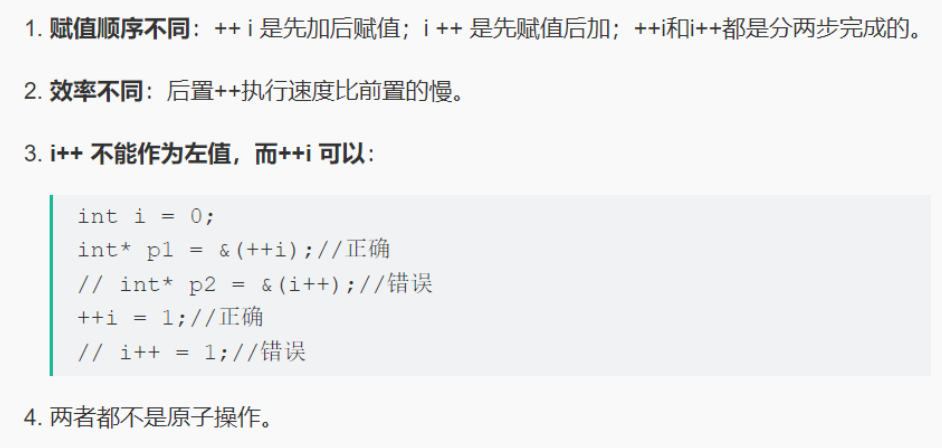


## 1.7 重载、重写与隐藏

### 1.7.1 三者的区别

（1）重载 overload

重载是指在同一范围定义中的同名成员函数才存在重载关系。主要特点是函数名相同，参数类型和数目有所不同，不能出现参数个数和类型均相同，仅仅依靠返回值不同来区分的函数。重载和函数成员是否是虚函数无关。举个例子：

```c++
class A{
 ...
 virtual int fun();
 void fun(int);
 void fun(double, double);
 static int fun(char);
 ...
}
```


（2）重写/覆盖 override

重写指的是在派生类中覆盖基类中的同名函数，**重写就是重写函数体**，**要求基类函数必须是虚函数**,且与基类的虚函数有相同的参数个数、参数类型和返回值类型相同。举个例子：

```c++
//父类
class A{
public:
 virtual int fun(int a){}
}
//子类
class B : public A{
public:
 //重写,一般加override可以确保是重写父类的函数
 virtual int fun(int a) override{}
}
```

重载与重写的区别：

​	重写是父类和子类之间的垂直关系，重载是不同函数之间的水平关系

​	重写要求参数列表相同，重载则要求参数列表不同，返回值不要求

​	重写关系中，调用方法根据对象类型决定，重载根据调用时实参表与形参表的对应关系来选择函数体

(3)隐藏 hide

隐藏指的是某些情况下，派生类中的函数屏蔽了基类中的同名函数，包括以下情况：

1-两个函数参数相同，但是基类函数不是虚函数。**和重写的区别在于基类函数是否是虚函数。**举个例

子：

```C++
//父类
class A{
public:
 void fun(int a){
 cout << "A中的fun函数" << endl;
 }
};
//子类
class B : public A{
public:
 //隐藏父类的fun函数
 void fun(int a){
 cout << "B中的fun函数" << endl;
 }
};
int main() {
 B b;
 b.fun(2); //调用的是B中的fun函数
 b.A::fun(2); //调用A中fun函数
 return 0; 
}
```

2-**两个函数参数不同，无论基类函数是不是虚函数，都会被隐藏。和重载的区别在于两个函数不在同一个类中。举个例子：**

```C++
//父类
class A{
public:
 virtual void fun(int a){
 cout << "A中的fun函数" << endl;
 }
};
//子类
class B : public A{
public:
 //隐藏父类的fun函数
 virtual void fun(char* a){
 cout << "A中的fun函数" << endl;
 }
};
int main(){
 B b;
 b.fun(2); 	   	//报错，调用的是B中的fun函数，参数类型不对
 b.A::fun(2); 	//调用A中fun函数
 return 0; }
```

### 1.7.2 C++中的重载和重写如何实现

（１）重载：C++利用命名倾轧（name mangling）技术，来更改函数名，区分参数不同的同名函数。命名倾轧是在**编译**阶段完成的。


（２）重写：在基类的函数前加上virtual关键字，在派生类中重写该函数，运行时将会根据对象的实际类型来调用相应的函数。如果对象类型是派生类，就调用派生类的函数；如果对象类型是基类，就调用基类的函数。

1.用virtual关键字申明的函数叫做虚函数，虚函数肯定是类的成员函数。

2.存在虚函数的类都有一个一维的虚函数表叫做虚表，类的对象有一个指向虚表开始的虚指针。虚表是和类对应的，虚表指针是和对象对应的。

3.多态性是一个接口多种实现，是面向对象的核心，分为类的多态性和函数的多态性。

4.重写用虚函数来实现，结合动态绑定。

5.纯虚函数是虚函数再加上 = 0。

6.抽象类是指包括至少一个纯虚函数的类。

7.纯虚函数：virtual void fun()=0。即抽象类必须在子类实现这个函数，即先有名称，没有内容，在派生类实现内容。


### 1.7.3 C 语言如何实现C++中重载的效果

c语言中不允许有同名函数，因为编译时函数命名是一样的，不像c++会添加参数类型和返回类型作为函数编译后的名称，进而实现重载。如果要用c语言显现函数重载，可通过以下方式来实现：

​	1.使用函数指针来实现，重载的函数不能使用同名称，只是类似的实现了函数重载功能

​	2.重载函数使用可变参数，方式如打开文件open函数

​	3.gcc有内置函数，程序使用编译函数可以实现函数重载


## 1.8 多态及其实现，静态绑定与动态绑定

### 1-多态及其实现（详见阿秀3.5 -1）

同一事物表现出不同事物的能力，即向不同对象发送同一消息，不同的对象在接收时会产生不同的行为。

**（重载实现编译时多态，虚函数实现运行时多态）**。

多态性是允许你将父对象设置成为和一个或更多的他的子对象相等的技术，赋值之后，父对象就可以根据当前赋值给它的子对象的特性以不同的方式运作。**简单一句话：允许将子类类型的指针赋值给父类类型的指针**

实现多态有两种方式——重写 / 覆盖（override）与 重载（overload）：

​	重写：是指子类重新定义父类的虚函数的做法。

​	重载：是指允许存在多个同名函数，而这些函数的参数表不同（或许参数个数不同，或许参数类型不同，或许两者都不同）。例如：基类是一个抽象对象——人，那教师、运动员也是人，而使用这个抽象对象既可以表示教师、也可以表示运动员。

### 2-静态绑定与动态绑定

静态类型：对象在声明时采用的类型，在编译期确定；

动态类型：通常是指一个指针或引用目前所指对象的类型，是在运行期决定的；

静态绑定(早绑定)：绑定的是静态类型，所对应的函数或属性依赖于对象的静态类型，发生在编译期；

动态绑定(晚绑定)：绑定的是动态类型，所对应的函数或属性依赖于对象的动态类型，发生在运行期；

非虚函数一般都是静态绑定，而虚函数都是动态绑定（如此才可实现多态性）。举个例子：

```C++
#include <iostream>
using namespace std;
class A {
public:
 /*virtual*/ void func() { std::cout << "A::func()\n"; }
};
class B : public A {
public:
 void func() { std::cout << "B::func()\n"; }
};
class C : public A {
public:
 void func() { std::cout << "C::func()\n"; }
};
int main() {
 C* pc = new C(); //pc的静态类型是它声明的类型C*，动态类型也是C*；
 B* pb = new B(); //pb的静态类型和动态类型也都是B*；
 A* pa = pc; //pa的静态类型是它声明的类型A*，动态类型是pa所指向的对象pc的类型C*；
 pa = pb; //pa的动态类型可以更改，现在它的动态类型是B*，但其静态类型仍是声明时候的A*；
 C *pnull = NULL; //pnull的静态类型是它声明的类型C*,没有动态类型，因为它指向了NULL；
 pa->func(); //A::func() pa的静态类型永远都是A*，不管其指向的是哪个子类，都是直接调用A::func()；
 pc->func(); //C::func() pc的动、静态类型都是C*，因此调用C::func()；
 pnull->func(); //C::func() 不用奇怪为什么空指针也可以调用函数，因为这在编译期就确定了，和指针空不空没关系；
 return 0; }
```

但是如果将A类中的virtual注释掉，运行结果则是

```C++
pa->func(); //B::func() 因为有了virtual虚函数特性，pa的动态类型指向B*，因此先在B中查找，找到后直接调用；
pc->func(); //C::func() pc的动、静态类型都是C*，因此也是先在C中查找；
pnull->func(); //空指针异常，因为是func是virtual函数，因此对func的调用只能等到运行期才能确定，然后才发现pnull是空指针；
```

在上面的例子中，

(1)如果基类A中的func不是virtual函数，那么不论pa、pb、pc指向哪个子类对象，对func的调用都是在定义pa、pb、pc时的静态类型决定，早已在编译期确定了。

(2)同样的空指针也能够直接调用no-virtual函数而不报错（这也说明一定要做空指针检查啊！），因此**静态绑定不能实现多态**；

(3)如果func是虚函数，那所有的调用都要等到运行时根据其指向对象的类型才能确定，比起静态绑定自然是要有性能损失的，但是却能实现多态特性；

### 3-引用是否能实现动态绑定，为什么可以实现？

引用在创建的时候必须初始化，在访问虚函数时，编译器会根据其所绑定的对象类型决定要调用哪个函数。注意只能调用虚函数。

```C++
#include <iostream>
using namespace std;
class Base {
public:
 virtual void fun() {
 	cout << "base :: fun()" << endl;
 }
};
class Son : public Base {
public:
 virtual void fun() {
 	cout << "son :: fun()" << endl;
  }
 void func() {
 	cout << "son :: not virtual function" <<endl;
 }
};
int main() {
 Son s;
 Base& b = s; // 基类类型引用绑定已经存在的Son对象，引用必须初始化
 s.fun(); //son::fun()
 b.fun(); //son :: fun()
 return 0;	
}
// 需要说明的是虚函数才具有动态绑定，上面代码中，Son类中还有一个非虚函数func()，这在b对象中是无法调用的，如果使用基类指针来指向子类也是一样的。
```


## 1.9 抽象类与纯虚函数及其作用，纯虚函数是否有函数体，是否编译

### 1-抽象类

1、定义

抽象类是一种特殊的类，它是为了抽象和设计的目的为建立的，它处于继承层次结构的较上层，称带有纯虚函数的类为抽象类。

2、作用

抽象类的主要作用是将有关的操作作为结果接口组织在一个继承层次结构中，由它来为派生类提供一个公共的根，派生类将具体实现在其基类中作为接口的操作。所以派生类实际上刻画了一组子类的操作接口的通用语义，这些语义也传给子类，子类可以具体实现这些语义，也可以再将这些语义传给自己的子类。

3、特点

抽象类只能作为基类来使用，其纯虚函数的实现由派生类给出。

如果派生类中没有重新定义纯虚函数，而只是继承基类的纯虚函数，则这个派生类仍然还是一个抽象类。如果派生类中给出了基类纯虚函数的实现，则该派生类就不再是抽象类了，它是一个可以建立对象的具体的类。

抽象类不能用作参数类型、函数返回类型或显示转换的类型

可以定义指向抽象类的指针和引用，指针可以指向其派生类从而实现多态

### 2-纯虚函数

> 定义

纯虚函数是一种特殊的虚函数，它是在基类中声明的虚函数，它在基类中没有定义，但要求任何派生类都要定义自己的实现方法。在基类中实现纯虚函数的方法是在函数原型后加 =0。定义如下：

```C++
class <类名> { virtual <类型><函数名>(<参数表>)=0; … };
```

> 引入原因

 1、为了方便使用多态特性，我们常常需要在基类中定义虚拟函数。

 2、在很多情况下，基类本身生成对象是不合情理的。例如，动物作为一个基类可以派生出老虎、孔 雀等子类，但动物本身生成对象明显不合常理。

因此在许多情况下，在基类中不能对虚函数给出有意义的实现，而把它声明为纯虚函数，它的实现留给该基类的派生类去做。这就是纯虚函数的作用。

纯虚函数可以让类先具有一个操作名称，而没有操作内容，让派生类在继承时再去具体地给出定义。凡是含有纯虚函数的类叫做抽象类。这种类不能声明对象，只是作为基类为派生类服务。除非在派生类中完全实现基类中所有的的纯虚函数，否则，派生类也变成了抽象类，不能实例化对象。

> 纯虚函数与虚函数的区别

虚函数是为了实现**动态编联**产生的，目的是**通过基类类型的指针指向不同对象时，自动调用相应的、和基类同名的函数**（使用同一种调用形式，既能调用派生类又能调用基类的同名函数）。虚函数需要在基类中加上virtual修饰符修饰，因为virtual会被隐式继承，所以子类中相同函数都是虚函数。当一个成员函数被声明为虚函数之后，其派生类中同名函数自动成为虚函数，在派生类中重新定义此函数时要求函数名、返回值类型、参数个数和类型全部与基类函数相同。

纯虚函数只是相当于一个接口名，但含有纯虚函数的类不能够实例化。


> 纯虚函数是否有函数体

纯虚函数首先是虚函数，其次它没有函数体，取而代之的是用“=0”。

既然是虚函数，它的函数指针会被存在虚函数表中，由于纯虚函数并没有具体的函数体，因此它在虚函数表中的值就为0，而具有函数体的虚函数则是函数的具体地址。

> 纯虚函数是否被编译

另一个问题是 early binding 和 late binding 的问题。非虚函数都是在编译期确定的，所以都是早绑定（静态绑定，编译期绑定）；虚函数理论上我们认为它是晚绑定（动态绑定，运行时绑定）的，但如果编译器能在编译阶段确定类型，这种情况下也能早绑定，例如，在构造函数和析构函数里，或者在最终派生类上直接调用虚函数等。

> 纯虚函数能实例化吗，为什么？派生类要实现吗，为什么？

1.纯虚函数不可以实例化，但是可以用其派生类实例化

```c++
class Base {
 public:
    virtual void fun() = 0;
};
class Derived : public Base {
 public:
    void fun() {
    	cout << "hello" << endl;
    }
};
int main() {
    Base *b = new Derived();
    b->fun();
    return 0;
}
```

2.虚函数的原理采用vtable。类中含有纯虚函数时，其vtable 不完全，有个空位。

即"纯虚函数在类的vtable表中对应的表项被赋值为0, 也就是指向一个不存在的函数。由于编译器绝对不允许有调用一个不存在的函数的可能，所以该类不能生成对象。在它的派生类中，除非重写此函数，否则也不能生成对象。” 所以纯虚函数不能实例化。

3.纯虚函数是在基类中声明的虚函数，它要求任何派生类都要定义自己的实现方法，以实现多态性。

4.定义纯虚函数是为了实现一个接口，用来规范派生类的行为，也即规范继承这个类的程序员必须实现这个函数。派生类仅仅只是继承函数的接口。纯虚函数的意义在于，让所有的类对象（主要是派生类对象）都可以执行纯虚函数的动作，但基类无法为纯虚函数提供一个合理的缺省实现。所以类纯虚函数的声明就是在告诉子类的设计者，“你必须提供一个纯虚函数的实现，但我不知道你会怎样实现它"。


## 1.10 虚函数与虚函数表

**1、虚函数的实现原理**

C++中多态的表象，在基类的函数前加上 virtual 关键字，在派⽣类中重写该函数，运⾏时将会 根据对象的实际类型来调⽤相应的函数。如果对象类型是派⽣类,就调⽤派⽣类的函数；如果是基类，就调⽤基类 的函数。

 实际上,当⼀个类中包含虚函数时，编译器会为该类⽣成⼀个虚函数表，保存该类中虚函数的地址。同样派⽣类 继承基类，派⽣类中⾃然⼀定有虚函数，所以编译器也会为派⽣类⽣成⾃⼰的虚函数表。当我们定义⼀个派⽣类对象时，编译器检测该类型有虚函数，所以为这个派⽣类对象⽣成⼀个虚函数指针，指向该类型的虚函数表，这个虚函数指针的初始化是在构造函数中完成的.。

后续如果有⼀个基类类型的指针指向派⽣类，那么当调⽤虚函数时，就会根据所指真正对象的虚函数表指针去寻找虚函数的地址，也就可以调⽤派⽣类的虚函数表中的虚函数以此实现多态。

**2、虚函数表**

虚函数表是一个指针数组，其元素是虚函数的指针，每个元素对应一个虚函数的函数指针。需要指出的是，普通的函数即非虚函数，其调用并不需要经过虚函数表，所以虚函数表的元素并不包括普通函数的函数指针。
虚函数表内的条目，即虚函数指针的赋值发生在编译器的编译阶段，也就是说在代码的编译阶段，虚函数表就可以构造出来了。

附：虚函数表何时写入


**3.虚函数表指针**

虚函数表是属于类的，而不是属于某个具体的对象，一个类只需要一个虚函数表即可。同一个类的所有对象都使用同一个虚函数表。
为了指定对象的虚函数表，对象内部包含一个虚函数表的指针，来指向自己所使用的虚函数表。为了让每个包含虚函数表的类的对象都拥有一个虚函数表指针，编译器在类中添加了一个指针，*__vptr，用来指向虚函数表。这样，当类的对象在创建时便拥有了这个指针，且这个指针的值会自动被设置为指向类的虚函数表。

**4、虚函数表指针位置**


注：上图中是在64位环境下，int与指针大小均为8


**5、基类的虚函数表存放在内存的什么区，虚表指针vptr的初始化时间**

虚函数表的特征：

（1）虚函数表是全局共享的元素，即全局仅有一个，在编译时就构造完成

（2）虚函数表类似一个数组，类对象中存储vptr指针，指向虚函数表，即虚函数表不是函数，不是程序代码，不可能存储在代码段

（3）虚函数表存储虚函数的地址,即虚函数表的元素是指向类成员函数的指针,而类中虚函数的个数在编译时期可以确定，即虚函数表的大小可以确定,即大小是在编译时期确定的，不必动态分配内存空间存储虚函数表，所以不在堆中

根据以上特征，虚函数表类似于类中静态成员变量.静态成员变量也是全局共享，大小确定，因此最有可能存在全局数据区。

由于虚表指针vptr跟虚函数密不可分，对于有虚函数或者继承于拥有虚函数的基类，对该类进行实例化时，在构造函数执行时会对虚表指针进行初始化，并且存在对象内存布局的最前面。

一般分为五个区域：栈区、堆区、函数区（存放函数体等二进制代码）、全局静态区、常量区

C++中虚函数表位于只读数据段（.rodata），也就是C++内存模型的常量区；

虚函数位于代码段(.text)，也就是内存模型的代码区。

**6、哪些函数不能是虚函数**

1) 构造函数，构造函数初始化对象，派生类必须知道基类函数干了什么，才能进行构造；当有虚函数时，每一个类有一个虚表，每一个对象有一个虚表指针，虚表指针在构造函数中初始化；

2) 内联函数，内联函数表示在编译阶段进行函数体的替换操作，而虚函数意味着在运行期间进行类型确定，所以内联函数不能是虚函数；

3) 静态函数，静态函数不属于对象属于类，静态成员函数没有this指针，因此静态函数设置为虚函数没有任何意义。

4) 友元函数，友元函数不属于类的成员函数，不能被继承。对于没有继承特性的函数没有虚函数的说法。

5) 普通函数，普通函数不属于类的成员函数，不具有继承特性，因此普通函数没有虚函数。


## 1.11 C++的内存分区和可执行程序的分段（内存管理） 

### 1、内存的五大分区（程序运行时，存储区如何划分）

栈：由编译器管理分配和回收，存放局部变量和函数形参。

堆（记忆位置时理解为向上堆，往上放往上增长）：由程序员管理，需要⼿动 new malloc delete free 进⾏分配和回收，空间较⼤，但可能会出现内存泄漏和空闲碎⽚的情况。

全局/静态存储区：分为初始化和未初始化两个相邻区域，存储初始化和未初始化的全局变量和静态变量。

常量存储区：存储常量，⼀般不允许修改。例如：通过#define、const定义的常量， 源代码中以指针形式定义的字符串

代码区：存放程序的⼆进制代码。


### 2、初始化为0的全局变量在哪里？

.BSS段;

.BSS段通常是指用来存放程序中**未初始化的或者初始化为0的全局变量和静态变量**的一块内存区域。特点是可读写的，在程序执行之前BSS段会自动清0。

### 3、可执行程序程序三段-Text段，Date段，Bss段


text段在内存中被映射为只读，date段与bss段是可写的

1. text段：代码段，就是放程序代码的，编译时确定，只读
2. date段：存放在编译阶段（而非运行时）就能确定的数据，可读可写。也就是通常所说的静态存储区，赋了初值的全局变量和赋初值的静态变量存放在这个区域，常量也存在这个区域
3. bss段：已经定义但没赋初值的全局变量和静态变量存放在这个区域。
    两者之间区别是：代码段，数据段，堆栈段是CPU级别的概念，五大分区属于语言级别的概念，两者是不同的概念。

### 4、可执行程序内存空间与逻辑地址空间的映射与划分


1. 首先是栈区（堆栈区stack）,堆栈是由编译器自动分配释放，存放函数的参数形参和局部变量的值（auto类型），操作方式类似于数据结构中的栈。栈的申请是由系统自动分配，如在函数内部申请一个局部变量int h,同时判断所申请空间是否小于栈的剩余空间，如果小于则为其开辟空间，为程序提供内存，否则将报异常提示栈溢出。
2. 堆（heap），堆一般由程序员分配释放，若程序员不释放，程序结束可能由OS回收。它与数据结构中的堆是两回事，分配方式类似于链表，申请则是程序员自己操作使用malloc或new。申请过程比较复杂，当系统收到程序的申请时，会遍历记录空闲内存地址的链表，以求寻找第一个空间大于所申请空间的堆节点，然后将该节点从空闲节点链表中删除，并将该节点的空间分配给程序，有些情况下，新申请的内存块的首地址记录本次分配的内存块的大小，这样在delete尤其是delete[]时能正确的释放内存空间。
3. 下边是全局静态存储区，全局变量与静态变量的存储是放在一块的，初始化的全局变量与静态变量存放在一块区域，未初始化的全局变量与未初始化的静态变量存放在相邻的另一块区域。
4. 文字常量区，常量字符串就是放在该部分，只读存储区，程序结束后由系统释放
5. 程序代码区，存放程序的二进制代码区。

### 5、存储类型关键字定义变量与函数作用域与生命周期


1. auto变量：函数的局部变量，如果没有声明为static，函数中定义的局部变量**全部为auto类型**，auto变量包括未加static声明的局部变量和函数的形参。在函数调用时系统会给他们分配存储空间，在函数调用结束后会自动释放这些空间。属于动态存储方式。
2. static变量：用static声明的局部变量在调用结束后不会消失而保存原来的值。static局部变量定义使用后值会存储下来。所以使用static局部变量定义只需要一次赋值。静态局部变量的作用域仅限于所定义的函数，但函数结束后变量的值会保留。直到整个程序运行结束。全局变量从定义开始作用于整个文件直至程序运行结束。
3. register寄存器变量：寄存器变量可以提高c语言的执行效率，即将局部变量的值存入CPU的寄存器中。需要注意的是！！！：1.只有动态存储的变量（自动局部变量和形参）才可以作为寄存器变量来存储，局部静态变量不可以定义为寄存器变量。2.计算机的寄存器数目是有限的，所以不能定义任意多个寄存器变量。
4. extern外部变量：即全局变量的外部表现形式，是在函数外部定义的变量。全局变量的作用域为从定义开始到源文件结束。extern对该变量作外部变量声明，**扩展变量作用域**。

### 6、常见的内存错误及对策


## 1.12 static

1、作用——控制变量的存储方式和可见性

**作⽤⼀：修饰局部变量**（两变一不变）：⼀般情况下，对于局部变量在程序中是存放在栈区的，并且局部的⽣命周期在包含语句块执⾏结束时便结束了。但是如果⽤ static 关键字修饰的话，该变量便会存放在静态数据区，其⽣命周期会⼀直延续到整个程序执⾏结束。但是要注意的是，虽然⽤ static 对局部变量进⾏修饰之后，其**⽣命周期以及存储空间**发⽣了变化，但其**作⽤域**并没有改变，作⽤域还是限制在其语句块。

**作⽤⼆：修饰全部变量**：对于⼀个全局变量，它既可以在本⽂件中被访问到，也可以在同⼀个⼯程中其它源⽂件被访问(添加 extern进⾏声明即可)。⽤ static 对全局变量进⾏修饰改变了其作⽤域范围，由原来的整个⼯程可⻅变成了本⽂件可⻅。

**作⽤三：修饰函数**：⽤ static 修饰函数，情况和修饰全局变量类似，也是改变了函数的作⽤域。

**作⽤四：修饰类**：如果 C++ 中对类中的某个函数⽤ static 修饰，则表示该函数属于⼀个类⽽不是属于此类的任何特定对象；如果对类中的某个变量进⾏ static 修饰，则表示该变量以及所有的对象所有，存储空间中只存在⼀个副本，可以通过 类和对象去调⽤。（补充：静态⾮常量数据成员，其只能在类外定义和初始化，在类内仅是声明⽽已。）

**作⽤五：类成员/类函数声明 static**

函数体内 static 变量的作⽤范围为该函数体，不同于 auto 变量，该变量的内存只被分配⼀次，因此其值在下次调⽤时仍维持上次的值；

在模块内的 static 全局变量可以被模块内所⽤函数访问，但不能被模块外其它函数访问； 

在模块内的 static 函数只可被这⼀模块内的其它函数调⽤，这个函数的使⽤范围被限制在声明它的模块内； 

在类中的 static 成员变量属于整个类所拥有，对类的所有对象只有⼀份拷⻉； 

在类中的 static 成员函数属于整个类所拥有，这个函数不接收 this 指针，因⽽只能访问类的 static 成员变量；

static 类对象必须要在类外进⾏初始化，static 修饰的变量先于对象存在，所以 static 修饰的变量要在类外初始化；

由于 static 修饰的类成员属于类，不属于对象，因此 static 类成员函数是没有 this 指针，this 指针是指向本对象的指针，正因为没有 this 指针，所以 static 类成员函数不能访问⾮ static 的类成员，只能访问 static修饰的类成员；

static 成员函数不能被 virtual 修饰，static 成员不属于任何对象或实例，所以加上 virtual 没有任何实际意义；静态成员函数没有 this 指针，虚函数的实现是为每⼀个对象分配⼀个 vptr 指针，⽽ vptr 是通过 this 指针调⽤的，所以不能为 virtual；虚函数的调⽤关系，this->vptr->ctable->virtual function。

2、作用(笼统概括)

1.第一条也是最重要的一条：隐藏。（static函数，static变量均可）。当同时编译多个文件时，所有未加static前缀的全局变量和函数都具有全局可见性。

2.static的第二个作用是保持变量内容的持久。（static变量中的记忆功能和全局生存期）存储在静态数据区的变量会在程序刚开始运行时就完成初始化，也是唯一的一次初始化。共有两种变量存储在静态存储区：全局变量和static变量，只不过和全局变量比起来，static可以控制变量的可见范围，说到底static还是用来隐藏的。

3.static的第三个作用是默认初始化为0（static变量）。其实全局变量也具备这一属性，因为全局变量也存储在静态数据区。在静态数据区，内存中所有的字节默认值都是0x00，某些时候这一特点可以减少程序员的工作量。

4.static的第四个作用：同上作用5

3、static变量初始化的时机

存储在静态数据区的变量会在程序刚开始运行时就完成初始化，也是唯一的一次初始化。.BSS段通常是指用来存放程序中**未初始化的或者初始化为0的全局变量和静态变量**的一块内存区域。特点是可读写的，在程序执行之前BSS段会自动清0。


## 1.13 给定类，判断大小，包括空类，加入static，加入虚函数，考虑到内存对齐

1、计算原则

与类大小有关的因素：普通成员变量，[虚函数](https://so.csdn.net/so/search?q=虚函数&spm=1001.2101.3001.7020)，继承（单一继承，多重继承，重复继承，虚拟继承）

与类大小无关的因素：[静态成员](https://so.csdn.net/so/search?q=静态成员&spm=1001.2101.3001.7020)变量，静态成员函数及普通成员函数

2、空类

```C++
class Base {};
```

空类即什么都没有的类，按上面的说法，照理说大小应该是0，但是，空类的大小为1，因为空类可以实例化，实例化必然在内存中占有一个位置，因此，编译器为其优化为一个字节大小。

某个类继承自空类

```C++
class base
{
};
class derived:public base
{
 private:
    int a;
};
```

此时，derived类的大小为4，derived类的大小是自身int成员变量的大小，至于为什么没有加上父类base的大小1是因为空白基优化的问题，在空基类被继承后，子类会优化掉基类的1字节的大小，节省了空间大小，提高了运行效率

3、一般类的大小（注意内存对齐）

```c++
class base1 {
private:
    char a;
    int b;
    double c;
};
class base2 {
private:
    char a;
    double b;
    int c;
};
```


4、包含普通成员函数的一般非空类

```C++
class Base {
    int val;
    char ch;
    void fun(){}
};
```

sizeof（Base）等于8。类的大小只与它的数据成员有关，与普通成员函数、构造函数、析构函数无关。

5、包含虚函数的类

```C++
class Base {
    int val;
    char ch;
    virtual void fun(){}
};
```

sizeof（Base）等于12。Base定义了一个虚函数，编译时会生成虚函数表，该类型的实例都包含一个指向虚函数表的指针，这个指向虚函数表的指针保存在实例内存中的最前面的位置，根据内存对齐的原则，Base的大小为12个字节。

6、包含静态数据成员的类别

```C++
class Base {
    int val;
    char ch;
    static int num;
};
```

sizeof（Base）等于8。因为静态数据成员保存在全局静态数据区，该类型的所有实例共享同一个静态数据成员，静态数据成员只分配一次内存。因此，Base的大小为8个字节。

7、单继承的类

```C++
class Base {
    int val;
    char ch;
};
class Derive： public Base {
    char c;
};
```

sizeof（Derive）等于12。Base的大小为8个字节，内存对齐值为4个字节，因此在Derive中相当于包含两个成员，类型分别为Base、char，根据内存对齐，对齐值为4，Derive的大小为12个字节。

8、含虚函数的单一继承 (64位，指针大小8字节)

```C++
class Base {
private:
    char a;
public:
    virtual void f();
    virtual void g();
};
class Derived:public Base {
private:
    int b;
public:
    void f();
};
class Derived1:public Base {
private:
    double b;
public:
    void g();
    virtual void h();
};
```


9、含虚函数的多继承

```C++
class Base1 {
private:
    char a;
public:
    virtual void f();
    virtual void g1();
};
class Base2 {
private:
    int b;
public:
    virtual void f();
    virtual void g2();
};
class Base3 {
private:
    double c;
public:
    virtual void f();
    virtual void g3();
};
class Derived:public Base1, public Base2, public Base3 {
private:
    double d;
public:
    void f();
    virtual void derived_func();
};
```


首先，Derived类自己的虚函数表指针与其声明继承顺序的**第一个基类**Base1的虚函数表指针合并，此外，若Derived类重写了基类中同名的虚函数，则在三个虚函数表的对应项都应该予以修改，**Derived中新添加的虚函数位于第一个虚函数表项后面，Derived中新添加的成员变量位于类的最后面**，按其声明顺序与内存对齐原则进行排列。

10、菱形继承的问题及解决方案：虚拟继承

[C++类大小详尽讲解](https://blog.csdn.net/longjialin93528/article/details/80160467?spm=1001.2101.3001.6661.1&utm_medium=distribute.pc_relevant_t0.none-task-blog-2~default~CTRLIST~Rate-1-80160467-blog-102457472.pc_relevant_paycolumn_v3&depth_1-utm_source=distribute.pc_relevant_t0.none-task-blog-2~default~CTRLIST~Rate-1-80160467-blog-102457472.pc_relevant_paycolumn_v3&utm_relevant_index=1)


## 1.14 指针和引用的区别

1、二者的区别

1. 指针是一个变量（实体），存储的是一个地址，引用跟原来的变量实质上是同一个东西，是原变量的别名
2. 指针可以有多级，引用只有一级
3. 指针可以为空，引用不能为NULL且在定义时必须初始化
4. 不存在指向空值的引用，必须有具体实体；但是存在指向空值的指针。
5. 指针在初始化后可以改变指向，而引用在初始化之后不可再改变（变量可以被引用为多次，但引用只能作为一个变量引用）
6. sizeof指针得到的是本指针的大小，sizeof引用得到的是引用所指向变量的大小；在参数传递中，指针需要被解引用后才可以对对象进行操作，而直接对引用进行修改会做用到对象本身；
7. 作为参数时也不同,传指针的实质是**传值**,传递的值是指针的地址；传引⽤的实质是**传地址**,传递的是变量的地址；
8. 引用本质是一个指针，同样会占4字节内存；指针是具体变量，需要占用存储空间（具体情况还要具体分析）。
9. 指针它指向⼀块内存,指针的内容是所指向的内存的地址,在编译的时候,则是将“指针变量名-指针变量的地址”添 加到符号表中,所以说,指针包含的内容是可以改变的,允许拷⻉和赋值,有 const 和⾮ const 区别,甚⾄可以为 空,sizeof 指针得到的是指针类型的⼤⼩. 
10. ⽽对于引⽤来说,它只是⼀块内存的别名,在添加到符号表的时候,是将"引⽤变量名-引⽤对象的地址"添加到符号 表中,符号表⼀经完成不能改变,所以引⽤必须⽽且只能在定义时被绑定到⼀块内存上,后续不能更改,也不能为空,也没有 const 和⾮ const 区别.

2、在传递函数参数时，什么时候该使用指针，什么时候该使用引用呢？

1. 需要返回函数内局部变量的内存的时候用指针。使用指针传参需要开辟内存，用完要记得释放指针，不然会内存泄漏。而返回局部变量的引用是没有意义的

2. 对栈空间大小比较敏感（比如递归）的时候使用引用。使用引用传递不需要创建临时变量，开销要更小

3. 类对象作为参数传递的时候使用引用，这是C++**类对象传递的标准方式**


## 1.15 构造函数和析构函数能否定义为虚函数

1、析构函数⼀般写成虚函数（虚析构）的原因

直观的讲：是为了降低内存泄漏的可能性.

由于类的多态性，基类指针可以指向派生类的对象，如果删除该基类的指针，就会调用该指针指向的派生类析构函数，而派生类的析构函数又自动调用基类的析构函数，这样整个派生类的对象完全被释放。

如果析构函数不被声明成虚函数，则编译器实施静态绑定，在删除基类指针时，只会调用基类的析构函数而不调用派生类析构函数，这样就会造成派生类对象析构不完全，造成**内存泄漏**。

所以将析构函数声明为虚函数是十分必要的。在实现多态时，当用基类操作派生类，在析构时防止只析构基类而不析构派生类的状况发生，要将基类的析构函数声明为虚函数。

**析构函数可以是纯虚函数**，含有纯虚函数的类是抽象类，此时不能被实例化。但派生类中可以根据自身需求重新改写基类中的纯虚函数。

2、构造函数不能定义成虚函数的原因（但构造函数内可以调用虚函数）

i.从存储空间角度:虚函数对应一个vtale,这个表的地址是存储在对象的内存空间的。如果将构造函数设置为虚函数,就需要到vtable 中调用，可是对象还没有实例化，没有内存空间分配，如何调用。(悖论)

ii.从使用角度:虚函数主要用于在信息不全的情况下，能使重载的函数得到对应的调用。构造函数本身就要初始化实例，那使用虚函数也没有实际意义。所以构造函数没有必要是虚函数。虚函数的作用在于通过父类的指针或引用来调用它的时候能够变成调用子类的那个成员函数。而构造函数是在创建对象时自动调用的，不可能通过父类的指针或者引用去调用，因此也就规定构造函数不能是虚函数。

iii.从实现上看，vbtl 在构造函数调用后才建立，因而构造函数不可能成为虚函数。从实际含义上看，在调用构造函数时还不能确定对象的真实类型(因为子类会调父类的构造函数);而且构造函数的作用是提供初始化，在对象生命期只执行一次，不是对象的动态行为，也没有太大的必要成为虚函数。

3、构造或析构函数中调用虚函数会怎样

实际上是不应该在构造函数或析构函数中调⽤虚函数的,因为这样的调⽤其实并不会带来所想要的效果. 

举例来说就是,有⼀个动物的基类,基类中定义了⼀个动物本身⾏为的虚函数 action_type(),在基类的构造函数中 调⽤了这个虚函数.

派⽣类中重写了这个虚函数,我们期望着根据对象的真实类型不同,⽽调⽤各⾃实现的虚函数,但实际上当我们创 建⼀个派⽣类对象时,⾸先会创建派⽣类的基类部分,执⾏基类的构造函数,此时,派⽣类的⾃身部分还没有被初 始化,对于这种还没有初始化的东⻄,C++选择当它们还不存在作为⼀种安全的⽅法. 

也就是说构造派⽣类的基类部分是,编译器会认为这就是⼀个基类类型的对象,然后调⽤基类类型中的虚函数实 现,并没有按照我们想要的⽅式进⾏.即对象在派⽣类构造函数执⾏前并不会成为⼀个派⽣类对象. 

在析构函数中也是同理,派⽣类执⾏了析构函数后,派⽣类的⾃身成员呈现未定义的状态,那么在执⾏基类的析构 函数中是不可能调⽤到派⽣类重写的⽅法的.所以说,我们不应该在构在函数或析构函数中调⽤虚函数,就算调⽤ ⼀般也不会达到我们想要的结果.


## 1.16 enable_if

1、定义

C++11中引入了std::enable_if函数，enable_if 的主要作用就是当某个 condition 成立时，enable_if可以提供某种类型。enable_if在标准库中通过结构体模板实现的，声明(原型)如下：

```C++
template< bool Condition, class T = void >
struct enable_if;
```

可能的函数实现为：

```C++
template<bool B, class T = void>
struct enable_if {};
 
template<class T>
struct enable_if<true, T> { typedef T type; };
```

由上可知，只有当第一个模板参数为true时，enable_if会包含一个type=T的公有成员，否则没有该公有成员。

头文件:

```C++
#include <type_traits>
```

2、使用场景

1. **限制模板函数的参数类型**

    在某些场景下，我们需要实现只有特定类型可以调用的模板函数。如下代码所示，通过对返回值使用std::enable_if和在模板参数中使用std::enable_if均实现了只允许整形参数调用函数的功能。

    ```C++
    // enable_if example: two ways of using enable_if
    #include <iostream>
    #include <type_traits>
    
    // 1. the return type (bool) is only valid if T is an integral type:
    template <class T>
    typename std::enable_if<std::is_integral<T>::value,bool>::type
     is_odd (T i) {return bool(i%2);}
    
    // 2. the second template argument is only valid if T is an integral type:
    template < class T, class = typename std::enable_if<std::is_integral<T>::value>::type>
    bool is_even (T i) {return !bool(i%2);}
    
    int main() {
    
        short int i = 1;  // code does not compile if type of i is not integral
    
        std::cout << std::boolalpha;
        std::cout << "i is odd: " << is_odd(i) << std::endl;
        std::cout << "i is even: " << is_even(i) << std::endl;
    
        return 0;
    }
    ```

当使用float类型参数调用函数时，程序会报错：

```C++
error: no matching function for call to 'is_odd(float&)'
```


2. 在使用模板编程时，可以利用std::enable_if的特性根据模板参数的不同特性进行不同的类型选择。

    如下所示，我们可以实现一个检测变量是否为智能指针的实现：

```C++
#include <iostream>
#include <type_traits>
#include <memory>

template <typename T>
struct is_smart_pointer_helper : public std::false_type {};

template <typename T>
struct is_smart_pointer_helper<std::shared_ptr<T> > : public std::true_type {};

template <typename T>
struct is_smart_pointer_helper<std::unique_ptr<T> > : public std::true_type {};

template <typename T>
struct is_smart_pointer_helper<std::weak_ptr<T> > : public std::true_type {};

template <typename T>
struct is_smart_pointer : public is_smart_pointer_helper<typename std::remove_cv<T>::type> {};

template <typename T>
typename std::enable_if<is_smart_pointer<T>::value, void>::type check_smart_pointer(const T& t) {
    std::cout << "is smart pointer" << std::endl;
}

template <typename T>
typename std::enable_if<!is_smart_pointer<T>::value, void>::type check_smart_pointer(const T& t) {
    std::cout << "not smart pointer" << std::endl;
}

int main() {
    int* p(new int(2));
    std::shared_ptr<int> pp(new int(2));
    std::unique_ptr<int> upp(new int(4));

    check_smart_pointer(p);
    check_smart_pointer(pp);
    check_smart_pointer(upp);

    return 0;
}
```

程序输出：

```C++
not smart pointer
is smart pointer
is smart pointer
```


## 1.17 模板是如何实现的，模板特化、模板偏特化

### 1、模板是什么，底层实现

C++模板提供了对逻辑结构相同的数据对象通用行为的定义。这些模板运算对象的类型不是实际的数据类型，而是一种参数化的类型。

（1）编译器并不是把函数模板处理成能够处理任意类的函数；编译器从函数模板**通过具体类型**产生不同的函数；编译器会对函数模板进行**两次编译**：**在声明的地方对模板代码本身进行编译，在调用的地方对参数替换后的代码进行编译**。

（2）这是因为函数模板要被**实例化**后才能成为真正的函数，在使用函数模板的源文件中包含函数模板的头文件，如果该头文件中只有声明，没有定义，那编译器无法实例化该模板，最终导致链接错误。

### 2、简单的模板的例子

```C++
// 函数模板
#include<iostream> 
using namespace std; 

template<typename type1,typename type2>
type1 Max(type1 a,type2 b) { 
	return a > b ? a : b; 
} 
int main() { 
	cout << "Max = "<< Max(5.5,'a') << endl; 
	return 0;
}
// 输出为
// Max = 97
```

```C++
// 类模板
template <class T>
class TClass {
public:
    //...
private:
    T member;
};
```


### 3、模板类和模板函数的区别是什么？

函数模板的实例化是由编译程序在处理函数调用时**自动完成**的，而类模板的实例化必须由程序员在程序中**显式地指定**。即函数模板允许隐式调用和显式调用而类模板只能显示调用。在使用时类模板必须加，而函数模板不必。

### 4、模板类和类模板

（1）类模板是模板的定义，不是一个真实存在的类，定义中用到通用类型参数

（2）模板类是实实在在的类定义，是类模板的实例化。类定义中参数被实际类型替代

（3）类模板的类型参数可以由一个或多个，每个类型前面都必须加class,  如 

```C++
template <class T1, class T2> 
class someclass {......}; 
```

在定义对象时分别带入实际的类型名，如

```C++
someclass <int, double> obj;
```

（4）和实用类一样，使用类模板时要注意作用域，只能在其有效作用域内使用它定义对象

（5）模板可以有层次，一个类模板可以作为基类派生出派生类

### 5、模板特化

5.1 概述

模板特化（template specialization）不同于模板的实例化，模板参数在某种特定类型下的具体实现称为模板特化。模板特化有时也称之为模板的具体化，分别有函数模板特化和类模板特化。

5.2 函数模板特化

函数模板特化指函数模板在模板参数为特定类型下的特定实现。查看以下示例：

```C++
#include <iostream>
using namespace std;

template<typename T> T Max(T t1,T t2) {
	return (t1 > t2) ? t1 : t2;
}
typedef const char* CCP;
template<> CCP Max<CCP>(CCP s1, CCP s2) {
	return (strcmp(s1 , s2) > 0) ? s1 : s2;
}

int main() {
	// 隐式调用实例：int Max<int>(int,int)
	int i = Max(10,5);
	
	// 显式调用特化版本：const char* Max<const char*>(const char*,const char*)
	const char* p = Max<const char*>("very","good");
	cout << "i:" << i << endl;
	cout << "p:" << p << endl;
}
```

结果

```C++
i:10
p:very
```

在函数模板显示特化定义（Explicit Specialization Definition）中，显示关键字 template 和一对尖括号 <>，然后是函数模板特化的定义。该定义指出了模板名、被用来特化模板的模板实参，以及函数参数表和函数体。在上面的程序中，如果不给出函数模板Max< T>在T为const char*时的特化版本，那么在比较两个字符串的大小时，比较的是字符串的起始地址的大小(默认)，而不是字符串的内容在字典序中的先后次序。

除了定义函数模板特化版本外，还可以直接给出模板函数在特定类型下的重载形式（普通函数）。**使用函数重载可以实现函数模板特化的功能，也可以避免函数模板的特定实例的失效**。例如，把上面的模板特化可以改成如下重载函数。

```C++
typedef const char* CCP;
CCP Max(CCP s1,CCP s2) {
	return (strcmp(s1,s2)>0)?s1:s2;
}
```

程序运行结果和使用函数模板特化相同。但是，**使用普通函数重载和使用模板特化还是有不同**之处，主要表现在如下两个方面：

（1）如果使用普通重载函数，那么不管是否发生实际的函数调用，都会在目标文件中生成该函数的二进制代码。

​		而如果使用模板的特化版本，除非发生函数调用，否则不会在目标文件中包含特化模板函数的二进制代码。这符合函数模板的“惰性实例化”准则。

（2）如果使用普通重载函数，那么在分离编译模式下，需要在各个源文件中包含重载函数的声明，否则在某些源文件中就会使用模板函数，而不是重载函数。

```C++
// 函数模板特化的简单例子
template<typename T> //模板函数
int compare(const T &v1,const T &v2) {
 	if(v1 > v2) return -1;
 	if(v2 > v1) return 1;
 	return 0; }
//模板特例化,满足针对字符串特定的比较，要提供所有实参，这里只有一个T
template<>
int compare(const char* const &v1,const char* const &v2) {
 	return strcmp(p1,p2);
}
```


5.3 类模板特化

类模板特化类似于函数模板的特化，即类模板参数在某种特定类型下的具体实现。考察如下代码：

```C++
#include <iostream>
using namespace std;

template<typename T>class A {
	T num;
public:
	A(){
		num=T(6.6);
	}
	void print(){
		cout<<"A'num:"<<num<<endl;
	}
};

template<> class A<string> {
	string str;
public:
	A() {
		str="A' special definition ";
	}
	void print() {
		cout<<str<<endl;
	}
};

int main() {
	A<int> a1;      //显示模板实参的隐式实例化
	a1.print();
	A<string> a2;    //使用特化的类模板
	a2.print();
}
```

输出结果：

```C++
A'num:6
A' special definition
```


### 6、模板偏特化

6.1 概述

模板偏特化（Template Partitial Specialization）是模板特化的一种特殊情况，指显示指定部分模板参数而非全部模板参数，或者指定模板参数的部分特性分而非全部特性，也称为模板部分特化。与模板偏特化相对的是模板全特化，指对所有模板参数进行特化。模板全特化与模板偏特化共同组成模板特化。

模板偏特化主要分为两种，一种是指对部分模板参数进行全特化，另一种是对模板参数特性进行特化，包括将模板参数特化为指针、引用或是另外一个模板类。

6.2 函数模板偏特化

假如我们有一个 compare 函数模板，在比较数值大小时没有问题，如果传入的是数值的地址，我们需要比较两个数值的大小，而非比较传入的地址大小。此时我们需要对 compare 函数模板进行偏特化。考察如下代码：

```C++
#include <vector>
#include <iostream> 
using namespace std;

// 函数模板
template<typename T, class N> void compare(T num1, N num2) {
	cout << "standard function template" << endl;
	if(num1>num2) {
		cout << "num1:" << num1 << " > num2:" << num2 <<endl;
	} else {
		cout << "num1:" << num1 << " <= num2:" << num2 << endl;
	}
}

// 对部分模板参数进行特化
template<class N> void compare(int num1, N num2) {
	cout<< "partitial specialization" <<endl;
	if (num1>num2)
		cout << "num1:" << num1 << " > num2:" << num2 << endl;
	else
		cout << "num1:" << num1 << " <= num2:" << num2 << endl;
}

// 将模板参数特化为指针(模板参数的部分特性)
template<typename T, class N> void compare(T* num1, N* num2) {
	cout << "new partitial specialization" << endl;
	if (*num1>*num2)
		cout << "num1:" << *num1 << " > num2:" << *num2 << endl;
	else
		cout << "num1:" << *num1 << " <= num2:" << *num2 << endl;
}

// 将模板参数特化为另一个模板类
template<typename T, class N> void compare(std::vector<T>& vecLeft, std::vector<T>& vecRight) {
	cout << "to vector partitial specialization" << endl;
	if (vecLeft.size()>vecRight.size())
		cout << "vecLeft.size()" << vecLeft.size() << " > vecRight.size():" << vecRight.size() << endl;
	else
		cout << "vecLeft.size()" << vecLeft.size() << " <= vecRight.size():" << vecRight.size() << endl;
}

int main() {
	// 调用非特化版本 compare<int,int>(int num1, int num2)
	compare<int,int>(30,31);

	// 调用偏特化版本 compare<char>(int num1, char num2)
	compare(30,'1');

	int a = 30;
	char c = '1';
	// 调用偏特化版本 compare<int,char>(int* num1, char* num2)
	compare(&a, &c);

	vector<int> vecLeft{0};
	vector<int> vecRight{1,2,3};
	// 调用偏特化版本 compare<int,char>(int* num1, char* num2)
	compare<int,int>(vecLeft,vecRight);
}
```

结果为：

```C++
standard function template
num1:30 <= num2:31
partitial specialization
num1:30 <= num2:1
new partitial specialization
num1:30 <= num2:1
to vector partitial specialization
vecLeft.size()1 <= vecRight.size():3
```

6. 3 类模板偏特化

```C++
#include <vector>
#include <iostream> 
using namespace std;

// 类模板
template<typename T, class N> class TestClass {
public:
	static bool comp(T num1, N num2) {
		cout <<"standard class template"<< endl;
		return (num1<num2) ? true : false;
	}
};

// 对部分模板参数进行特化
template<class N> class TestClass<int, N> {
public:
	static bool comp(int num1, N num2) {
		cout << "partitial specialization" << endl;
		return (num1<num2) ? true : false;
	}
};

// 将模板参数特化为指针
template<typename T, class N> class TestClass<T*, N*> {
public:
	static bool comp(T* num1, N* num2) {
		cout << "new partitial specialization" << endl;
		return (*num1<*num2) ? true : false;
	}
};

// 将模板参数特化为另一个模板类
template<typename T, class N> class TestClass<vector<T>,vector<N>> {
public:
	static bool comp(const vector<T>& vecLeft, const vector<N>& vecRight) {
		cout << "to vector partitial specialization" << endl;
		return (vecLeft.size()<vecRight.size()) ? true : false;
	}
};

int main() {
	// 调用非特化版本
	cout << TestClass<char, char>::comp('0', '1') << endl;	
	
	// 调用部分模板参数特化版本
	cout << TestClass<int,char>::comp(30, '1') << endl;		

	// 调用模板参数特化为指针版本
	int a = 30;
	char c = '1';
	cout << TestClass<int*, char*>::comp(&a, &c) << endl;		

	// 调用模板参数特化为另一个模板类版本
	vector<int> vecLeft{0};
	vector<int> vecRight{1,2,3};
	cout << TestClass<vector<int>, vector<int>>::comp(vecLeft,vecRight) << endl;	
}
```

结果为

```C++
standard class template
1
partitial specialization
1
new partitial specialization
1
to vector partitial specialization
1
```

### 7、模板类调用优先级

对主版本模板类、全特化类、偏特化类的调用优先级从高到低进行排序是：全特化类 > 偏特化类 > 主版本模板类 （越特殊优先级越高）。这样的优先级顺序对性能也是最好的。

但是模板特化并不只是为了性能优化，更多是为了让模板函数能够正常工作，最典型的例子就是 STL中的 iterator_traits。algorithm 中大多数算法通过 iterator 对象来处理数据，但是同时允许以指针代替 iterator 对象，这是为了支持 C-Style Array。如果直接操作 iterator，那么为了支持指针类型，每个算法函数都需要进行重载，因为指针没有::value_type类型。为了解决这个问题，STL 使用了 iterator_traits 对 iterator 特性进行封装，并为指针类型做了偏特化处理，**算法通过它来操作 iterator，不需要知道实际操作的是 iterator 对象还是指针。**

```C++
template<typename IteratorClass> class iterator_traits
...
template<typename ValueType> class iterator_traits<ValueType*>
...
template<typename ValueType> class iterator_traits<ValueType const*>
...
// 后面两是针对指针类型的偏特化，也是偏特化的一种常见形式。
```

对于模板偏特化在STL中的应用，见小贺14.6部分

### 8、写一个模板特化函数printType<T>，当T是int输出"I am int"，其他则输出"I am others"。

```C++
// 使用模板
template<typename T> void printType(const T& a){
    if(typeid(a) == typeid(int)) {
        std::cout << "i am int" << std::endl;
    } else {
        std::cout << "i am others" << std::endl;
    }
}

int main(){
    printType(1);
    printType(1.0);
}
```

```C++
// 使用模板特化
template<typename T> void printType(const T& a){
    if(typeid(a) == typeid(int)) {
        std::cout << "i am int" << std::endl;
    } else {
        std::cout << "i am others" << std::endl;
    }
}
template<>


int main(){
    printType(1);
    printType(1.0);
}
```


## 1.18 元组

1、简介

tuple是一个固定大小的不同类型值的集合，是泛化的std::pair。可以把他当做一个通用的结构体来用，不需要创建结构体又获取结构体的特征，在某些情况下可以取代结构体使程序更简洁，直观。std::tuple理论上可以有无数个任意类型的成员变量，而std::pair只能是2个成员，因此在需要保存3个及以上的数据时就需要使用tuple元组了。

```C++
#include <iostream>
#include <tuple>
#include <string>
#include <vector>
using namespace std;

int main() {
	//初始化列表赋值
	tuple<int, string, double,int> tu = { 1,"asd",1.35f,5};
	tuple<char, int, double> tu1;

	//给已定义的对象赋值
	tu1 = make_tuple('a', 1, 1.2f);
	//根据元素下标获取元组数据
	cout << get<0>(tu1) << endl;
	//根据数据类型获取元组数据
	cout << get<double>(tu) << endl;
	//通过tie进行 解包 tuple的各个元素的值
	char c1;
	int  n1;
	double d1;
	tie(c1, n1, d1) = tu1;
	cout << "first element:" << c1 << endl;
	cout << "second element:" << n1 << endl;
	cout << "third element:" << d1 << endl;
	return 0;
}
```

输出为：

```C++
a
1.35
first element:a
second element:1
third element:1.2
```


2、tuple的具体操作见[C++ tuple元组的基本用法(总结)](https://www.jb51.net/article/191040.htm)


## 1.19 C++的空指针与野指针

 二者都是是指向无效内存区域(这里的无效指的是"不安全不可控")的指针，访问行为将会导致未定义行为。

1、野指针

1. 概念：指针指向的位置是不可知的（随机的，不正确的，没有限制的）

    ```C++
    int main(void) { 
     
     int* p; // 未初始化
     std::cout<< *p << std::endl; // 未初始化就被使用
     
     return 0; 
    }
    ```

2. 产生原因：

    （1）释放内存后指针未及时置为空，依然指向该内存，可能会出现非法访问的错误

    （2）创建指针的时候没有初始化

    （3）在指针变量的作用域外使用指针

3. 避免

    （1）定义指针时要进行初始化，如果没有确定的值，就让它指向NULL。因为NULL在宏定义是#define NULL(void **) 0 它代表的是零地址，零地址是不能进行任何读写操作的。

    （2）当需要给指针指向的空间进行赋值时，检查这个指针是否已经分配空间，即指针使用之前检查有效性。

    （3）对申请好的空间进行初始化，可以使用memset(p, 0, sizeof(int))将指针指向的空间都置为0。

    （4）使用完指针后要及时释放，free或delete，释放完后将指针的指向更改为NULL。

    （5）使用智能指针。

2、空指针

1. 定义悬空指针，指针最初指向的内存已经被释放了的一种指针。

    C++11 引入了 nullptr 关键字，专门用来区分空指针、0。nullptr 的类型为nullptr_t，能够隐式的转换为任何指针或成员指针的类型，也能和他们进行相等或者不等的比较。

    ```C++
    int main(void) { 
     int * p = nullptr;
     int* p2 = new int;
     
     p = p2;
     delete p2; }
    ```

    

2. 避免

    （1）设置为nullp后再使用

    （2）使用智能指针

## 1.20 函数调用的过程

以一个代码为例分析

```C++
#include <stdio.h>

int func(int param1 ,int param2,int param3){	// step2
        int var1 = param1;			// step3
        int var2 = param2;
        int var3 = param3;

        printf("var1=%d,var2=%d,var3=%d",var1,var2,var3);	// step4
        return var1;			// step5
}

int main(int argc, char* argv[]) {
        int result = func(1,2,3);	// step1
        return 0;
}
```

在栈中变量分布是从高地址到低地址分布，EBP是指向栈底的指针，在过程调用中不变，又称为帧指针。ESP指向栈顶，程序执行时移动，ESP减小分配空间，ESP增大释放空间，ESP又称为栈指针。

**函数的调用过程:**

1.函数main执行，main各个参数从右向左逐步压入栈中，最后压入返回地址

2.执行第step1，3个参数以从左向右的顺序压入堆栈，即从param3到param1，栈内分布如下图：


 3.返回地址入栈：此时的栈内分布如下：


4.step2函数调用时，通过跳转指令进入函数后，函数地址入栈后，EBP入栈，然后把当前ESP的值给EBP，对应的汇编指令：

```assembly
push ebp
mov ebp esp
```

  此时栈顶和栈底指向同一位置，栈内分布如下：

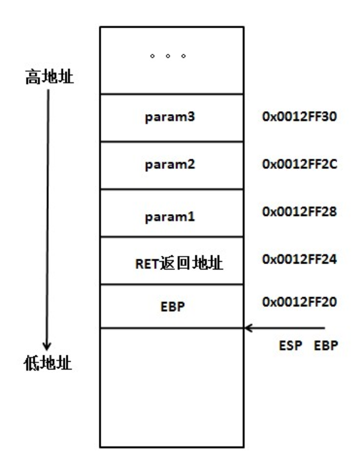

5.step3开始执行， int var1 = param1; int var2 = param2; int var3 = param3;按申明顺序依次存储。对应的汇编：

```assembly
mov 0x8(%ebp),%eax
mov %eax,-0x4(%ebp)
```

 其中将[EBP+0x8]地址里的内容赋给EAX，即把param的值赋给EAX，然后把EAX的中的值放到[EBP-4]这个地址里，即把EAX值赋给var1，完成C代码 int var1 = param1，其他变量雷同。


6.step4，输出结果，step5执行 对应的汇编代码：

```assembly
mov  -0x4(%ebp),%eax
```

 最后通过eax寄存器保存函数的返回值；

7.调用执行函数完毕，局部变量var3，var2，var1一次出栈，EBP恢复原值，返回地址出栈，找到原执行地址，param1，param2，param3依次出栈，函数调用执行完毕。图略


## 1.21 内联、宏、普通函数的区别（内联和宏分别如何实现）

### 1、内联和宏的区别

（1）**宏定义不是函数**，但是使用起来像函数。预处理器用**复制宏代码**的方式代替函数的调用，**省去了函数压栈退栈过程，提高了效率**；而**内联函数本质上是一个函数**，内联函数一般用于**函数体的代码比较简单的函数**，不能包含复杂的控制语句，while、switch，并且内联函数本身不能直接调用自身。

（2）宏函数是在**预编译**的时候把所有的宏名用宏体来替换，简单的说就是字符串替换；而内联函数则是在**编译**的时候进行代码插入，编译器会在每处调用内联函数的地方直接把内联函数的内容展开，这样可以省去函数的调用的开销，提高效率

（3）宏定义是没有**类型检查**的，无论对还是错都是直接替换；而内联函数在**编译**的时候会进行类型的检查与语法判断，内联函数满足函数的性质，比如有返回值、参数列表、可以重载等

（4）宏定义时要注意书写（参数要括起来）否则容易出现歧义，内联函数不会产生歧义

```C++
// 宏定义
#define MAX(a, b) ((a) > (b) ? (a):(b))
MAX(a, "hello");  // 错误地比较int与string,没有参数的类型检查

// 内联
#include <iostream>
inline int add(int a, int b) {
    return (a + b);
}
int main(void) {
    int a;
    a = add(1, 2);
    cout << a << endl;
    return 0;
}
```

### 2、内联和函数的区别

（1）内联函数多了inline

（2）内联函数避免了程序运行时函数调用的开销

（3）普通函数在被调用时需要寻址(函数入口地址)，普通函数不需要

（4）内联函数的代码有限制，要求代码尽量简单，不能包含复杂的结构控制语句，普通函数没有这种要求

### 3、内联的使用场景与注意事项

（1）使用宏定义的地方都可以使用 inline 函数。

（2）作为类成员接口函数来读写类的私有成员或者保护成员，会提高效率。

（3）内联函数的定义一定要出现在其第一次调用之前

不宜使用内联：（不能将所有函数都写为内联）

（1）函数体代码过长将导致内存消耗代价较高；（2）函数体内出现循环，执行函数体内代码时间要比函数调用开销大

### 4、构造函数、析构函数、虚函数可否声明为内联函数

（1）**构造函数和析构函数声明为内联函数是没有意义的**

《Effective C++》中所阐述的是：将构造函数和析构函数声明为inline是没有什么意义的，即编译器并不真正对声明为inline的构造和析构函数进行内联操作。**首先**编译器会在构造和析构函数中添加额外的操作（申请、释放内存，构造、析构对象等），致使构造函数和析构函数并不像看上去的那么精简。**其次**，class中的函数默认是inline型的，编译器也只是有选择性的inline，将构造函数和析构函数声明为内联函数是没有什么意义的。

（2）**对于虚函数，要分情况讨论**

有的人认为虚函数被声明为inline，但是编译器并没有对其内联，他们给出的理由是inline是编译期决定的，而虚函数是运行期决定的，即在不知道将要调用哪个函数的情况下，如何将函数内联呢？

上述观点看似正确，其实不然，如果虚函数在编译器就能够决定将要调用哪个函数时，就能够内联，那么什么情况下编译器可以确定要调用哪个函数呢，答案是当**用对象调用虚函数（此时不具有多态性）**时，就内联展开。

**综上**，当是指向派生类的指针（多态性）调用声明为inline的虚函数时，不会内联展开；当是对象本身调用虚函数时，会内联展开（前提依然是函数并不复杂的情况下）。

## 1.22 new、delete和malloc、free的区别-> 深入到operator new的三种情况与malloc中brk与mmap的实现

### 1、new、delete和malloc、free的异同点

相同点：都可用于内存的动态申请和释放

不同点：

（1）前者是C++操作符，后者是C/C++语言标准库函数

（2）new自动计算要分配的空间大小，malloc需要手动计算

（3）new是类型安全的，malloc不是。

（4）new调用名为**operator new**的标准库函数分配足够空间并调用相关对象的构造函数；delete对指针所指对象运行适当的析构函数，然后通过调用名为**operator delete**的标准库函数释放该对象所用内存。后者均没有相关调用

（5）后者需要库文件支持，前者不用

（6）new是封装了malloc，直接free不会报错，但是这只是释放内存，而不会析构对象

### 2、new和delete的实现原理

**执行new实际上执行两个过程**:1.分配未初始化的内存空间(malloc)；2.使用对象的构造函数对空间进行初始化;返回空间的首地址。

如果在第一步分配空间中出现问题，则抛出 std:bad_alloc异常，或被某个设定的异常处理函数捕获处理;如果在第二步构造对象时出现异常，则自动调用delete释放内存。

**执行delete实际上也有两个过程**∶1.使用析构函数对对象进行析构；2.回收内存空间(free)。

以上也可以看出 new和malloc的区别,new得到的是经过初始化的空间，而malloc得到的是未初始化的空间。所以**new是new一个类型，而malloc则是malloc一个字节长度的空间**。delete和free同理,delete 不仅释放空间还析构对象，delete 一个类型,free一个字节长度的空间。


### 3、malloc与free的实现原理


### 4、既然有了malloc/free，C++中为什么还需要new/delete呢？

malloc/free和new/delete都是用来申请内存和回收内存的。

在对非基本数据类型的对象(不是int,float等基本数据类型的数据)使用的时候，对象创建的时候还需要执行构造函数，销毁的时候要执行析构函数。而malloc/free是库函数，是已经编译的代码，所以不能把构造函数和析构函数的功能强加给

malloc/free，所以new/delete是必不可少的。

### 5、new和malloc的区别及其各自底层实现原理

区别：

1. new是操作符,需要编译器支持；而malloc是库函数，需要头文件支持；

2. new会先调用operator new函数，申请足够的内存（通常底层使用malloc实现）。然后调用类型的构造函数，初始化成员变量，最后返回自定义类型指针。delete先调用析构函数，然后调用operator delete函数释放内存（通常底层使用free实现）。malloc/free是库函数，只能动态的申请和释放内存，无法强制要求其做自定义类型对象构造和析构工作。

3. malloc需要给定申请内存的大小，返回的指针需要强转；new会调用构造函数，不用指定内存的大小，返回指针不用强转;

    malloc的返回类型是void*即空类型指针，需要做显式的类型转换

    ```C++
    char* pStr = (char*)malloc(100*sizeof(char))
    ```

4. new可以被重载但malloc不行;

5. new操作符内存分配成功时，返回的是对象类型的指针，类型严格与对象匹配，无须进行类型转换，故new是符合类型安全性的操作符。而malloc内存分配成功则是返回void * ，需要通过强制类型转换将void*指针转换成我们需要的类型。

    ```c
    char* pStr = (char*)malloc(100*sizeof(char))
    ```

6. new发生错误会抛出出bac_alloc异常，而malloc直接返回null。

malloc底层实现:

当开辟的空间小于128K时，调用brk(）函数;当开辟的空间大于128K时，调用mmap () 。malloc采用的是内存池的管理方式，以减少内存碎片。先申请大块内存作为堆区，然后将堆区分为多个内存块。当用户申请内存时，直接从堆区分配一块合适的空闲块。采用隐式链表将所有空闲块，每一个空闲块记录了一个未分配的、连续的内存地址。

new底层实现，new在调用构造函数的时候进行如下几个步骤：

（1）创建一个新的对象

（2）将构造函数的作用域赋值给这个新的对象（因此this指向这个新的对象）

（3）执行构造函数中的代码（为这个新对象添加属性）

（4）返回新的对象

### 6、malloc申请的内存能用delete释放吗

不能，malloc /free主要为了兼容C，new和delete 完全可以取代malloc /free的；从理论上说使用malloc申请的内存是可以通过delete释放的。不过一般不这样写的。而且也不能保证每个C++的运行时都能正常。

malloc /free的操作对象都是必须明确大小的，而且不能用在动态类上。

new 和delete会自动进行类型检查和大小，malloc/free不能执行构造函数与析构函数，所以动态对象它是不行的。

### 7、 delete p、delete [] p、allocator都有什么作用？

1、 动态数组管理new一个数组时，[]中必须是一个整数，但是不一定是常量整数，普通数组必须是一个常量整数；

2、 new动态数组返回的并不是数组类型，而是一个元素类型的指针；

3、 delete[]时，数组中的元素按逆序的顺序进行销毁；

4、 new在内存分配上面有一些局限性，new的机制是将内存分配和对象构造组合在一起，同样的，delete也是将对象析构和内存释放组合在一起的。allocator将这两部分分开进行，allocator申请一部分内存，不进行初始化对象，只有当需要的时候才进行初始化操作。

### 8、malloc、realloc、calloc的区别

malloc

```C++
void* malloc(unsigned int num_size);
int *p = malloc(20*sizeof(int));申请20个int类型的空间；
```

calloc

```C++
void* calloc(size_t n,size_t size);
int *p = calloc(20, sizeof(int));
```

省去了人为空间计算；malloc申请的空间的值是随机初始化的，calloc申请的空间的值是初始化为0的；

realloc

```C++
void realloc(void *p, size_t new_size);
```

为动态分配的空间分配额外的空间用于扩充容量

### 9、C++中有几种类型的new

（1）**plain new**

就是普通的new，我们常用的new，在C++中定义如下：

```C++
void* operator new(std::size_t) throw(std::bad_alloc);
void operator delete(void *) throw();
```

因此**plain new**在空间分配失败的情况下，抛出异常**std::bad_alloc**而不是返回NULL，因此通过判断返回值是否为NULL是徒劳的，举个例子：

```C++
#include <iostream>
#include <string>
using namespace std;
int main() {
    try {
        char *p = new char[1000000000000];	// 要求分配的空间过大
        delete p;
    }
    catch (const std::bad_alloc &ex) {
        cout << ex.what() << endl;
    }
    return 0; 
}
//执行结果：bad allocation
```

（2）**nothrow new**

nothrow new在空间分配失败的情况下是不抛出异常，而是**返回NULL**，定义如下：

```C++
void* operator new(std::size_t,const std::nothrow_t&) throw();
void operator delete(void*) throw();
```

举例如下

```C++
#include <iostream>
#include <string>
using namespace std;
int main() {
    char *p = new(nothrow) char[1000000000000];
    if (p == NULL)  cout << "alloc failed" << endl;
    delete p;
    return 0; 
}
//执行结果：alloc failed
```

（3）**placement new**

这种new允许在一块已经分配成功的内存上重新构造对象或对象数组。placement new不用担心内存分配失败，因为**它根本不分配内存，它做的唯一一件事情就是调用对象的构造函数**。定义如下：

```C++
void* operator new(size_t,void*);
void operator delete(void*,void*);
```

使用placement new需要注意两点：

（1）palcement new的主要用途就是反复使用一块较大的动态分配的内存来构造不同类型的对象或者他们的数组

（2）placement new构造起来的对象数组，要显式的**调用他们的析构函数来销毁**（析构函数并不释放对象的内存），**千万不要使用delete**，这是因为placement new构造起来的对象或数组大小并不一定等于原来分配的内存大小，使用delete会造成内存泄漏或者之后释放内存时出现运行时错误。

```C++
#include <iostream>
#include <string>
using namespace std;

class ADT {
    int i;
    int j;
public:
    ADT() {
        i = 10;
        j = 100;
        cout << "ADT construct i = " << i << ", j = "<<j <<endl;
    }
    ~ADT(){
        cout << "ADT destruct" << endl;
    }
};
int main() {
    char *p = new(nothrow) char[sizeof(ADT) + 1];
    if (p == NULL) cout << "alloc failed" << endl;
    ADT *q = new(p) ADT; //placement new:不必担心失败，只要p所指对象的的空间足够ADT创建即可
    //delete q;		    //错误!不能在此处调用delete q;
    q->ADT::~ADT();     //显示调用析构函数
    delete[] p;
    return 0; 
}
//输出结果：
// ADT construct i = 10, j = 100
// ADT destruct
```

## 1.23 **C++**从代码到可执行程序经历了什么？

一段高级语言代码经过四个阶段的处理形成可执行的目标二进制代码：

​								  预处理→编译→汇编→链接

其中文件后缀由 .c/.cpp → .i → .s → .o →可执行目标文件


1、预处理

主要处理源代码文件中的以“#”开头的预编译指令。处理规则见下：

1. 删除所有的#define，展开所有的宏定义。

2. 处理所有的条件预编译指令，如“#if”、“#endif”、“#ifdef”、“#elif”和“#else”。

3. 处理“#include”预编译指令，将文件内容替换到它的位置，这个过程是递归进行的，文件中包含其他文件。

4. 删除所有的注释，“//”和“/**/”。

5. 保留所有的#pragma 编译器指令，编译器需要用到他们，如：#pragma once 是为了防止有文件被重复引用。

6. 添加行号和文件标识，便于编译时编译器产生调试用的行号信息，和编译时产生编译错误或警告是能够显示行号。

2、编译

把预编译之后生成的xxx.i或xxx.ii文件，进行一系列词法分析、语法分析、语义分析及优化后，生成相应的汇编代码文件。

1. 词法分析：利用类似于“有限状态机”的算法，将源代码程序输入到扫描机中，将其中的字符序列分割成一系列的记号。

2. 语法分析：语法分析器对由扫描器产生的记号，进行语法分析，产生语法树。由语法分析器输出的语法树是一种以表达式为节点的树。

3. 语义分析：语法分析器只是完成了对表达式语法层面的分析，语义分析器则对表达式是否有意义进行判断，其分析的语义是静态语义——在编译期能分期的语义，相对应的动态语义是在运行期才能确定的语义。

4. 优化：源代码级别的一个优化过程。

5. 目标代码生成：由代码生成器将中间代码转换成目标机器代码，生成一系列的代码序列——汇编语言表示。

6. 目标代码优化：目标代码优化器对上述的目标机器代码进行优化：寻找合适的寻址方式、使用位移来替代乘法运算、删除多余的指令等。

3、汇编

将汇编代码转变成机器可以执行的指令(机器码文件)。 汇编器的汇编过程相对于编译器来说更简单，没有复杂的语法，也没有语义，更不需要做指令优化，只是根据汇编指令和机器指令的对照表一一翻译过来，汇编过程有汇编器as完成。经汇编之后，产生目标文件(与可执行文件格式几乎一样) xxx.o(Windows下)、xxx.obj(Linux下)。

4、链接

将不同的源文件产生的目标文件进行链接，从而形成一个可以执行的程序。链接分为静态链接和动态链接。


## 1.24静态链接和动态链接的区别，具体静态链接的实现

**静态链接**

函数和数据被编译进一个二进制文件。在使用静态库的情况下，在编译链接可执行文件时，链接器从库中复制这些函数和数据并把它们和应用程序的其它模块组合起来创建最终的可执行文件。

空间浪费：因为每个可执行程序中对所有需要的目标文件都要有一份副本，所以如果多个程序对同一个目标文件都有依赖，会出现同一个目标文件都在内存存在多个副本；

更新困难：每当库函数的代码修改了，这个时候就需要重新进行编译链接形成可执行程序。

运行速度快：但是静态链接的优点就是，在可执行程序中已经具备了所有执行程序所需要的任何东西，在执行的时候运行速度快。

**动态链接**

动态链接的基本思想是把程序按照模块拆分成各个相对独立部分，在程序运行时才将它们链接在一起形成一个完整的程序，而不是像静态链接一样把所有程序模块都链接成一个单独的可执行文件。

共享库：就是即使需要每个程序都依赖同一个库，但是该库不会像静态链接那样在内存中存在多分，副本，而是这多个程序在执行时共享同一份副本；

更新方便：更新时只需要替换原来的目标文件，而无需将所有的程序再重新链接一遍。当程序下一次运行时，新版本的目标文件会被自动加载到内存并且链接起来，程序就完成了升级的目标。

性能损耗：因为把链接推迟到了程序运行时，所以每次执行程序都需要进行链接，所以性能会有一定损失。

### 静态链接的实现

静态链接器以一组可重定位目标文件为输入，生成一个完全链接的可执行目标文件作为输出。链接器主要完成以下两个任务：

符号解析：每个符号对应于一个函数、一个全局变量或一个静态变量，符号解析的目的是将每个符号引用与一个符号定义关联起来。

重定位：链接器通过把每个符号定义与一个内存位置关联起来，然后修改所有对这些符号的引用，使得它们指向这个内存位置。


### 动态链接的实现

静态库有以下两个问题：

当静态库更新时那么整个程序都要重新进行链接；

对于 printf 这种标准函数库，如果每个程序都要有代码，这会极大浪费资源。

共享库是为了解决静态库的这两个问题而设计的，在 Linux 系统中通常用 .so 后缀来表示，Windows 系统上它们被称为 DLL。它具有以下特点：

1. 在给定的文件系统中一个库只有一个文件，所有引用该库的可执行目标文件都共享这个文件，它不会被复制到引用它的可执行文件中；

2. 在内存中，一个共享库的 .text 节（已编译程序的机器代码）的一个副本可以被不同的正在运行的进程共享。


## 1.25 float和int的存储结构与运算性能

具体见[计算机中int和float的储存结构以及运算性能](https://blog.csdn.net/weixin_40026797/article/details/112427288)

几个主要结论：

1. float 在内存中占32位，第一位是符号位（sign），符号位后面 8 位是指数位（exponent），最后 23 位是尾数（mantissa）。float值的二进制表示形式如下（该表达式对应上述二进制存储结构）：

    ```C++
    sign * mantissa * 2 ^ (exponent)
    ```

    符号位sign：表示浮点数的正负，0为正，1为负；
    指数位mantissa：实际上也有正负，但没有单独的符号位，计算机中使用二进制，指数表示的也是 2 的 N 次幂，8 位指数表达的范围是 **0至255**，而实际上是**-127至128**，也就是说，**实际的指数等于指数位表示的数值减127**。
    尾数位exponent：只表示二进制的小数点后的部分，小数点前的那位被省略了，当指数位全部为0时，省略的是0，否则省略的是1

2. float无法表示的int

    

    由此也可以得出**不能被 float 准确表达的最小 int 值是2 ^ 24 + 1**。我们再将1000000000000000000000001的值加1，变成1000000000000000000000010，这样变换为指数形式可以看出尾数又变为了23位，也就是说25位的二进制整数最后一位是0才能被float准确表示，每2个数就有一个不能被准确表示（x0与x1中只有x0才能被准确表示）。如果是26位的二进制整数最后两位都是0才可以被float准确表达，每4个数就有3个不能被准确表示（00,01,10,11中只有00才能被准确表示），以此类推。

3. 运算性能

    测试二者做乘除运算的性能。此处单纯使用主线程进行运算查看运算时间的差异

    注意：不使用额外线程是因为线程有资源优先级的问题，要排除这个影响。同时，不使用数值类型强转，避免其他性能消耗影响 。最后，为了普适化，使用 10 和 3 这种除不尽的数值。

    结论：

    （1）int 乘 int 消耗时间最多，float数据做运行的速度甚至比 int 要快那么一点点，但是从整体看来，区别不大，所以在100000000000次运算下，可以说单纯的乘除运算，int 和 float 的性能几乎一样。

    （2）使用代码进行数值运算后，肯定要储存结果，那么就存在数据转换问题。可以得到结论：

    1. int 除 int 消耗性能最高；
    2. 乘除法运算中，不同类型相乘除相对比较耗时；
    3. 都使用float运算，耗时最少，性能最高；

    （3）不同类型运算依旧相对比较耗时，同时，float 类型做乘除运算都比 int 要快一些，特别是除法运算，性能更高。

4. 总结

    （1）无论在任何平台，尽量使用同类型进行运算，这样相对比较快，节省了类型转化的时间。

    （2）在高端平台（比如PC，CPU性能较强），不用特别在意 float 的乘除问题，float单纯做乘除法的运行性能差距不大，不需要特意将除法改写为乘法，反而特意改写后可能会造成多次复合运算后的精度不准确。但在低端平台（比如CPU为M4、M7等），float 的乘法明显比除法快，建议通过改写来提升效率。

    （3）在高端平台上（比如PC，CPU性能较强），float 的乘除运算速度比 int 要快，很多人潜意识都觉得 float 的使用更消耗性能，好多时候都会强转成 int，没必要，不仅运算更慢，还不精确。当然，也不是说用 float 就是最好的选择，还需要考虑到 float 无法准确表示某些 int 数值的情况。

    （4）在低端平台上（比如CPU为M4、M7等），开启FPU（浮点运算单元）时，int 和 float 做乘法性能几乎一样；关闭FPU后，int 更快，且性能差距有十几倍。无论是否开启FPU，二者做除法运算都很慢，特别 float 的除法最慢，要避免使用。

## 1.26 C++多线程并发问题  atomic是怎么实现的（[原子操作](https://zhuanlan.zhihu.com/p/340359732)） 

### 1、多进程与多线程的使用场景

频繁修改：需要频繁创建和销毁的优先使用**多线程**，因为进程消耗资源要远高于线程

计算量：需要大量计算的优先使用**多线程** 因为需要消耗大量CPU资源且切换频繁，所以多线程好一点

相关性：任务间相关性比较强的用**多线程**，相关性比较弱的用多进程。因为线程之间的数据共享和同步比较简单。

多分布：可能要扩展到多机分布的用**多进程**，多核分布的用**多线程**。

但是实际中更常见的是进程加线程的结合方式，并不是非此即彼的。


## 27. C++11 新特性

### 0. 概括

C++11的新特性主要分为：语法的改进和标准库的扩充

**语法的改进**又分为三部分：

（1）提高运行效率的语言特性：右值引用与泛化的常量表达式consexpr

（2）原有语法的使用性增强：初始化列表和统一的初始化语法，auto与decltype的类型推导，范围for循环，lambda表达式，final与override，构造函数委托，增强的元组（变长参数的tuple）

（3）语言能力的提升：空指针nullptr，default与delete，静态assert

**标准库的扩充**：

无序容器（哈希表），正则表达式，智能指针


### 1. 语法改进

> 提高运行效率

#### 1. 右值引用与move语义

> 背景

C++03 及之前的标准中，右值是不允许被改变的，实践中也通常使⽤ const T& 的⽅式传递右值。然⽽这是效率低下的做法，例如：

```C++
Person get() {
	Person p;
	return p; 
}
Person p = get();
```

上述获取右值并初始化 p 的过程包含了 Person 的3个构造过程和2个析构过程。 这是 C++ ⼴受诟病的⼀点，但C++11 的右值引⽤特性允许我们对右值进⾏修改。 借此可以实现 **move**语义 ，即从右值中直接拿数据过来初始化或修改左值， ⽽不需要重新构造左值后再析构右值（即将某个左值强制转化为右值）。⼀个 move 构造函数是这样声明的：

```C++
class Person {
public:
	Person(Person && rhs) {...}
	...
};
```

> 左值与右值

左值：表示的是可以获取地址的表达式，它能出现在赋值语句的左边，对该表达式进行赋值。但是修饰符const的出现使得可以声明如下的标识符，它可以取得地址，但是没办法对其进行赋值，例如 `const int& a = 10;` 

右值：表示无法获取地址的对象，有常量值、函数返回值、lambda表达式等。无法获取地址，但不表示其不可改变，当定义了右值的右值引用时就可以更改右值。

> 右值引用

C++11正是通过引入右值引用来优化性能，具体来说是通过移动语义来避免无谓拷贝的问题，通过move语义来将临时生成的左值中的资源无代价的转移到另外一个对象中去，通过完美转发来解决不能按照参数实际类型来转发的问题（同时，完美转发获得的一个好处是可以实现移动语义）。

1. 在C++11中所有的值必属于左值、右值两者之一，右值又可以细分为纯右值、将亡值。在C++11中可以取地址的、有名字的就是左值，反之，不能取地址的、没有名字的就是右值（将亡值或纯右值）。举个例子，int a = b+c, a 就是左值，其有变量名为a，通过&a可以获取该变量的地址；表达式b+c、函数int func()的返回值是右值，在其被赋值给某一变量前，我们不能通过变量名找到它，＆(b+c)这样的操作则不会通过编译；

2. C++11对C++98中的右值进行了扩充。在C++11中右值又分为纯右值（prvalue，Pure Rvalue）和将亡值（xvalue，eXpiring Value）。

    其中纯右值的概念等同于我们在C++98标准中右值的概念，指的是临时变量和不跟对象关联的字面量值；将亡值则是C++11新增的跟右值引用相关的表达式，这样表达式通常是将要被移动的对象（移为他用），比如返回右值引用T&&的函数返回值、std::move的返回值，或者转换为T&&的类型转换函数的返回值。

    将亡值可以理解为通过“盗取”其他变量内存空间的方式获取到的值。在确保其他变量不再被使用、或即将被销毁时，通过“盗取”的方式可以避免内存空间的释放和分配，能够延长变量值的生命期。

3. 左值引用就是对一个左值进行引用的类型。右值引用就是对一个右值进行引用的类型，事实上，由于右值通常不具有名字，我们也只能通过引用的方式找到它的存在。右值引用和左值引用都是属于引用类型。无论是声明一个左值引用还是右值引用，都必须立即进行初始化。而其原因可以理解为是**引用类型本身自己并不拥有所绑定对象的内存，只是该对象的一个别名**。左值引用是具名变量值的别名，而右值引用则是不具名（匿名）变量的别名。左值引用通常也不能绑定到右值，但常量左值引用是个“万能”的引用类型。它可以接受非常量左值、常量左值、右值对其进行初始化。不过常量左值所引用的右值在它的“余生”中只能是只读的。相对地，非常量左值只能接受非常量左值对其进行初始化。

4. 右值值引用通常不能绑定到任何的左值，要想绑定一个左值到右值引用，通常需要std::move()将左值强制转换为右值。

> 右值引用的特点

特点1：通过右值引用的声明，右值又“重获新生”，其生命周期与右值引用类型变量的生命周期一样长，只要该变量还活着，该右值临时量将会一直存活下去

特点2：右值引用独立于左值和右值。意思是右值引用类型的变量可能是左值也可能是右值

特点3：T&& t在发生自动类型推断的时候，它是左值还是右值取决于它的初始化。

> 移动构造函数

（1）有时候我们会遇到这样一种情况，我们用对象a初始化对象b后对象a我们就不在使用了，但是对象a的空间还在（在析构之前），既然拷贝构造函数，实际上就是把a对象的内容复制一份到b中，那么为什么我们不能直接使用a的空间呢？这样就避免了新的空间的分配，大大降低了构造的成本。这就是**移动构造函数设计的初衷**，C++引入了移动构造函数，专门处理这种，用a初始化b后，就将a析构的情况；

（2）拷贝构造函数中，对于指针，我们一定要采用深层复制，而移动构造函数中，对于指针，我们采用浅层复制。浅层复制之所以危险，是因为两个指针共同指向一片内存空间，若第一个指针将其释放，另一个指针的指向就不合法了。

所以我们只要避免第一个指针释放空间就可以了。避免的方法就是将第一个指针（比如a->value）置为NULL，这样在调用析构函数的时候，由于有判断是否为NULL的语句，所以析构a的时候并不会回收a->value指向的空间；

（3）移动构造函数的参数和拷贝构造函数不同，拷贝构造函数的参数是一个左值引用，但是移动构造函数的初值是一个右值引用。意味着，移动构造函数的参数是一个右值或者将亡值的引用。也就是说，**只有用一个右值，或者将亡值初始化另一个对象的时候，才会调用移动构造函数**。而那个move语句，就是将一个左值（即前面说的a对象）变成一个将亡值。

（4）与拷贝类似，移动也使用一个对象的值设置另一个对象的值。但是，又与拷贝不同的是，移动实现的是对象值真实的转移（源对象到目的对象）：源对象将丢失其内容，其内容将被目的对象占有。

移动操作的发生的时候，是当移动值的对象是未命名的对象的时候。这里未命名的对象就是那些临时变量，甚至都不会有名称。典型的未命名对象就是函数的返回值或者类型转换的对象。使用临时对象的值初始化另一个对象值，不会要求对对象的复制：因为临时对象不会有其它使用，因而，它的值可以被移动到目的对象。

做到这些，就要使用移动构造函数和移动赋值：当使用一个临时变量对象进行构造初始化的时候，调用移动构造函数。类似的，使用未命名的变量的值赋给一个对象时，调用移动赋值操作。

#### 2. 泛化常量表达式constexpr

> 原有语法的使用性增强

#### 3. 初始化列表

#### 4. 统一的初始化语法

#### 5. auto与decltype的自动类型推导

#### 6. 范围for循环

#### 7. lambda表达式与函数闭包

#### 8. final与override

#### 9. 构造函数委托

#### 10. 增强的元组（变长参数的tuple模板）

> 语言能力的提升

#### 11. 空指针nullptr

#### 12. default与delete

#### 13. 静态assert

### 2. 标准库扩充

#### 1. 智能指针

#### 2. 正则表达式

#### 3. 无序容器（哈希表）

##### 1. STL中的hashtable如何实现

hashtable使用开链法解决哈希冲突


hashtable中的bucket所维护的list是其自己定义的由hashtable_node数据结构组成的**linked-list**，而bucket聚合体本身使用**vector**进行存储。hashtable的迭代器只提供前进操作，不提供后退操作。

在hashtable设计bucket的数量上，其内置了28个质数[53, 97, 193,...,429496729]，在创建hashtable时，会根据存入的元素个数选择**大于等于元素个数的质数作为hashtable的容量（vector的长度），其中每个bucket所维护的linked-list长度也等于hashtable的容量**。如果插入hashtable的元素个数超过了bucket的容量，就要进行重建table操作，即找出下一个质数，创建新的buckets vector，重新计算元素在新hashtable的位置。


## 28. 完美转发与移动语义

string右值，它调用的哪个构造函数


## 29. RAII与智能指针

### 1. RAII

#### 1.1 定义

`RAII`是`Resource Acquisition Is Initialization`的简称，其翻译过来就是“**资源获取即初始化**”，即在构造函数中申请分配资源，在析构函数中释放资源，它是`C++`语言中的一种**管理资源、避免内存泄漏**的方法。

`C++`语言的机制保证了，当创建一个类对象时，会自动调用构造函数，当对象超出作用域时会自动调用析构函数。`RAII`正是利用这种机制，**利用类来管理资源，将资源与类对象的生命周期绑定**，即在对象创建时获取对应的资源，在对象生命周期内控制对资源的访问，使之始终保持有效，最后在对象析构时，释放所获取的资源。

`RAII`技术被认为是`C++`中管理资源的最佳方法，更进一步来说，使用`RAII`技术也可以实现安全、简洁的状态管理。

#### 1.2 如何实现

对于系统中的资源不具有自动释放的功能， 而`C++`中的类具有自动调用析构函数的功能，因此我们可以**将资源用类进行封装起来**，对资源的操作都封装在类的内部，在析构函数中进行资源的释放。

下面是一个示例，将资源封装成类在使用

```C++
class ArrayOperation { 
public : 
    ArrayOperation()  { 
        m_Array = new int [10]; 
    } 
    void InitArray() { 
        for (int i = 0; i < 10; ++i) *(m_Array + i) = i;
    } 
    void ShowArray() { 
        for (int i = 0; i < 10; ++i) cout << m_Array[i] << endl;
    } 
    ~ArrayOperation() { 
        cout<< "~ArrayOperation is called" <<endl; 
        if (m_Array != NULL ) {
            delete[] m_Array;  
            m_Array = NULL ; 
        } 
    } 
private : 
    int *m_Array; 
}; 
 
int main() { 
    ArrayOperation arrayOp;    //创建一个资源对象
    arrayOp.InitArray();       //获取资源
    arrayOp.ShowArray();       //对资源进行操控，完成后自动释放资源
    return 0;
}
```

#### 1.3 RAII的典型应用

**在资源管理方面**，智能指针(`std::shared_ptr`和`std::unique_ptr`)是`RAII`最具代表性的实现，使用了智能指针，可以实现自动的内存管理，不用担心忘记`delete`造成内存泄漏了。

**在状态管理方面**，线程同步中使用`std::unique_lock`或`std::lock_guard`对互斥量`std::mutex`进行状态管理也是`RAII`的典型实现，通过这种方式，不用担心互斥量之间的代码出现异常而造成线程死锁。

总结起来说，`RAII`的核心思想是**将资源或状态与类对象的生命周期绑定**，通过`C++`语言机制，实现资源与状态的安全管理。

### 2. 智能指针

用unique_ptr实现RAII(unique_ptr与原始指针结合)

智能指针 shared_ptr是否线程安全，队列是否线程安全， shared_ptr的构造方式 make_share(stl)   shared_ptr的具体实现

#### 2.1 原理

智能指针是一个类，包含在头文件<memory>中，shared_ptr、unique_ptr、weak_ptr。

shared_ptr多个指针指向相同的对象。用来**存储指向动态分配对象的指针，负责自动释放动态分配的对象，防止堆内存泄漏**。动态分配的资源，交给一个类对象去管理，当类对象声明周期结束时，自动调用析构函数释放资源。

> 作用

方便管理堆内存，使用普通指针，容易造成堆内存泄露（程序结束忘记释放），二次释放，程序发生异常时内存泄露等问题等，使用智能指针能更好的管理堆内存。

因为智能指针就是⼀个类，当超出了类的作⽤域时，类会⾃动调⽤析构函数，析构函数会⾃动释放资源。所以智能指针的作⽤原理就是在函数结束时⾃动释放内存空间，不需要⼿动释放内存空间。

> 初始化

初始化。智能指针是个模板类，可以指定类型，传入指针通过构造函数初始化。也可以使用make_shared函数初始化。不能将指针直接赋值给一个智能指针，一个是类，一个是指针。例如std::shared_ptr<int> p4 = new int(1);的写法是错误的

> 常用接口

```C++
T* get();
T& operator*();
T* operator->();
T& operator=(const T& val);
T* release();
void reset (T* ptr = nullptr);
```

- T 是模板参数, 也就是传⼊的类型；
- get() ⽤来获取 auto_ptr 封装在内部的指针, 也就是获取原⽣指针；
- operator*()* 重载 , operator->() 重载了->, operator=()重载了=；
- realease() 将 auto_ptr 封装在内部的指针置为 nullptr, 但并不会破坏指针所指向的内容, 函数返回的是内部指针置空之前的值；
- 直接释放封装的内部指针所指向的内存, 如果指定了 ptr 的值, 则将内部指针初始化为该值 (否则将其设置为nullptr；

> 与普通指针的区别

智能指针实际上是对普通指针加了一层封装机制，这样的一层封装机制的目的是为了使得智能指针可以方便的管理一个对象的生命期。

#### 2.2 auto_ptr（C++98 的⽅案，C11 已抛弃）

```C++
auto_ptr<std::string> p1 (new string ("hello"));
auto_ptr<std::string> p2;
p2 = p1; //auto_ptr 不会报错.
// 此时不会报错，p2 剥夺了 p1 的所有权，但是当程序运⾏时访问 p1 将会报错。所以 auto_ptr 的缺点是：存在潜在的内存崩溃问题！
```

主要是为了解决“有异常抛出时发生内存泄漏”的问题 。因为发生异常而无法正常释放内存。

auto_ptr有拷贝语义，拷贝后源对象变得无效，这可能引发很严重的问题；而unique_ptr则无拷贝语义，但提供了移动语义，这样的错误不再可能发生，因为很明显必须使用std::move()进行转移。

auto_ptr不支持拷贝和赋值操作，不能用在STL标准容器中。STL容器中的元素经常要支持拷贝、赋值操作，在这过程中auto_ptr会传递所有权，所以不能在STL中使用。

#### 2.3 unique_ptr（替换 auto_ptr ）

```C++
unique_ptr<string> p3 (new string (auto));//#4
unique_ptr<string> p4;//#5
p4 = p3;//unique_ptr此时会报错
// 编译器认为 p4=p3 ⾮法，避免了 p3 不再指向有效数据的问题。
// 因此，unique_ptr ⽐ auto_ptr 更安全
```

unique_ptr采用的是**独享所有权语义**，一个非空的unique_ptr总是拥有它所指向的资源。转移一个unique_ptr将会把所有权全部从源指针转移给目标指针，源指针被置空；所以**unique_ptr不支持普通的拷贝和赋值操作**，所以不能用在STL标准容器中，但是局部变量的返回值除外（因为编译器知道要返回的对象将要被销毁）。如果拷贝一个unique_ptr，那么拷贝结束后，这两个unique_ptr都会指向相同的资源，造成在结束时对同一内存指针多次释放而导致程序崩溃（即双重释放`double free`问题）。

 unique_ptr“唯一”拥有其所指对象，同一时刻只能有一个unique_ptr指向给定对象（通过禁止拷贝语义、只有移动语义来实现）。相比与原始指针unique_ptr用于RAII的特性，使得在出现异常的情况下，动态资源能得到释放。

unique_ptr指针本身的生命周期：从unique_ptr指针创建时开始，直到离开作用域。离开作用域时，若其指向对象，则将其所指对象销毁(默认使用delete操作符，用户可指定其他操作)。

unique_ptr指针与其所指对象的关系：在智能指针生命周期内，可以改变智能指针所指对象，如创建智能指针时通过构造函数指定、通过reset方法重新指定、通过release方法释放所有权、通过移动语义转移所有权。

#### 2.4 shared_ptr(共享型，强引用)

实现原理：采用引用计数器的方法，允许多个智能指针指向同一个对象，每当多一个指针指向该对象时，指向该对象的所有智能指针内部的引用计数加1，每当减少一个智能指针指向对象时，引用计数会减1，当计数为0的时候会自动释放动态分配的资源。

shared_ptr内部的引用计数是线程安全的，但是对象的读取需要加锁。

- 智能指针将一个**计数器**与**类指向的对象**相关联，引用计数器跟踪共有多少个类对象共享同一指针
- 每次创建类的新对象时，初始化指针并将引用计数置为1
- 当对象作为另一对象的副本而创建时，拷贝构造函数拷贝指针并增加与之相应的引用计数
- 对一个对象进行赋值时，赋值操作符减少左操作数所指对象的引用计数（如果引用计数为减至0，则删除对象），并增加右操作数所指对象的引用计数
- 调用析构函数时，构造函数减少引用计数（如果引用计数减至0，则删除基础对象）

> 手写实现shared_ptr

```C++
template<typename T>
class SharedPtr {
public:
    SharedPtr(T* ptr = NULL):_ptr(ptr), _pcount(new int(1)) {}
    SharedPtr(const SharedPtr& s):_ptr(s._ptr), _pcount(s._pcount) (*_pcount)++;
    SharedPtr<T>& operator=(const SharedPtr& s) {
        if (this != &s) {
            if (--(*(this->_pcount)) == 0) {
                delete this->_ptr;
                delete this->_pcount;
            }
            _ptr = s._ptr;
            _pcount = s._pcount;
            *(_pcount)++;
        }
        return *this;
    }
    T& operator*() {
        return *(this->_ptr);
    }
    T* operator->() {
        return this->_ptr;
    }
    ~SharedPtr() {
        --(*(this->_pcount));
        if (*(this->_pcount) == 0) {
            delete _ptr;
            _ptr = NULL;
            delete _pcount;
            _pcount = NULL;
        }
    }
private:
    T* _ptr;
    int* _pcount;//指向引用计数的指针
};
```


#### 2.5 weak_ptr（弱引用）

weak_ptr 是⽤来解决 shared_ptr 相互引⽤时的死锁问题，如果说两个 shared_ptr 相互引⽤，那么这两个指针的引⽤计数永远不可能下降为0，也就是资源永远不会释放。它是对对象的⼀种弱引⽤，不会增加对象的引⽤计数，和 shared_ptr 之间可以相互转化，shared_ptr 可以直接赋值给它，它可以通过调⽤ lock 函数来获得shared_ptr。

weak_ptr 是⼀种不控制对象⽣命周期的智能指针，它指向⼀个 shared_ptr 管理的对象。进⾏该对象的内存管理的是那个强引⽤的 shared_ptr。

 weak_ptr 只是提供了对管理对象的⼀个访问⼿段。weak_ptr 设计的⽬的是为配合 shared_ptr ⽽引⼊的⼀种智能指针来协助 shared_ptr ⼯作，它只可以从⼀个 shared_ptr 或另⼀个 weak_ptr 对象构造,，它的构造和析构不会引起引⽤记数的增加或减少。

weak_ptr不能改变资源的引用计数，只会观察资源，无法使用资源，没有提供operator*   operator->等裸指针的功能。

```C++
class B;
class A {
public:
    A() {cout << "A()" << endl;}
    ~A() {cout << "~A()" << endl;}
    void funcA () {
        cout << "非常好用的方法" << endl;
    }
    weak_ptr<B> _ptrb;
};
class B {
public:
    B() {cout << "B()" << endl;}
    ~B() {cout << "~B()" << endl;}
    void funcB () {
        _ptra->funcA(); 	// 会直接提示错误
    }
    weak_ptr<A> _ptra;
};
int main() {

    shared_ptr<A> pa(new A());
    shared_ptr<B> pb(new B());

    pa->_ptrb = pb;
    pb->_ptra = pa;

    cout << pa.use_count() << endl;
    cout << pb.use_count() << endl;
    return 0;
}
```

若想使用弱指针调用某些资源，必须提升他使其拥有强指针的能力（可以用在多线程环境中，作为资源的观察者）：

```C++
class B;
class A {
public:
    A() {cout << "A()" << endl;}
    ~A() {cout << "~A()" << endl;}
    void funcA () {
        cout << "非常好用的方法" << endl;
    }
    weak_ptr<B> _ptrb;
};
class B {
public:
    B() {cout << "B()" << endl;}
    ~B() {cout << "~B()" << endl;}
    void funcB () {
        // _ptra->funcA(); 
        shared_ptr<A> ps = _ptra.lock();    // 提升方法
        if (ps != nullptr) ps->funcA();
    }
    weak_ptr<A> _ptra;
};
int main() {

    shared_ptr<A> pa(new A());
    shared_ptr<B> pb(new B());

    pa->_ptrb = pb;
    pb->_ptra = pa;

    cout << pa.use_count() << endl;
    cout << pb.use_count() << endl;
    pb->funcB();
    return 0;
}
// 输出结果
A()
B()
1
1
非常好用的方法
~B()
~A()
```

#### 2.6 循环(交叉)引用问题

> 背景

shared_ptr:强智能指针，可以改变资源的引用计数

weak_ptr:弱智能指针，不能改变资源的引用计数，只会观察资源，无法使用资源，没有提供operator*   operator->等裸指针的功能

weak_ptr -> shared_ptr -> 资源（内存）

> 循环引用

循环引用是指使用多个智能指针shared_ptr时，出现了指针之间相互指向，从而形成环的情况，有点类似于死锁的情况，这种情况下，智能指针往往不能正常调用对象的析构函数，导致内存泄露，几块相互引用的内存永远得不到释放。

举个例子1：


```C++
struct C {
    std::shared_ptr<C> m_child;
    std::shared_ptr<C> m_parent;
};

int main() {

    auto parent = std::make_shared<C>();
    auto child = std::make_shared<C>();

    cout << "parent的use_count = " << parent.use_count() << endl;   // 1
    cout << "child的use_count = " << child.use_count() << endl;     // 1

    // 建立相互引用
    parent->m_child = child;
    child->m_parent = parent;

    cout << "parent的use_count = " << parent.use_count() << endl;   // 2
    cout << "child的use_count = " << child.use_count() << endl;     // 2

    parent = nullptr;   // parent不会被释放，因为child还指向它
    child = nullptr;    // child不会被释放，因为parent还指向它

    return 0;
}

```

只有当引用计数减减之后等于0，析构时才会释放对象，而上述情况造成了一个僵局，那就是析构对象时先析构parent,可是由于parent的空间child还在使用中，所以parent.use_count减减之后为1，不释放;child也是相同的道理，由于child的空间parent还在使用中，所以child.use_count减减之后为1，也不释放。

parent等着child先释放，child等着parent先释放,二者互不相让，导致最终都没能释放，内存泄漏。

例子2：

```C++
class B;
class A {
public:
    A() {cout << "A()" << endl;}
    ~A() {cout << "~A()" << endl;}
    shared_ptr<B> _ptrb;
};
class B {
public:
    B() {cout << "B()" << endl;}
    ~B() {cout << "~B()" << endl;}
    shared_ptr<A> _ptra;
};
int main() {

    shared_ptr<A> pa(new A());
    shared_ptr<B> pb(new B());

    pa->_ptrb = pb;
    pb->_ptra = pa;

    cout << pa.use_count() << endl;		// 2
    cout << pb.use_count() << endl;		// 2
    return 0;
}
```


> 解决方案

（1）把其中逻辑上“不具有所属权”的那一个改成 weak_ptr 即可。（定义对象的时候用强智能指针，引用对象的地方用弱智能指针）

weak_ptr的构造函数不会修改引用计数的值，从而不会对对象的内存进行管理；它类似一个普通指针，不会影响指向引用计数的共享内存，但是可以检测到所管理的对象是否已经被释放(只起到观察资源是否存活的作用)，从而避免非法访问。

- 因为父窗口“拥有”子窗口是天经地义的，而子窗口并不“拥有”父窗口。
- 其实主要是一个父窗口可以有多个子窗口，只有规定子窗口从属于父窗口才能解决引用计数的问题……


```C++
class B;
class A {
public:
    A() {cout << "A()" << endl;}
    ~A() {cout << "~A()" << endl;}
    weak_ptr<B> _ptrb;
};
class B {
public:
    B() {cout << "B()" << endl;}
    ~B() {cout << "~B()" << endl;}
    weak_ptr<A> _ptra;
};
int main() {

    shared_ptr<A> pa(new A());
    shared_ptr<B> pb(new B());

    pa->_ptrb = pb;
    pb->_ptra = pa;

    cout << pa.use_count() << endl;
    cout << pb.use_count() << endl;
    return 0;
}
// 输出结果
A()
B()
1
1
~B()
~A()
```


（2）把 m_parent 变成原始指针。

- 还有一种更适应“父子窗口”这一场景的解决方案。刚才提到原始指针的应用场景是“当该对象不属于我，但他释放前我必然被释放时”。这里我们可以发现父窗口的释放必然导致子窗口的释放。因此我们完全可以把 m_parent 变成原始指针。
- 这样也不需要 weak_ptr 判断是否 *expired()* 了。


（2）的改进

- 还可以更好！刚才提到 unique_ptr 的应用场景是“**当该对象仅仅属于我时**”。既然都用了原始指针（假定他释放前我必然被释放）。因为因此我们完全可以把 m_child 变成一个标志“完全所有权”的 unique_ptr。
- 这样也不需要 shared_ptr 维护一个原子计数器的开销了。


#### 2.7 手写实现一个智能指针

```C++
template<typename T>
class SharedPtr {
private:
    size_t* m_count_;
    T* m_ptr_;
public:
    // 构造函数
    SharedPtr(): m_ptr_(nullptr),m_count_(new size_t) {}
    SharedPtr(T* ptr): m_ptr_(ptr),m_count_(new size_t) { m_count_ = 1;}
    // 析构函数
    ~SharedPtr() {
        -- (*m_count_);
        if (*m_count_ == 0) {
            delete m_ptr_;
            delete m_count_;
            m_ptr_ = nullptr;
            m_count_ = nullptr;
        }
    }
    // 拷⻉构造函数
    SharedPtr(const SharedPtr& ptr) {
        m_count_ = ptr.m_count_;
        m_ptr_ = ptr.m_ptr_;
        ++(*m_count_);
    }
    // 拷⻉赋值运算
    void operator=(const SharedPtr& ptr) { SharedPtr(std::move(ptr)); }
    // 移动构造函数
    SharedPtr(SharedPtr&& ptr) : m_ptr_(ptr.m_ptr_), m_count_(ptr.m_count_) { ++(*m_count_); }
    // 移动赋值运算
    void operator=(SharedPtr&& ptr) { SharedPtr(std::move(ptr)); }
    // 解引⽤
    T& operator*() { return *m_ptr_; }
    // 箭头运算
    T* operator->() { return m_ptr_; }
    // 重载bool操作符
    operator bool() {return m_ptr_ == nullptr;}
    T* get() { return m_ptr_;}
    size_t use_count() { return *m_count_;}
    bool unique() { return *m_count_ == 1; }
    void swap(SharedPtr& ptr) { std::swap(*this, ptr); }
};
```


## 30. 类型转换及隐式类型转换

类型转换就是将给定类型的表达式转换为另一种类型。C++中的转型可分为两种：隐式类型转换和显式类型转换。

### 1. 隐式类型转换的情形

隐式类型转换是C中的遗留物，在C++中并不推荐使用（C++有专门的转型操作符，即四种显式转型）。将某种类型的对象拷贝到另一种不同类型的对象中时就会发生隐式转型。比如异型赋值，返回值（函数声明的返回值与代码块实际返回值不同的情况下），按值传递异型参数等情况均会发生隐式类型转换。

> 情形一：标准转换支持数值类型，bool以及某些指针之间相互转换。注意：某些转换可能会导致精度丢失，比如从 long 转换到 int。

**算术运算中的隐式转换规则:**

确定二元运算中的哪个操作数要转换为另一个操作数的类型是，其机制相当简单。其基本规则是，**将值域较小的操作数类型转换为另一个操作数类型(即低转高)**，但在一些情况下，两个操作数都要转换类型。

1. 浮点晋升：整型类型遇到浮点类型结果转换成浮点类型
2. 小整型向int转换：比整型的范围小的数在遇到比整型范围小的数时结果转换成整型
3. 范围扩大：小范围的数和大范围的数计算结果变为大范围的数
4. 去符号：有符号数和无符号数计算时,结果是无符号数

由低到高：short->int->unsigned int->long->double			float->double

#### 带符号和不带符号数之间的运算转换

当表达式中含有无符号类型和有符号类型时，**有符号的要先转换成无符号类型**，因此，在这方面，无符号类型的运算优先级要高于有符号类型的；
而对于浮点数来说，浮点数（float，double）实际上都是有符号数，unsigned 和signed前缀不能加在float和double之上，当然就不存在有符号数跟无符号数之间转化的问题了

```C++
signed int a = -30;
unsigned int b = 10;
cout << a + b << endl;
// 发现结果不是-20，这是因为在a+b时，有符号的a会先自动转换成无符号类型，再和b进行运算；
// 输出结果
-30
10
4294967276
```


## 31. 四种强制转换（显示转换）

> 几个概念

上行转换：子类指针转换成父类指针(也就是父类指针指向了子类对象)

下行转换：父类指针转换成子类指针(也就是子类指针指向了父类对象)

### 0. 基础类型的显示转换

C++ 是一门强类型转换，因此不同自定义类型之间的转换必须进行显式转换，当然基础数据类型也可以进行显式转换。

```C++
short a = 10;
int b;
b = (int) a;    // c-like cast notation
b = int (a);    // functional notation
```

以上是基础数据类型之间进行传统的强制类型转换。这种强制类型转换可以在两种指向不同类型对象的指针之间进行，这很可能是相当危险的事情。所以 C++ 提供四种转换操作符来细分显式类型转换：

```C++
static_cast <new_type> (expression)
const_cast <new_type> (expression)
dynamic_cast <new_type> (expression)
reinterpret_cast <new_type> (expression)
```


### 1. static_cast

明确指出类型转换，⼀般建议将隐式转换都替换成显示转换，因为没有动态类型检查，上⾏转换（派⽣类->基类）安全，下⾏转换（基类->派⽣类） 不安全，所以主要执⾏⾮多态的转换操作；

```C++
#include <bits/stdc++.h>
using namespace std;
class Base {
public:
    Base() : b(1) {}
    virtual void fun() {};
    int b;
};
class Son : public Base {
public:
    Son() :d(2) {}
    int d;
};
int main() {
    Son* b1 = new Son;
    Base* b2 = new Base;
    //static_cast
    Son* s1 = static_cast<Son*>(b1);   // 同类型转换
    Son* s2 = static_cast<Son*>(b2);   // 下行转换，不安全
    Base* s3 = static_cast<Base*>(b1); // 上行转换，安全
    cout << s1->d << endl; // 输出2
    cout << s2->d << endl; // 输出垃圾值，下行转换，原先父对象没有d成员
    cout << s3->b << endl; // 输出1，上行转换，原先父对象有b成员，输出b
    return 0;
}
```


### 2. dynamic_cast

专⻔⽤于派⽣类之间的转换，type-id 必须是类指针，类引⽤或 void*，dynamic_cast有类型检查，基类向派生类转换（下行转换）比较安全，但是派生类向基类转换（上行转换）则不太安全。

dynamic_cast运算符可以在执行期决定真正的类型，也就是说expression必须是多态类型。如果下行转换是安全的（也就说，如果基类指针或者引用确实指向一个派生类对象）这个运算符会传回适当转型过的指针。如果 如果下行转换不安全，这个运算符会传回空指针（也就是说，基类指针或者引用没有指向一个派生类对象）。

dynamic_cast主要用于类层次间的上行转换和下行转换，还可以用于类之间的交叉转换

```C++
#include <bits/stdc++.h>
using namespace std;
class Base {
public:
    Base() : b(1) {}
    virtual void fun() {};
    int b;
};
class Son : public Base {
public:
    Son() :d(2) {}
    int d;
};
int main() {
    Son* b1 = new Son;
    Base* b2 = new Base;
    //dynamic_cast
    Son* s3 = dynamic_cast<Son*>(b1); //同类型转换
    Base* s5 = static_cast<Base*>(b1); // 上行转换，安全
    Son* s4 = dynamic_cast<Son*>(b2); //下行转换，会进行类型检查

    cout << s3->d << endl;    // 输出2 同类型转换安全
    cout << s5->b << endl;    // 输出1 上行转换安全
    cout << "下行转换进行类型检查:" << endl;
    if(s4 == nullptr) cout << "s4指针为nullptr" << endl;  // 输出
    else cout << s4->d << endl;
    return 0;
}
```

> dynamic_cast与static_cast的区别

1. 在类层次间进行上行转换时，dynamic_cast和static_cast的效果是一样的。

2. 在进行下行转换时，dynamic_cast具有类型检查的功能，比static_cast更安全。

dynamic_cast有类型检查，如果下行转换是安全的（也就说，如果基类指针或者引用确实指向一个派生类对象）这个运算符会传回适当**转型过的指针**。如果 如果下行转换不安全，这个运算符会传回**空指针**（也就是说，基类指针或者引用没有指向一个派生类对象）

但是当类型不⼀致时，static_cast转换过来的是错误意义的指针，可能造成⾮法访问等问题。

> dynamic_cast失败时的处理

- 对指针进行dynamic_cast，失败返回null，成功返回正常cast后的对象指针；
- 对引用进行dynamic_cast，失败抛出一个异常，成功返回正常cast后的对象引用。
- dynamic_cast 会动用运行时信息RTTI（这就要求父类必须包含虚函数）来进行类型安全检查，因此 dynamic_cast 存在一定的效率损失。

### 3. const_cast

专⻔⽤于 const 属性的转换，去除 const 性质，或增加 const 性质， 是四个转换符中唯⼀⼀个可以操作常量的转换符。

```C++
int n = 97;
//const_cast
const int *p2 = &n;
int *p3 = const_cast<int*>(p2);
cout << "*p3 = :" << *p3 << endl;   // 97
*p3 = 100;
cout << "const_cast输出:" << *p3 << endl;   // 100
```


### 4. reinterpret_cast

不到万不得已，不要使⽤这个转换符，⾼危操作。

使⽤特点：

- 从底层对数据进⾏重新解释，依赖具体的平台，可移植性差；
- 可以将整形转换为指针，也可以把指针转换为数组；
- 可以在指针和引⽤之间进⾏肆⽆忌惮的转换。

例子：

```C++
int n = 97;
//reinterpret_cast
int *p = &n;
//以下两者效果相同
char *c2 = reinterpret_cast<char*> (p); 
// char *c2 = (char*)(p);
cout << "reinterpret_cast输出:"<< *c2 << endl;
```

## 32. 函数传参 string string& const string &

### 1. string 做参数

```C++
#include <bits/stdc++.h>
using namespace std;
void test(string s){
    s="shit";
}
int main(){
    string s{"test"};
    test(s);
    cout<<s<<endl;
}
// 输出结果
test
```

### 2. string& 做参数

```C++
void test(string &s){
    s="shit";
}
int main(){
    string s{"test"};
    test(s);
    cout<<s<<endl;
}
// 输出结果
shit
```

### 3. const string 与 const string& 做参数

> 背景

在 C/C++ 里面，一个函数 func(type value) 调用参数时是 pass-by-value，从调用的地方把值复制一遍传给函数。这样至少有两个问题，

第一是如果你需要在函数里修改这个值，那么你修改的只是它的副本，在你调用函数的位置这个值本身没有变化（参考所有 C 课本提到的 naive swap 例子）；

第二是如果你这个 type 不是诸如 int, double 这样的基本类型而是比较复杂的 struct 或者 array 之类，复制一遍成本很高，影响性能。

> C语言的做法

C 的传统做法是显式地传一个指针实现 pass-by-reference。一来函数拿到指针之后也可以修改参数本身，因为你把一个地址复制一遍，两个地址指向的还是同一个地方；二来一个指针地址就是一个 int，即使在 64 位系统上复制成本也能接受。

> C++的做法

C++ 在语言层面区分了 pass-by-value 和 pass-by-reference，前者和 C 一样，后者则是提供了一个更易用的、相当于传指针的做法，你只要把函数声明改成 func(type**&** value) 就行。

这个「更易用」还体现在，因为 C++ 规定**引用不能为空**，所以**一个函数传进来引用就可以直接用**，而传进来指针你还需要判断指针是否为空。

参数声明中的 const，const string s 的意思是你复制出来的这个副本你不会修改，const string& s 的意思是你调用函数时原来的那个 string 不会修改。


类的内存模型

内存分配代码找bug并修改。继承关系的代码找bug并修改。

# 2. 算法与数据结构

## 1. 链表找环

```C++
// 1.快慢指针
class Solution {
public:
    bool hasCycle(ListNode *head) {
        ListNode* fast = head;
        ListNode* slow = head;
        while (fast && fast->next) {
            slow = slow->next;
            fast = fast->next->next;
            if (fast == slow) return true;
        }
        return false;
    }
};
// 2-哈希表
class Solution {
public:
    bool hasCycle(ListNode *head) {
        if (head == nullptr) return false;
        unordered_set<ListNode*> st;
        while (head && head->next) {
            if (st.count(head)) return true;
            else st.insert(head);
            head = head->next;
        }
        return false;
    }
};
```

## 2. TopK问题  

小数据范围TopK -> 快排的partation思想；大数据范围TopK -> 外[排序](https://www.nowcoder.com/jump/super-jump/word?word=排序)+归并 / 分治+哈希+堆

 [力扣T215]([215. 数组中的第K个最大元素 - 力扣（LeetCode）](https://leetcode.cn/problems/kth-largest-element-in-an-array/))

> 直接暴力排序

```C++
class Solution {
public:
    int findKthLargest(vector<int>& nums, int k) {
        if (nums.size() == 1 && k == 1) return nums[0];
        else if (nums.size() == 1 && k > 1) return -1;
        sort(nums.begin(), nums.end());
        return nums[nums.size() - k];
    }
};
```

复杂度分析：

时间复杂度：O(NlogN)，这里 N 是数组的长度，算法的性能消耗主要在排sort()默认使用快速排序，因此时间复杂度为O(NlogN)；
空间复杂度：O(logN)，这里认为编程语言使用的排序方法是「快速排序」，空间复杂度为递归调用栈的高度，为 logN。

> 快排的partition操作

针对 topK 问题，可以对快排进行改进。仅对部分数据进行递归计算。比如，在 100 个数字中，找最大的 10 个：第一次循环的时候，povit 被移动到了 80 的位置，则接下来仅需要在后面的 20 个数字中找最大的 10 个即可。

这样做的优势是，理论最优时间复杂度可以达到 `O(n)`，不过平均时间复杂度还是 `O(nlogn)`。需要说明的是，通过这种方式，找出来的最大的 k 个数字之间，是无序的。

```C++
// 2-利用快排的partition操作
// 左右挖坑互填写法
class Solution {
public:
    int findKthLargest(vector<int>& nums, int k)  {
        int n = nums.size();
        int l = 0;
        int r = n - 1;
        while (true) {
            int idx = partition(nums, l, r);
            if (idx == k - 1) return nums[idx];
            else if (idx < k - 1) l = idx + 1;
            else r = idx - 1;
        }
    }
    // 左右挖坑互填
    int partition(vector<int> & nums, int l, int r) {
        int pivot = nums[l];
        while (l < r) {
            while (l < r && nums[r] <= pivot) r--;
            nums[l] = nums[r];
            while (l < r && nums[l] >= pivot) l++;
            nums[r] = nums[l];
        }
        nums[l] = pivot;
        return l;
    }
};
```

注意：如果partition()函数这样写则是找 **topk小** 的数字

```C++
int partition(vector<int> & nums, int l, int r) {
    int pivot = nums[l];
    while (l < r) {
        while (l < r && nums[r] >= pivot) r--;
        nums[l] = nums[r];
        while (l < r && nums[l] <= pivot) l++;
        nums[r] = nums[l];
    }
    nums[l] = pivot;
    return l;
}
```

> 利用大根堆

```C++
// 调库实现
class Solution {
public:
    int findKthLargest(vector<int>& nums, int k) {
        priority_queue<int, vector<int>, less<int>> maxHeap;
        for (int x : nums) maxHeap.push(x);
        for (int i = 0; i < k - 1; i++) maxHeap.pop();
        return maxHeap.top();
    }
};
```

```C++
// 手写实现
class Solution {
public:
    int findKthLargest(vector<int>& nums, int k)  {
        int n = nums.size();
        build_maxHeap(nums);
        for (int i = 0; i < k - 1; i++) {
            swap(nums[0], nums[n - 1 - i]);
            adjust_down(nums, 0, n - 1 - i - 1);
        }
        return nums[0];
    }
    void build_maxHeap(vector<int> & nums) {
        int n = nums.size();
        for (int root = n / 2; root > -1; root--) adjust_down(nums, root, n - 1);
    }

    void adjust_down(vector<int> & nums, int root, int hi) {
        if (root > hi) return;
        int t = nums[root];
        int child = 2 * root + 1;
        while (child <= hi) {
            if (child + 1 <= hi && nums[child] < nums[child + 1]) child++;
            if (t > nums[child]) break;
            nums[root] = nums[child];
            root = child;
            child = 2 * root + 1;
        }
        nums[root] = t;
    }
};
```

> bitmap

有时候 topK 问题会遇到数据量过大，内存无法全部加载。这个时候，可以考虑将数据存放至 bitmap 中，方便查询。

比如，给出 10 个 int 类型的数据，分别是【13，12，11，1，2，3，4，5，6，7】，int 类型的数据每个占 4 个字节，那这个数组就占据了 40 个字节。现在，把它们放到一个 16 个长度 bool 的 bitmap 中，结果就是【0，1，1，1，1，1，1，1，0，0，0，1，1，1，0，0】，在将空间占用降低至 4 字节的同时，也可以很方便的看出，最大的 3 个数字，分别是 11，12 和 13。

需要说明的是，bitmap 结合**跳表**一起使用往往有奇效。比如以上数据还可以记录成：从第 1 位开始，有连续 7 个 1；从第 11 位开始，有连续 3 个 1。这样做，空间复杂度又得到了进一步的降低。

这种做法的优势，当然是降低了空间复杂度。不过需要注意一点，bitmap 比较适合不重复且有范围（比如，数据均在 0 ～ 10 亿之间）的数据的查询。至于有重复数据的情况，可以考虑与 hash 等结构的混用。

> hash

如果遇到了查询 string 类型数据的大小，可以考虑 hash 方法。

举个例子，10 个 string 数字【"1001"，"23"，"1002"，"3003"，"2001"，"1111"，"65"，"834"，"5"，"987"】找最大的 3 个。我们先通过长度进行 hash，得到长度最大为 4，且有 5 个长度为 4 的 string。接下来再通过最高位值做 hash，发现有 1 个最高位为"3"的，1 个为"2"的，3 个为"1"的。接下来，可以通过再设计 hash 函数，或者是循环的方式，在 3 个最高位为"1"的 string 中找到最大的一个，即可找到 3 个最值大的数据。

这种方法比较适合网址或者电话号码的查询。缺点就是如果需要多次查询的话，需要多次计算 hash，并且需要根据实际情况设计多个 hash 函数。

> 外排序

 我们一般提到排序都是指内排序，比如快速排序，堆排序，归并排序等，所谓内排序就是可以在**内存**中完成的排序。RAM的访问速度大约是磁盘的25万倍，我们当然希望如果可以的话都是内排来完成。但对于大数据集来说，内存是远远不够的，这时候就涉及到外排序了。

外部排序指的是大文件的排序，即待排序的记录存储在外存储器上，待排序的文件无法一次装入内存，需要在内存和外部存储器之间进行多次数据交换，以达到排序整个文件的目的。

>  多路归并排序

基本思想
外部排序最常用的算法是多路归并排序，即将原文件分解成多个能够一次性装人内存的部分，分别把每一部分调入内存完成排序。然后，对已经排序的子文件进行归并排序。　　

一般来说外排序分为两个步骤：预处理和合并排序。即首先根据内存的大小，将有n个记录的磁盘文件分批读入内存，采用有效的内存排序方法进行排序，将其预处理为若干个有序的子文件，这些有序子文件就是初始顺串，然后采用合并的方法将这些初始顺串逐趟合并成一个有序文件。

由于多路归并，有k路，就要比较k-1次，所以有了减少比较次数的**胜者树与败者树**，而多路归并常用**败者树**。


## 3. 交换两个数的多种方法

> 中间变量

```C++
int a = 10, b = 5;
int temp = a;
a = b;
b = temp;
```

> 算术法

```C++
int a = 10, b = 5;
a = a + b;	// 前提是a + b不能溢出
b = a - b;
a = a - b;
```

> 异或法
>
> 两数异或的结果保存了两个数上每一个二进制位不同或相同的信息，如果相应的二进制位不同，就标志为1，如果相同，则标志为0。
>
> 由于任意一个二进制位与1异或有这样一个特性：
>
> 0^1=1
>
> 1^1=0

```C++
// 只能对int,char
// 第一种写法
x = x ^ y;
y = x ^ y; 
x = x ^ y; 
// 第二种写法
x ^= y ^= x ^= y;
```

## 4.  **strcat**，**strcpy**，**strncpy**，**memset**，memcpy函数实现

### 1. memcpy与strcpy的区别

- 复制的内容不同。strcpy只能复制字符串，而memcpy针对内存块之间的拷贝，所以可以复制任意内容，例如字符数组、整型、结构体、类等。
- 复制的方法不同。strcpy不需要指定长度，它遇到被复制字符的串结束符"\0"才结束，所以容易溢出。memcpy则是根据其第3个参数决定复制的长度。
- 用途不同。通常在复制字符串时用strcpy，而需要复制其他类型数据时则一般用memcpy。

### 2. strcat的实现

[strcat](https://so.csdn.net/so/search?q=strcat&spm=1001.2101.3001.7020)()库函数的原型如下：

 char \*strcat(char \*dest, const char \*src);

把 src 所指向的字符串追加到 dest 所指向的字符串的结尾。

```C++
//1. 将⽬的字符串的起始位置先保存，最后要返回它的头指针
//2. 先找到dest的结束位置,再把src拷⻉到dest中，记得在最后要加上'\0'
char* strcat(char *dest,const char *src) {
    // 确保二者不为空
    assert(dest != NULL);
    assert(src != NULL);
    //这个是为了记住起始地址，后面dst会偏移，输出要靠tmp
    char *ret = dest;
    while(*dest != '\0') dest++;
    //这个循环结束之后dst偏移指向任意一块起始地址
    while(*src != '\0') *(dest++) = *(src++);
    //这句一定要加，否则最后一个字符会乱码
    *dest='\0';
    //这里返回tmp,不能返回dst，dst已经偏移指向'\0'了
    return ret; 
}
```

### 3. strcpy的实现

```C++
//把 src 所指向的字符串复制到 dest，注意：dest定义的空间应该⽐src⼤。
char* strcpy(char *dest, const char *src) {
    assert(dest != NULL);//优化点1：检查输⼊参数
    assert(src != NULL);
    char *ret = dest;
    while(*src != '\0') *(dest++) = *(src++);
    *dest = '\0';//优化点2：⼿动地将最后的'\0'补上
    return ret; 
}
//考虑内存重叠的字符串拷⻉函数
char* strcpy(char *dest,char *src) {
    char *ret = dest;
    assert(dest != NULL);
    assert(src != NULL);
    memmove(dest, src, strlen(src)+1);
    return ret; 
}
```

### 4. strncpy()的实现

函数原型char *strncpy(char *dest, char *src, size_t n);

strcpy只是复制字符串，但不限制复制的数量，很容易造成缓冲溢出。strncpy要安全一些。strncpy能够选择一段字符输出，strcpy则不能。

```C
// const确保str2不被修改
char* Strncpy(char* str1, const char* str2, int size) {
    assert(str1 != NULL);
    assert(str2 != NULL);
	for (int i = 0; *(str1 + i) != '\0'; ++i) {
		if (i == size - 1) {
			*(str1 + i) = '\0';
			break;
		}
		*(str1 + i) = *(str2 + i);
	}
	return str1;
}
```

### 5. strcmp()的实现

函数原型 int strcmp(const char *s1,const char *s2) 

把 str1 所指向的字符串和 str2 所指向的字符串进⾏⽐较。

该函数返回值如下：

如果返回值 < 0，则表示 str1 ⼩于 str2。

如果返回值 > 0，则表示 str1 ⼤于 str2。

如果返回值 = 0，则表示 str1 等于 str2。

```c
//对两个字符串不希望修改，所以加上const来修饰
int strcmp(const char *s1,const char *s2) {
    assert(s1 != NULL) && (s2 != NULL);
    while(*s1 != '\0' && *s2 != '\0') {
        if(*s1 > *s2) return 1;
        else if(*s1 < *s2) return -1;
        else s1++, s2++;
    }
    //当某⼀个字符串已经⾛到结尾
    if(*s1 > *s2) return 1;
    else if(*s1 < *s2) return -1;
    else return 0; 
 }
```

### 6. strstr()的实现

在另外一个[字符串](https://so.csdn.net/so/search?q=字符串&spm=1001.2101.3001.7020)里面寻找和原字符串中相同的部分,并输出后面所有的值

```C
char* strstr(const char* s1, const char* s2) {
    assert (s1 != null) && (s2 != null);
    char* str = (char*) s1;
    char* substart = (char*) s2;
    char* ans = (char*) s1;
    while (*ans) {
        str = cp;
        while (*str != '\0' && *substart != '\0' && *str == * substart) {
            str++;
            substart++;
        }
        if (*substart == '\0') return cp;
        if (*substart != '\0' && *str == '\0') return null;
        substart = (char*)s2;
        cp++;
    }
    return null;
}
```

### 7. memcpy()的实现

模拟实现memcpy函数 从存储区 str2 复制 n 个字符到存储区 dst。

```c
// 不考虑内存重叠
void* memcpy(void* dest, void* src, size_t num) {
    void* ret = dest;
    assert(dest != NULL) && (src != NULL);
    for(size_t i = 0; i < num; i++) {
        //因为void* 不能直接解引⽤，所以需要强转成char*再解引⽤
        //此处的void*实现了泛型编程
        *(char*) dest = *(char*) src;
        dest = (char*)dest + 1;
        src = (char*)src + 1;
    }
    return ret;
}
```

```C
//考虑内存重叠的memcpy函数
void* memmove(void* dest, void* src, size_t num) {
    assert(dest != NULL) && (src != NULL);
    char* p1 = (char*)dest;
    char* p2 = (char*)src;
    //p1低地址, p2⾼地址
    if(p1 < p2) {
        for(size_t i = 0; i != num; ++i) *(p1++) = *(p2++);
    } else {
        //从后往前赋值
        p1 += num - 1;
        p2 += num - 1;
        for(size_t i = 0; i != num; ++i) *(p1--) = *(p2--);
    }
    return dest;
 }
```

## 5. 链表与二叉树的结构体

链表

```C++
struct ListNode {
    int val;
    ListNode *next;
    ListNode() : val(0), next(nullptr) {}
    ListNode(int x) : val(x), next(nullptr) {}
    ListNode(int x, ListNode *next) : val(x), next(next) {}
};
```

二叉树

```C++
struct TreeNode {
    int val;
    TreeNode *left;
    TreeNode *right;
    TreeNode() : val(0), left(nullptr), right(nullptr) {}
    TreeNode(int x) : val(x), left(nullptr), right(nullptr) {}
    TreeNode(int x, TreeNode *left, TreeNode *right) : val(x), left(left), right(right) {}
};
```

## 6. 二叉树的遍历

### 1. 中序遍历

```C++
// 1-递归
class Solution {
public:
    void inorder(TreeNode* root, vector<int>& ans) {
        if (root == nullptr) return;
        inorder(root->left, ans);
        ans.push_back(root->val);
        inorder(root->right, ans);
        return;
    }
    vector<int> inorderTraversal(TreeNode* root) {
        vector<int> ans;
        inorder(root, ans);
        return ans;
    }
};
// 2-迭代
class Solution {
public:
    vector<int> inorderTraversal(TreeNode* root) {
        vector<int> ans;
        if (root == nullptr) return ans;
        stack<TreeNode*> st;
        TreeNode* temp = root;
        while (temp != nullptr || !st.empty()) {
            if (temp) {
                st.push(temp);
                temp = temp->left;
            } else {
                temp = st.top();
                st.pop();
                ans.push_back(node->val);
                temp = temp->right;
            }
        }
        return ans;
    }
};
```

## 7. 红黑树

红黑树的实现原理其应用

### 1. 概念


### 2. 红黑树的特点(二叉排序树性质+自己的特性)

1. 它是二叉排序树（继承二叉排序树的性质）：

- 若左子树不空，则左子树上所有结点的值均小于或等于它的根结点的值
- 若右子树不空，则右子树上所有结点的值均大于或等于它的根结点的值
- 其左右子树也分别为二叉排序树

2. 每个节点或者是⿊⾊，或者是红⾊。

3. 根节点是⿊⾊。

4. 每个叶⼦节点（NIL）是⿊⾊。 [注意：这⾥叶⼦节点，是指为空(NIL或NULL)的叶⼦节点！]

5. 如果⼀个节点是红⾊的，则它的⼦节点一定是⿊⾊的；如果一个节点是黑色的，它的子节点颜色不一定

6. 从根到NULL的任何路径上黑色结点数相同（确保没有⼀条路径会⽐其他路径⻓出两倍。因⽽，红⿊树是相对是接近平衡的⼆叉树。）

7. 查找时间一定可以控制在O(logn)。

### 3. 应用场景


### 4. 基本操作

> 旋转操作

添加或删除红⿊树中的节点之后，红⿊树就发⽣了变化，变成⼀颗普通的树了。

⽽通过旋转，可以使这颗树重新成为红⿊树。简单点说，旋转的⽬的是让树保持红⿊树的特性。

在红⿊树⾥的旋转包括两种：左旋和右旋。

左旋： 对节点 X 进⾏左旋，也就说让节点 X 成为左节点。

右旋： 对节点 X 进⾏右旋，也就说让节点 X 成为右节点。


> 插入

两种插入方式

```C++
//不允许键值重复插⼊
pair<iterator, bool> insert_unique(const value_type& x);
//允许键值重复插⼊
iterator insert_equal(const value_type& x);
```

RB-tree ⾥⾯分两种插⼊⽅式，⼀种是允许键值重复插⼊，⼀种不允许。可以简单的理解，如果调⽤insert_unique 插⼊重复的元素，在 RB-tree ⾥⾯其实是⽆效的。其实在 RB-tree 源码⾥⾯，上⾯两个函数⾛到最底层，调⽤的是同⼀个 __insert() 函数。

### 5. 红黑树与AVL树的区别

#### 1. AVL树

> 介绍

AVL树是带有平衡条件的二叉查找树，一般是用平衡因子差值判断是否平衡并通过旋转来实现平衡，**左右子树的高度差不超过1**，和红黑树相比，**AVL树是严格的平衡二叉树**，平衡条件必须满足（所有节点的左右子树高度差的绝对值不超过1）。**不管我们是执行插入还是删除操作，只要不满足上面的条件，就要通过旋转来保持平衡**，而旋转是非常耗时的，由此可知**AVL树适合用于插入与删除次数比较少，但查找多的情况。**

> 局限性

由于维护高度平衡所付出的代价比从中获得的效率收益还大，故而实际的应用不多，更多的地方是用追求局部而不是非常严格整体平衡的红黑树。当然，**如果应用场景中对插入删除不频繁，只是对查找要求较高，那么AVL还是较优于红黑树**。

> 应用

Windows NT内核中广泛存在

#### 2. 红黑树

> 简介

红黑树是一种二叉查找树，但在每个节点增加一个**存储位表示节点的颜色**，可以是红或黑（非红即黑）。通过对任何一条从根到叶子的路径上各个节点着色的方式的限制，**红黑树确保没有一条路径会比其它路径长出两倍（即同一父节点出发到叶子节点，所有路径上的黑色节点数目一样）**，因此，**红黑树是一种弱平衡二叉树，在相同的节点情况下，AVL树的高度低于红黑树**。

红黑树放弃了追求完全平衡，而是追求**大致平衡**，在与AVL树的时间复杂度相差不大的情况下，保证**每次插入最多只需要三次旋转就能达到平衡**，维持平衡的时间消耗较少，实现起来也更为简单。

相对于要求严格的AVL树来说，它的旋转次数少，所以**对于插入，删除操作较多的情况下，选择红黑树**。

红黑树的查询性能略微逊色于AVL树，因为其比AVL树会稍微不平衡最多一层，也就是说红黑树的查询性能只比相同内容的AVL树最多多一次比较。但是，红黑树在插入和删除上优于AVL树，AVL树每次插入删除会进行大量的平衡度计算，而红黑树为了维持红黑性质所做的红黑变换和旋转的开销，相较于AVL树为了维持平衡的开销要小得多。

> 应用

1. 广泛用于C ++的STL中，map, multimap, set和multiset都是用红黑树实现的;
2. Linux的进程调度完全公平调度程序，用红黑树管理进程控制块，进程的虚拟内存区域都存储在一颗红黑树上，每个虚拟地址区域都对应红黑树的一个节点，左指针指向相邻的地址虚拟存储区域，右指针指向相邻的高地址虚拟地址空间;
3. IO多路复用的epoll的实现采用红黑树组织管理的sockfd，以支持快速的增删改查;
4. Nginx中用红黑树管理定时器，因为红黑树是有序的，可以很快的得到距离当前最小的定时器;
5. Java中TreeMap的实现;

#### 3. 二者的比较

（1）**调整平衡的实现机制不同**

红黑树根据节点颜色(**同一父节点出发到叶子节点，所有路径上的黑色节点数目一样**)，一些约定和旋转实现；

AVL根据树的平衡因子(**所有节点的左右子树高度差的绝对值不超过1**)和旋转决定

（2）**红黑树的插入效率更高**

红黑树是用非严格的平衡来换取增删节点时候旋转次数的降低，任何不平衡都会在三次旋转之内解决，红黑树并不追求“完全平衡”，它只要求部分地达到平衡要求，降低了对旋转的要求，从而提高了性能。

（3）**红黑树统计性能比AVL树更高**

红黑树能够以**O(log n)** 的时间复杂度进行查询、插入、删除操作。

AVL树查找、插入和删除在平均和最坏情况下都是**O(log n)**。

红黑树的算法时间复杂度和AVL相同，**但统计性能比AVL树更高**，典型的用途是实现关联数组。

（4）**适用性**

**如果应用中，查询的次数远远大于插入和删除，那么选择AVL树，如果查询和插入删除次数几乎差不多，应选择红黑树**。即，有时仅为了排序（建立-遍历-删除），不查找或查找次数很少，红黑树更合算一些。


## 8. 哈希表

### 1. 哈希表的构建及底层数据结构

哈希表，也被称为散列表，是⼀种常⽤的数据结构，这种结构在插⼊、删除、查找等操作上也具有”常数平均时间“的表现，也可以视为⼀种字典结构。

哈希表的本质是一个数组，它能够通过给定的关键字的值直接访问到具体对应的值。哈希表使用某种算法操作(散列函数)将键转化为数组的索引来访问数组中的数据，这样可以通过Key-value的方式来访问数据，达到常数级别的存取效率。

实现哈希表一般有两种方法

- 数组+链表（同时也是解决哈希冲突的办法）
- 数组+二叉树（当冲突过多时链表会转换为树结构）—Java中的HashMap

### 2. 散列函数的构造方法

（1）直接定址法：
取关键字或关键字的某个线性函数值为哈希地址：H(key) = key 或 H(key) = a·key + b
其中a和b为常数，这种哈希函数叫做自身函数。

注意：由于直接定址所得地址集合和关键字集合的大小相同。因此，对于不同的关键字不会发生冲突。但实际中能使用这种哈希函数的情况很少。

（2）相乘取整法：
首先用关键字key乘上某个常数A(0 < A < 1)，并抽取出key.A的小数部分；然后用m乘以该小数后取整。

注意：该方法最大的优点是m的选取比除余法要求更低。比如，完全可选择它是2的整数次幂。虽然该方法对任何A的值都适用，但对某些值效果会更好。Knuth建议选取 0.61803……。

（3）平方取中法：
取关键字平方后的中间几位为哈希地址。

通过平方扩大差别，另外中间几位与乘数的每一位相关，由此产生的散列地址较为均匀。这是一种较常用的构造哈希函数的方法。

（4）除留余数法：
取关键字被数p除后所得余数为哈希地址：H(key) = key MOD p (p ≤ m)。

注意：这是一种最简单，也最常用的构造哈希函数的方法。它不仅可以对关键字直接取模(MOD)，也可在折迭、平方取中等运算之后取模。值得注意的是，在使用除留余数法时，对p的选择很重要。一般情况下可以选p为质数或不包含小于20的质因素的合数。

（5）随机数法：
选择一个随机函数，取关键字的随机函数值为它的哈希地址，即 H(key) = random (key)，其中random为随机函数。通常，当关键字长度不等时采用此法构造哈希函数较恰当。

### 3. 哈希冲突的解决办法

哈希冲突是不可避免的，因为键的数目总是比索引的数目多，不管是多么高明的算法都不可能解决这个问题。就算键的数目比索引的数目少，必有一个输出串对应多个输入串，冲突还是会发生。

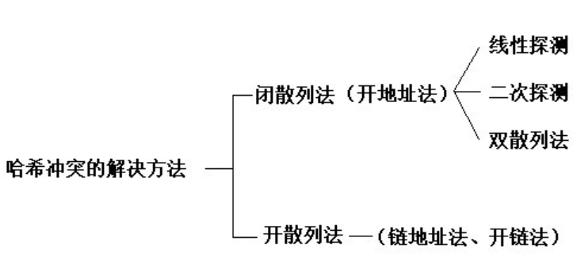

#### 3.1 开放定址法

 当关键字key的哈希地址p =H（key）出现冲突时，以p为基础，产生另一个哈希地址p1，若p1仍然冲突，再以p为基础，产生另一个哈希地址p2，…，直到找出一个不冲突的哈希地址pi ，将相应元素存入其中。

即：Hi=（H（key）+di）% m （i=1，2，…，n）

开放定址法有三种方式：

1. 线性探测再散列
    顺序查看下一个单元，直到找出一个空单元或查遍全表
    di=1，2，3，…，m-1
2. 二次(平方)探测再散列
    在表的左右进行跳跃式探测，直到找出一个空单元或查遍全表
    di=1^2，-1^2，2^2，-2^2，…，k^2，-k^2 ( k<=m/2 )
3. 伪随机探测再散列
    （1）建立一个伪随机数发生器，并给一个随机数作为起点
    （2）di=伪随机数序列。具体实现时，应建立一个伪随机数发生器，（如i=(i+p) % m），并给定一个随机数做起点。

例如，已知哈希表长度m=11，哈希函数为：H（key）= key % 11，则H（47）=3，H（26）=4，H（60）=5，假设下一个关键字为69，则H（69）=3，与47冲突。

如果用线性探测再散列处理冲突，下一个哈希地址为H1=（3 + 1）% 11 = 4，仍然冲突，再找下一个哈希地址为H2=（3 + 2）% 11 = 5，还是冲突，继续找下一个哈希地址为H3=（3 + 3）% 11 = 6，此时不再冲突，将69填入5号单元。

如果用二次探测再散列处理冲突，下一个哈希地址为H1=（3 + 1的平方）% 11 = 4，仍然冲突，再找下一个哈希地址为H2=（3 - 1的平方）% 11 = 2，此时不再冲突，将69填入2号单元。

如果用伪随机探测再散列处理冲突，且伪随机数序列为：2，5，9，……..，则下一个哈希地址为H1=（3 + 2）% 11 = 5，仍然冲突，再找下一个哈希地址为H2=（3 + 5）% 11 = 8，此时不再冲突，将69填入8号单元。


优点

1. 容易序列化
2. 若可预知数据总数，可以创建完美哈希数列

缺点

1. 占空间很大。（开放定址法为减少冲突，要求装填因子α较小，故当结点规模较大时会浪费很多空间）

2. 删除节点很麻烦。不能简单地将被删结点的空间置为空，否则将截断在它之后填人散列表的同义词结点的查找路径。这是因为各种开放地址法中，空地址单元(即开放地址)都是查找失败的条件。因此在用开放地址法处理冲突的散列表上执行删除操作，只能在被删结点上做删除标记，而不能真正删除结点。

3. 线性探测法虽然在哈希表未满的情况下，总能保证找到不冲突的地址，但是容易发生二次哈希冲突的现象。比如在处理若干次次哈希冲突后k,k+1,k+2位置上的都存储了数据，那下一次存储地址在k,k+1,k+2,k+3位置的数据都将存在k+3位置上，这就产生了二次冲突。

    堆积现象——用线性探测法处理哈希冲突时，k,k+1,k+2位置已存有数据，下一个数据请求地址如果是k,k+1,k+2,k+3的话，那么这四个数据都会要求填入k+3的位置。

#### 3.2 链地址法

链表法就是在发生冲突的地址处，挂一个单向链表，然后所有在该位置冲突的数据，都插入这个链表中。

插入数据的方式有多种，可以从链表的尾部向头部依次插入数据，也可以从头部向尾部依次插入数据，也可以依据某种规则在链表的中间插入数据，总之保证链表中的数据的有序性。

例：已知一组关键字为(19，14，23，01，68，20，84，27，55，11，10，79)，则按哈希函数 H(key) = key MOD13 和链地址法处理冲突构造所得的哈希表为：


优点

1. 处理冲突简单，无堆积现象。即非同义词不会发生冲突，因此平均查找长度较短；

2. 适合总数经常变化的情况。（因为拉链法中各链表上的结点空间是动态申请的）
3. 占空间小。装填因子可取α≥1，且结点较大时，拉链法中增加的指针域可忽略不计
4. 删除结点的操作易于实现。只要简单地删去链表上相应的结点即可。

缺点

1. 查询时效率较低。（存储是动态的，查询时跳转需要更多的时间）
2. 在key-value可以预知，以及没有后续增改操作时候，开放定址法性能优于链地址法。
3. 不容易序列化

#### 3.3 再哈希法

提供多个哈希函数，如果第一个哈希函数计算出来的key的哈希值冲突了，则使用第二个哈希函数计算key的哈希值。

优点

- 再哈希法可以有效的避免堆积现象

缺点

- 增加了计算时间和哈希算法的数量，而且不能保证在哈希表未满的情况下，总能找到不冲突的地址

#### 3.4 建立公共溢出区

建立一个基本表，基本表的大小等于哈希表的大小。建立一个溢出表，所有哈希地址的第一个记录都存在基本表中，所有发生冲突的数据，不管哈希算法得到的地址是什么，都放入溢出表中。

但是有一个缺点就是，必须事先知道哈希表的可能大小，而且溢出表里的数据不能太多，否则影响溢出表的查询效率。实际上就是要尽量减少冲突。

 ## 8. STL序列式容器

vector的原理，添加元素的方式 扩容机制（扩容过程中是否是拷贝构造） 添加不调用拷贝构造方式  vector如何删除所有值为value的元素   插入元素的时间复杂度，如何计算     手撕一个vector（构造、析构等） vector底层实现 -> 深入到STL源码，重点说了扩容和emplace_back


## 9. STL关联式容器

map底层实现  map及其变体


## 10. 排序算法

### 0. 总览

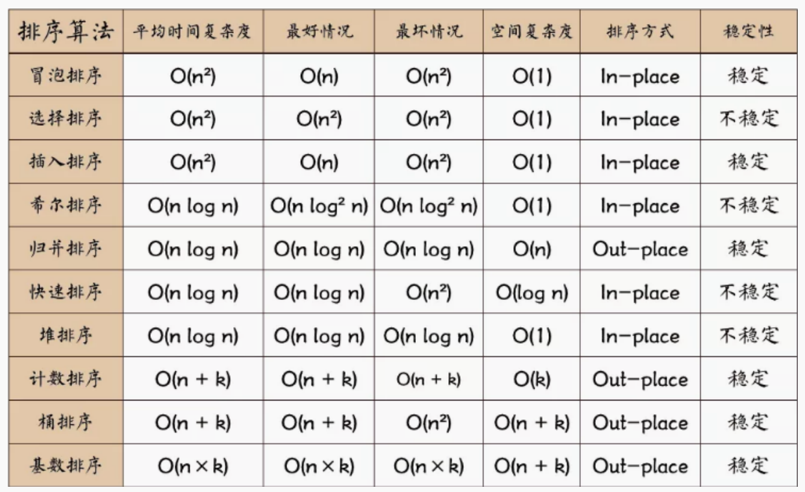

> 几个总结性的记忆口诀

不稳定的排序算法：快些选堆（快排，希尔，选择，堆排序）

平均时间复杂度为O(nlogn)的算法：快些归队(快排，希尔，归并排序，堆排序)

## 11. 生成1-n的不重复的随机数，使得1-n都会出现，数字不可重复

### 1. 粗暴解法

```C++
#define N 10000
int main() {
    int i, j, flag, num, a[N];
    srand((unsigned)time(NULL));
    for (i = 0; i < N; ++i) {
        num = rand() % N + 1;
        flag = 1;
        //判断前面是否出现过这个随机数，如果没有就加入结果中，如果出现过就继续产生随机数
        for (j = 0; j < i; ++j) {
            if (num == a[j]) {
                flag = 0;
                break;
            }
        }
        if (flag) a[i] = num;
        else --i;
    }
    for (i = 0; i < N; ++i) cout << a[i] << " ";
    cout << endl;
    return 0;
}
```

当N很小时，可能很快出结果，但是当N很大时运行很长时间都不一定能出结果。假设要产生1-100的随机数，某个时刻已经产生了1-99的数，但是还差1个100，然后程序继续运行，但是程序运行期间很可能很长一段时间都是产生和前面重复的数（1-99），这时候程序运行很长时间都不能得到想要的结果，这种方法有很大的运气在里面，所以不建议这种方法。

### 2. 减小时间复杂度

```C++
void rand(const int n) {
    vector<int> a;
    vector<int> ans(n);  //保存结果

    srand(static_cast<unsigned int>(time(nullptr)));
    for (int i = 0; i < n; ++i) a.push_back(i + 1);
    for (int i = 0; i < n; ++i) {
        int mark = rand() % (n - i);//获取下标
        ans[i] = a[mark];
        swap(a[mark], a[n - i - 1]);
    }
    for (int i = 0; i < n; i++) cout << ans[i] << " ";
    cout << endl;
    return;
}

int main() {
    rand(10000);
    return 0;
}
```

这种做法能保证时间复杂度为O（n），但是用了双倍的空间。

### 3. 减小空间复杂度

```C++
void rand(const int n) {
    vector<int> ans(n);
    srand(static_cast<unsigned int>(time(nullptr)));
    for (int i = 0; i < n; ++i) ans[i] = i + 1;
    for (int i = n-1; i > 0; --i) {//从最后面开始遍历，因为我们能控制产生的随机数范围
        int mark = rand() % i;//获得下标
        swap(ans[mark], ans[i]);//交换两个元素，交换过后a[i]的值就确定了
    }
    for (int i = 0; i < n; i++) cout << ans[i] << " ";
    cout << endl;
    return;
}

int main() {
    rand(10000);
    return 0;
}
```

## 12. 负载均衡中的一致性哈希

[负载均衡中的一致性Hash算法详解](https://blog.csdn.net/monokai/article/details/106626945)

[好刚: 7分钟视频详解一致性hash 算法_哔哩哔哩_bilibili](https://www.bilibili.com/video/BV1Hs411j73w?spm_id_from=333.337.search-card.all.click&vd_source=5c56a54df285aab5b704ed86c6307246)

分布式缓存怎么决定内容存在哪个服务器

hash算法(比如对图片的hash值以机器数进行取模，得到余数决定存储在哪台服务器上)

如果增加服务器，所有数据都得重新取模，这怎么办。

我当时没答出来，看来这个视频就是正解了（一致性哈希）

### 1. 背景

> 分布式缓存怎么决定内容存在哪个服务器


> 哈希算法的分布式缓存的缺陷


### 2. 一致性哈希算法的原理


> 解决哈希缓存的问题


### 3. 一致性哈希的缺陷

> 哈希偏斜


> 解决方式——增加虚拟节点


## 13. B树与B+树

> 可视化数据结构的网站
>
> https://www.cs.usfca.edu/~galles/visualization/BTree.html

### 1. 二者的区别

（1）B+树内节点不存储数据，**所有 data 存储在叶节点**使得查询时间复杂度固定为 log n。⽽B-树查询时间复杂度不固定，与 key 在树中的位置有关，最好为O(1)。

（2）B+树叶节点两两相连可⼤⼤增加区间访问性，可使⽤在**范围查询**等，⽽B-树每个节点 key和 data 在⼀起，则⽆法区间查找。

（3）B+树更适合**外部存储**。由于内节点⽆ data 域，每个节点能索引的范围更⼤更精确。

当存储同数量级的数据的时候，B+树的⾼度⽐B树的⾼度⼩，这样进程IO操作的次数就少，效果就⾼。因为B+树的所有⾮叶⼦节点只存索引，数据存在叶⼦节点，⼀般3层的树⾼度，即可存千万级别的数据，⽽B-树不⾏。(具体的计算可以到⽹上去看看，有⾯试官可能会问怎么算出来的。)

### 2. 文件索引和数据库索引为什么使用B+树而不是红黑树或者hash索引

> 在磁盘中寻找数据的原理

我们在MySQL中的数据一般是放在磁盘中的，读取数据的时候肯定会有访问磁盘的操作，磁盘中有两个机械运动的部分，分别是**盘片旋转**和**磁臂移动**。

盘片旋转就是我们市面上所提到的多少转每分钟，而磁盘移动则是在盘片旋转到指定位置以后，移动磁臂后开始进行数据的读写。

那么这就存在一个定位到磁盘中的块的过程，而定位是磁盘的存取中花费时间比较大的一块，毕竟机械运动花费的时候要远远大于电子运动的时间。当大规模数据存储到磁盘中的时候，显然定位是一个非常花费时间的过程，因此需要优化，提高磁盘读取时定位的效率。

> 为什么用B+树而不是B树

最主要原因——文件与数据库都是需要较大的存储，也就是说，它们都不可能全部存储在内存中，故需要存储到磁盘上。而所谓索引，则为了数据的快速定位与查找，那么索引的结构组织要尽量减少查找过程中磁盘I/O的存取次数。B树必须用中序遍历的方法按序扫库，而**B+树支持范围查找**，直接从叶子结点挨个扫一遍就完了，而B树不支持，这是数据库选用B+树的最主要原因。

B+树查找效率更加稳定，B树有可能在中间节点找到数据，稳定性不够。

B+tree的磁盘读写代价更低：B+tree的内部结点并没有指向关键字具体信息的指针(红色部分)，因此其内部结点相对B 树更小。如果把所有同一内部结点的关键字存放在同一块盘中，那么盘块所能容纳的关键字数量也越多。一次性读入内存中的需要查找的关键字也就越多，相对来说IO读写次数也就降低了；

B+tree的查询效率更加稳定：由于内部结点并不是最终指向文件内容的结点，而只是叶子结点中关键字的索引，所以，任何关键字的查找必须走一条从根结点到叶子结点的路。所有关键字查询的路径长度相同，导致每一个数据的查询效率相当；

> 为什么不用红黑树

数据库系统巧妙利用了局部性原理与磁盘预读原理，将一个节点的大小设为等于一个页，这样每个节点只需要一次I/O就可以完全载入，而红黑树这种结构，高度明显要深的多，并且由于逻辑上很近的节点(父子)物理上可能很远，无法利用局部性。

> 为什么不用Hash表

利用Hash需要把数据全部**加载到内存中**，如果数据量大，是一件很**消耗内存**的事，而采用B+树，是基于**按照节点分段加载，由此减少内存消耗**。

从业务场景来看，**对于唯一查找**（查找一个值），Hash确实更快，**但数据库中经常查询多条数据**，这时候由于B+树数据的有序性，与叶子节点又有链表相连，他的查询效率会比Hash快的多。


字符串的回文子串个数（中心扩展法、马拉车优化）

相似字符串判定，写代码（[剑指 Offer II 117. 相似的字符串](https://leetcode.cn/problems/H6lPxb/)）

实现一个无锁队列——[迈向多线程——解析无锁队列的原理与实现 - 知乎 (zhihu.com)](https://zhuanlan.zhihu.com/p/352723264)

力扣 272 最接近的二叉搜索树数值 

写一个判断文件相互引用的程序 （拓扑排序？）

​    a. 每个文件可引用多个文件，应该是结构体的形式

​    b. 形成一个图的形式，需要dfs和bfs


# 3. 网络&网络编程

## 重点内容

注：网络中的细节，大部分都可 以通过抓包来分析


TCP/IP 网络参考模型共有 `4` 层，其中需要熟练掌握的是应用层、传输层和网络层，至于网络接口层（数据链路层和物理层）只需要做简单的了解。

对于应用层，当然重点要熟悉最常见的HTTP与HTTPS，传输层 TCP 和 UDP 都要熟悉，网络层要熟悉 IPv4, IPv6 可以做简单了解。

从常见事情着手：

比如， ping 命令可以说在判断网络环境的时候，最常使用的，可以先把你电脑 ping 舍友或同事的电脑的过程中发生的事情都搞明白，这样就基本知道一个数据包是怎么转发的了，于是就知道了网络层、数据链路层和物理层之间是如何工作，如何相互配合的了。

搞明白了 ping 过程，学起 HTTP 请求过程的时候，会很快就能掌握了，因为网络层以下的工作方式在学习 ping 的时候就已经明白了。这时就只需要认真掌握传输层中的 TCP 和应用层中的 HTTP 协议，就能搞明白访问网页的整个过程，这也是面试常见的题目。

重中之重的知识就是 TCP 了，TCP 不管是[建立连接、断开连接 (opens new window)]的过程，还是数据传输的过程，都不能放过，针对数据可靠传输的特性，又可以拆解为[超时重传、流量控制、滑动窗口、拥塞控制 (opens new window)]等等知识点，学完这些只能算对 TCP 有个「**感性**」的认识，另外还得知道 Linux 提供的 [TCP 内核的参数 (opens new window)](https://mp.weixin.qq.com/s/fjnChU3MKNc_x-Wk7evLhg)的作用，这样才能从容地应对工作中遇到的问题。


## 0. HTTP报文的格式以及解析过程 -> 状态机；具体描述一下主从状态机的状态切换以及是如何推动的

### 1、HTTP请求报文格式


### 2、HTTP响应报文格式


### 3、HTTP协议

超文本传输协议（Hypertext Transfer Protocol，HTTP）是一个简单的请求 - 响应协议，它通常运行在**TCP** 之上。它指定了客户端可能发送给服务器什么样的消息以及得到什么样的响应。请求和响应消息的头以 ASCII 形式给出；而消息内容则具有一个类似 MIME 的格式。HTTP是万维网的数据通信的基础。

HTTP 是一个客户端终端（用户）和服务器端（网站）请求和应答的标准（TCP）。通过使用网页浏览器、网络爬虫或者其它的工具，客户端发起一个HTTP请求到服务器上指定端口（默认端口为80）。我们称这个客户端为用户代理程序（user agent）。应答的服务器上存储着一些资源，比如 HTML 文件和图像。我们称这个应答服务器为源服务器（origin server）。在用户代理和源服务器中间可能存在多个“中间层”，比如代理服务器、网关或者隧道（tunnel）。

尽管 TCP/IP 协议是互联网上最流行的应用，**HTTP 协议中，并没有规定必须使用它或它支持的层**。事实上，HTTP可以在任何互联网协议上，或其他网络上实现。**HTTP 假定其下层协议提供可靠的传输**。因此，**任何能够提供这种保证的协议都可以被其使用**。因此也就是其在 TCP/IP 协议族使用 TCP 作为其传输层。

通常，由HTTP客户端发起一个请求，创建一个到服务器指定端口（默认是80端口）的 TCP 连接。HTTP服务器则在那个端口监听客户端的请求。一旦收到请求，服务器会向客户端返回一个状态，比如"HTTP/1.1 200 OK"，以及返回的内容，如请求的文件、错误消息、或者其它信息。

### 4、HTTP工作原理（HTTP请求/响应的步骤或解析过程）

HTTP 协议定义 Web 客户端如何从 Web 服务器请求 Web 页面，以及服务器如何把 Web 页面传送给客户端。

HTTP 协议采用了请求/响应模型。客户端向服务器发送一个**请求报文**，请求报文包含请求的方法、URL、协议版本、请求头部和请求数据。服务器以一个状态行作为响应，响应的内容包括协议的版本、成功或者错误代码、服务器信息、响应头部和响应数据。

HTTP请求/响应的步骤：

1. 客户端连接到 Web 服务器

​		一个HTTP客户端，通常是浏览器，与 Web 服务器的 HTTP 端口（默认为 80 ）建立一个 TCP 套接字连接。例如，http://www.baidu.com。（URL） 

2. 发送 HTTP 请求

​		通过 TCP 套接字，客户端向 Web 服务器发送一个文本的请求报文，一个请求报文由请求行、请求头部、空行和请求数据 4 部分组成。

3. 服务器接受请求并返回 HTTP 响应

​		Web 服务器解析请求，定位请求资源。服务器将资源复本写到 TCP 套接字，由客户端读取。一个响应由状态行、响应头部、空行和响应数据 4 部分组成。

4. 释放连接 TCP 连接

​		若 connection 模式为 close，则服务器主动关闭 TCP连接，客户端被动关闭连接，释放 TCP 连接；若connection 模式为 keepalive，则该连接会保持一段时间，在该时间内可以继续接收请求; 

5. 客户端浏览器解析 HTML 内容

​		客户端浏览器首先解析状态行，查看表明请求是否成功的状态代码。然后解析每一个响应头，响应头告知以下为若干字节的 HTML 文档和文档的字符集。客户端浏览器读取响应数据 HTML，根据HTML 的语法对其进行格式化，并在浏览器窗口中显示。


### 5、基于有限状态机实现http解析

HTTP报文的解析过程比较繁琐，基于状态机的思想设计程序会一定程度降低复杂性。

原理：自己的理解:解析http这种协议,他在解析的过程中存在不同的状态, 我们在解析的时候根据解析的内存判断不同状态下不同的处理方法,通过状态的转换,实现对协议的解析。

```C++
使用状态机完成对HTTP请求的读取和分析

主状态机作用(parse_content())：读取请求行与头部行数据
状态：请求行、头部行

从状态机作用(parse_line)：读取每一行数据
状态：读取成功、失败、需要继续读取
parse_request():读取请求行，并将主状态机状态更改为头部行
parse_header():读取头部行

主状态机初始状态为请求行，循环调用parse_line，若为成功状态继续（失败退出返回失败原因）
并且判断主状态机状态
请求->parse_request()->继续循环（失败退出返回失败原因）
头部->parse_header()->成功返回好的请求结果（失败退出返回失败原因）
```

**从状态机：**

状态转移图


从状态机三种状态

- LINE_OK ,完整读取一行
- LINE_OPEN，读取的行不完整
- LINE_BAD，读取的报文有误

从状态机每次从缓冲区读取一行信息，直至读取到 \r\n 表示读取到一行，同时将 \r\n 替换为 \0\0 便于主状态机读取该行，然后再将行起始标志定位到下一行的起始位置。

**主状态机：**

状态转移图


主状态机的初始状态是CHECK_STATE_REQUESTLINE，parse_request_line()函数中解析请求行，当解析请求行成功时，解析请求行内部函数将主状态转移至下一个状态。

当请求方法为GET时，请求报文没有请求正文，也就是说解析完头部字段后该报文的解析过程就完成了。
解析请求行比较重要的一点是需要保存url，url对应客户端请求的文档。

**示例：**

```C++
STATE_MATCHINE() {
	State cur_State = type_A;
    while (cur_State != typeC) {
        Package _pack = getNewPackage();
        switch (cur_State)
        {
        case typeA:
            process_package_state_A(_pack);
            cur_State = type_B;
            break;
        case typeB:
            process_package_state_B(_pack);
            cur_State = type_C;
            break;
        }
    }
}
```

该状态机包含三种状态：type_A、type_B 和 type_C，其中 type_A 是状态机的开始状态，type_C 是状态机的结束状态。状态机的当前状态记录在 cur_State 变量中。在一趟循环过程中，状态机先通过getNewPackage 方法获得一个新的数据包，然后根据 cur_State 变量的值判断如何处理该数据包。数据包处理完之后，状态机通过给 cur_State 变量传递目标状态值来实现状态转移。那么当状态机进入下一趟循环时，它将执行新的状态对应的逻辑。


## 1. 常见的HTTP状态码，例如400，401，404， 301, 302

所有HTTP响应的第一行都是状态行，依次是当前HTTP版本号，3位数字组成的状态代码，以及描述状态的短语，彼此由空格分隔。

状态代码的第一个数字代表当前响应的类型：

1xx消息——请求已被服务器接收，继续处理

2xx成功——请求已成功被服务器接收、理解、并接受

3xx重定向——需要后续操作才能完成这一请求

4xx请求错误——请求含有词法错误或者无法被执行

5xx服务器错误——服务器在处理某个正确请求时发生错误


### 1XX 信息

100 Continue ：表明到目前为止都很正常，客户端可以继续发送请求或者忽略这个响应。

### 2XX 成功

200：OK

204 No Content ：请求已经成功处理，但是返回的响应报文不包含实体的主体部分。一般在只需要从客户端往服务器发送信息，而不需要返回数据时使用。

206 Partial Content ：表示客户端进行了范围请求，响应报文包含由 Content-Range 指定范围的实体内容。

### 3XX 重定向

301 Moved Permanently ：永久性重定向

302 Found ：临时性重定向

303 See Other ：和 302 有着相同的功能，但是 303 明确要求客户端应该采用 GET 方法获取资源。

304 Not Modified ：如果请求报文首部包含一些条件，例如：If-Match，If-Modified-Since，If-None-Match，If-Range，If-Unmodified-Since，如果不满足条件，则服务器会返回 304 状态码。

307 Temporary Redirect ：临时重定向，与 302 的含义类似，但是 307 要求浏览器不会把重定向请求的 POST 方法改成 GET 方法。

### 4XX **客户端**错误

400 Bad Request ：请求报文中存在语法错误。

401 Unauthorized ：该状态码表示发送的请求需要有认证信息（BASIC 认证、DIGEST 认证）。如果之前已进行过一次请求，则表示用户认证失败。

403 Forbidden ：请求被拒绝。

404 Not Found

### 5XX **服务器**错误

500 Internal Server Error ：服务器正在执行请求时发生错误。

503 Service Unavailable ：服务器暂时处于超负载或正在进行停机维护，现在无法处理请求。


## 2. TCP粘包问题

### 1、定义

一个完整的业务可能会被TCP拆分成多个包进行发送，也有可能把多个小的包封装成一个大的数据包发送，这个就是TCP的拆包和粘包问题。

TCP粘包是指发送方发送的若干包数据到接收方接收时粘成一包，从接收缓冲区看，后一包数据的头紧接着前一包数据的尾。

### 2、原因

1、应用程序写入数据的字节大小大于套接字发送缓冲区的大小. 

2、进行MSS大小的TCP分段。( MSS=TCP报文段长度-TCP首部长度) 

3、以太网的payload大于MTU进行IP分片。（ MTU指：一种通信协议的某一层上面所能通过的最大数据包大小。）

4、由TCP连接复用造成的粘包问题。

5、流量控制，拥塞控制也可能导致粘包。

6、接收方不及时接收缓冲区的包，造成多个包接收

7、因为TCP默认会使用Nagle算法，此算法会导致粘包问题。

​	只有上一个分组得到确认，才会发送下一个分组；

​	收集多个小分组，在一个确认到来时一起发送。

### 3、解决方案

1. 应用层发送数据时定长发送。
2. 尾部标记序列：在包尾部增加回车或者空格符等特殊字符进行分割
3. 将消息分为消息头和消息尾，头部标记分步接收。在TCP报文的头部加上表示数据长度。
4. 使用其它复杂的协议，如RTMP协议等。
5. 如果是Nagle算法问题导致的，需要结合应用场景适当关闭该算法

## 3. 常见的协议

### 1、应用层

|   协议 |          中文名称          |    默认端口    |                       底层协议                        |
| -----: | :------------------------: | :------------: | :---------------------------------------------------: |
|   HTTP |       超文本传输协议       |       80       |                          TCP                          |
|  HTTPS |     超文本传输安全协议     |      443       |                          TCP                          |
| Telnet |    远程登陆服务标准协议    |       23       |                          TCP                          |
|    FTP |        文件传输协议        | 20传输和21连接 |                          TCP                          |
|   SMTP | 简单邮件传输协议（发送用） |       25       |                          TCP                          |
|    POP |     邮局协议（接收用）     |      110       |                          TCP                          |
|    DNS |        域名解析服务        |       53       | 服务期间进行域传输时用TCP，客户端查询DNS服务器时用UDP |
|   TFTP |      简单文本传输协议      |       21       |                          UDP                          |
|   SNMP |      简单网络管理协议      |      161       |                          UDP                          |

### 2、网络层

| 协议 |         名称         | 作用                                                         |
| :--: | :------------------: | :----------------------------------------------------------- |
|  IP  |       网际协议       | 定义了数据传输时的基本单元和格式，还定义了数据报的递交方法和路由选择 |
| ICMP | Internet控制报文协议 | ICMP就是一个“错误侦测与回报机制”，其目的是让我们能够检测网路的连线状况，也能确保连线的准确性，是**ping**和**traceroute**的工作协议 |
| RIP  |     路由信息协议     | 使用“跳数”(即metric)来衡量到达目标的路由距离                 |
| IGMP |  Internet组管理协议  | 用于实现组播、广播等通信                                     |

### 3、数据链路层

| 协议 |       名称       | 作用                                                         |
| :--: | :--------------: | :----------------------------------------------------------- |
| ARP  |   地址解析协议   | 根据IP地址获取物理地址                                       |
| RARP | 反向地址解析协议 | 根据物理地址获取IP地址                                       |
| PPP  |    点对点协议    | 主要是用来通过拨号或专线方式建立点对点连接发送数据，使其成为各种主机、网桥和路由器之间简单连接的一种共通的解决方案 |
|      |                  |                                                              |

## 4. 非对称加密和对称加密

### 1、对称密钥

对称密钥加密（Symmetric-Key Encryption），加密和解密使用同一密钥。

优点：运算速度快

缺点：无法安全地将密钥传输给通信方

### 2、非对称密钥

非对称密钥加密，又称公开密钥加密（Public-Key Encryption），加密和解密使用不同的密钥。

公开密钥所有人都可以获得，通信发送方获得接收方的公开密钥之后，就可以使用公开密钥进行加密，接收方收到通信内容后使用私有密钥解密。

**非对称密钥除了用来加密，还可以用来进行签名**。因为私有密钥无法被其他人获取，因此通信发送方使用其私有密钥进行签名，通信接收方使用发送方的公开密钥对签名进行解密，就能判断这个签名是否正确。

优点：可以更安全地将公开密钥传输给通信发送方；

缺点：运算速度慢。


## 5. HTTP与HTTPS

### 1、定义

HTTP 先和 SSL（Secure Sockets Layer）通信，再由 SSL 和 TCP 通信，也就是说 HTTPS 使用了**隧道**进行通信。通过使用 SSL，HTTPS 具有了加密（防窃听）、认证（防伪装）和完整性保护（防篡改）。

### 2、HTTP的缺点

使用明文进行通信，内容可能会被窃听；不验证通信方的身份，通信方的身份有可能遭遇伪装；无法证明报文的完整性，报文有可能遭篡改。

### 3、HTTP与HTTPS的区别

1、HTTP协议传输的数据都是未加密的，也就是明文的，因此使用HTTP协议传输隐私信息非常不安全；HTTPS协议是由SSL+HTTP协议构建的可进行加密传输、身份认证的网络协议，要比http协议安全。

2、https协议需要到ca申请证书，一般免费证书较少，因而需要一定费用。

3、http和https使用的是完全不同的连接方式，用的端口也不一样，前者是80，后者是443。

### 4、什么是SSL/TLS ？

SSL代表安全套接字层。它是一种用于加密和验证应用程序（如浏览器）和Web服务器之间发送的数据的协议。身份验证，加密Https的加密机制是一种共享密钥加密和公开密钥加密并用的混合加密机制。

SSL/TLS协议作用：认证用户和服务，加密数据，维护数据的完整性的应用层协议。

### 5、HTTPS是如何保证数据传输的安全，整体的流程是什么？（SSL是如何工作保证安全的） 

因为数字签名、摘要是证书防伪非常关键的武器。 “摘要”就是对传输的内容，通过hash算法计算出一段固定长度的串。然后，通过发送方的私钥对这段摘要进行加密，加密后得到的结果就是“数字签名”。

SSL/TLS协议的基本思路是采用**公钥加密法**，也就是说，客户端先向服务器端索要公钥，然后用公钥加密信息，服务器收到密文后，用自己的私钥解密。具体流程如下：

（1）客户端向服务器端发起SSL连接请求；

（2）服务器把公钥发送给客户端，并且服务器端保存着唯一的私钥

（3）客户端用公钥对双方通信的对称秘钥进行加密，并发送给服务器端

（4）服务器利用自己唯一的私钥对客户端发来的对称秘钥进行解密，

（5）进行数据传输，服务器和客户端双方用公有的相同的对称秘钥对数据进行加密解密，可以保证在数据收发过程中的安全，即使第三方获得数据包，也无法对其进行加密，解密和篡改。

### 6、HTTPS常用的加密方式

HTTPS 采用混合的加密机制，使用非对称密钥加密用于传输，对称密钥来保证传输过程的安全性，之后使用对称密钥加密进行通信来保证通信过程的效率。


确保传输安全过程（其实就是rsa原理）：

1. Client给出协议版本号、一个客户端生成的**随机数**（Client random），以及客户端支持的加密方法。

2. Server确认双方使用的加密方法，并给出数字证书、以及一个服务器生成的**随机数**（Server random）。

3. Client确认数字证书有效，然后生成一个新的**随机数**（Premaster secret），并使用数字证书中的公钥，加密这个随机数，发给Server。

4. Server使用自己的私钥，获取Client发来的随机数（Premaster secret）。

5. Client和Server根据约定的加密方法，使用前面的三个随机数，生成”对话密钥”（session key），用来加密接下来的整个对话过程。


## 6. DDos、SYN、xss、CSRF攻击

### 1、DDos攻击

客户端向服务端发送请求链接数据包，服务端向客户端发送确认数据包，客户端不向服务端发送确认数据包，服务器一直等待来自客户端的确认。

没有彻底根治的办法，除非不使用TCP

DDos 预防：

1）限制同时打开SYN半链接的数目

2）缩短SYN半链接的Time out 时间

3）关闭不必要的服务

### 2、SYN攻击

服务器端的资源分配是在二次握手时分配的，而客户端的资源是在完成三次握手时分配的，所以服务器容易受到SYN洪泛攻击。SYN攻击就是Client在短时间内伪造大量不存在的IP地址，并向Server不断地发送SYN包，Server则回复确认包，并等待Client确认，由于源地址不存在，因此Server需要不断重发直至超时，这些伪造的SYN包将长时间占用未连接队列，导致正常的SYN请求因为队列满而被丢弃，从而引起网络拥塞甚至系统瘫痪。SYN 攻击是一种典型的 DoS/DDoS 攻击。

检测 SYN 攻击非常的方便，当你在服务器上看到大量的半连接状态时，特别是源IP地址是随机的，基本上可以断定这是一次SYN攻击。在 Linux/Unix 上可以使用系统自带的 netstats 命令来检测 SYN 攻击。

```powershell
netstat -n -p TCP | grep SYN_RECV
```

常见的防御 SYN 攻击的方法有如下几种：

缩短超时（SYN Timeout）时间

增加最大半连接数

过滤网关防护

SYN cookies技术

### 3、xss攻击(低频)

跨站点脚本攻击，指攻击者通过篡改网页，嵌入恶意脚本程序，在用户浏览网页时，控制用户浏览器进行恶意操作的一种攻击方式。

如何防范XSS攻击

1）前端，服务端，同时需要字符串输入的长度限制。

2）前端，服务端，同时需要对HTML转义处理。将其中的”<”,”>”等特殊字符进行转义编码。

防 XSS 的核心是**必须对输入的数据做过滤处理**。

### 4、CSRF攻击

（1）概念

跨站点请求伪造，指攻击者通过跨站请求，以合法的用户的身份进行非法操作。

可以这么理解CSRF攻击：攻击者盗用你的身份，以你的名义向第三方网站发送恶意请求。CRSF能做的事情包括利用你的身份发邮件，发短信，进行交易转账，甚至盗取账号信息。

（2）防范：

安全框架，例如Spring Security。

token机制。在HTTP请求中进行token验证，如果请求中没有token或者token内容不正确，则认为CSRF攻击而拒绝该请求。

验证码。通常情况下，验证码能够很好的遏制CSRF攻击，但是很多情况下，出于用户体验考虑，验证码只能作为一种辅助手段，而不是最主要的解决方案。

referer识别。在HTTP Header中有一个字段Referer，它记录了HTTP请求的来源地址。如果Referer是其他网站，就有可能是CSRF攻击，则拒绝该请求。但是，服务器并非都能取到Referer。很多用户出于隐私保护的考虑，限制了Referer的发送。在某些情况下，浏览器也不会发送Referer，例如HTTPS跳转到HTTP。 

1）验证请求来源地址；

2）关键操作添加验证码；

3）在请求地址添加 token 并验证。


## 7. DNS以及DNS污染

### 1、定义

**官方解释**：DNS（Domain Name System，域名系统），因特网上作为域名和IP地址相互映射的一个分布式数据库，能够使用户更方便的访问互联网，而不用去记住能够被机器直接读取的IP数字串。

通过主机名，最终得到该主机名对应的IP地址的过程叫做域名解析（或主机名解析）。

**通俗的讲**，我们更习惯于记住一个网站的名字，比如www.baidu.com,而不是记住它的ip地址，比如：167.23.10.2。

### 2、工作原理

将主机域名转换为ip地址，属于应用层协议，使用53号端口。

使用UDP传输（原因：因为UDP快！UDP的DNS协议只要一个请求、一个应答就好了。而使用基于TCP的DNS协议要三次握手、发送数据以及应答、四次挥手，但是UDP协议传输内容不能超过512字节。

但是注意客户端向DNS服务器查询域名，一般返回的内容都不超过512字节，用UDP传输即可。）

过程：

总结： 浏览器缓存，系统缓存，路由器缓存，IPS服务器缓存，根域名服务器缓存，顶级域名服务器缓存，主域名服务器缓存。

一、主机向本地域名服务器的查询一般都是采用**递归查询**。

二、本地域名服务器向根域名服务器的查询是**迭代查询**。

1)当用户输入域名时，浏览器先检查**自己的缓存**中是否 这个域名映射的ip地址，有解析结束。

2）若没命中，则检查**操作系统缓存**（如Windows的hosts）中有没有解析过的结果，有解析结束。

3）若无命中，则请求**本地域名服务器**解析（ LDNS）。

4）若LDNS没有命中就直接跳到**根域名服务器**请求解析。根域名服务器返回给LDNS一个 主域名服务器地址。

5） 此时LDNS再发送请求给上一步返回的gTLD（ 通用顶级域）， 接受请求的gTLD查找并返回这个域名对应的Name Server的地址

6） Name Server根据映射关系表找到目标ip，返回给LDNS

7） LDNS缓存这个域名和对应的ip， 把解析的结果返回给用户，用户根据TTL值缓存到本地系统缓存中（以备下次别的用户查询时可以直接返回结果，加速访问过程），域名解析过程至此结束

### 3、DNS的负载均衡策略

当一个网站有足够多的用户的时候，假如每次请求的资源都位于同一台机器上面，那么这台机器随时可能会崩掉。处理办法就是用DNS负载均衡技术，它的原理是在DNS服务器中为**同一个主机名**配置**多个IP 地址**,在应答DNS查询时,DNS服务器对每个查询将以DNS文件中主机记录的IP地址按顺序返回不同的解析结果,将客户端的访问引导到不同的机器上去,使得不同的客户端访问不同的服务器,从而达到负载均衡的目的。例如可以根据每台机器的负载量，该机器离用户地理位置的距离等等。

### 4、DNS的查询方式

当局部DNS服务器自己不能回答客户机的DNS查询时，它就需要向其他DNS服务器进行查询。此时有两种方式。

**递归解析（dns服务器会代替客户端向其他的dns服务器查询）**

局部DNS服务器自己负责向其他DNS服务器进行查询，一般是先向该域名的根域服务器查询，再由根域名服务器一级级向下查询。最后得到的查询结果返回给局部DNS服务器，再由局部DNS服务器返回给客户端。

**迭代解析（dns服务器帮助客户端寻找相关的服务器）**

当局部DNS服务器自己不能回答客户机的DNS查询时，也可以通过迭代查询的方式进行解析。局部DNS 服务器不是自己向其他DNS服务器进行查询，而是把能解析该域名的其他DNS服务器的IP地址返回给客户端DNS程序，客户端DNS程序再继续向这些DNS服务器进行查询，直到得到查询结果为止。也就是说，**迭代解析只是帮你找到相关的服务器**而已，而不会帮你去查。比如说：baidu.com的服务器ip地址在192.168.4.5这里，你自己去查吧，本人比较忙，只能帮你到这里了。

**反向查询**：可以让dns客户端利用IP地址查询其主机名称。

### 5、DNS污染

定义：

DNS污染是指有意或无意进行的域名服务器分组，将域名指向错误的IP地址。

一般来说，在互联网上都有可信赖的网域服务器，但为减低网络上的流量压力，一般的域名服务器都会把从上游的域名服务器获得的解析记录暂存起来，待下次有其他机器要求解析域名时，可以立即提供服务。一旦有关网域的局域域名服务器的缓存受到污染，就会把网域内的计算机导引往错误的服务器或服务器的网址。

解决方案：


## 8. socket通信基本步骤

### 1、socket介绍

所谓 socket（套接字），就是对网络中不同主机上的应用进程之间进行双向通信的**端点的抽象**。一个套接字就是网络上进程通信的一端，提供了应用层进程利用网络协议交换数据的机制。从所处的地位来讲，**套接字上联应用进程，下联网络协议栈，是应用程序通过网络协议进行通信的接口，是应用程序与网络协议根进行交互的接口。**

socket 可以看成是两个网络应用程序进行通信时，各自通信连接中的端点，这是一个**逻辑上的概念**。它是网络环境中进程间通信的 API，也是可以被命名和寻址的通信端点，使用中的每一个套接字都有其类型和一个与之相连进程。通信时其中一个网络应用程序将要传输的一段信息写入它所在主机的 socket 中，该 socket 通过与网络接口卡（NIC）相连的传输介质将这段信息送到另外一台主机的 socket 中，使对方能够接收到这段信息。socket 是由 IP 地址和端口结合的，提供向应用层进程传送数据包的机制。

socket 本身有“插座”的意思，在 Linux 环境下，用于表示进程间网络通信的**特殊文件**类型（Linux下一切皆文件）。本质为

内核借助缓冲区形成的伪文件。既然是文件，那么理所当然的，我们可以使用文件描述符引用套接字。与管道类似的，Linux 系统将其封装成文件的目的是为了统一接口，使得读写套接字和读写文件的操作一致。区别是**管道主要应用于本地进程间通信，而套接字多应用于网络进程间数据的传递**。


### 2、socket通信的基本流程


### 3、TCP通信的流程


```C++
// 服务器端 （被动接受连接的角色） 
1. 创建一个用于监听的套接字 
    - 监听：监听有客户端的连接 
    - 套接字：这个套接字其实就是一个文件描述符 
2. 将这个监听文件描述符和本地的IP和端口绑定（IP和端口就是服务器的地址信息） 
    - 客户端连接服务器的时候使用的就是这个IP和端口 
3. 设置监听，监听的fd开始工作 
4. 阻塞等待，当有客户端发起连接，解除阻塞，接受客户端的连接，会得到一个和客户端通信的套接字 （fd） 
5. 通信 
    - 接收数据 
    - 发送数据 
6. 通信结束，断开连接
// 客户端（主动连接的角色）
1. 创建一个用于通信的套接字（fd）
2. 连接服务器，需要指定连接的服务器的 IP 和 端口
3. 连接成功了，客户端可以直接和服务器通信 
	 - 接收数据   
 	 - 发送数据
4. 通信结束，断开连接
```


## 9. TCP/UDP区别以及举例

### 1、TCP的特点和UDP的特点

TCP：

（1）TCP是面向连接的。（就好像打电话一样，通话前需要先拨号建立连接，通话结束后要挂机释放连接）；

（2）每一条TCP连接只能有两个端点，每一条TCP连接只能是点对点的（一对一）；

（3）TCP提供可靠交付的服务。通过TCP连接传送的数据，无差错、不丢失、不重复、并且按序到达；

（4）TCP提供全双工通信。TCP允许通信双方的应用进程在任何时候都能发送数据。TCP连接的两端都设有发送缓存和接收缓存，用来临时存放双方通信的数据；

（5）面向字节流。TCP中的“流”（stream）指的是流入进程或从进程流出的字节序列。“面向字节流”的含义是：虽然应用程序和TCP的交互是一次一个数据块（大小不等），但TCP把应用程序交下来的数据仅仅看成是一连串的无结构的字节流。

UDP：

（１）UDP是无连接的；

（２）UDP使用尽最大努力交付，即不保证可靠交付，因此主机不需要维持复杂的链接状态（这里面有许多参数）；

（３）UDP是面向报文的；

（４）UDP没有拥塞控制，因此网络出现拥塞不会使源主机的发送速率降低（对实时应用很有用，如IP电话，实时视频会议等）；

（５）UDP支持一对一、一对多、多对一和多对多的交互通信；

（６）UDP的首部开销小，只有8个字节，比TCP的20个字节的首部要短。

### 2、二者区别

|                |            TCP            |              UDP               |
| :------------: | :-----------------------: | :----------------------------: |
|  是否面向连接  |            是             |               否               |
|    是否可靠    |            是             |               否               |
|    面向什么    |          字节流           |              报文              |
| 是否有拥塞控制 |            是             |               否               |
|    通信方式    | 每一条TCP连接只能是点到点 | 一对一、一对多、多对一和多对多 |
|    首部开销    |      大（20个字节）       |         小（８个字节）         |
|      逻辑      |     全双工的可靠信道      |           不可靠信道           |

1、TCP面向连接（如打电话要先拨号建立连接）;UDP是无连接的，即发送数据之前不需要建立连接

2、TCP提供可靠的服务。也就是说，通过TCP连接传送的数据，无差错，不丢失，不重复，且按序到达；UDP尽最大努力交付，即不保证可靠交付

3、TCP面向字节流，实际上是TCP把数据看成一连串无结构的字节流;UDP是面向报文的

UDP没有拥塞控制，因此网络出现拥塞不会使源主机的发送速率降低（对实时应用很有用，如IP电话，实时视频会议等）

4、每一条TCP连接只能是点到点的;UDP支持一对一，一对多，多对一和多对多的交互通信

5、TCP首部开销20字节;UDP的首部开销小，只有8个字节

6、TCP的逻辑通信信道是全双工的可靠信道，UDP则是不可靠信道

7、UDP是面向报文的，发送方的UDP对应用层交下来的报文，不合并，不拆分，只是在其上面加上首部后就交给了下面的网络层，论应用层交给UDP多长的报文，它统统发送，一次发送一个。而对接收方，接到后直接去除首部，交给上面的应用层就完成任务了。因此，它需要应用层控制报文的大小。

TCP是面向字节流的，它把上面应用层交下来的数据看成无结构的字节流会发送，可以想象成流水形式的，发送方TCP会将数据放入“蓄水池”（缓存区），等到可以发送的时候就发送，不能发送就等着TCP 会根据当前网络的拥塞状态来确定每个报文段的大小。

### 3、二者对应的应用层协议

TCP：

FTP：定义了文件传输协议，使用21端口.

Telnet：它是一种用于远程登陆的端口,23端口

SMTP：定义了简单邮件传送协议，服务器开放的是25号端口。

POP3：它是和SMTP对应，POP3用于接收邮件。

UDP：

DNS：用于域名解析服务，用的是53号端口

SNMP：简单网络管理协议，使用161号端口

TFTP(Trival File Transfer Protocal)：简单文件传输协议，69

### 4、TCP的封包和拆包

封包和拆包都是基于TCP的概念。因为TCP是无边界的流传输，所以需要对TCP进行封包和拆包，确保发送和接收的数据不粘连。

封包：封包就是在发送数据报的时候为每个TCP数据包加上一个报头，将数据报分为报头和报体两个部分。报头是一个固定长度的结构体，里面包含该数据报的总长度。

拆包：接收方在接收到报文后对报文中的长度信息进行截取。

### 5、如何知道TCP的连接数


## 10. TCP的可靠性保证？超时重传 流量控制 拥塞控制

### 第一种回答

**确认和重传**：接收方收到报文就会确认，发送方发送一段时间后没有收到确认就会重传。

**数据校验**：TCP报文首部有校验和，用于校验报文是否损坏。

**数据合理分片和排序**：tcp会按最大传输单元(MTU)合理分片，接收方会缓存未按序到达的数据，重新排序后交给应用层。而UDP：IP数据报大于1500字节，大于MTU。这个时候发送方的IP层就需要分片，把数据报分成若干片，是的每一片都小于MTU。而接收方IP层则需要进行数据报的重组。由于UDP的特性，某一片数据丢失时，接收方便无法重组数据报，导致丢弃整个UDP数据报。

**流量控制**：当接收方来不及处理发送方的数据，能通过滑动窗口，提示**发送方降低发送的速率**，防止包丢失。

**拥塞控制**：当网络拥塞时，通过拥塞窗口，减少数据的发送，防止包丢失。（阿秀T79四大拥塞控制算法）

### 第二种回答

建立连接（标志位）：通信前确认通信实体存在。

序号机制（序号、确认号）：确保了数据是按序、完整到达。

数据校验（校验和）：CRC校验全部数据。

超时重传（定时器）：保证因链路故障未能到达数据能够被多次重发。

窗口机制（窗口）：提供流量控制，避免过量发送。

拥塞控制：同上。

### 第三种回答

**首部校验**

这个校验机制能够确保数据传输不会出错吗？ 答案是不能。

**原因**

TCP协议中规定，TCP的首部字段中有一个字段是**校验和**，发送方将伪首部、TCP首部、TCP数据使用累加和校验的方式计算出一个数字，然后存放在首部的校验和字段里，接收者收到TCP包后重复这个过程，然后将计算出的校验和和接收到的首部中的校验和比较，如果不一致则说明数据在传输过程中出错。

这就是TCP的数据校验机制。 但是这个机制能够保证检查出一切错误吗？**显然不能**。

因为这种校验方式是**累加和**，也就是将一系列的数字（TCP协议规定的是数据中的每16个比特位数据作为一个数字）求和后取末位。 但是小学生都知道A+B=B+A，**假如在传输的过程中有前后两个16比特位的数据前后颠倒**了（至于为什么这么巧合？我不知道，也许路由器有bug？也许是宇宙中的高能粒子击中了电缆？反正这个事情的概率不为零，就有可能会发生），**那么校验和的计算结果和颠倒之前是一样的，那么接收端肯定无法检查出这是错误的数据**。

**解决方案**

传输之前先使用MD5加密数据获得**摘要，跟数据一起发送到服务端**

服务端接收之后对数据也进行MD5加密，如果加密结果和摘要一致，则认为没有问题

## 11. 子网掩码和默认网关的作用


**子网掩码**

子网掩码不能单独存在，它必须结合IP地址一起使用。子网掩码只有一个作用，就是将**某个IP地址划分成网络地址和主机地址两部分**。子网掩码的设定必须遵循一定的规则。与IP地址相同，子网掩码的长度也是32位，左边是网络位，用二进制数字“1”表示;右边是主机位，用二进制数字“0”表示。只有通过子网掩码，才能表明一台主机所在的子网与其他子网的关系，使网络正常工作。

子网掩码的术语是扩展的网络前缀码不是一个地址，但是可以确定一个网络层地址哪一部分是网络号，哪一部分是主机号，1的部分代表网络号，掩码为 0的部分代表主机号。**子网掩码的作用就是获取主机IP的网络地址信息，用于区别主机通信不同情况，由此选择不同路**。其中 A类地址的默认子网掩码为 255.0.0.0;B类地址的默认子网掩码为 255.255.0.0;C类地址的默认子网掩码为：255.255.255.0。

**默认网关**

（1）网关

举例说明：一个房间走到另一个房间必然要经过一扇门。同样，从一个网络向另一个网络发送信网关息，也必须经过一道“关口”，这道关口就是网关。顾名思义，**网关（Gateway）就是一个网络连接到另一个网络的“关口”。**也就是网络关卡。

网关（Gateway）又称网间连接器、协议转换器。默认网关在网络层上以实现网络互连，是最复杂的网络互连设备，仅用于两个高层协议不同的网络互连。网关的结构也和路由器类似，不同的是互连层。网关既可以用于广域网互连，也可以用于局域网互连。

（2）默认网关

默认网关也叫缺省网关，是定义计算机网络中如何将数据包转发到其他网络中的节点（类似路由器的作用），在TCP网络上可以转发数据包到其他网络，可以为网络上的TCP主机提供同远程网络上其他主机通信时所使用的默认路由。在一个典型的TCP / IP网络，节点都有一个定义的默认路由设置，配置默认网关可以在 IP 路由表中创建一个默认路径，可以在没有特定路由的情况下，明确出发送数据包的下一跳IP地址。即**一台主机如果找不到可用的网关，就把数据包发给默认指定的网关，由这个网关来处理数据包。**

现在主机使用的网关，一般指的是默认网关。 一台电脑的默认网关是不可以随随便便指定的，必须正确地指定，否则一台电脑就会将数据包发给不是网关的电脑，从而无法与其他网络的电脑通信。默认网关的设定有手动设置和自动设置两种方式。


## 12. ARP协议与RARP协议

### 0、MAC地址

MAC（Medium/Media Access Control）地址，用来表示互联网上每一个站点的标识符，采用十六进制数表示，共六个字节（48位）。其中，前三个字节是由IEEE的注册管理机构RA负责给不同厂家分配的代码(高位24位），也称为“编制上唯一的标识符”（Organizationally Unique Identifier），后三个字节(低位24位)由各厂家自行指派给生产的适配器接口，称为扩展标识符（唯一性）。一个地址块可以生成224个不同的地址。MAC地址实际上就是适配器地址或适配器标识符EUI-48。

例如：00-01-22-0A-AD-01

### 1、ARP协议

地址解析协议，即ARP（Address Resolution Protocol），是根据IP地址获取物理地址（MAC地址）的一个TCP/IP协议。

在**局域网**中，网络中实际传输的是“帧”，帧里面是有目标主机的MAC地址的。在**以太网**中，一个主机和另一个主机进行直接通信，必须要知道目标主机的MAC地址。但这个目标MAC地址是如何获得的呢？它就是通过地址解析协议获得的。所谓“地址解析”就是**主机在发送帧前将目标IP地址转换成目标MAC地址的过程**。ARP协议的基本功能就是通过目标设备的IP地址，查询目标设备的MAC地址，以保证通信的顺利进行。

原理：

1.源主机发送信息时将包含目的主机IP地址的ARP请求以广播形式发送到网络上的所有主机，并接收返回消息，以此确定目标的物理地址；
2.目的主机回应ARP应答消息；
3.收到返回消息后解析该IP地址和物理地址存入本机ARP缓存中并生成一个老化定时器，在老化前可以直接查arp表访问；

工作过程：


### 2、RARP协议（Reverse Address Resolution Protocol）

概括： 反向地址转换协议，网络层协议，RARP与ARP工作方式相反。 RARP使只知道自己硬件地址的主机能够知道其IP地址。RARP发出要反向解释的物理地址并希望返回其IP地址，应答包括能够提供所需信息的RARP服务器发出的IP地址。

原理：

(1)网络上的每台设备都会有一个独一无二的硬件地址，通常是由设备厂商分配的MAC地址。主机从网卡上读取MAC地址，然后在网络上发送一个RARP请求的广播数据包，请求RARP服务器回复该主机的IP地址。

(2)RARP服务器收到了RARP请求数据包，为其分配IP地址，并将RARP回应发送给主机。

(3)PC1收到RARP回应后，就使用得到的IP地址进行通讯。

## 13. 结合七层模型讲一讲网址键入的全过程 

输入网址之后实现了什么；键入网址的全过程 -> 从应用层到协议栈再到网卡，通过交换机路由器的网络风暴到达服务器，加上html/css的DOM树解析与渲染；


### 1、简略版本

(1)应用层: 浏览器输入URL，浏览器要将URL解析为IP地址，解析域名就要用到DNS协议(可以扩展DNS解析过程)，DNS服务器是基于UDP的，因此会用到UDP协议。知道了IP地址，浏览器会开始构造一个HTTP请求报文，因此要用到http协议，如果采用https还会使用https协议先对http数据进行加密，随后将构建的报文传递给传输层。

(2)传输层:传输层会向服务端发起TCP连接，在建立连接前，会先进行TCP三次握手。为了方便传输，会对数据进行分割(以**报文段**为单位)，并标记编号，方便服务器接受时能够准确地还原报文信息。所以在传输层用到了TCP协议。

(3)网络层:网络层将来自传输层的TCP报文段打包为**数据报**，并加入源及目标的IP地址，因此用到了IP协议，随后根据路由表一跳一跳发送到目的地址。如果目标地址与源地址在同一个网段，则根据mac地址发送即可，因为又要使用到ARP协议查询mac地址。

(4)数据链路层:数据链路层将网络层传递的数据分成以"**帧**"为单位的数据包，因此用到了以太网协议。利用mac地址以及广播的形式进行数据帧的传递。

(5)物理层:物理层的任务就是透明地传送**比特流**。

(6)服务器接受请求，接受过程就是把以上步骤逆转过来，同时服务器返回HTTP响应报文。

(7)浏览器根据其请求到的资源、数据渲染页面，最终向用户呈现一个完整的页面。

(8)结束连接

### 2、详细版见[OSI七层模型工作过程&&输入URL浏览器的工作过程](https://www.icode9.com/content-4-711316.html)


## 14. 三次握手

TCP 是一种面向连接的单播协议，在发送数据前，通信双方必须在彼此间建立一条连接。所谓的“连接”，其实是客户端和服务器的内存里保存的一份关于对方的信息，如 IP 地址、端口号等。

TCP 可以看成是一种字节流，它会处理 IP 层或以下层的丢包、重复以及错误问题。在连接的建立过程中，双方需要交换一些连接的参数。这些参数可以放在 TCP 头部。

TCP 提供了一种可靠、面向连接、字节流、传输层的服务，采用三次握手建立一个连接（三次握手的目的就是**保证通信双方互相建立了连接**），采用 四次挥手来关闭一个连接。

### 1、三次握手的流程

三次握手（Three-way Handshake）其实就是指建立一个TCP连接时，需要客户端和服务器总共发送3个包。**进行三次握手的主要作用就是为了确认双方的接收能力和发送能力是否正常、指定自己的初始化序列号为后面的可靠性传送做准备**。实质上其实就是连接服务器指定端口，建立TCP连接，并同步连接双方的序列号和确认号，交换TCP窗口大小信息。


三次握手发生在客户端连接的时候，在T-8的socket网络编程流程图中，当调用**connect()**时，底层会通过TCP协议进行三次握手。


### 2、为什么需要三次握手，两次握手会出现什么问题（三次握手的目的是什么，能不能只用两次握手来达到同样的目的。）

第一次握手：客户端发送网络包，服务端收到了。 这样**服务端**就能得出结论：**客户端的发送能力、服务端的接收能力是正常的**。

第二次握手：服务端发包，客户端收到了。 这样**客户端**就能得出结论：**服务端的接收、发送能力，客户端的接收、发送能力是正常**的。不过此时服务器并不能确认客户端的接收能力是否正常。

第三次握手：客户端发包，服务端收到了。 这样**服务端**就能得出结论：**客户端的接收、发送能力正常，服务器自己的发送、接收能力也正常**。

> 如果只是两次握手：

为了实现可靠传输，发送方和接收方始终需要同步( **SYN**chronize )序号。 由于 TCP 是一个双向通信协议， 通信双方都有能力发送信息并接收响应。 因此， 通信双方都需要随机产生一个初始的序列号， 并且把这个起始值告诉对方，以标识发送出去的数据包中， 哪些是已经被对方收到的。 三次握手的过程即是通信双方相互告知序列号起始值， 并确认对方已经收到了序列号起始值的必经步骤。

如果只是两次握手， 至多只有连接发起方的起始序列号能被确认， 另一方选择的序列号则得不到确认。这样就**防止已失效的连接请求报文段突然又传送到了服务端，因而产生错误(谢希仁计网中的原话)**，保证数据可靠传输

> 序列号作用的例子：
>
> 发送方在发送数据包（假设大小为 10 byte）时， 同时送上一个序号( 假设为 500)，那么接收方收到这个数据包以后， 就可以回复一个确认号（510 = 500 + 10） 告诉发送方 “我已经收到了你的数据包， 你可以发送下一个数据包， 序号从 510 开始” 。
>
> 这样发送方就可以知道哪些数据被接收到，哪些数据没被接收到， 需要重发。

（注意）SYN序号并不是从 0 开始的， 而是由发送方随机选择的初始序列号 ( Initial Sequence Number, ISN )开始 。

> 为什么不是四次握手？

TCP作为一种可靠传输控制协议，其**核心思想**：既要保证数据可靠传输，又要提高传输的效率，而用**三次恰恰可以满足以上两方面的需求！**

四次握手的过程：


### 3、什么是半连接队列

服务器第一次收到客户端的 SYN 之后，就会处于 SYN_RCVD 状态，此时双方还没有完全建立起连接，服务器会把此种状态下请求连接放在一个**队列**里，我们把这种队列称之为**半连接队列**。

当然还有一个**全连接队列**，就是已经完成三次握手，建立起连接的就会放在全连接队列中。如果队列满了就有可能会出现丢包现象 (因为队列中放不下新的连接了)。

这里在补充一点关于**SYN-ACK** **重传次数**的问题： 服务器发送完SYN-ACK包，如果未收到客户确认包，服务器进行首次重传，等待一段时间仍未收到客户确认包，进行第二次重传。如果重传次数超过系统规定的最大重传次数，系统将该连接信息从半连接队列中删除。 注意，每次重传等待的时间不一定相同，一般会是指数增长，例如间隔时间为 1s，2s，4s，8s......

### 4、三次握手过程中可以携带数据吗

其实第三次握手的时候，是可以携带数据的。但是，**第一次、第二次握手不可以携带数据**。

假如第一次握手可以携带数据的话，如果有人要恶意攻击服务器，那他每次都在第一次握手中的 SYN 报文中放入大量的数据。因为攻击者根本就不理服务器的接收、发送能力是否正常，然后疯狂着重复发 SYN 报文的话，这会让服务器花费很多时间、内存空间来接收这些报文。

也就是说，**第一次握手不可以放数据，其中一个简单的原因就是会让服务器更加容易受到攻击**。而对于第三次的话，此时客户端已经处于ESTABLISHED状态。对于客户端来说，他已经建立起连接了，并且也已经知道服务器的接收、发送能力是正常的了，所以能携带数据也没啥毛病。

## 15. 四次挥手

建立一个连接需要三次握手，而终止一个连接要经过四次挥手（也有将四次挥手叫做四次握手的）。这由TCP的**半关闭**（half-close）造成的。所谓的半关闭，其实就是TCP提供了连接的一端在结束它的发送后还能接收来自另一端数据的能力。


TCP 的连接的拆除需要发送四个包，因此称为四次挥手(Four-way handshake)，客户端或服务器均可主动发起挥手动作。

### 1. 四次挥手的流程

刚开始双方都处于 ESTABLISHED 状态，假如是客户端先发起关闭请求。四次挥手的过程如下：


第一次挥手：客户端发送一个 FIN 报文，报文中会指定一个序列号。此时客户端处于 FIN_WAIT1 状态。 即发出**连接释放报文段**（FIN=1，序号seq=u），并停止再发送数据，主动关闭TCP连接，进入FIN_WAIT1（终止等待1）状态，等待服务端的确认。

第二次挥手：服务端收到 FIN 之后，会发送 ACK 报文，且把客户端的序列号值 +1 作为 ACK 报文的序列号值，表明已经收到客户端的报文了，此时服务端处于 CLOSE_WAIT 状态。 即服务端收到连接释放 报 文 段 后 即 发 出 **确 认 报 文 段** （ ACK=1 ， 确 认 号 ack=u+1 ， 序 号 seq=v ） ， 服 务 端 进 入CLOSE_WAIT（关闭等待）状态，此时的TCP处于半关闭状态，客户端到服务端的连接释放。客户端收到服务端的确认后，进入FIN_WAIT2（终止等待2）状态，等待服务端发出的连接释放报文段。

第三次挥手：如果服务端也想断开连接了，和客户端的第一次挥手一样，发给 FIN 报文，且指定一个序列号。此时服务端处于 LAST_ACK 的状态。 即服务端没有要向客户端发出的数据，服务端发出**连接释放报文段**（FIN=1，ACK=1，序号seq=w，确认号ack=u+1），服务端进入LAST_ACK（最后确认）状态，等待客户端的确认。

第四次挥手：客户端收到 FIN 之后，一样发送一个 ACK 报文作为应答，且把服务端的序列号值 +1 作为自己 ACK 报文的序列号值，此时客户端处于 TIME_WAIT 状态。需要过一阵以确保服务端收到自己的 ACK 报文之后才会进入 CLOSED 状态，服务端收到 ACK 报文之后，就处于关闭连接了，处于 CLOSED 状态。 即客户端收到服务端的连接释放报文段后，对此发出**确认报文段**（ACK=1，seq=u+1，ack=w+1），客户端进入TIME_WAIT（时间等待）状态。此时TCP未释放掉，需要经过时间等待计时器设置的时间2MSL后，客户端才进入CLOSED状态。

收到一个FIN只意味着在这一方向上没有数据流动。**客户端执行主动关闭并进入TIME_WAIT是正常的，服务端通常执行被动关闭，不会进入TIME_WAIT状态**。


### 2. 挥手为什么需要四次

**第一种回答**

建立连接时，当服务端收到客户端的SYN连接请求报文后，可以直接发送SYN+ACK报文。其中ACK报文是用来应答的，SYN报文是用来同步的。但是关闭连接时，当服务端收到FIN报文时，很可能并不会立即关闭SOCKET，所以只能先回复一个ACK报文，告诉客户端，"你发的FIN报文我收到了"。只有等到我服务端所有的报文都发送完了，我才能发送FIN报文，因此不能一起发送。故需要四次挥手。

**第二种回答**

任何一方都可以在数据传送结束后发出连接释放的通知，待对方确认后进入半关闭状态。当另一方也没有数据再发送的时候，则发出连接释放通知，对方确认后就完全关闭了TCP连接。举个例子：A 和 B 打电话，通话即将结束后，A 说“我没啥要说的了”，B回答“我知道了”，但是 B 可能还会有要说的话，A 不能要求 B 跟着自己的节奏结束通话，于是 B 可能又巴拉巴拉说了一通，最后 B 说“我说完了”，A 回答“知道了”，这样通话才算结束。

### 3. 2MSL等待状态

TIME_WAIT状态也称为2MSL等待状态。每个具体TCP实现必须选择一个报文段最长报文寿命MSL（Maximum Segment Lifetime），它是**任何报文段被丢弃前在网络内存留的最长时间**。这个时间是有限的，因为TCP报文段以IP数据报在网络内传输，而IP数据报则有限制其生存时间的TTL字段。

对一个具体实现所给定的MSL值，处理的原则是：当TCP执行一个主动关闭，并发回最后一个ACK，该连接必须在TIME_WAIT状态停留的时间为2倍的MSL。这样可让TCP再次发送最后的ACK以防这个ACK丢失（另一端超时并重发最后的FIN）。

> 客户端与服务端在2MSL时的操作


这种2MSL等待的另一个结果是这个TCP连接在2MSL等待期间，定义这个连接的插口（客户的IP地址和端口号，服务器的IP地址和端口号）不能再被使用。这个连接只能在2MSL结束后才能再被使用。

> 等待2MSL的意义

1. **为了保证客户端发送的最后一个ACK报文段能够到达服务器**（也即保证断开连接的被动方接收到主动方的ACK信息）。因为这个ACK有可能丢失，从而导致处在LAST-ACK状态的服务器收不到对FIN-ACK的确认报文。服务器会超时重传这个FIN-ACK，接着客户端再重传一次确认，重新启动时间等待计时器。最后客户端和服务器都能正常的关闭。

    假设客户端不等待2MSL，而是在发送完ACK之后直接释放关闭，一旦这个ACK丢失的话，服务器就无法正常的进入关闭连接状态。

2. **防止“已失效的连接请求报文段”出现在本连接中**。 客户端在发送完最后一个ACK报文段后，再经过2MSL，就可以使本连接持续的时间内所产生的所有报文段都从网络中消失，使下一个新的连接中不会出现这种旧的连接请求报文段。

### 4. 客户端和服务端的所有可能状态

注：**TCP的状态转换发生在三次握手与四次挥手的过程中，数据传输的过程中状态不会改变**


```bash
// 11种状态
// 三次握手的状态
LISTEN：等待从任何远端TCP和端口的连接请求。
SYN_SENT：发送完一个连接请求后等待一个匹配的连接请求。
SYN_RECEIVED：发送连接请求并且接收到匹配的连接请求以后等待连接请求确认。
ESTABLISHED：表示一个打开的连接，接收到的数据可以被投递给用户。连接的数据传输阶段的正常状态。
// 四次挥手的状态    
FIN_WAIT_1：等待远端TCP的连接终止请求，或者等待之前发送的连接终止请求的确认。
FIN_WAIT_2：等待远端TCP的连接终止请求。
CLOSE_WAIT：等待本地用户的连接终止请求。
CLOSING：等待远端TCP的连接终止请求确认。
LAST_ACK：等待先前发送给远端TCP的连接终止请求的确认（包括它字节的连接终止请求的确认）
TIME_WAIT：等待足够的时间过去以确保远端TCP 接收到它的连接终止请求的确认。
    TIME_WAIT 两个存在的理由：
    1.可靠的实现tcp全双工连接的终止；
    2.允许老的重复分节在网络中消逝。
CLOSED：不在连接状态（这是为方便描述假想的状态，实际不存在）
    
// 使用客户端与服务器端表示
// 三次握手的状态
CLOSED：初始状态。
LISTEN：服务器处于监听状态。
SYN_SEND：客户端socket执行CONNECT连接，发送SYN包，进入此状态。
SYN_RECV：服务端收到SYN包并发送服务端SYN包，进入此状态。
ESTABLISH：表示连接建立。客户端发送了最后一个ACK包后进入此状态，服务端接收到ACK包后进入此状态。
// 四次挥手的状态 
FIN_WAIT_1：终止连接的一方（通常是客户机）发送了FIN报文后进入。等待对方FIN。
CLOSE_WAIT：（假设服务器）接收到客户机FIN包之后等待关闭的阶段。在接收到对方的FIN包之后，自然是需要立即回复ACK包的，表示已经知道断开请求。但是本方是否立即断开连接（发送FIN包）取决于是否还有数据需要发送给客户端，若有，则在发送FIN包之前均为此状态。
FIN_WAIT_2：此时是半连接状态，即有一方要求关闭连接，等待另一方关闭。客户端接收到服务器的ACK包，但并没有立即接收到服务端的FIN包，进入FIN_WAIT_2状态。
LAST_ACK：服务端发动最后的FIN包，等待最后的客户端ACK响应，进入此状态。
TIME_WAIT：客户端收到服务端的FIN包，并立即发出ACK包做最后的确认，在此之后的2MSL时间称为TIME_WAIT状态
```

```bash
// TCP三次握手建立连接的过程
1、一开始，建立连接之前服务器和客户端的状态都为CLOSED；
2、服务器创建socket后开始监听，变为LISTEN状态；
3、客户端请求建立连接，向服务器发送SYN报文，客户端的状态变味SYN_SENT；
4、服务器收到客户端的报文后向客户端发送ACK和SYN报文，此时服务器的状态变为SYN_RCVD；
5、然后，客户端收到ACK、SYN，就向服务器发送ACK，客户端状态变为ESTABLISHED；
6、服务器端收到客户端的ACK后变为ESTABLISHED。此时3次握手完成，连接建立！
```

```bash
// TCP四次挥手断开连接的过程
由于TCP连接是全双工的，断开连接会比建立连接麻烦一点点。
1、客户端先向服务器发送FIN报文，请求断开连接，其状态变为FIN_WAIT1；
2、服务器收到FIN后向客户端发送ACK，服务器的状态围边CLOSE_WAIT；
3、客户端收到ACK后就进入FIN_WAIT2状态，此时连接已经断开了一半了。如果服务器还有数据要发送给客户端，就会继续发送；
4、直到发完数据，就会发送FIN报文，此时服务器进入LAST_ACK状态；
5、客户端收到服务器的FIN后，马上发送ACK给服务器，此时客户端进入TIME_WAIT状态；
6、再过了2MSL长的时间后进入CLOSED状态。服务器收到客户端的ACK就进入CLOSED状态。
至此，还有一个状态没有出来：CLOSING状态。
CLOSING状态表示：
客户端发送了FIN，但是没有收到服务器的ACK，却收到了服务器的FIN，这种情况发生在服务器发送的ACK丢包的时候，因为网络传输有时会有意外。
```


### 5. linux用什么命令查看上述状态

查看TCP连接状态

```shell
\#netstat -n | awk '/^tcp/ {++S[$NF]} END {for(a in S) print a, S[a]}'
```

```C++
CLOSED 没有使用这个套接字[netstat 无法显示closed状态]
LISTEN 套接字正在监听连接[调用listen后]
SYN_SENT 套接字正在试图主动建立连接[发送SYN后还没有收到ACK]
SYN_RECEIVED 正在处于连接的初始同步状态[收到对方的SYN，但还没收到自己发过去的SYN的ACK]
ESTABLISHED 连接已建立
CLOSE_WAIT 远程套接字已经关闭：正在等待关闭这个套接字[被动关闭的一方收到FIN]
FIN_WAIT_1 套接字已关闭，正在关闭连接[发送FIN，没有收到ACK也没有收到FIN]
// CLOSING 套接字已关闭，远程套接字正在关闭，暂时挂起关闭确认[在FIN_WAIT_1状态下收到被动方的FIN]
LAST_ACK 远程套接字已关闭，正在等待本地套接字的关闭确认[被动方在CLOSE_WAIT状态下发送FIN]
FIN_WAIT_2 套接字已关闭，正在等待远程套接字关闭[在FIN_WAIT_1状态下收到发过去FIN对应的ACK]
TIME_WAIT 这个套接字已经关闭，正在等待远程套接字的关闭传送[FIN、ACK、FIN、ACK都完毕，这是主动方的最后一个状态，在过了2MSL时间后变为CLOSED状态]
```

此外还有几种方法见[Linux系统下判断TCP连接状态的几种方法](https://blog.csdn.net/u010656463/article/details/110449733)


## 16. 异常情况 -> 大量time_wait状态的情况，  time_wait出现原因，所用资源，如何解决（TIME_WAIT状态的详细分析，何时出现，何处出现，为何出现，是否有弊端，如何避免 ）

### 1、TIME_WAIT状态

tcp断开连接需要经过四次挥手的过程，这时候最后的ACK由主动关闭端发出，此时**主动关闭端状态为TIME_WAIT**。
为什么需要TIME_WAIT状态：
主动关闭的Socket端会进入TIME_WAIT状态，并且持续2MSL时间长度，MSL就是maximum segment lifetime(最大分节生命期），这是一个IP数据包能在互联网上生存的最长时间，超过这个时间将在网络中消失。


**等待2MSL的意义(TIME_WAIT产生的原因)**

1. **为了保证客户端发送的最后一个ACK报文段能够到达服务器（可靠的关闭TCP连接）**。因为这个ACK有可能丢失，从而导致处在LAST-ACK状态的服务器收不到对FIN-ACK的确认报文。服务器会超时重传这个FIN-ACK，接着客户端再重传一次确认，重新启动时间等待计时器。最后客户端和服务器都能正常的关闭。

    假设客户端不等待2MSL，而是在发送完ACK之后直接释放关闭，一旦这个ACK丢失的话，服务器就无法正常的进入关闭连接状态。

2. **防止“已失效的连接请求报文段”出现在本连接中**。 客户端在发送完最后一个ACK报文段后，再经过2MSL，就可以使本连接持续的时间内所产生的所有报文段都从网络中消失，使下一个新的连接中不会出现这种旧的连接请求报文段。

### 2、产生大量TIME_WAIT的原因

在[高并发](https://so.csdn.net/so/search?q=高并发&spm=1001.2101.3001.7020)短连接的TCP服务器上，当服务器处理完请求后立刻主动正常关闭连接。主动关闭的一方在发送最后一个 ack 后就会进入TIME_WAIT 状态 停留2MSL（max segment lifetime）的时间，这个场景下，会出现大量socket处于TIME_WAIT状态。如果客户端的并发量持续很高，此时部分客户端就会显示连接不上。

- 高并发让服务器在短时间范围内同时占用大量端口，而端口只0~65535的范围，有限
- 短连接表示“业务处理+传输数据的时间 远远小于 TIMEWAIT超时的时间”的连接。

### 3、大量TIME_WAIT的解决办法

1. 优化内核参数，让服务器能够快速回收和重用那些TIME_WAIT的资源

 	具体实现

```
编辑内核文件/etc/sysctl.conf，加入以下内容：

net.ipv4.tcp_syncookies = 1    %表示开启SYN Cookies。当出现SYN等待队列溢出时，启用cookies来处理，可防范少量SYN攻击，默认为0，表示关闭；

net.ipv4.tcp_tw_reuse = 1      %表示开启重用。允许将TIME-WAIT sockets重新用于新的TCP连接，默认为0，表示关闭；
net.ipv4.tcp_tw_recycle = 1    %表示开启TCP连接中TIME-WAIT sockets的快速回收，默认为0，表示关闭。
net.ipv4.tcp_fin_timeout      %修改系默认的 TIMEOUT 时间

执行 /sbin/sysctl -p 让参数生效：
/etc/sysctl.conf是一个允许改变正在运行中的Linux系统的接口，它包含一些TCP/IP堆栈和虚拟内存系统的高级选项，修改内核参数永久生效。
允许将TIME-WAIT sockets重新用于新的TCP连接，同时TIME-WAIT sockets的加快回收
```

2. 改短连接为长连接

    短连接：

    - 连接->传输数据->关闭连接
    - HTTP是无状态的，浏览器和服务器每进行一次HTTP操作，就建立一次连接，但任务结束就中断连接。
    - 也可以这样说：短连接是指SOCKET连接后发送后接收完数据后马上断开连接。

    长连接

    - 连接->传输数据->保持连接 -> 传输数据-> 。。。->关闭连接。
    - 长连接指建立SOCKET连接后不管是否使用都保持连接，但安全性较差。

从区别上可以看出，长连接比短连接从根本上减少了关闭连接的次数，减少了TIME_WAIT状态的产生数量，在[高并发](https://so.csdn.net/so/search?q=高并发&spm=1001.2101.3001.7020)的系统中，这种方式的改动非常有效果，可以明显减少系统TIME_WAIT的数量。

### 4、[服务器保持了大量CLOSE_WAIT状态](https://blog.csdn.net/qq_35238352/article/details/106052401)

close_wait是被动关闭连接是形成的，根据TCP状态机，服务器端收到客户端发送的FIN，TCP协议栈会自动发送ACK，链接进入close_wait状态。但如果服务器端不执行socket的close()操作（即不向客户端发送FIN），状态就不能由close_wait迁移到last_ack，则系统中会存在很多close_wait状态的连接。

出现原因：

通常，CLOSE_WAIT 状态在服务器停留时间很短，如果你发现大量的 CLOSE_WAIT 状态，那么就意味着被动关闭的一方没有及时发出 FIN 包，一般有如下几种可能：

- 程序问题：如果代码层面忘记了 close 相应的 socket 连接，那么自然不会发出 FIN 包，从而导致 CLOSE_WAIT 累积；或者代码不严谨，出现死循环之类的问题，导致即便后面写了 close 也永远执行不到。
- 响应太慢或者超时设置过小：如果连接双方不和谐，一方不耐烦直接 timeout，另一方却还在忙于耗时逻辑，就会导致 close 被延后。响应太慢是首要问题，不过换个角度看，也可能是 timeout 设置过小。

解决办法：检查代码，问题可能出在server程序里面。


## 17. 如果没有网络连接，应该从哪些方面去排查问题 

(1)首先是排除接触故障，即确保网线是可以正常使用的。然后禁用网卡后再启用，排除偶然故障。打开网络和共享中心窗口，单击窗口左上侧“更改适配器设置”右击其中的“本地连接“或”无线网络连接”，单击快捷菜单中的“禁用”命令，即可禁用所选网络。接下来重启网络，只需右击后单击启用即可。

(2)使用ipconfig查看计算机的上网参数

win+R -> cmd -> ipconfig，可以看到机器的配置信息，输入ipconfig/all,可以看到IP地址和网卡物理地址等相关网络详细信息。

(3)使用 ping本机回送地址(127.0.0.1) 命令测试网络的连通性，定位故障范围

在命令提示符窗口中输入”ping 127.0.0.1“，数据显示本机分别发送和接受了4个数据包，丢包率为零，可以判断本机网络协议工作正常，如显示”请求超时“，则表明**本机网卡的安装或TCP/IP协议有问题**，接下来就应该**检查网卡和TCP/IP协议**，卸载后重装即可。

(4)ping本机IP

在确认127.0.0.1地址能被ping通的情况下，继续使用ping命令测试本机的IP地址能否被ping通。如不能，说明本机的网卡驱动程序不正确，或者网卡与网线之间连接有故障，也有可能是本地的路由表面收到了破坏，此时应**检查本机网卡的状态是否为已连接，网络参数是否设置正确**，如果正确可是不能ping通，就应该重**新安装网卡驱动程序**。丢失率为零，可以判断网卡安装配置没有问题，工作正常。

(5)ping网关

网关地址能被ping通的话，表明本机网络连接以及正常，如果命令不成功，可能是**网关设备自身存在问题，也可能是本机上网参数设置有误，检查网络参数**。

(6)检查防火墙的策略，看是不是没有放行。


## 18. [ICMP协议及ping和traceroute ](https://blog.csdn.net/qq_34827674/article/details/105106807) 

### 1、IP协议的助手 —— ICMP 协议

ICMP 全称是 **Internet Control Message Protocol**，也就是**互联网控制报文协议**。

#### 1.1 ICMP的功能

**确认 IP 包是否成功送达目标地址、报告发送过程中 IP 包被废弃的原因和改善网络设置等。**


如上图例子，主机 A 向主机 B 发送了数据包，由于某种原因，途中的路由器 2 未能发现主机 B 的存在，这时，路由器 2 就会向主机 A 发送一个 ICMP 目标不可达数据包，说明发往主机 B 的包未能成功。

ICMP 的这种通知消息会使用 **IP** 进行发送 。

因此，从路由器 2 返回的 ICMP 包会按照往常的路由控制先经过路由器 1 再转发给主机 A 。收到该 ICMP 包的主机 A 则分解 ICMP 包的首部和数据域以后得知具体发生问题的原因。

#### 1.2 ICMP的包头格式


ICMP 包头的**类型**字段，大致可以分为两大类：

- 一类是用于诊断的查询消息，也就是「**查询报文类型**」
- 另一类是通知出错原因的错误消息，也就是「**差错报文类型**」


#### 1.3 查询报文类型

```
回送消息 —— 类型 0 和 8
回送消息用于进行通信的主机或路由器之间，判断所发送的数据包是否已经成功到达对端的一种消息，ping 命令就是利用这个消息实现的
```


可以向对端主机发送**回送请求**的消息（`ICMP Echo Request Message`，类型 `8`），也可以接收对端主机发回来的**回送应答**消息（`ICMP Echo Reply Message`，类型 `0`）


相比原生的 ICMP，这里多了两个字段：

1. 标识符：用以区分是哪个应用程序发 ICMP 包，比如用进程 PID 作为标识符；
2. 序号：序列号从 0 开始，每发送一次新的回送请求就会加 1， 可以用来确认网络包是否有丢失。在选项数据中，ping 还会存放发送请求的时间值，来计算往返时间，说明路程的长短。

#### 1.4 差错报文类型

接下来，说明几个常用的 ICMP 差错报文的例子：

- 目标不可达消息 —— 类型 为 `3`
- 原点抑制消息 —— 类型 `4`
- 重定向消息 —— 类型 `5`
- 超时消息 —— 类型  11

```
目标不可达消息（Destination Unreachable Message） —— 类型为 3
```

IP 路由器无法将 IP 数据包发送给目标地址时，会给发送端主机返回一个目标不可达的 ICMP 消息，并在这个消息中显示不可达的具体原因，原因记录在 ICMP 包头的代码字段。

由此，根据 ICMP 不可达的具体消息，发送端主机也就可以了解此次发送不可达的具体原因。

6 种常见的目标不可达类型的代码：

```
0	网络不可达(Network Unreachable)
1	主机不可达(Host Unreachable)
2	协议不可达(Protocol Unreachable)
3	端口不可达(Port Unreachable)
4	需要进行分片但设置了不分片(Fragmentation needed but no frag)
```

利用送外卖的例子介绍以上几种不可达类型：

```
0	网络不可达(Network Unreachable)
```

外卖版本：

第一次送外卖时，小区里只有 A 和 B 区两栋楼，但送餐地址写的是 C 区楼，小林表示头上很多问号，压根就没这个地方。

正常版本：

IP 地址是分为网络号和主机号的，所以当路由器中的路由器表匹配不到接收方 IP 的网络号，就通过 ICMP 协议以网络不可达（Network Unreachable）的原因告知主机。

自从不再有网络分类以后，网络不可达也渐渐不再使用了。

```
1	主机不可达(Host Unreachable)
```

外卖版本：

第二次送外卖时，这次小区有 5 层楼高的 C 区楼了，找到地方了，但送餐地址写的是 C 区楼 601 号房 ，说明找不到这个房间。

正常版本：

当路由表中没有该主机的信息，或者该主机没有连接到网络，那么会通过 ICMP 协议以主机不可达（Host Unreachable）的原因告知主机。

```
2	协议不可达(Protocol Unreachable)
```

外卖版本：

第三次送外卖时，这次小区有 C 区楼，也有 601 号房，找到地方了，也找到房间了，但是一开门人家是外国人说的是英语，我说的是中文！语言不通，外卖送达失败~

正常版本：

当主机使用 TCP 协议访问对端主机时，能找到对端的主机了，可是对端主机的防火墙已经禁止 TCP 协议访问，那么会通过 ICMP 协议以协议不可达的原因告知主机。

```
3	端口不可达(Port Unreachable)
```

外卖版本：

第四次送外卖时，这次小区有 C 区楼，也有 601 号房，找到地方了，也找到房间了，房间里的人也是说中文的人了，但是人家说他要的不是外卖，而是快递。。。

正常版本：

当主机访问对端主机 8080 端口时，这次能找到对端主机了，防火墙也没有限制，可是发现对端主机没有进程监听 8080 端口，那么会通过 ICMP 协议以端口不可达的原因告知主机。

```
4	需要进行分片但设置了不分片(Fragmentation needed but no frag)
```

外卖版本：

第五次送外卖时，这次是个吃播博主点了 100 份外卖，但是吃播博主要求一次性要把全部外卖送达，一台电动车装不下呀，这样就没办法送达了。

正常版本：

发送端主机发送 IP 数据报时，将 IP 首部的分片禁止标志位设置为1。根据这个标志位，途中的路由器遇到超过 MTU 大小的数据包时，不会进行分片，而是直接抛弃。

随后，通过一个 ICMP 的不可达消息类型，代码为 4 的报文，告知发送端主机。

```
原点抑制消息（ICMP Source Quench Message） —— 类型 4
```

在使用低速广域线路的情况下，连接 WAN 的路由器可能会遇到网络拥堵的问题。

ICMP 原点抑制消息的目的就是为了缓和这种拥堵情况。

当路由器向低速线路发送数据时，其发送队列的缓存变为零而无法发送出去时，可以向 IP 包的源地址发送一个 ICMP 原点抑制消息。

收到这个消息的主机借此了解在整个线路的某一处发生了拥堵的情况，从而增大 IP 包的传输间隔，减少网络拥堵的情况。

然而，由于这种 ICMP 可能会引起不公平的网络通信，一般不被使用。

```
重定向消息（ICMP Redirect Message） —— 类型 5
```

如果路由器发现发送端主机使用了「不是最优」的路径发送数据，那么它会返回一个 ICMP 重定向消息给这个主机。

在这个消息中包含了最合适的路由信息和源数据。这主要发生在路由器持有更好的路由信息的情况下。路由器会通过这样的 ICMP 消息告知发送端，让它下次发给另外一个路由器。

```
超时消息（ICMP Time Exceeded Message） —— 类型 11
```

IP 包中有一个字段叫做 TTL （Time To Live，生存周期），它的值随着每经过一次路由器就会减 1，直到减到 0 时该 IP 包会被丢弃。

此时，路由器将会发送一个 ICMP 超时消息给发送端主机，并通知该包已被丢弃。

（1）设置 IP 包生存周期的主要目的，是为了在路由控制遇到问题发生循环状况时，避免 IP 包无休止地在网络上被转发。

（2）此外，有时可以用 TTL 控制包的到达范围，例如设置一个**较小的 TTL 值**。


### 2、ping —— 查询报文类型的使用

ping的发送与接收过程（同个子网下的主机 A 和 主机 B，主机 A 执行`ping` 主机 B 后）：


（1）ping 命令执行的时候，源主机首先会构建一个 **ICMP 回送请求**消息数据包。

​		ICMP 数据包内包含多个字段，最重要的是两个：

1. 第一个是类型，对于回送请求消息而言该字段为 8；

2. 另外一个是序号，主要用于区分连续 ping 的时候发出的多个数据包

    每发出一个请求数据包，序号会自动加 1。为了能够计算往返时间 RTT，它会在报文的数据部分插入发送时间。


（2）然后，由 ICMP 协议将这个数据包连同地址 192.168.1.2 一起交给 IP 层。IP 层将以 192.168.1.2 作为**目的地址**，本机 IP 地址作为**源地址**，**协议**字段设置为 `1` 表示是 `ICMP` 协议，再加上一些其他控制信息，构建一个 `IP` 数据包。

（3）接下来，需要加入 MAC 头。如果在本地 ARP 映射表中查找出 IP 地址 192.168.1.2 所对应的 MAC 地址，则可以直接使用；如果没有，则需要发送 ARP 协议查询 MAC 地址，获得 MAC 地址后，由数据链路层构建一个数据帧，目的地址是 IP 层传过来的 MAC 地址，源地址则是本机的 MAC 地址；还要附加上一些控制信息，依据以太网的介质访问规则，将它们传送出去。


（4）主机 B 收到这个数据帧后，先检查它的目的 MAC 地址，并和本机的 MAC 地址对比，如符合，则接收，否则就丢弃。

接收后检查该数据帧，将 IP 数据包从帧中提取出来，交给本机的 IP 层。同样，IP 层检查后，将有用的信息提取后交给 ICMP 协议。

主机 B 会构建一个 **ICMP 回送响应**消息数据包，回送响应数据包的类型字段为 0，序号为接收到的请求数据包中的序号，然后再发送出去给主机 A。


在规定的时候间内，源主机如果没有接到 ICMP 的应答包，则说明目标主机不可达；如果接收到了 ICMP 回送响应消息，则说明目标主机可达。

此时，源主机会检查，用当前时刻减去该数据包最初从源主机上发出的时刻，就是 ICMP 数据包的时间延迟。


当然这只是最简单的，同一个局域网里面的情况。如果跨网段的话，还会涉及网关的转发、路由器的转发等等。

但是对于 ICMP 的头来讲，是没什么影响的。会影响的是根据目标 IP 地址，选择路由的下一跳，还有每经过一个路由器到达一个新的局域网，需要换 MAC 头里面的 MAC 地址。

说了这么多，可以看出 ping 这个程序是使用了 ICMP 里面的 ECHO REQUEST（类型为 8 ） 和 ECHO REPLY （类型为 0）。

### 3、traceroute —— 差错报文类型的使用

有一款充分利用 ICMP **差错报文类型**的应用叫做 `traceroute`（在UNIX、MacOS中是这个命令，而在Windows中对等的命令叫做 tracert ）。

#### （1）作用一

traceroute 的第一个作用就是**故意设置特殊的 TTL，来追踪去往目的地时沿途经过的路由器。**

traceroute 的参数指向某个**目的 IP 地址**，例如

```
traceroute 192.168.1.100
```

作用原理：

它的原理就是利用 IP 包的生存期限 从 1 开始按照顺序递增的同时发送 UDP 包，强制接收 ICMP 超时消息的一种方法。

比如，将 TTL 设置 为 1，则遇到第一个路由器，就牺牲了，接着返回 ICMP 差错报文网络包，类型是时间超时。

接下来将 TTL 设置为 2，第一个路由器过了，遇到第二个路由器也牺牲了，也同时返回了 ICMP 差错报文数据包，如此往复，直到到达目的主机。

这样的过程，traceroute 就可以拿到所有的路由器 IP。

当然有的路由器根本就不会返回这个 ICMP，所以对于有的公网地址，是看不到中间经过的路由的。


发送方如何知道发出的 UDP 包是否到达了目的主机呢？

traceroute 在发送 UDP 包时，会填入一个不可能的端口号值作为 UDP 目标端口号（大于 3000 ）。当目的主机收到 UDP 包后，会返回 ICMP 差错报文消息，但这个差错报文消息的类型是「端口不可达」。

所以，当差错报文类型是端口不可达时，说明发送方发出的 UDP 包到达了目的主机。

#### （2）作用二

**故意设置不分片，从而确定路径的 MTU**。

```
最大传输单元（Maximum Transmission Unit，MTU）用来通知对方所能接受的数据服务单元的最大尺寸，说明发送方能够接受的有效载荷大小。 
是包或帧的最大长度，一般以[字节]记。如果MTU过大，在碰到路由器时会被拒绝转发，因为它不能处理过大的包。如果太小，因为协议一定要在包(或帧)上加上包头，那实际传送的数据量就会过小，这样也划不来。大部分操作系统会提供给用户一个默认值，该值一般对用户是比较合适的。
```

这样做的目的是为了**路径MTU发现**。

因为有的时候我们并不知道路由器的 `MTU` 大小，以太网的数据链路上的 `MTU` 通常是 `1500` 字节，但是非以外网的 `MTU` 值就不一样了，所以我们要知道 `MTU` 的大小，从而控制发送的包大小。


它的工作原理如下：

首先在发送端主机发送 IP 数据报时，将 IP 包首部的分片禁止标志位设置为 1。根据这个标志位，途中的路由器不会对大数据包进行分片，而是将包丢弃。

随后，通过一个 ICMP 的不可达消息将数据链路上 MTU 的值一起给发送主机，不可达消息的类型为「需要进行分片但设置了不分片位」。

发送主机端每次收到 ICMP 差错报文时就减少包的大小，以此来定位一个合适的 MTU 值，以便能到达目标主机。


## 19. 从网络层模型 ---> Linux系统是如何收发网络包的（Linux内协议栈的实现）

### 1、网络模型


由于 OSI 模型实在太复杂，提出的也只是概念理论上的分层，并没有提供具体的实现方案。事实上，我们比较常见，也比较实用的是四层模型，即 TCP/IP 网络模型，**Linux 系统正是按照这套网络模型来实现网络协议栈的**。

TCP/IP 网络模型共有 4 层，分别是应用层、传输层、网络层和网络接口层，每一层负责的职能如下：

- 应用层，负责向用户提供一组应用程序，比如 HTTP、DNS、FTP 等;
- 传输层，负责端到端的通信，比如 TCP、UDP 等；
- 网络层，负责网络包的封装、分片、路由、转发，比如 IP、ICMP 等；
- 网络接口层，负责网络包在物理网络中的传输，比如网络包的封帧、 MAC 寻址、差错检测，以及通过网卡传输网络帧等；


不过，我们常说的七层和四层负载均衡，是用 OSI 网络模型来描述的，七层对应的是应用层，四层对应的是传输层。

### 2、Linux网络协议栈

把 TCP 协议通信的网络包发出去的时候，会把应用层的数据按照网络协议栈层层封装和处理。从下面这张图可以看到，应用层数据在每一层的封装格式。


其中：

- 传输层，给应用数据前面增加了 TCP 头；
- 网络层，给 TCP 数据包前面增加了 IP 头；
- 网络接口层，给 IP 数据包前后分别增加了帧头和帧尾；

这些新增的头部和尾部，都有各自的作用，也都是按照特定的协议格式填充，**这每一层都增加了各自的协议头，那自然网络包的大小就增大了**，但物理链路并不能传输任意大小的数据包，所以在以太网中，规定了**最大传输单元（MTU）**是 `1500` 字节，也就是规定了单次传输的最大 IP 包大小。

当网络包超过 MTU 的大小，就会在网络层分片，以确保分片后的 IP 包不会超过 MTU 大小，如果 MTU 越小，需要的分包就越多，那么网络**吞吐能力**就越差，相反的，如果 MTU 越大，需要的分包就越小，那么网络吞吐能力就越好。

知道了 TCP/IP 网络模型，以及网络包的封装原理后，那么 Linux 网络协议栈的样子就类似于 TCP/IP 的四层结构：


从上图的的网络协议栈，可以看到：

- 应用程序需要通过系统调用，来跟 Socket 层进行数据交互；
- Socket 层的下面就是传输层、网络层和网络接口层；
- 最下面的一层，则是网卡驱动程序和硬件网卡设备

### 3、Linux接收网络包的流程

网卡是计算机里的一个硬件，专门负责接收和发送网络包，当网卡接收到一个网络包后，会通过 DMA 技术，将网络包放入到 Ring Buffer，这是一个环形缓冲区。

那接收到网络包后，应该怎么告诉操作系统这个网络包已经到达了呢？

```
最简单的一种方式就是触发中断，也就是每当网卡收到一个网络包，就触发一个中断告诉操作系统。
```

但是，这存在一个问题，在高性能网络场景下，网络包的数量会非常多，那么就会触发非常多的中断，要知道当 CPU 收到了中断，就会停下手里的事情，而去处理这些网络包，处理完毕后，才会回去继续其他事情，那么频繁地触发中断，则会导致 CPU 一直没完没了的处理中断，而导致其他任务可能无法继续前进，从而影响系统的整体效率。

```
所以为了解决频繁中断带来的性能开销，Linux 内核在 2.6 版本中引入了 NAPI 机制，它是混合「中断和轮询」的方式来接收网络包，它的核心概念就是不采用中断的方式读取数据，而是首先采用中断唤醒数据接收的服务程序，然后 poll 的方法来轮询数据。
比如，当有网络包到达时，网卡发起硬件中断，于是会执行网卡硬件中断处理函数，中断处理函数处理完需要「暂时屏蔽中断」，然后唤醒「软中断」来轮询处理数据，直到没有新数据时才恢复中断，这样一次中断处理多个网络包，于是就可以降低网卡中断带来的性能开销。
```

那软中断是怎么处理网络包的呢？它会从 Ring Buffer 中拷贝数据到内核 struct sk_buff 缓冲区中，从而可以作为一个**网络包交给网络协议栈进行逐层处理。**

首先，会先进入到网络接口层，在这一层会检查报文的合法性，如果不合法则丢弃，合法则会找出该网络包的上层协议的类型，比如是 IPv4，还是 IPv6，接着再去掉帧头和帧尾，然后交给网络层。

到了网络层，则取出 IP 包，判断网络包下一步的走向，比如是交给上层处理还是转发出去。当确认这个网络包要发送给本机后，就会从 IP 头里看看上一层协议的类型是 TCP 还是 UDP，接着去掉 IP 头，然后交给传输层。

传输层取出 TCP 头或 UDP 头，根据四元组「源 IP、源端口、目的 IP、目的端口」 作为标识，找出对应的 Socket，并把数据拷贝到 Socket 的接收缓冲区。

最后，应用层程序调用 Socket 接口，从内核的 Socket 接收缓冲区读取新到来的数据到应用层。

至此，一个网络包的接收过程就已经结束了，可以从下图左边部分看到网络包接收的流程，右边部分刚好反过来，它是网络包发送的流程。


### 4、Linux发送网络包的流程

如上图的右半部分，发送网络包的流程正好和接收流程相反。

首先，应用程序会调用 Socket 发送数据包的接口，由于这个是系统调用，所以会从用户态陷入到内核态中的 Socket 层，Socket 层会将应用层数据拷贝到 Socket 发送缓冲区中。

接下来，网络协议栈从 Socket 发送缓冲区中取出数据包，并按照 TCP/IP 协议栈从上到下逐层处理。

如果使用的是 TCP 传输协议发送数据，那么会在传输层增加 TCP 包头，然后交给网络层，网络层会给数据包增加 IP 包，然后通过查询路由表确认下一跳的 IP，并按照 MTU 大小进行分片。

分片后的网络包，就会被送到网络接口层，在这里会通过 ARP 协议获得下一跳的 MAC 地址，然后增加帧头和帧尾，放到发包队列中。

这一些准备好后，会触发**软中断**告诉网卡驱动程序，这里有新的网络包需要发送，最后驱动程序通过 DMA，从发包队列中读取网络包，将其放入到硬件网卡的队列中，随后物理网卡再将它发送出去。

### 5、总结

电脑与电脑之间通常都是通话网卡、交换机、路由器等网络设备连接到一起，那由于网络设备的异构性，国际标准化组织定义了一个七层的 OSI 网络模型，但是这个模型由于比较复杂，实际应用中并没有采用，而是采用了更为简化的 TCP/IP 模型，Linux 网络协议栈就是按照了该模型来实现的。

TCP/IP 模型主要分为应用层、传输层、网络层、网络接口层四层，每一层负责的职责都不同，这也是 Linux 网络协议栈主要构成部分。

当应用程序通过 Socket 接口发送数据包，数据包会被网络协议栈从上到下进行逐层处理后，才会被送到网卡队列中，随后由网卡将网络包发送出去。

而在接收网络包时，同样也要先经过网络协议栈从下到上的逐层处理，最后才会被送到应用程序。

# 4. OS

## 0. os重难点

操作系统最重要的四大模块：内存管理、进程管理、文件系统管理、输入输出设备管理。

「虚拟」的概念，比如虚拟内存、虚拟文件系统，实际上它们的本质上都是一样的，都是**向下屏蔽差异，向上提供统一的东西**，以方便我们程序员使用。

对于各种各样的[调度算法 (opens new window)](https://mp.weixin.qq.com/s/JWj6_BF9Xc84kQcyx6Nf_g)，重要的是要理解为什么要提出那么多调度算法，当然可以说是为了更快更有效率，但是因什么问题而因此引入新算法的这个过程，更是重点学习的地方。

进程与线程最大的区别在于**上下文切换过程中，线程不用切换虚拟内存**，因为**同一个进程内的线程都是共享虚拟内存空间的，线程就单这一点不用切换，就相比进程上下文切换的性能开销减少了很多**。由于虚拟内存与物理内存的映射关系需要查询页表，页表的查询是很慢的过程，因此会把**常用的地址映射关系缓存在 TLB 里**的，这样便可以提高页表的查询速度，如果发生了进程切换，那 TLB 缓存的地址映射关系就会失效，缓存失效就意味着命中率降低，于是虚拟地址转为物理地址这一过程就会很慢。

学习操作系统的时候，不要误以为它是在说 Linux 操作系统，操作系统是集合大多数操作系统实现的思想，跟实际具体实现的 Linux 操作系统多少都会有点差别。

## 1. 虚拟内存概念，程序员在写程序时需要考虑虚拟内存吗？物理地址和逻辑地址之间的转换 -> 从Linux的内存管理到MMU

### 1、虚拟内存

> 引入

引入——单片机是没有操作系统的，所以每次写完代码，都需要借助工具把程序烧录进去，这样程序才能跑起来。另外，**单片机的 CPU 是直接操作内存的「物理地址」**。在这种情况下，要想在内存中同时运行两个程序是不可能的。如果第一个程序在 2000 的位置写入一个新的值，将会擦掉第二个程序存放在相同位置上的所有内容，所以同时运行两个程序是根本行不通的，这两个程序会立刻崩溃。

> 操作系统是如何解决这个问题呢？

单片机中关键的问题是这两个程序都引用了**绝对物理地址**，而这正是我们最需要避免的。

我们可以把进程所使用的地址「隔离」开来，即让操作系统为每个进程分配独立的一套「**虚拟地址**」，人人都有，大家自己玩自己的地址就行，互不干涉。但是有个前提每个进程都不能访问物理地址，至于虚拟地址最终怎么落到物理内存里，对进程来说是透明的，操作系统已经把这些都安排的明明白白了。

> 概念

**操作系统会提供一种机制，将不同进程的虚拟地址和不同内存的物理地址映射起来。**

如果程序要访问虚拟地址的时候，由操作系统转换成不同的物理地址，这样不同的进程运行的时候，写入的是不同的物理地址，这样就不会冲突了。

于是，这里就引出了两种地址的概念：

- 我们程序所使用的内存地址叫做**虚拟内存地址**（*Virtual Memory Address*）
- 实际存在硬件里面的空间地址叫**物理内存地址**（*Physical Memory Address*）。

操作系统引入了虚拟内存，进程持有的虚拟地址会通过 CPU 芯片中的**内存管理单元**（**MMU**）的映射关系，来转换变成物理地址，然后再通过物理地址访问内存，如下图所示：


> 操作系统是如何管理虚拟地址与物理地址之间的关系？

主要有两种方式，分别是**内存分段和内存分页**

### 2、内存分段

程序是由若干个逻辑分段组成的，如可由**代码段、数据段、栈段、堆段**组成。不同的段是有不同的属性的，所以就用分段（\*Segmentation\*）的形式把这些段分离出来。

> 分段机制下，虚拟地址和物理地址是如何映射的？

分段机制下的虚拟地址由两部分组成，**段选择因子**和**段内偏移量**。


段选择因子和段内偏移量：

- **段选择因子**就保存在段寄存器里面。段选择因子里面最重要的是**段号**，用作段表的索引。**段表**里面保存的是这个**段的基地址、段的界限和特权等级**等。
- 虚拟地址中的**段内偏移量**应该位于 0 和段界限之间，如果段内偏移量是合法的，就将段基地址加上段内偏移量得到物理内存地址。

在上面，知道了虚拟地址是通过**段表**与物理地址进行映射的，**分段机制会把程序的虚拟地址分成 4 个段**，每个段在段表中有一个项，在这一项找到段的基地址，再加上偏移量，就能找到物理内存中的地址，如下图


如果要访问段 3 中偏移量 500 的虚拟地址，我们可以计算出物理地址为，段 3 基地址 7000 + 偏移量 500 = 7500。

分段的办法很好，解决了程序本身不需要关心具体的物理内存地址的问题，但它也有一些**不足之处**：

- 第一个就是**内存碎片**的问题。
- 第二个就是**内存交换的效率低**的问题。

> 1、分段为什么会产生内存碎片的问题？

假设有 1G 的物理内存，用户执行了多个程序，其中：

- 游戏占用了 512MB 内存
- 浏览器占用了 128MB 内存
- 音乐占用了 256 MB 内存。

这个时候，如果我们关闭了浏览器，则空闲内存还有 1024 - 512 - 256 = 256MB。

如果这个 256MB 不是连续的，被分成了两段 128 MB 内存，这就会导致没有空间再打开一个 200MB 的程序。


这里的内存碎片的问题共有两处地方：

- 外部内存碎片，也就是产生了多个不连续的小物理内存，导致新的程序无法被装载；
- 内部内存碎片，程序所有的内存都被装载到了物理内存，但是这个程序有部分的内存可能并不是很常使用，这也会导致内存的浪费；

解决外部内存碎片的问题就是**内存交换**。

可以把音乐程序占用的那 256MB 内存写到硬盘上，然后再从硬盘上读回来到内存里。不过再读回的时候，我们不能装载回原来的位置，而是紧紧跟着那已经被占用了的 512MB 内存后面。这样就能空缺出连续的 256MB 空间，于是新的 200MB 程序就可以装载进来。

这个内存交换空间，在 Linux 系统里，也就是我们常看到的 Swap 空间，这块空间是从硬盘划分出来的，用于内存与硬盘的空间交换。

> 2、分段为什么会导致内存交换效率低的问题？

对于多进程的系统来说，用分段的方式，内存碎片是很容易产生的，产生了内存碎片，那不得不重新 `Swap` 内存区域，这个过程会产生性能瓶颈。

因为硬盘的访问速度要比内存慢太多了，每一次内存交换，我们都需要把一大段连续的内存数据写到硬盘上。

所以，**如果内存交换的时候，交换的是一个占内存空间很大的程序，这样整个机器都会显得卡顿。**

为了解决内存分段的内存碎片和内存交换效率低的问题，就出现了内存分页。

### 3、内存分页

分段的好处就是能产生连续的内存空间，但是会出现内存碎片和内存交换的空间太大的问题。

要解决这些问题，那么就要想出能少出现一些内存碎片的办法。另外，当需要进行内存交换的时候，让需要交换写入或者从磁盘装载的数据更少一点，这样就可以解决问题了。这个办法，也就是**内存分页**（*Paging*）。

> **分页是把整个虚拟和物理内存空间切成一段段固定尺寸的大小**。这样一个连续并且尺寸固定的内存空间，我们叫**页**（*Page*）。在 Linux 下，每一页的大小为 `4KB`。

虚拟地址与物理地址之间通过**页表**来映射，如下图：


页表是存储在**内存**里的，**内存管理单元** （*MMU*）就做将虚拟内存地址转换成物理地址的工作。

而当进程访问的虚拟地址在页表中查不到时，系统会产生一个**缺页异常**，进入系统内核空间分配物理内存、更新进程页表，最后再返回用户空间，恢复进程的运行。

> 分页是怎么解决分段的内存碎片、内存交换效率低的问题？

由于内存空间都是预先划分好的，也就不会像分段会产生间隙非常小的内存，这正是分段会产生内存碎片的原因。而**采用了分页，那么释放的内存都是以页为单位释放的，也就不会产生无法给进程使用的小内存。**

如果内存空间不够，操作系统会把其他正在运行的进程中的「最近没被使用」的内存页面给释放掉，也就是暂时写在硬盘上，称为**换出**（*Swap Out*）。一旦需要的时候，再加载进来，称为**换入**（*Swap In*）。所以，一次性写入磁盘的也只有少数的一个页或者几个页，不会花太多时间，**内存交换的效率就相对比较高。**


更进一步地，分页的方式使得我们在加载程序的时候，不再需要一次性都把程序加载到物理内存中。我们完全可以在进行虚拟内存和物理内存的页之间的映射之后，并不真的把页加载到物理内存里，而是**只有在程序运行中，需要用到对应虚拟内存页里面的指令和数据时，再加载到物理内存里面去。**

> 分页机制下，虚拟地址和物理地址是如何映射的？

在分页机制下，虚拟地址分为两部分，**页号**和**页内偏移**。页号作为页表的索引，**页表**包含物理页每页所在**物理内存的基地址**，这个基地址与页内偏移的组合就形成了物理内存地址，见下图。


对于一个内存地址转换，其实就是这样三个步骤：

- 把虚拟内存地址，切分成页号和偏移量；
- 根据页号，从页表里面，查询对应的物理页号；
- 直接拿物理页号，加上前面的偏移量，就得到了物理内存地址。

下面举个例子，虚拟内存中的页通过页表映射为了物理内存中的页，如下图：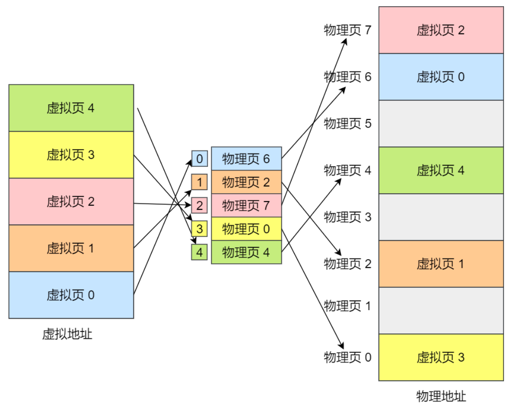

> 简单的分页有什么缺陷吗？

有空间上的缺陷。

因为操作系统是可以同时运行非常多的进程的，那这不就意味着页表会非常的庞大。

在 32 位的环境下，虚拟地址空间共有 4GB，假设一个页的大小是 4KB（2^12），那么就需要大约 100 万 （2^20） 个页，每个「页表项」需要 4 个字节大小来存储，那么整个 4GB 空间的映射就需要有 `4MB` 的内存来存储页表。

这 4MB 大小的页表，看起来也不是很大。但是要知道每个进程都是有自己的虚拟地址空间的，也就说都有自己的页表。

那么，`100` 个进程的话，就需要 `400MB` 的内存来存储页表，这是非常大的内存了，更别说 64 位的环境了。

### 4、**多级页表**（*Multi-Level Page Table*）—— 解决内存分配空间上的问题

要解决上面的问题，就需要采用一种叫作**多级页表**（*Multi-Level Page Table*）的解决方案。

在前面我们知道了，对于单页表的实现方式，在 32 位和页大小 `4KB` 的环境下，一个进程的页表需要装下 100 多万个「页表项」，并且每个页表项是占用 4 字节大小的，于是相当于每个页表需占用 4MB 大小的空间。

我们把这个 100 多万个「页表项」的单级页表再分页，将页表（一级页表）分为 `1024` 个页表（二级页表），每个表（二级页表）中包含 `1024` 个「页表项」，形成**二级分页**。如下图所示：

> 但是分了二级表，映射 4GB 地址空间就需要 4KB（一级页表）+ 4MB（二级页表）的内存，这样占用空间不是更大了吗？

当然如果 4GB 的虚拟地址全部都映射到了物理内存上的话，二级分页占用空间确实是更大了，但是，我们往往不会为一个进程分配那么多内存。

> 其实我们应该换个角度来看问题，计算机组成原理——局部性原理

每个进程都有 4GB 的虚拟地址空间，而显然对于大多数程序来说，其使用到的空间远未达到 4GB，因为会存在部分对应的页表项都是空的，根本没有分配，对于已分配的页表项，如果存在最近一定时间未访问的页表，在物理内存紧张的情况下，操作系统会将页面换出到硬盘，也就是说不会占用物理内存。

如果使用了二级分页，一级页表就可以覆盖整个 4GB 虚拟地址空间，但**如果某个一级页表的页表项没有被用到，也就不需要创建这个页表项对应的二级页表了，即可以在需要时才创建二级页表**。做个简单的计算，假设只有 20% 的一级页表项被用到了，那么页表占用的内存空间就只有 4KB（一级页表） + 20% * 4MB（二级页表）= `0.804MB`，这对比单级页表的 `4MB` 是不是一个巨大的节约？

> 那么为什么不分级的页表就做不到这样节约内存呢？

我们从页表的性质来看，保存在内存中的页表承担的职责是将虚拟地址翻译成物理地址。假如虚拟地址在页表中找不到对应的页表项，计算机系统就不能工作了。所以**页表一定要覆盖全部虚拟地址空间，不分级的页表就需要有 100 多万个页表项来映射，而二级分页则只需要 1024 个页表项**（此时一级页表覆盖到了全部虚拟地址空间，二级页表在需要时创建）。

我们把二级分页再推广到多级页表，就会发现页表占用的内存空间更少了，这一切都要归功于对局部性原理的充分应用。

>  对于 64 位的系统，两级分页肯定不够了，就变成了四级目录，分别是：
>
>  - 全局页目录项 PGD（*Page Global Directory*）；
>  - 上层页目录项 PUD（*Page Upper Directory*）；
>  - 中间页目录项 PMD（*Page Middle Directory*）；
>  - 页表项 PTE（*Page Table Entry*）
>
>  

### 5、TLB（*Translation Lookaside Buffer*）快表 ——  解决内存分配时间上的问题

多级页表虽然解决了空间上的问题，但是虚拟地址到物理地址的转换就多了几道转换的工序，这显然就降低了这俩地址转换的速度，也就是带来了时间上的开销。

程序是有局部性的，即在一段时间内，整个程序的执行仅限于程序中的某一部分。相应地，执行所访问的存储空间也局限于某个内存区域。

我们就可以利用这一特性，**把最常访问的几个页表项存储到访问速度更快的硬件**，于是计算机科学家们，就在 CPU 芯片中，加入了一个**专门存放程序最常访问的页表项的 Cache**，这个 Cache 就是 TLB（*Translation Lookaside Buffer*） ，通常称为页表缓存、转址旁路缓存、快表等。


在 CPU 芯片里面，封装了内存管理单元（*Memory Management Unit*）芯片，它用来完成地址转换和 TLB 的访问与交互。

有了 TLB 后，那么 CPU 在寻址时，会先查 TLB，如果没找到，才会继续查常规的页表。

TLB 的命中率其实是很高的，因为程序最常访问的页就那么几个。

### 6、段页式内存管理

内存分段和内存分页并不是对立的，它们是可以组合起来在同一个系统中使用的，那么组合起来后，通常称为**段页式内存管理**。

段页式内存管理实现的方式：

- 先将程序划分为多个有逻辑意义的段，也就是前面提到的分段机制；
- 接着再把每个段划分为多个页，也就是对分段划分出来的连续空间，再划分固定大小的页；

这样，地址结构就由**段号、段内页号和页内位移**三部分组成。

用于段页式地址变换的数据结构是每一个程序一张段表，每个段又建立一张页表，段表中的地址是页表的起始地址，而页表中的地址则为某页的物理页号，如图所示：


段页式地址变换中要得到物理地址须经过三次内存访问：

- 第一次访问段表，得到页表起始地址；
- 第二次访问页表，得到物理页号；
- 第三次将物理页号与页内位移组合，得到物理地址。

可用软、硬件相结合的方法实现段页式地址变换，这样虽然增加了硬件成本和系统开销，但提高了内存的利用率。

### 7、Linux内存管理

>  Linux 采用什么方式管理内存？

**Linux 内存主要采用的是页式内存管理，但同时也不可避免地涉及了段机制**。

**但是由于 Intel 处理器的发展史，Linux 系统无法避免分段管理**。于是 Linux 就把所有段的基地址设为 `0`，也就意味着所有程序的地址空间都是线性地址空间（虚拟地址），相当于屏蔽了 CPU 逻辑地址的概念，所以**段只被用于访问控制和内存保护**。

**Linux 系统中的每个段都是从 0 地址开始的整个 4GB 虚拟空间（32 位环境下），也就是所有的段的起始地址都是一样的。这意味着，Linux 系统中的代码，包括操作系统本身的代码和应用程序代码，所面对的地址空间都是线性地址空间（虚拟地址），这种做法相当于屏蔽了处理器中的逻辑地址概念，段只被用于访问控制和内存保护。**

> Linux 的虚拟地址空间是如何分布的？

在 Linux 操作系统中，虚拟地址空间的内部又被分为**内核空间和用户空间**两部分，不同位数的系统，地址空间的范围也不同。比如最常见的 32 位和 64 位系统，如下所示：


通过这里可以看出：

- `32` 位系统的内核空间占用 `1G`，位于最高处，剩下的 `3G` 是用户空间；
- `64` 位系统的内核空间和用户空间都是 `128T`，分别占据整个内存空间的最高和最低处，剩下的中间部分是未定义的。

再来说说，内核空间与用户空间的区别：

- 进程在用户态时，只能访问用户空间内存；
- 只有进入内核态后，才可以访问内核空间的内存；

虽然每个进程都各自有独立的虚拟内存，但是**每个虚拟内存中的内核地址，其实关联的都是相同的物理内存**。这样，进程切换到内核态后，就可以很方便地访问内核空间内存。


> 用户空间分布的情况，以 32 位系统为例
>
> 

用户空间内存，从**低到高**分别是 6 种不同的内存段：

- 程序文件段（.text），包括二进制可执行代码；
- 已初始化数据段（.data），包括静态常量；
- 未初始化数据段（.bss），包括未初始化的静态变量；
- 堆段，包括动态分配的内存，从低地址开始向上增长；
- 文件映射段，包括动态库、共享内存等，从低地址开始向上增长（[跟硬件和内核版本有关 (opens new window)](http://lishiwen4.github.io/linux/linux-process-memory-location)）；
- 栈段，包括局部变量和函数调用的上下文等。栈的大小是固定的，一般是 `8 MB`。当然系统也提供了参数，以便我们自定义大小；

在这 7 个内存段中，**堆和文件映射段**的内存是**动态分配**的。比如说，使用 C 标准库的 `malloc()` 或者 `mmap()` ，就可以分别在堆和文件映射段动态分配内存。

### 8、常见的内存分配方式

（1） 从静态存储区域分配。内存在程序编译的时候就已经分配好，这块内存在程序的整个运行期间都存在。例如全局变量，static变量。

（2） 在栈上创建。在执行函数时，函数内局部变量的存储单元都可以在栈上创建，函数执行结束时这些存储单元自动被释放。栈内存分配运算内置于处理器的指令集中，效率很高，但是分配的内存容量有限。

（3） 从堆上分配，亦称动态内存分配。程序在运行的时候用malloc或new申请任意多少的内存，程序员自己负责在何时用free或delete释放内存。动态内存的生存期由我们决定，使用非常灵活，但问题也最多。

### 9、常见的内存分配错误

（1）内存分配未成功，却使用了它。

编程新手常犯这种错误，因为他们没有意识到内存分配会不成功。常用解决办法是，在使用内存之前检查指针是否为NULL。如果指针p是函数的参数，那么在函数的入口处用assert(p!=NULL)进行检查。如果是用malloc或new来申请内存，应该用if(p==NULL) 或if(p!=NULL)进行防错处理。

（2）内存分配虽然成功，但是尚未初始化就引用它。

犯这种错误主要有两个起因：一是没有初始化的观念；二是误以为内存的缺省初值全为零，导致引用初值错误（例如数组）。内存的缺省初值究竟是什么并没有统一的标准，尽管有些时候为零值，我们宁可信其无不可信其有。所以无论用何种方式创建数组，都别忘了赋初值，即便是赋零值也不可省略，不要嫌麻烦。

（3）内存分配成功并且已经初始化，但操作越过了内存的边界。

例如在使用数组时经常发生下标“多1”或者“少1”的操作。特别是在for循环语句中，循环次数很容易搞错，导致数组操作越界。

（4）忘记了释放内存，造成内存泄露。

含有这种错误的函数每被调用一次就丢失一块内存。刚开始时系统的内存充足，你看不到错误。终有一次程序突然挂掉，系统出现提示：内存耗尽。动态内存的申请与释放必须配对，程序中malloc与free的使用次数一定要相同，否则肯定有错误（new/delete同理）。

（5）释放了内存却继续使用它。常见于以下有三种情况：

1. 程序中的对象调用关系过于复杂，实在难以搞清楚某个对象究竟是否已经释放了内存，此时应该重新设计数据结构，从根本上解决对象管理的混乱局面。
2. 函数的return语句写错了，注意不要返回指向“栈内存”的“指针”或者“引用”，因为该内存在函数体结束时被自动销毁。
3. 使用free或delete释放了内存后，没有将指针设置为NULL。导致产生“野指针”。


## 2. 进程管理

### 1、进程

我们编写的代码只是一个存储在硬盘的静态文件，通过编译后就会生成二进制可执行文件，当我们运行这个可执行文件后，它会被装载到内存中，接着 CPU 会执行程序中的每一条指令，那么这个**运行中的程序，就被称为「进程」（Process）**。

当进程要从硬盘读取数据时，CPU 不需要阻塞等待数据的返回，而是去执行另外的进程。当硬盘数据返回时，CPU 会收到个**中断**，于是 CPU 再继续运行这个进程。


这种**多个程序、交替执行**的思想，就有 CPU 管理多个进程的初步想法。

对于一个支持多进程的系统，CPU 会从一个进程快速切换至另一个进程，其间每个进程各运行几十或几百个毫秒。

虽然单核的 CPU 在某一个瞬间，只能运行一个进程。但在 1 秒钟期间，它可能会运行多个进程，这样就产生**并行的错觉**，实际上这是**并发**。

> 并发和并行有什么区别？
>
> 并发是指宏观上在一段时间内能同时运行多个程序，而并行则指同一时刻能运行多个指令。
>
> 并行需要硬件支持，如多流水线、多核处理器或者分布式计算系统。
>
> 操作系统通过引入进程和线程，使得程序能够并发运行
>
> 

> 进程与程序的关系的类比
>
> **CPU 可以从一个进程（做菜）切换到另外一个进程（买可乐），在切换前必须要记录当前进程中运行的状态信息，以备下次切换回来的时候可以恢复执行。**
>
> 所以，可以发现进程有着「**运行 - 暂停 - 运行**」的活动规律。

#### 1.1 进程的创建与Linux内核的fork实现

> 进程的创建过程？需要哪些函数？需要哪些数据结构?

1) fork函数创造的⼦进程是⽗进程的完整副本，复制了⽗亲进程的资源，包括内存的内容task_struct内容；

2) vfork创建的⼦进程与⽗进程共享数据段，⽽且由vfork创建的⼦进程将先于⽗进程运⾏；

3) linux上创建线程⼀般使⽤的是pthread库，实际上linux也给我们提供了创建线程的系统调⽤，就是clone；

> 进程创建⼦进程, fork()详解

1. 函数原型

    ```C++
    pid_t fork(void);	// void代表没有任何形参
    ```

2. 除了0号进程（系统创建的）之外，linux系统中所有的进程都是由其他进程创建的。创建新进程的进程，即调⽤fork函数的进程为⽗进程，新建的进程为⼦进程。

3. fork函数不需要任何参数，对于返回值有三种情况：

    ① 对于⽗进程，fork函数返回新建⼦进程的pid； 

    ② 对于⼦进程，fork函数返回 0； 

    ③ 如果出错创建子进程失败， fork函数返回 -1。

    ```C++
    int pid=fork();
    if(pid < 0){
    //失败，⼀般是该⽤户的进程数达到限制或者内存被⽤光了 
    ........ 
    }
    else if(pid == 0){
    //⼦进程执⾏的代码
    ......
    }
    else{
    //⽗进程执⾏的代码
    .........
    }
    ```

    注意：fork() 函数被调用一次，但返回两次。两次返回的区别是：子进程的返回值是 0，而父进程的返回值则是新子进程的进程 ID。即——通过fork的返回值区分父子进程。

4. 子进程创建成功后，代码的执行的位置：父进程执行到哪，子进程就从那开始执行；

    但是父子进程的执行顺序不一定，谁先抢到CPU资源谁先执行。

    父子进程之间不能使用全局变量通信，两个进程间的内存不能共享。

5. fork()的写时拷贝

在刚fork出来后，父子进程两个地址空间用户区数据完全相同，在后续各自进行不同的操作，各个进程的地址空间中数据是完全独立的。

PS：虽然说对于在各自的地址空间的数据完全独立，但如果两个进程只是访问（也就是说read操作）数据时，其映射在物理内存中的数据是共享的；但如果两者各自进程修改了数据值，在物理内存中将原来的数据空间进行拷贝一份副本，存入修改的数据。<总结：读时共享，写时复制>。

6. 当进程调用fork后，当控制转移到内核中的fork代码后，内核会做4件事情:

    1.分配新的内存块和内核数据结构给子进程

    2.将父进程部分数据结构内容拷贝至子进程

    3.添加子进程到系统进程列表当中

    4.fork返回，开始调度器调度

7. fork()函数的底层

linux平台通过clone()系统调用实现fork()， fork(),vfork()和clone()库函数都根据各自需要的参数标志去调用clone()，然后由clone()去调用do_fork()。再然后do_fork()完成了创建中的大部分工作，他定义在kernel/fork.c当中。该函数调用copy_process()。该过程如图所示：


 copy_process函数到底做了那些事情：

> 1. 调用dup_task_struct()为新进程创建一个内核栈，thread_info结构和task_struct这些值与当前父进程相等。此时，父子进程的描述符完全相同；
> 2. 检查新创建的子进程，查看当前用户所拥有的进程数目是否超过分配的资源限制；
> 3. 区别父子进程描述符，部分进程描述符成员清零或设置；
> 4. 子进程状态被设置为task_uninterruptible(不可中断)，以保证它不会投入运行；
> 5. copy_process()调用copy_flags以更新task_struct的flags成员，表明进程是否拥有超级用户权限的PF_SUPERPRIV标志被清零。表明进程还没有调用exex函数；
> 6. 调用get_pid为新进程获取一个有效的PID；
> 7. 根据clone()参数，copy_process()拷贝或共享打开的文件、进程地址空间等；
> 8. copy_process()扫尾并返回指向子进程的指针。

8. vfork和fork之间的区别:

    > 1. fork父子进程交替运行，vfork子进程先运行，父进程阻塞，直到子进程结束；
    >
    > 2. fork实现了写时拷贝. vfork直接让父子进程公用资源然后无论如何也不会多开辟空间拷贝了；
    >
    > 3. vfork必须使用exit或者excl退出;
    >
    > 4. 就算是fork使用了写时拷贝，也没有vfork性能高;
    >
    > 5. 但是每个系统上的vfork都有问题，推荐不要使用.

    

#### 1.2 进程的状态

一般说来，一个进程并不是自始至终连续不停地运行的，它与并发执行中的其他进程的执行是相互制约的。

它有时处于运行状态，有时又由于某种原因而暂停运行处于等待状态，当使它暂停的原因消失后，它又进入准备运行状态。

所以，**在一个进程的活动期间至少具备三种基本状态，即运行状态、就绪状态、阻塞状态。**


上图中各个状态的意义：

- 运行状态（*Running*）：该时刻进程占用 CPU；
- 就绪状态（*Ready*）：可运行，由于其他进程处于运行状态而暂时停止运行；
- 阻塞状态（*Blocked*）：该进程正在等待某一事件发生（如等待输入/输出操作的完成）而暂时停止运行，这时，即使给它CPU控制权，它也无法运行；

当然，进程还有另外两个基本状态：

- 创建状态（*new*）：进程正在被创建时的状态；
- 结束状态（*Exit*）：进程正在从系统中消失时的状态；


再来详细说明一下进程的状态变迁：

- *NULL -> 创建状态*：一个新进程被创建时的第一个状态；
- *创建状态 -> 就绪状态*：当进程被创建完成并初始化后，一切就绪准备运行时，变为就绪状态，这个过程是很快的；
- *就绪态 -> 运行状态*：处于就绪状态的进程被操作系统的进程调度器选中后，就分配给 CPU 正式运行该进程；
- *运行状态 -> 结束状态*：当进程已经运行完成或出错时，会被操作系统作结束状态处理；
- *运行状态 -> 就绪状态*：处于运行状态的进程在运行过程中，由于分配给它的运行时间片用完，操作系统会把该进程变为就绪态，接着从就绪态选中另外一个进程运行；
- *运行状态 -> 阻塞状态*：当进程请求某个事件且必须等待时，例如请求 I/O 事件；
- *阻塞状态 -> 就绪状态*：当进程要等待的事件完成时，它从阻塞状态变到就绪状态；

如果有大量处于阻塞状态的进程，进程可能会占用着物理内存空间，显然不是我们所希望的，毕竟物理内存空间是有限的，被阻塞状态的进程占用着物理内存就一种浪费物理内存的行为。

所以，在**虚拟内存管理**的操作系统中，通常会**把阻塞状态的进程的物理内存空间换出到硬盘，等需要再次运行的时候，再从硬盘换入到物理内存**。


那么，就需要一个新的状态，来**描述进程没有占用实际的物理内存空间的情况，这个状态就是挂起状态**。这跟阻塞状态是不一样，**阻塞状态是等待某个事件的返回**。

另外，挂起状态可以分为两种：

- 阻塞挂起状态：进程在外存（硬盘）并等待某个事件的出现；
- 就绪挂起状态：进程在外存（硬盘），但只要进入内存，即刻立刻运行；


导致进程挂起的原因不只是因为进程所使用的内存空间不在物理内存，还包括如下情况：

- 通过 sleep 让进程间歇性挂起，其工作原理是设置一个定时器，到期后唤醒进程。
- 用户希望挂起一个程序的执行，比如在 Linux 中用 `Ctrl+Z` 挂起进程；（`Ctrl+C` 结束进程）

#### 1.3 进程的控制结构 PCB

在操作系统中，是用**进程控制块**（*process control block，PCB*）数据结构来描述进程的。

**PCB 是进程存在的唯一标识**，这意味着一个进程的存在，必然会有一个 PCB，如果进程消失了，那么 PCB 也会随之消失。

> PCB 具体包含什么信息呢？

**进程描述信息：**

- 进程标识符：标识各个进程，每个进程都有一个并且唯一的标识符；
- 用户标识符：进程归属的用户，用户标识符主要为共享和保护服务；

**进程控制和管理信息：**

- 进程当前状态，如 new、ready、running、waiting 或 blocked 等；
- 进程优先级：进程抢占 CPU 时的优先级；

**资源分配清单：**

- 有关内存地址空间或虚拟地址空间的信息，所打开文件的列表和所使用的 I/O 设备信息。

**CPU 相关信息：**

- CPU 中各个寄存器的值，当进程被切换时，CPU 的状态信息都会被保存在相应的 PCB 中，以便进程重新执行时，能从断点处继续执行

> 每个 进程控制块PCB 是如何组织的呢？（链表链接方式和索引方式）

通常是通过**链表**的方式进行组织，把具有**相同状态的进程链在一起，组成各种队列**。比如：

- 将所有处于就绪状态的进程链接在一起，称为**就绪队列**；
- 把所有 因等待某事件而处于等待状态 的进程链在一起就组成各种**阻塞队列**；
- 另外，对于**运行队列**在单核 CPU 系统中则只有一个运行指针了，因为**单核 CPU 在某个时间，只能运行一个程序**。

那么，就绪队列和阻塞队列链表的组织形式如下图：


除了链接的组织方式，还有**索引方式**，它的工作原理：**将同一状态的进程组织在一个索引表中，索引表项指向相应的 PCB，不同状态对应不同的索引表。**

一般会选择链表，因为可能面临进程创建，销毁等调度导致进程状态发生变化，所以链表能够更加灵活的插入和删除。

#### 1.4 进程的控制

进程的**创建、终止、阻塞、唤醒**的过程就是进程的控制。

**01 创建进程**

操作系统允许一个进程创建另一个进程，而且允许子进程继承父进程所拥有的资源，当子进程被终止时，其在父进程处继承的资源应当还给父进程。同时，终止父进程时同时也会终止其所有的子进程。

> 注意：Linux 操作系统对于终止有子进程的父进程，会把子进程交给 1 号进程接管。
>
> 本文所指出的进程终止概念是宏观操作系统的一种观点，最后如何实现当然是看具体的操作系统。

创建进程的过程如下：

- 申请一个空白的 PCB，并向 PCB 中填写一些控制和管理进程的信息，比如进程的唯一标识等；
- 为该进程分配运行时所必需的资源，比如内存资源；
- 将 PCB 插入到就绪队列，等待被调度运行；

**02 终止进程**

进程可以有 3 种终止方式：正常结束、异常结束以及外界干预（信号 `kill` 掉）。

终止进程的过程如下：

- 查找需要终止的进程的 PCB；
- 如果处于执行状态，则立即终止该进程的执行，然后将 CPU 资源分配给其他进程；
- 如果其还有子进程，则应将其所有子进程终止；
- 将该进程所拥有的全部资源都归还给父进程或操作系统；
- 将其从 PCB 所在队列中删除；

**03 阻塞进程**

当进程需要等待某一事件完成时，它可以调用阻塞语句把自己阻塞等待。而一旦被阻塞等待，它只能由另一个进程唤醒。

阻塞进程的过程如下：

- 找到将要被阻塞进程标识号对应的 PCB；
- 如果该进程为运行状态，则保护其现场，将其状态转为阻塞状态，停止运行；
- 将该 PCB 插入到阻塞队列中去

**04 唤醒进程**

进程由「运行」转变为「阻塞」状态是由于**进程必须等待某一事件的完成**，所以**处于阻塞状态的进程是绝对不可能叫醒自己**的。

如果某进程正在等待 I/O 事件，需由别的进程发消息给它，则只有当该进程所期待的事件出现时，才由发现者进程用唤醒语句叫醒它。

唤醒进程的过程如下：

- 在该事件的阻塞队列中找到相应进程的 PCB；
- 将其**从阻塞队列中移出**，并置其状态为就绪状态；
- 把该 PCB **插入到就绪队列**中，等待调度程序调度；

进程的阻塞和唤醒是一对功能相反的语句，**如果某个进程调用了阻塞语句，则必有一个与之对应的唤醒语句**。

#### 1.5 进程的上下文切换

概念：各个进程之间是共享 CPU 资源的，在不同的时候进程之间需要切换，让不同的进程可以在 CPU 执行，那么这个**一个进程切换到另一个进程运行，称为进程的上下文切换**。

> 在详细说进程上下文切换前，先来看看 CPU 上下文切换

在每个任务运行前，CPU 需要知道任务从哪里加载，又从哪里开始运行。所以，操作系统需要事先帮 CPU 设置好 **CPU 寄存器和程序计数器**。

> CPU 寄存器是 CPU 内部一个容量小，但是速度极快的内存（缓存）;
>
> 程序计数器则是用来存储 CPU 正在执行的指令位置、或者即将执行的下一条指令位置。
>
> CPU 寄存器和程序计数是 CPU 在运行任何任务前，所必须依赖的环境，这些环境就叫做 **CPU 上下文**。

CPU 上下文切换就是先把前一个任务的 CPU 上下文（CPU 寄存器和程序计数器）保存起来，然后加载新任务的上下文到这些寄存器和程序计数器，最后再跳转到程序计数器所指的新位置，运行新任务。

系统内核会存储保持下来的上下文信息，当此任务再次被分配给 CPU 运行时，CPU 会重新加载这些上下文，这样就能保证任务原来的状态不受影响，让任务看起来还是连续运行。

上面说到所谓的「任务」，主要包含进程、线程和中断。所以，可以根据任务的不同，把 CPU 上下文切换分成：**进程上下文切换、线程上下文切换和中断上下文切换**。

> 进程的上下文切换

进程是由内核管理和调度的，所以进程的切换只能发生在内核态。

所以，**进程的上下文切换不仅包含了虚拟内存、栈、全局变量等用户空间的资源，还包括了内核堆栈、寄存器等内核空间的资源。**

通常，会把交换的信息保存在进程的 PCB，当要运行另外一个进程的时候，我们需要从这个进程的 PCB 取出上下文，然后恢复到 CPU 中，这使得这个进程可以继续执行，如下图所示：


> 发生进程上下文切换有哪些场景？

- 为了保证所有进程可以得到公平调度，CPU 时间被划分为一段段的时间片，这些时间片再被轮流分配给各个进程。这样，当某个进程的时间片耗尽了，进程就从运行状态变为就绪状态，系统从就绪队列选择另外一个进程运行；
- 进程在系统资源不足（比如内存不足）时，要等到资源满足后才可以运行，这个时候进程也会被挂起，并由系统调度其他进程运行；
- 当进程通过睡眠函数 sleep 这样的方法将自己主动挂起时，自然也会重新调度；
- 当有优先级更高的进程运行时，为了保证高优先级进程的运行，当前进程会被挂起，由高优先级进程来运行；
- 发生硬件中断时，CPU 上的进程会被中断挂起，转而执行内核中的中断服务程序.

#### 1.6 守护进程、僵尸进程与孤儿进程

> 守护进程

**概念：**守护进程（Daemon Process），也就是通常说的 Daemon 进程（精灵进程），是Linux 中的后台服务进程。它是一个生存期较长的进程，通常独立于控制终端并且周期性地执行某种任务或等待处理某些发生的事件。一般采用以 d 结尾的名字。Linux 的大多数服务器就是用守护进程实现的。比如，Internet 服务器 inetd，Web 服务器 httpd 等，ssh服务也是。

**特征：**

1. **生命周期很长**，守护进程会在系统启动的时候被创建并一直运行直至系统被关闭。

2. 它**在后台运行并且不拥有控制终端**。没有控制终端确保了内核永远不会为守护进程自动生成任何控制信号以及终端相关的信号（如 SIGINT、SIGQUIT）。

**守护进程的创建步骤：**

1. 执行一个 fork()，之后父进程退出，子进程继续执行。确保子进程不会成为进程组的首进程

2. 子进程调用 setsid() 开启一个新会话。目的是脱离控制终端

3. 清除进程的 umask 以确保当守护进程创建文件和目录时拥有所需的权限。

4. 修改进程的当前工作目录，通常会改为根目录（/）。

5. 关闭守护进程从其父进程继承而来的所有打开着的文件描述符。

6. 在关闭了文件描述符0、1、2之后，守护进程通常会打开/dev/null 并使用dup2() 使所有这些描述符指向这个设备。

7. 核心业务逻辑

```C++
// 1.创建子进程，退出父进程
    pid_t pid = fork();

    if(pid > 0) {
        // 退出父进程
        exit(0);
    }

    // 2.将子进程重新创建一个会话
    setsid();

    // 3.设置掩码
    umask(022);

    // 4.更改工作目录
    // chdir("/root/nowcoderLinuxProject/");
    chdir("/");

    // 5. 关闭、重定向文件描述符
    int fd = open("/dev/null", O_RDWR);
    dup2(fd, STDIN_FILENO);
    dup2(fd, STDOUT_FILENO);
    dup2(fd, STDERR_FILENO);

    // 6.业务逻辑

    // 捕捉定时信号
```

> 孤儿进程

1. 父进程运行结束，但子进程还在运行（未运行结束），这样的子进程就称为孤儿进程（Orphan Process）。

2. 每当出现一个孤儿进程的时候，内核就把孤儿进程的父进程设置为 init（因为每个进程都必须有父进程） ，而 init 进程会循环地 wait() 它的已经退出的子进程。这样，当一个孤儿进程凄凉地结束了其生命周期的时候，init 进程就会代表党和政府出面处理它的一切善后工作。

3. 因此孤儿进程并不会有什么危害。

```C++
    // 创建子进程
    pid_t pid = fork();

    // 判断是父进程还是子进程
    if(pid > 0) {
        printf("i am parent process, pid : %d, ppid : %d\n", getpid(), getppid());
    } else if(pid == 0) {
        // 父进程死亡后，当前终端切换到前台
        // 又因为还有子进程在运行，所以子进程将输出在前台打印出来
        sleep(1);
        // 当前是子进程
        printf("i am child process, pid : %d, ppid : %d\n", getpid(),getppid());
    }
```

> 僵尸进程

1.  每个进程结束之后, 都会释放自己地址空间中的用户区数据，内核区的 PCB 没有办法自己释放掉，需要父进程去释放。 若当前进程已退出，但是由于内核中仍保存其进程状态信息，由于父进程未对其进行回收，使其一直留在操作系统中，占用系统资源，其在进程表中的状态为僵尸进程(Zombie)。
2.  **出现原因**：一般来说，父进程需要追踪子进程的退出状态，因此当子进程结束运行后，内核不会立即释放该进程的进程表表项，**以满足父进程后续对子进程退出信息的查询。**

3.  **僵尸进程的危害：**如果父进程不调用 wait() 或 waitpid() 的话，那么保留的那段信息就不会释放，其**进程号就会一直被占用**，但是系统所能使用的进程号是有限的，如果产生大量的僵尸进程，将因为没有可用的进程号而导致系统不能产生新的进程，此即为僵尸进程的危害，应当避免。

```C++
    // 创建子进程
    pid_t pid = fork();

    // 判断是父进程还是子进程
    if(pid > 0) {
        while(1) {
            printf("i am parent process, pid : %d, ppid : %d\n", getpid(), getppid());
            sleep(1);
        }
    } else if(pid == 0) {
        // 当前是子进程
        printf("i am child process, pid : %d, ppid : %d\n", getpid(),getppid()); 
    }
```

**解决方案：**

注意：僵尸进程不能被 kill -9 杀死（因为kill()是发送**信号**）。

父进程调用wait() 以及 waitpid()来实现对子进程状态信息的回收

两者区别：wait只有阻塞性质的，他是等待当前进程的某个子进程结束；waitpid有个option参数可以设置WNOHANG，可以将其设置为非阻塞；

**如何通知进程使其回收子进程信息，使其不让它成为僵尸进程：**

可以通过在父进程捕获信号，SIGCHLD信号：当一个进程结束的时候，它将给其父进程发送一个SIGCHLD信号，通过在父进程捕获SIGCHLD信号，并在信号处理函数中调用waitpid函数以“彻底结束”一个子进程。

另外几种处理僵尸进程的方法：

1. 如果父进程很忙可以用signal注册信号处理函数，在信号处理函数调用wait/waitpid等待子进程退出。
2. 通过两次调用fork。父进程首先调用fork创建一个子进程然后waitpid等待子进程退出，子进程再fork一个孙进程后退出。这样子进程退出后会被父进程等待回收，而对于孙子进程其父进程已经退出所以孙进程成为一个孤儿进程，孤儿进程由init进程接管，孙进程结束后，init会等待回收。

#### 1.7 Linux设置进程后台运行

背景：当用户注销（logout）或者网络断开时，终端会收到 HUP（hangup）信号从而关闭其所有子进程。因此，解决办法就有两种途径：要么让进程忽略 HUP 信号，要么让进程运行在新的会话里从而成为不属于此终端的子进程。

1. nohup

nohup 的用途就是让提交的命令忽略 hangup 信号。

nohup 的使用是十分方便的，只需在要处理的命令前加上 nohup 即可，忽略所有挂断（SIGHUP）信号。

标准输出和标准错误缺省会被重定向到 nohup.out 文件中。一般可在结尾加上"&"来将命令同时放入后台运行，也可用">filename 2>& 1"来更改缺省的重定向文件名。

```
[root@pythontab ~]# nohup ping www.baidu.com &
[1] 3059
nohup: appending output to `nohup.out'
[root@pythontab ~]# ps -ef |grep 3059
root      3059   984  0 15:06 pts/3    00:00:00 ping www.baidu.com
root      3067   984  0 15:06 pts/3    00:00:00 grep 3059
```

2. setsid

nohup 无疑通过忽略 HUP 信号来使进程避免中途被中断，但如果我们换个角度思考，如果我们的进程不属于接受 HUP 信号的终端的子进程，那么自然也就不会受到 HUP 信号的影响了。setsid 就能帮助我们做到这一点。

setsid 的使用也是非常方便的，也只需在要处理的命令前加上 setsid 即可，使其父进程变为init进程，不受HUP信号的影响。

```
[root@pythontab ~]# setsid ping www.baidu.com
[root@pythontab ~]# ps -ef |grep www.baidu.com
root     31094     1  0 07:28 ?        00:00:00 ping www.baidu.com
root     31102 29217  0 07:29 pts/4    00:00:00 grep www.baidu.com
# 进程 ID(PID)为31094，而它的父 ID（PPID）为1（即为 init 进程 ID），并不是当前终端的进程 ID。
```

3. & subshell

这里还有一个关于 subshell 的小技巧。我们知道，将一个或多个命名包含在“()”中就能让这些命令在子 shell 中运行中，从而扩展出很多有趣的功能，我们现在要讨论的就是其中之一。

当我们将"&"也放入“()”内之后，我们就会发现所提交的作业并不在作业列表中，也就是说，是无法通过jobs来查看的。让我们来看看为什么这样就能躲过 HUP 信号的影响

```
[root@pythontab ~]# (ping www.baidu.com &)
[root@pythontab ~]# ps -ef |grep www.baidu.com
root     16270     1  0 16:13 pts/4    00:00:00 ping www.baidu.com
root     16278 15362  0 16:13 pts/4    00:00:00 grep www.baidu.com
# 新提交的进程的父 ID（PPID）为1（init 进程的 PID），并不是当前终端的进程 ID。因此并不属于当前终端的子进程，从而也就不会受到当前终端的 HUP 信号的影响了。
```

4. 命令后面加上&即可，实际上，这样是将命令放入到一个作业队列中了
5. ctrl + z 挂起进程，使用jobs查看序号，在使用bg %序号后台运行进程

#### 1.8 一个进程最多可以创建多少线程

对于Linux系统：

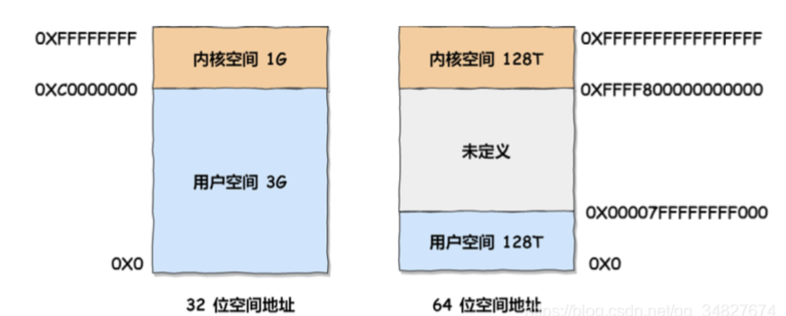

通过这里可以看出:

- 32 位系统的内核空间占用 1G ，位于最高处，剩下的 3G 是用户空间;
- 64 位系统的内核空间和用户空间都是 128T ，分别占据整个内存空间的最高和最低处，剩下的中 间部分是未定义的。

这个问题跟两个东西有关系：

- **进程的虚拟内存空间上限**，因为创建一个线程，操作系统需要为其分配一个栈空间，如果线程数量越多，所需的栈空间就要越大，那么虚拟内存就会占用的越多。
- **系统参数限制**，虽然 Linux 并没有内核参数来控制单个进程创建的最大线程个数，但是有系统级别的参数来控制整个系统的最大线程个数。

总结：

- 32 位系统，用户态的虚拟空间只有 3G，如果创建线程时分配的栈空间是 10M，那么一个进程最多只能创建 300 个左右的线程。
- 64 位系统，用户态的虚拟空间大到有 128T，理论上不会受虚拟内存大小的限制，而会受**系统的参数或性能限制**

#### 1.9 线程崩溃了进程一定会崩溃吗

> 回答

当进程中的一个线程崩溃时，会导致所属进程的所有线程崩溃（只针对C／C++，JAVA中的线程崩溃不会导致进程崩溃）。

一般来说如果线程是因为非法访问内存引起的崩溃，那么进程肯定会崩溃，为什么系统要让进程崩溃呢，这主要是因为在进程中，**各个线程的地址空间是共享的**，既然是共享，那么某个线程对地址的非法访问就会导致内存的不确定性，进而可能会影响到其他线程，这种操作是危险的，操作系统会认为这很可能导致一系列严重的后果，于是干脆让整个进程崩溃。

>  线程共享代码段，数据段，地址空间，文件非法访问内存有以下几种情况，以 C 语言举例。

1. 针对只读内存写入数据

```C
char *s = "hello world";
// 向只读内存写入数据，崩溃
s[1] = 'H'; 
```

2. 访问了进程没有权限访问的地址空间（比如内核空间）

```C
int *p = (int *)0xC0000fff;
// 针对进程的内核空间写入数据，崩溃
*p = 10; 

// 在 32 位虚拟地址空间中，p 指向的是内核空间，显然不具有写入权限，所以上述赋值操作会导致崩溃
```

3. 访问了不存在的内存

```C
int *a = null;
*a = 1;
```

以上错误都是访问内存时的错误，所以统一会报 Segment Fault 错误（即段错误），这些都会导致进程崩溃

> 进程是如何崩溃的——信号机制

要干掉一个正在运行的进程经常用 kill -9 pid 这样的命令，这里的 kill 其实就是给指定 pid 发送终止信号的意思，其中的 9 就是信号。在 Linux 中可以通过 `kill -l`查看所有可用的信号。

当然了发 kill 信号必须具有一定的权限，否则任意进程都可以通过发信号来终止其他进程，那显然是不合理的，实际上 kill 执行的是**系统调用**，将控制权转移给了**内核（操作系统）**，由内核来给指定的进程发送信号

那么发个信号进程怎么就崩溃了呢，其背后的机制如下：

1. CPU 执行正常的进程指令；
2. 调用 kill 系统调用向进程发送信号；
3. 进程收到操作系统发的信号，CPU 暂停当前程序运行，并将控制权转交给操作系统；
4. 调用 kill 系统调用向进程发送信号（假设为 11，即 SIGSEGV，一般非法访问内存报的都是这个错误）；
5. 操作系统根据情况**执行相应的信号处理程序或函数(此处就是让相关的进程崩溃)**，一般执行完信号处理程序逻辑后会让进程退出。

注意上面的第五步，如果进程没有注册自己的信号处理函数，那么操作系统会执行默认的信号处理程序（一般最后会让进程退出）；但如果注册了，则会执行自己的信号处理函数，这样的话就给了进程一个垂死挣扎的机会，它收到 kill 信号后，可以调用 exit() 来退出，**但也可以使用 sigsetjmp，siglongjmp 这两个函数来恢复进程的执行。**

```C
// 自定义信号处理函数示例
#include <stdio.h>
#include <signal.h>
#include <stdlib.h>
// 自定义信号处理函数，处理自定义逻辑后再调用 exit 退出
void sigHandler(int sig) {
  printf("Signal %d catched!\n", sig);
  exit(sig);
}
int main(void) {
  signal(SIGSEGV, sigHandler);
  int *p = (int *)0xC0000fff;
  *p = 10; // 针对不属于进程的内核空间写入数据，崩溃
}

// 以上结果输出: Signal 11 catched!
```

**如代码所示**：注册信号处理函数后，当收到 SIGSEGV 信号后，先执行相关的逻辑再退出；另外当进程接收信号之后也可以不定义自己的信号处理函数，而是选择忽略信号，如下

```C
#include <stdio.h>
#include <signal.h>
#include <stdlib.h>

int main(void) {
  // 忽略信号
  signal(SIGSEGV, SIG_IGN);

  // 产生一个 SIGSEGV 信号
  raise(SIGSEGV);

  printf("正常结束\n");
}
```

也就是说虽然给进程发送了 kill 信号，但如果进程自己定义了信号处理函数或者无视信号就有机会逃出生天，当然了 kill -9 命令例外，不管进程是否定义了信号处理函数，都会马上被干掉。


### 2、进程的调度

一旦操作系统把进程切换到运行状态，也就意味着该进程占用着 CPU 在执行；但是当操作系统把进程切换到其他状态时，那就不能在 CPU 中执行了，于是操作系统会选择下一个要运行的进程。选择一个进程运行这一功能是在操作系统中完成的，通常称为**调度程序**（*scheduler*）。

#### 2.1 调度时机

在进程的生命周期中，当进程从一个运行状态到另外一状态变化的时候就会触发一次调度。

比如，以下状态的变化都会触发操作系统的调度：

- *从就绪态 -> 运行态*：当进程被创建时，会进入到就绪队列，操作系统会从就绪队列选择一个进程运行；
- *从运行态 -> 阻塞态*：当进程发生 I/O 事件而阻塞时，操作系统必须选择另外一个进程运行；
- *从运行态 -> 结束态*：当进程退出结束后，操作系统得从就绪队列选择另外一个进程运行；

如硬件时钟提供某个频率的周期性中断，那么可以根据如何处理时钟中断 ，把调度算法分为两类：

- **非抢占式调度算法**挑选一个进程，然后让该进程运行直到被阻塞，或者直到该进程退出，才会调用另外一个进程，也就是说不会理时钟中断这个事情。
- **抢占式调度算法**挑选一个进程，然后让该进程只运行某段时间，如果在该时段结束时，该进程仍然在运行时，则会把它挂起，接着调度程序从就绪队列挑选另外一个进程。这种抢占式调度处理，需要在时间间隔的末端发生**时钟中断**，以便把 CPU 控制返回给调度程序进行调度，也就是常说的**时间片机制**。

#### 2.2 调度原则

*原则一*：如果运行的程序，发生了 I/O 事件的请求，那 CPU 使用率必然会很低，因为此时进程在阻塞等待硬盘的数据返回。这样的过程，势必会造成 CPU 突然的空闲。所以，**为了提高 CPU 利用率，在这种发送 I/O 事件致使 CPU 空闲的情况下，调度程序需要从就绪队列中选择一个进程来运行。**

*原则二*：有的程序执行某个任务花费的时间会比较长，如果这个程序一直占用着 CPU，会造成系统吞吐量（CPU 在单位时间内完成的进程数量）的降低。所以，**要提高系统的吞吐率，调度程序要权衡长任务和短任务进程的运行完成数量。**

*原则三*：从进程开始到结束的过程中，实际上是包含两个时间，分别是进程运行时间和进程等待时间，这两个时间总和就称为**周转时间**。进程的周转时间越小越好，**如果进程的等待时间很长而运行时间很短，那周转时间就很长，这不是我们所期望的，调度程序应该避免这种情况发生。**

*原则四*：处于就绪队列的进程，也不能等太久，当然希望这个等待的时间越短越好，这样可以使得进程更快的在 CPU 中执行。所以，**就绪队列中进程的等待时间也是调度程序所需要考虑的原则。**

*原则五*：对于鼠标、键盘这种交互式比较强的应用，我们当然希望它的响应时间越快越好，否则就会影响用户体验了。所以，**对于交互式比较强的应用，响应时间也是调度程序需要考虑的原则。**

总结如下：

- **CPU 利用率**：调度程序应确保 CPU 是始终匆忙的状态，这可提高 CPU 的利用率；
- **系统吞吐量**：吞吐量表示的是**单位时间内 CPU 完成进程的数量**，长作业的进程会占用较长的 CPU 资源，因此会降低吞吐量，相反，短作业的进程会提升系统吞吐量；
- **周转时间**：周转时间是进程运行+阻塞时间+等待时间的总和，一个进程的周转时间越小越好；
- **等待时间**：这个等待时间不是阻塞状态的时间，而是进程处于就绪队列的时间，等待的时间越长，用户越不满意；
- **响应时间**：用户提交请求到系统第一次产生响应所花费的时间，在交互式系统中，响应时间是衡量调度算法好坏的主要标准。

#### 2.3 调度算法（针对单核CPU）

> 先来先服务 first-come first-serverd（FCFS）

非抢占式的调度算法，按照请求的顺序进行调度。


先来后到，**每次从就绪队列选择最先进入队列的进程，然后一直运行，直到进程退出或被阻塞，才会继续从队列中选择第一个进程接着运行。**

这似乎很公平，但是当一个长作业先运行了，那么后面的短作业等待的时间就会很长，不利于短作业。

FCFS 对长作业有利，适用于 CPU 繁忙型作业的系统，而不适用于 I/O 繁忙型作业的系统。

> 短作业优先 shortest job first (SJF)

非抢占式的调度算法，按估计运行时间最短的顺序进行调度。


这显然对长作业不利，很容易造成一种极端现象。

比如，一个长作业在就绪队列等待运行，而这个就绪队列有非常多的短作业，那么就会使得长作业不断的往后推，周转时间变长，致使长作业长期不会被运行。

> 高响应比优先 Highest Response Ratio Next (HRRN)

前面的「先来先服务调度算法」和「最短作业优先调度算法」都没有很好的权衡短作业和长作业，该算法主要是权衡了短作业和长作业。

**每次进行进程调度时，先计算「响应比优先级」，然后把「响应比优先级」最高的进程投入运行**，「响应比优先级」的计算公式：

优先权 = （等待时间 + 要求服务时间）/  要求服务时间

从上面的公式，可以发现：

- 如果两个进程的「等待时间」相同时，「要求的服务时间」越短，「响应比」就越高，这样短作业的进程容易被选中运行；
- 如果两个进程「要求的服务时间」相同时，「等待时间」越长，「响应比」就越高，这就兼顾到了长作业进程，因为进程的响应比可以随时间等待的增加而提高，当其等待时间足够长时，其响应比便可以升到很高，从而获得运行的机会；

> 时间片轮转 Round Robin (RR)

最古老、最简单、最公平且使用最广的算法。


将所有就绪进程按 FCFS 的原则排成一个队列，每次调度时，把 CPU 时间分配给队首进程，该进程可以执行一个时间片。

当时间片用完时，由计时器发出时钟中断，调度程序便停止该进程的执行，并将它送往就绪队列的末 尾，同时继续把 CPU 时间分配给队首的进程。

时间片轮转算法的效率和时间片的大小有很大关系：

因为进程切换都要保存进程的信息并且载入新进程的信息，如果时间片太小，会导致进程切换得太频繁在进程切换上就会花过多时间。

而如果时间片过长，那么实时性就不能得到保证。

一般来说，时间片设为 `20ms~50ms` 通常是一个比较合理的折中值。

> 最高优先级调度算法 Highest Priority First (HPF)

前面的「时间片轮转算法」做了个假设，即**让所有的进程同等重要**，也不偏袒谁，大家的运行时间都一样。

但是，对于多用户计算机系统就有不同的看法了，它们希望调度是有优先级的，即希望调度程序能**从就绪队列中选择最高优先级的进程进行运行，这称为最高优先级（\*Highest Priority First，HPF\*）调度算法**。

进程的优先级可以分为，静态优先级和动态优先级：

- 静态优先级：创建进程时候，就已经确定了优先级了，然后整个运行时间优先级都不会变化；
- 动态优先级：根据进程的动态变化调整优先级，比如如果进程运行时间增加，则降低其优先级，如果进程等待时间（就绪队列的等待时间）增加，则升高其优先级，也就是**随着时间的推移增加等待进程的优先级**。

该算法也有两种处理优先级高的方法，非抢占式和抢占式：

- 非抢占式：当就绪队列中出现优先级高的进程，运行完当前进程，再选择优先级高的进程。
- 抢占式：当就绪队列中出现优先级高的进程，当前进程挂起，调度优先级高的进程运行。

但是依然有缺点，可能会导致低优先级的进程永远不会运行。

> 多级反馈队列调度算法 Multilevel Feedback Queue

该算法是「时间片轮转算法」和「最高优先级算法」的综合和发展。

顾名思义：

- 「多级」表示有多个队列，每个队列优先级从高到低，同时优先级越高时间片越短。
- 「反馈」表示如果有新的进程加入优先级高的队列时，立刻停止当前正在运行的进程，转而去运行优先级高的队列

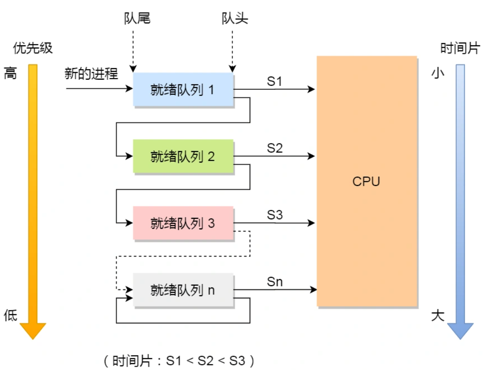

工作流程：

- 设置了多个队列，赋予每个队列不同的优先级，每个**队列优先级从高到低**，同时**优先级越高时间片越短**；
- 新的进程会被放入到第一级队列的末尾，按先来先服务的原则排队等待被调度，如果在第一级队列规定的时间片没运行完成，则将其转入到第二级队列的末尾，以此类推，直至完成；
- 当较高优先级的队列为空，才调度较低优先级的队列中的进程运行。如果进程运行时，有新进程进入较高优先级的队列，则停止当前运行的进程并将其移入到原队列末尾，接着让较高优先级的进程运行；

可以发现，对于短作业可能可以在第一级队列很快被处理完。对于长作业，如果在第一级队列处理不完，可以移入下次队列等待被执行，虽然等待的时间变长了，但是运行时间也变更长了，所以该算法很好的**兼顾了长短作业，同时有较好的响应时间。**

### 3、进程间通信

#### 0. 背景

每个进程的用户地址 空间都是独立的，一般而言是不能互相访问的，但内核空间是每个进程都共享的，所以进程之间要通信必须通过内核。


Linux内核提供了很多进程之间通信的机制：

#### 1. 管道

对于Linux命令 `ps auxf | grep mysql` 中的 `|` 就是一个**管道**，它的功能是将前一个命令（`ps auxf`）的输出，作为后一个命令（`grep mysql`）的输入，从这功能描述，可以看出**管道传输数据是单向的**，如果想相互通信，我们需要创建两个管道才行。

同时，我们得知上面这种管道是没有名字，所以 `|` 表示的管道称为**匿名管道**，用完了就销毁。

管道还有另外一个类型是**命名管道**，也被叫做 `FIFO`，因为数据是先进先出的传输方式。

在使用命名管道前，先需要通过 `mkfifo` 命令来创建，并且指定管道名字 `mkfifo myPipe` , myPipe 就是管道的名称，基于 Linux 一切皆文件的理念，所以管道也是以**文件**的方式存在，我们可以用 ls 看一下，这个文件的类型是 p，也就是 pipe（管道） 的意思：

```shell
$ ls -l
prw-r--r--. 1 root    root         0 Jul 17 02:45 myPipe
```

往myPipe管道中输入数据

```sh
$ echo "hello" > myPipe  // 将数据写进管道
                         // 停住了 ...
```

操作完后，会发现命令执行后就停在这了，这是因为管道里的内容没有被读取，只有当管道里的数据被读完后，命令才可以正常退出。

于是，我们执行另外一个命令来读取这个管道里的数据：

```sh
$ cat < myPipe  // 读取管道里的数据
hello
```

可以看到，管道里的内容被读取出来了，并打印在了终端上，另外一方面，echo 那个命令也正常退出了。

我们可以看出，**管道这种通信方式效率低，不适合进程间频繁地交换数据**。当然，它的好处，自然就是简单，同时也我们很容易得知管道里的数据已经被另一个进程读取了。

> 那管道如何创建呢，背后原理是什么？

```c++
// 创建匿名管道，需要如下的系统调用
int pipe(int fd[2]);
```

这里表示创建一个匿名管道，并返回了两个描述符，一个是管道的读取端描述符 `fd[0]`，另一个是管道的写入端描述符 `fd[1]`。注意，这个匿名管道是特殊的文件，只存在于内存，不存于文件系统中。


其实，**所谓的管道，就是内核里面的一串缓存**。从管道的一端写入的数据，实际上是缓存在内核中的；另一端读取，也就是从内核中读取这段数据。另外，**管道传输的数据是无格式的流且大小受限**。

**但是这两个描述符都是在一个进程里面，并没有起到进程间通信的作用，怎么样才能使得管道是跨过两个进程的呢？**

我们可以使用 `fork` 创建子进程，**创建的子进程会复制父进程的文件描述符**，这样就做到了两个进程各有两个 `fd[0]` 与 `fd[1]`，两个进程就可以通过各自的 fd 写入和读取同一个管道文件实现跨进程通信了。


管道只能一端写入，另一端读出，所以上面这种模式容易造成混乱，因为父进程和子进程都可以同时写入，也都可以读出。那么，为了避免这种情况，通常的做法是：

- 父进程关闭读取的 fd[0]，只保留写入的 fd[1]；
- 子进程关闭写入的 fd[1]，只保留读取的 fd[0]；


所以说如果需要双向通信，则应该创建两个管道。

到这里，我们解析了使用管道进行父进程与子进程之间的通信，但是在我们 shell 里面并不是这样的。

在 shell 里面执行 `A | B`命令的时候，A 进程和 B 进程都是 shell 创建出来的子进程，A 和 B 之间不存在父子关系，它俩的父进程都是 shell。


所以说，在 shell 里通过`|`匿名管道将多个命令连接在一起，实际上也就是创建了多个子进程，那么编写 shell 脚本时，能使用一个管道搞定的事情，就不要多用一个管道，这样可以减少创建子进程的系统开销。

我们可以得知，**对于匿名管道，它的通信范围是存在父子关系的进程**。因为管道没有实体，也就是没有管道文件，只能通过 fork 来复制父进程 fd 文件描述符，来达到通信的目的。

另外，**对于命名管道，它可以在不相关的进程间也能相互通信**。因为命名管道，提前创建了一个类型为管道的设备文件，在进程里只要使用这个设备文件，就可以相互通信。

不管是匿名管道还是命名管道，进程写入的数据都是缓存在内核中，另一个进程读取数据时候自然也是从内核中获取，同时通信数据都遵循**先进先出**原则，不支持 lseek 之类的文件定位操作。

总结：

匿名管道（内存文件）：管道是一种半双工的通信方式，数据只能单向流动，而且只能在具有亲缘关系的进程之间使用。进程的亲缘关系通常是指父子进程关系。

有名管道（FIFO文件，借助文件系统）：有名管道也是半双工的通信方式，但是允许在没有亲缘关系的进程之间使用，管道是先进先出的通信方式。

#### 2. 消息队列

背景：因为管道的通信方式是效率低的，因此管道不适合进程间频繁地交换数据。

① 消息队列，是消息的连接表，存放在内核中。⼀个消息队列由⼀个标识符来标识；

② 消息队列是⾯向记录的，其中的消息具有特定的格式以及特定的优先级；

③ 消息队列独⽴于发送与接收进程。消息队列生命周期随内核，如果没有释放消息队列或者没有关闭操作系统，消息队列会一直存在，而前面提到的匿名管道的生命周期，是随进程的创建而建立，随进程的结束而销毁；

④ 消息队列可以实现消息的随机查询。

缺点：**一是通信不及时，二是附件也有大小限制**

① **消息队列不适合比较大数据的传输**，因为在内核中每个消息体都有一个最大长度的限制，同时所有队列所包含的全部消息体的总长度也是有上限。在 Linux 内核中，会有两个宏定义 `MSGMAX` 和 `MSGMNB`，它们以字节为单位，分别定义了一条消息的最大长度和一个队列的最大长度。

② **消息队列通信过程中，存在用户态与内核态之间的数据拷贝开销**，因为进程写入数据到内核中的消息队列时，会发生从用户态拷贝数据到内核态的过程，同理另一进程读取内核中的消息数据时，会发生从内核态拷贝数据到用户态的过程。

#### 3. 共享内存

背景：消息队列的读取和写入的过程，都会有发生用户态与内核态之间的消息拷贝过程。那**共享内存**的方式，就很好的解决了这一问题。

现代操作系统，对于内存管理，采用的是虚拟内存技术，也就是每个进程都有自己独立的虚拟内存空间，不同进程的虚拟内存映射到不同的物理内存中。所以，即使进程 A 和 进程 B 的虚拟地址是一样的，其实访问的是不同的物理内存地址，对于数据的增删查改互不影响。

**共享内存的机制，就是拿出一块虚拟地址空间来，映射到相同的物理内存中**。这样这个进程写入的东西，另外一个进程马上就能看到了，都不需要拷贝来拷贝去，传来传去，大大提高了进程间通信的速度。

① 共享内存，指两个或多个进程共享⼀个给定的存储区；

② 共享内存是最快的⼀种进程通信⽅式，因为进程是直接对内存进⾏存取；

③ 因为多个进程可以同时操作，所以需要进⾏同步；

④ 信号量+共享内存通常结合在⼀起使⽤。

#### 4. 信号量

背景：

用了共享内存通信方式，带来新的问题，那就是如果多个进程同时修改同一个共享内存，很有可能就冲突了。例如两个进程都同时写一个地址，那先写的那个进程会发现内容被别人覆盖了。

为了防止多进程竞争共享资源，而造成的数据错乱，所以需要保护机制，使得共享的资源在任意时刻只能被一个进程访问。正好，**信号量**就实现了这一保护机制。

概念：

**信号量其实是一个整型的计数器，主要用于实现进程间的互斥与同步，而不是用于缓存进程间通信的数据**。

信号量表示**资源的数量**，控制信号量的方式有两种原子操作：

- 一个是 **P 操作**，这个操作会把信号量减去 1，相减后如果信号量 < 0，则表明资源已被占用，进程需阻塞等待；相减后如果信号量 >= 0，则表明还有资源可使用，进程可正常继续执行。
- 另一个是 **V 操作**，这个操作会把信号量加上 1，相加后如果信号量 <= 0，则表明当前有阻塞中的进程，于是会将该进程唤醒运行；相加后如果信号量 > 0，则表明当前没有阻塞中的进程；

P 操作是用在进入共享资源之前，V 操作是用在离开共享资源之后，这两个操作是必须成对出现的。

举例：

如果要使得两个进程互斥访问共享内存，我们可以初始化信号量为 `1`。

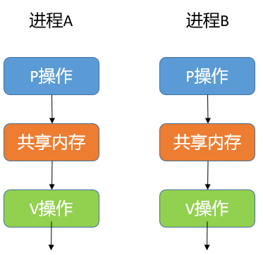

具体的过程如下：

> - 进程 A 在访问共享内存前，先执行了 P 操作，由于信号量的初始值为 1，故在进程 A 执行 P 操作后信号量变为 0，表示共享资源可用，于是进程 A 就可以访问共享内存。
> - 若此时，进程 B 也想访问共享内存，执行了 P 操作，结果信号量变为了 -1，这就意味着临界资源已被占用，因此进程 B 被阻塞。
> - 直到进程 A 访问完共享内存，才会执行 V 操作，使得信号量恢复为 0，接着就会唤醒阻塞中的线程 B，使得进程 B 可以访问共享内存，最后完成共享内存的访问后，执行 V 操作，使信号量恢复到初始值 1。

可以发现，信号初始化为 `1`，就代表着是**互斥信号量**，它可以保证共享内存在任何时刻只有一个进程在访问，这就很好的保护了共享内存。

另外，在多进程里，每个进程并不一定是顺序执行的，它们基本是以各自独立的、不可预知的速度向前推进，但有时候我们又希望多个进程能密切合作，以实现一个共同的任务。

例如，进程 A 是负责生产数据，而进程 B 是负责读取数据，这两个进程是相互合作、相互依赖的，进程 A 必须先生产了数据，进程 B 才能读取到数据，所以执行是有前后顺序的。

那么这时候，就可以用信号量来实现多进程同步的方式，我们可以初始化信号量为 `0`。


具体过程：

> - 如果进程 B 比进程 A 先执行了，那么执行到 P 操作时，由于信号量初始值为 0，故信号量会变为 -1，表示进程 A 还没生产数据，于是进程 B 就阻塞等待；
> - 接着，当进程 A 生产完数据后，执行了 V 操作，就会使得信号量变为 0，于是就会唤醒阻塞在 P 操作的进程 B；
> - 最后，进程 B 被唤醒后，意味着进程 A 已经生产了数据，于是进程 B 就可以正常读取数据了。

可以发现，信号初始化为 `0`，就代表着是**同步信号量**，它可以保证进程 A 应在进程 B 之前执行

总结：

① 信号量是⼀个计数器，信号ᰁ⽤于实现进程间的互斥与同步，⽽不是⽤于存储进程间通信数据；

② 信号量⽤于进程间同步，若要在进程间传递数据需要结合共享内存；

③ 信号量基于操作系统的PV操作，程序对信号量的操作都是**原⼦操作**；

#### 5. 信号

上面说的进程间通信，都是常规状态下的工作模式。**对于异常情况下的工作模式，就需要用「信号」的方式来通知进程。**

信号跟信号量虽然名字相似度 66.66%，但两者用途完全不一样，就好像 Java 和 JavaScript 的区别。

在 Linux 操作系统中， 为了响应各种各样的事件，提供了几十种信号，分别代表不同的意义。我们可以通过 `kill -l` 命令，查看所有的信号：

```sh
$ kill -l
 1) SIGHUP       2) SIGINT       3) SIGQUIT      4) SIGILL       5) SIGTRAP
 6) SIGABRT      7) SIGBUS       8) SIGFPE       9) SIGKILL     10) SIGUSR1
11) SIGSEGV     12) SIGUSR2     13) SIGPIPE     14) SIGALRM     15) SIGTERM
16) SIGSTKFLT   17) SIGCHLD     18) SIGCONT     19) SIGSTOP     20) SIGTSTP
21) SIGTTIN     22) SIGTTOU     23) SIGURG      24) SIGXCPU     25) SIGXFSZ
26) SIGVTALRM   27) SIGPROF     28) SIGWINCH    29) SIGIO       30) SIGPWR
31) SIGSYS      34) SIGRTMIN    35) SIGRTMIN+1  36) SIGRTMIN+2  37) SIGRTMIN+3
38) SIGRTMIN+4  39) SIGRTMIN+5  40) SIGRTMIN+6  41) SIGRTMIN+7  42) SIGRTMIN+8
43) SIGRTMIN+9  44) SIGRTMIN+10 45) SIGRTMIN+11 46) SIGRTMIN+12 47) SIGRTMIN+13
48) SIGRTMIN+14 49) SIGRTMIN+15 50) SIGRTMAX-14 51) SIGRTMAX-13 52) SIGRTMAX-12
53) SIGRTMAX-11 54) SIGRTMAX-10 55) SIGRTMAX-9  56) SIGRTMAX-8  57) SIGRTMAX-7
58) SIGRTMAX-6  59) SIGRTMAX-5  60) SIGRTMAX-4  61) SIGRTMAX-3  62) SIGRTMAX-2
63) SIGRTMAX-1  64) SIGRTMAX
```

运行在 shell 终端的进程，我们可以通过键盘输入某些组合键的时候，给进程发送信号。例如

- Ctrl+C 产生 `SIGINT` 信号，表示终止该进程；
- Ctrl+Z 产生 `SIGTSTP` 信号，表示停止该进程，但还未结束；

如果进程在后台运行，可以通过 `kill` 命令的方式给进程发送信号，但前提需要知道运行中的进程 PID 号，例如：

- kill -9 1050 ，表示给 PID 为 1050 的进程发送 `SIGKILL` 信号，用来立即结束该进程；

所以，信号事件的来源主要有硬件来源（如键盘 Cltr+C ）和软件来源（如 kill 命令）。

信号是进程间通信机制中**唯一的异步通信机制**，因为可以在任何时候发送信号给某一进程，一旦有信号产生，我们就有下面这几种，用户进程对信号的处理方式。

**1.执行默认操作**。Linux 对每种信号都规定了默认操作，例如，上面列表中的 SIGTERM 信号，就是终止进程的意思。

**2.捕捉信号**。我们可以为信号定义一个信号处理函数。当信号发生时，我们就执行相应的信号处理函数。

**3.忽略信号**。当我们不希望处理某些信号的时候，就可以忽略该信号，不做任何处理。有两个信号是应用进程无法捕捉、忽略和阻塞的，即 `SIGKILL` 和 `SIGSTOP`，它们只能执行默认动作，用于在任何时候中断或结束某一进程。

#### 6. Socket

背景：

前面提到的管道、消息队列、共享内存、信号量和信号都是在同一台主机上进行进程间通信，那要想**跨网络与不同主机上的进程之间通信，就需要 Socket 通信了。**

实际上，Socket 通信不仅可以跨网络与不同主机的进程间通信，还可以在同主机上进程间通信。

```C++
// 创建Socket的系统调用
int socket(int domain, int type, int protocal);
```

三个参数分别代表：

> - domain 参数用来指定协议族，比如 AF_INET 用于 IPV4、AF_INET6 用于 IPV6、AF_LOCAL/AF_UNIX 用于本机；
> - type 参数用来指定通信特性，比如 SOCK_STREAM 表示的是字节流，对应 TCP、SOCK_DGRAM 表示的是数据报，对应 UDP、SOCK_RAW 表示的是原始套接字；
> - protocal 参数原本是用来指定通信协议的，但现在基本废弃。因为协议已经通过前面两个参数指定完成，protocol 目前一般写成 0 即可；

根据创建 socket 类型的不同，通信的方式也就不同：

> - 实现 TCP 字节流通信： socket 类型是 AF_INET 和 SOCK_STREAM；
> - 实现 UDP 数据报通信：socket 类型是 AF_INET 和 SOCK_DGRAM；
> - 实现本地进程间通信： 「本地字节流 socket 」类型是 AF_LOCAL 和 SOCK_STREAM，「本地数据报 socket 」类型是 AF_LOCAL 和 SOCK_DGRAM。另外，AF_UNIX 和 AF_LOCAL 是等价的，所以 AF_UNIX 也属于本地 socket；

三种通信的编程模式：

> 针对 TCP 协议通信的 socket 编程模型


- 服务端和客户端初始化 `socket`，得到文件描述符；
- 服务端调用 `bind`，将绑定在 IP 地址和端口;
- 服务端调用 `listen`，进行监听；
- 服务端调用 `accept`，等待客户端连接；
- 客户端调用 `connect`，向服务器端的地址和端口发起连接请求；
- 服务端 `accept` 返回用于传输的 `socket` 的文件描述符；
- 客户端调用 `write` 写入数据；服务端调用 `read` 读取数据；
- 客户端断开连接时，会调用 `close`，那么服务端 `read` 读取数据的时候，就会读取到了 `EOF`，待处理完数据后，服务端调用 `close`，表示连接关闭。

这里需要注意的是，服务端调用 `accept` 时，连接成功了会返回一个已完成连接的 socket，后续用来传输数据。

所以，监听的 socket 和真正用来传送数据的 socket，是「**两个**」 socket，一个叫作**监听 socket**，一个叫作**已完成连接 socket**。

成功连接建立之后，双方开始通过 read 和 write 函数来读写数据，就像往一个文件流里面写东西一样。

> 针对 UDP 协议通信的 socket 编程模型


UDP 是没有连接的，所以不需要三次握手，也就不需要像 TCP 调用 listen 和 connect，但是 UDP 的交互仍然需要 IP 地址和端口号，因此也需要 bind。

对于 UDP 来说，不需要维护连接，那么也就没有所谓的发送方和接收方，甚至都不存在客户端和服务端的概念，只要有一个 socket 多台机器就可以任意通信，因此每一个 UDP 的 socket 都需要 bind。

另外，每次通信时，调用 sendto 和 recvfrom，都要传入目标主机的 IP 地址和端口

> 针对本地进程间通信的 socket 编程模型

本地 socket 被用于在**同一台主机上进程间通信**的场景：

- 本地 socket 的编程接口和 IPv4 、IPv6 套接字编程接口是一致的，可以支持「字节流」和「数据报」两种协议；
- 本地 socket 的实现效率大大高于 IPv4 和 IPv6 的字节流、数据报 socket 实现；

对于本地字节流 socket，其 socket 类型是 AF_LOCAL 和 SOCK_STREAM。

对于本地数据报 socket，其 socket 类型是 AF_LOCAL 和 SOCK_DGRAM。

本地字节流 socket 和 本地数据报 socket 在 bind 的时候，不像 TCP 和 UDP 要绑定 IP 地址和端口，而是**绑定一个本地文件**，这也就是它们之间的最大区别。

#### 总结

由于每个进程的用户空间都是独立的，不能相互访问，这时就需要借助内核空间来实现进程间通信，原因很简单，每个进程都是共享一个内核空间。

Linux 内核提供了不少进程间通信的方式，其中最简单的方式就是管道，管道分为「匿名管道」和「命名管道」。

**匿名管道**顾名思义，它没有名字标识，匿名管道是特殊文件只存在于内存，没有存在于文件系统中，shell 命令中的「`|`」竖线就是匿名管道，通信的数据是**无格式的流并且大小受限**，通信的方式是**单向**的，数据只能在一个方向上流动，如果要双向通信，需要创建两个管道，再来**匿名管道是只能用于存在父子关系的进程间通信**，匿名管道的生命周期随着进程创建而建立，随着进程终止而消失。

**命名管道**突破了匿名管道只能在亲缘关系进程间的通信限制，因为使用命名管道的前提，需要在文件系统创建一个类型为 p 的设备文件，那么毫无关系的进程就可以通过这个设备文件进行通信。另外，不管是匿名管道还是命名管道，进程写入的数据都是**缓存在内核**中，另一个进程读取数据时候自然也是从内核中获取，同时通信数据都遵循**先进先出**原则，不支持 lseek 之类的文件定位操作。

**消息队列**克服了管道通信的数据是无格式的字节流的问题，消息队列实际上是保存在内核的「消息链表」，消息队列的消息体是可以用户自定义的数据类型，发送数据时，会被分成一个一个独立的消息体，当然接收数据时，也要与发送方发送的消息体的数据类型保持一致，这样才能保证读取的数据是正确的。消息队列通信的速度不是最及时的，毕竟**每次数据的写入和读取都需要经过用户态与内核态之间的拷贝过程。**

**共享内存**可以解决消息队列通信中用户态与内核态之间数据拷贝过程带来的开销，**它直接分配一个共享空间，每个进程都可以直接访问**，就像访问进程自己的空间一样快捷方便，不需要陷入内核态或者系统调用，大大提高了通信的速度，享有**最快**的进程间通信方式之名。但是便捷高效的共享内存通信，**带来新的问题，多进程竞争同个共享资源会造成数据的错乱。**

那么，就需要**信号量**来保护共享资源，以确保任何时刻只能有一个进程访问共享资源，这种方式就是互斥访问。**信号量不仅可以实现访问的互斥性，还可以实现进程间的同步**，信号量其实是一个计数器，表示的是资源个数，其值可以通过两个原子操作来控制，分别是 **P 操作和 V 操作**。

与信号量名字很相似的叫**信号**，它俩名字虽然相似，但功能一点儿都不一样。信号是**异步通信机制**，信号可以在应用进程和内核之间直接交互，内核也可以利用信号来通知用户空间的进程发生了哪些系统事件，信号事件的来源主要有硬件来源（如键盘 Cltr+C ）和软件来源（如 kill 命令），一旦有信号发生，**进程有三种方式响应信号 1. 执行默认操作、2. 捕捉信号、3. 忽略信号**。有两个信号是应用进程无法捕捉和忽略的，即 `SIGKILL` 和 `SIGSTOP`，这是为了方便我们能在任何时候结束或停止某个进程。

前面说到的通信机制，都是工作于同一台主机，如果**要与不同主机的进程间通信，那么就需要 Socket 通信了**。Socket 实际上不仅用于不同的主机进程间通信，还可以用于本地主机进程间通信，可根据创建 Socket 的类型不同，分为三种常见的通信方式，一个是基于 TCP 协议的通信方式，一个是基于 UDP 协议的通信方式，一个是本地进程间通信方式。

#### 另-线程通信间的方式

同个进程下的线程之间都是共享进程的资源，只要是共享变量都可以做到线程间通信，比如全局变量，所以对于线程间关注的不是通信方式，而是关注多线程竞争共享资源的问题，信号量也同样可以在线程间实现互斥与同步：

- 互斥的方式，可保证任意时刻只有一个线程访问共享资源；
- 同步的方式，可保证线程 A 应在线程 B 之前执行；

#### 另-子进程和父进程之间的通信

1) 在 Linux 系统中实现⽗⼦进程的通信可以采⽤ pipe() 和 fork() 函数进⾏实现；

2) 对于⽗⼦进程，在程序运⾏时⾸先进⼊的是⽗进程，其次是⼦进程，在此我个⼈认为，在创建⽗⼦进程的时候程序是先运⾏创建的程序，其次在复制⽗进程创建⼦进程。fork() 函数主要是以⽗进程为蓝本复制⼀个进程，其 ID 号和⽗进程的 ID 号不同。对于结果 fork出来的⼦进程的⽗进程 ID 号是执⾏ fork() 函数的进程的 ID 号。

3) 管道：是指⽤于连接⼀个读进程和⼀个写进程，以实现它们之间通信的共享⽂件，⼜称 pipe ⽂件。

4) 写进程在管道的尾端写入数据，读进程在管道的首端读出数据。


## 3. 线程相关的问题

### 0. 线程产生的背景

> 需要有一种新的实体，满足以下特性：
>
> - 实体之间可以并发运行；
> - 实体之间共享相同的地址空间；
>
> 这个新的实体，就是**线程( Thread )**，线程之间可以并发运行且共享相同的地址空间。

### 1. 线程的概念

**线程是进程当中的一条执行流程。**

同一个进程内多个线程之间可以**共享代码段、数据段、打开的文件等资源**，但每个线程各自都有**一套独立的寄存器和栈**，这样可以确保线程的**控制流**是相对独立的。

> 线程的优缺点

线程的优点：

- 一个进程中可以同时存在多个线程；
- 各个线程之间可以并发执行；
- 各个线程之间可以共享地址空间和文件等资源；

线程的缺点：

- 当进程中的一个线程崩溃时，会导致其所属进程的所有线程崩溃（这里是针对 C/C++ 语言，Java语言中的线程崩溃不会造成进程崩溃）

### 2. 线程间通信 


>  Linux下的线程通信

信号：类似进程间的信号处理

锁机制：互斥锁、读写锁和自旋锁

条件变量：使用通知的方式解锁，与互斥锁配合使用

信号量：包括无名线程信号量和命名线程信号量

> windows下的线程通信

全局变量：需要有多个线程来访问一个全局变量时，通常我们会在这个全局变量前加上volatile声明，以防编译器对此变量进行优化

Message消息机制：常用的Message通信的接口主要有两个：PostMessage和PostThreadMessage，PostMessage为线程向主窗口发送消息。而PostThreadMessage是任意两个线程之间的通信接口。

CEvent对象：CEvent为MFC中的一个对象，可以通过对CEvent的触发状态进行改变，从而实现线程间的通信和同步，这个主要是实现线程直接同步的一种方法。

### 3. 线程会共享内存吗

**⼀个进程中的所有线程共享该进程的地址空间，但它们有各⾃独⽴的 / 私有的 栈(stack)**，Windows 线程的缺省堆栈⼤⼩为1M。堆(heap)的分配与栈有所不同，⼀般是⼀个进程有⼀个C运⾏时堆，这个**堆为本进程中所有线程共享**，windows 进程还有所谓进程默认堆，⽤户也可以创建⾃⼰的堆。


| 进程共享 | 进程私有 | 线程共享 |  线程私有  |
| :------: | :------: | :------: | :--------: |
|  代码段  | 地址空间 |    堆    |   线程栈   |
| 公共数据 |    堆    | 地址空间 |   寄存器   |
| 进程目录 | 全局变量 | 全局变量 | 程序计数器 |
|  进程ID  |    栈    | 静态变量 |   状态字   |
|          |  寄存器  |          |            |

### 4. 线程池的状态，设计思路

### 5. 线程与进程的比较

1) 进程是资源（包括内存、打开的文件等）分配的单位，线程是 CPU 调度的基本单位；
2) 同⼀进程的线程共享本进程的地址空间，⽽进程之间则是独⽴的地址空间；
3) 同⼀进程内的线程共享本进程的资源，但是进程之间的资源是独⽴的；
4) ⼀个进程崩溃后，在保护模式下不会对其他进程产⽣影响，但是⼀个线程崩溃整个进程崩溃，所以多进程⽐多线程健壮；
5) 进程切换，消耗的资源⼤。所以涉及到频繁的切换，使⽤线程要好于进程；
6) 两者均可并发执⾏；
7) 每个独⽴的进程有⼀个程序的⼊⼝、程序出⼝。但是线程不能独⽴执⾏，必须依存在应⽤程序中，由应⽤程序提供多个线程执⾏控制。

对于线程相比进程能减少开销，体现在：

- 线程的创建时间比进程快，因为进程在创建的过程中，还需要资源管理信息，比如内存管理信息、文件管理信息，而线程在创建的过程中，不会涉及这些资源管理信息，而是共享它们；
- 线程的终止时间比进程快，因为线程释放的资源相比进程少很多；
- 同一个进程内的线程切换比进程切换快，因为线程具有相同的地址空间（虚拟内存共享），这意味着同一个进程的线程都具有同一个页表，那么在切换的时候不需要切换页表。而对于进程之间的切换，切换的时候要把页表给切换掉，而页表的切换过程开销是比较大的；
- 由于同一进程的各线程间共享内存和文件资源，那么在线程之间数据传递的时候，就不需要经过内核了，这就使得线程之间的数据交互效率更高了

### 6. 线程的上下文切换

线程与进程最大的区别在于：**线程是调度的基本单位，而进程则是资源拥有的基本单位**。所以，所谓操作系统的任务调度，实际上的**调度对象是线程**，而进程只是给线程提供了虚拟内存、全局变量等资源。

对于线程和进程之间的关系：

- 当进程只有一个线程时，可以认为进程就等于线程；
- 当进程拥有多个线程时，这些线程会共享相同的虚拟内存和全局变量等资源，这些资源在上下文切换时是不需要修改的；

 另外线程也有自己的私有数据，比如栈和寄存器等，这些在上下文切换时也是需要保存的

> 线程的上下文切换

这还得看线程是不是属于同一个进程：

- 当两个线程不是属于同一个进程，则切换的过程就跟进程上下文切换一样；
- **当两个线程是属于同一个进程，因为虚拟内存是共享的，所以在切换时，虚拟内存这些资源就保持不动，只需要切换线程的私有数据、寄存器等不共享的数据**；

所以线程的上下文切换开销要比进程小得多。

切换情况：保存和设置程序计数器、少量寄存器和栈的内容

切换者：操作系统

切换过程：用户态->内核态->用户态

### 7. 线程的实现

主要有三种线程的实现方式：

- **用户线程（\*User Thread\*）**：在用户空间实现的线程，不是由内核管理的线程，是由用户态的线程库来完成线程的管理；
- **内核线程（\*Kernel Thread\*）**：在内核中实现的线程，是由内核管理的线程；
- **轻量级进程（\*LightWeight Process\*）**：在内核中来支持用户线程；

### 8. 线程回收的方式

1. 等待线程结束 `int pthread_join(pthread_t id, void** retval)`

**主线程调用**，等待子线程退出并回收其资源，类似于进程中wait/waitpid回收僵尸进程，调用pthread_join的线程会被阻塞。

- tid：创建线程时通过指针得到tid值。
- retval：指向返回值的指针

2. 结束线程 `pthread_exit(void** retval)`

**子线程执行**，用来结束当前线程并通过retval传递返回值，该返回值可通过pthread_join获得。

3. 分离线程 `int pthread_detach(pthread_t tid)`

**主线程、子线程均可调用**。主线程中pthread_detach(tid)，子线程中pthread_detach(pthread_self())，调用后和主线程分离，子线程结束时自己立即回收资源。

## 4. 多线程的冲突与解决

### 0. 背景

在单核 CPU 系统里，为了实现多个程序同时运行的假象，操作系统通常以时间片调度的方式，让每个进程执行每次执行一个时间片，时间片用完了，就切换下一个进程运行，由于这个时间片的时间很短，于是就造成了**并发**的现象。


另外，操作系统也为每个进程创建巨大、私有的虚拟内存的假象，这种地址空间的抽象让每个程序好像拥有自己的内存，而实际上操作系统在背后秘密地让多个地址空间「复用」物理内存或者磁盘。


如果一个程序只有一个执行流程，也代表它是单线程的。当然一个程序可以有多个执行流程，也就是所谓的多线程程序，线程是调度的基本单位，进程则是资源分配的基本单位。

所以，线程之间是可以共享进程的资源，比如代码段、堆空间、数据段、打开的文件等资源，但每个线程都有自己独立的栈空间。


那么问题就来了，多个线程如果竞争共享资源，如果不采取有效的措施，则会造成共享数据的混乱。

> 做个实验验证，创建两个线程，它们分别对共享变量 `i` 自增 `1` 执行 `10000` 次，如下代码：

```c++
# include<iostream>
# include<thread>
using namespace std;

int i = 0;      // 共享数据
// 线程函数--对共享变量i自增执行1w次
void test () {
    int num = 10000;
    for (int n = 0; n < num; n++) i = i + 1;
}

int main() {
    cout << "start all threads" << endl;

    // 创建线程
    thread thread_test1(test);
    thread thread_test2(test);

    // 等待线程执行完成
    thread_test1.join();
    thread_test2.join();

    cout << "all threads joined" << endl;
    cout << "now i = " << i << endl;
    return 0;
}
```

程序最终结果可能会出现i = 20000，但是也有可能出现其他未知结果。

> 为什么会出现这种结果？

对于给i加1的汇编指令的执行过程是这样的：


可以发现，只是单纯给 `i` 加上数字 1，在 CPU 运行的时候，实际上要执行 `3` 条指令。

设想我们的线程 1 进入这个代码区域，它将 i 的值（假设此时是 50 ）从内存加载到它的寄存器中，然后它向寄存器加 1，此时在寄存器中的 i 值是 51。

现在，一件不幸的事情发生了：**时钟中断发生**。因此，操作系统将当前正在运行的线程的状态保存到线程的线程控制块 TCB。

现在更糟的事情发生了，线程 2 被调度运行，并进入同一段代码。它也执行了第一条指令，从内存获取 i 值并将其放入到寄存器中，此时内存中 i 的值仍为 50（因为线程1执行+1操作后结果还在寄存器中没有保存到内存中），因此线程 2 寄存器中的 i 值也是 50。假设线程 2 执行接下来的两条指令，将寄存器中的 i 值 + 1，然后将寄存器中的 i 值保存到内存中，于是此时全局变量 i 值是 51。

最后，又发生一次上下文切换，线程 1 恢复执行。还记得它已经执行了两条汇编指令，现在准备执行最后一条指令。回忆一下， 线程 1 寄存器中的 i 值是51，因此，执行最后一条指令后，将值保存到内存，全局变量 i 的值再次被设置为 51。

简单来说，增加 i （值为 50 ）的代码被运行两次，按理来说，最后的 i 值应该是 52，但是由于**不可控的调度**，导致最后 i 值却是 51。

### 1. 竞争与协作

#### 1.1 互斥

上面展示的情况称为**竞争条件（\*race condition\*）**，当多线程相互竞争操作共享变量时，由于运气不好，即在执行过程中发生了上下文切换，我们得到了错误的结果，事实上，每次运行都可能得到不同的结果，因此输出的结果存在**不确定性（\*indeterminate\*）**

由于多线程执行操作共享变量的这段代码可能会导致竞争状态，因此我们将此段代码称为**临界区（\*critical section\*），它是访问共享资源的代码片段，一定不能给多线程同时执行。**

我们希望这段代码是**互斥（\*mutualexclusion\*）的，也就说保证一个线程在临界区执行时，其他线程应该被阻止进入临界区**，说白了，就是这段代码执行过程中，最多只能出现一个线程。


另外，说一下互斥也并不是只针对多线程。在多进程竞争共享资源的时候，也同样是可以使用互斥的方式来避免资源竞争造成的资源混乱。

#### 1.2 同步

互斥解决了并发进程/线程对临界区的使用问题。这种基于临界区控制的交互作用是比较简单的，只要一个进程/线程进入了临界区，其他试图想进入临界区的进程/线程都会被阻塞着，直到第一个进程/线程离开了临界区。

我们都知道在多线程里，每个线程并不一定是顺序执行的，它们基本是以各自独立的、不可预知的速度向前推进，但有时候我们又希望多个线程能密切合作，以实现一个共同的任务。

例子，线程 1 是负责读入数据的，而线程 2 是负责处理数据的，这两个线程是相互合作、相互依赖的。线程 2 在没有收到线程 1 的唤醒通知时，就会一直阻塞等待，当线程 1 读完数据需要把数据传给线程 2 时，线程 1 会唤醒线程 2，并把数据交给线程 2 处理。

**所谓同步，就是并发进程/线程在一些关键点上可能需要互相等待与互通消息，这种相互制约的等待与互通信息称为进程/线程同步**。

注意，同步与互斥是两种不同的概念：

- 同步就好比：「操作 A 应在操作 B 之前执行」，「操作 C 必须在操作 A 和操作 B 都完成之后才能执行」等；
- 互斥就好比：「操作 A 和操作 B 不能在同一时刻执行」；


### 2. 互斥与同步的实现和使用

在进程/线程并发执行的过程中，进程/线程之间存在协作的关系，例如有互斥、同步的关系。

为了实现进程/线程间正确的协作，操作系统必须提供实现进程协作的措施和方法，主要的方法有两种：

- *锁*：加锁、解锁操作；
- *信号量*：P、V 操作；

#### 2.1 锁机制

使用加锁操作和解锁操作可以解决并发线程/进程的互斥问题。

任何想进入临界区的线程，必须先执行加锁操作。若加锁操作顺利通过，则线程可进入临界区；在完成对临界资源的访问后再执行解锁操作，以释放该临界资源。


根据锁的实现不同，可以分为「忙等待锁」和「无忙等待锁」。

在说明「忙等待锁」的实现之前，先介绍现代 CPU 体系结构提供的特殊**原子操作指令 —— 测试和置位（\*Test-and-Set\*）指令**。

如果用 C 代码表示 Test-and-Set 指令，形式如下：

```C++
int TestAndSet(int* old_ptr, int new) {
	int old = *old_ptr;
	*old_ptr = new;
	return old;
}
```

测试并设置指令做了下述事情:

- 把 `old_ptr` 更新为 `new` 的新值
- 返回 `old_ptr` 的旧值；

当然，**关键是这些代码是原子执行**。因为既可以测试旧值，又可以设置新值，所以我们把这条指令叫作「测试并设置」。

那什么是原子操作呢？**原子操作就是要么全部执行，要么都不执行，不能出现执行到一半的中间状态**

> 忙等待锁

```C++
// 忙等待锁的实现
typedef struct lock_t {
    int flag;
} lock_t;

void intit(lock_t * lock) {
    lock->flag = 0;
}

void lock(lock_t * lock) {
    while (TestAndSet(&lock->flag, 1) == 1)
        ;	// do nothing
}

void unlock(lock_t * lock) {
    lock->flag = 0;
}
```

工作原理：

- 第一个场景是，首先假设一个线程在运行，调用 `lock()`，没有其他线程持有锁，所以 `flag` 是 0。当调用 `TestAndSet(flag, 1)` 方法，返回 0，线程会跳出 while 循环，获取锁。同时也会原子的设置 flag 为1，标志锁已经被持有。当线程离开临界区，调用 `unlock()` 将 `flag` 清理为 0。
- 第二种场景是，当某一个线程已经持有锁（即 `flag` 为1）。本线程调用 `lock()`，然后调用 `TestAndSet(flag, 1)`，这一次返回 1。只要另一个线程一直持有锁，`TestAndSet()` 会重复返回 1，本线程会一直**忙等**。当 `flag` 终于被改为 0，本线程会调用 `TestAndSet()`，返回 0 并且原子的设置为 1，从而获得锁，进入临界区。

很明显，当获取不到锁时，线程就会一直 while 循环，不做任何事情，所以就被称为「忙等待锁」，也被称为**自旋锁（\*spin lock\*）**

这是最简单的一种锁，一直自旋，利用 CPU 周期，直到锁可用。在单处理器上，需要抢占式的调度器（即不断通过时钟中断一个线程，运行其他线程）。否则，自旋锁在单 CPU 上无法使用，因为一个自旋的线程永远不会放弃 CPU。

> 无等待锁

无等待锁顾明思议就是获取不到锁的时候，不用自旋。既然不想自旋，那当没获取到锁的时候，就把当前线程放入到锁的等待队列，然后执行调度程序，把 CPU 让给其他线程执行。

```C++
typedef struct lock_t {
    int flag;
    queue_t *q;     // 等待队列
} lock_t;

void init(lock_t* lock) {
    lock->flag = 0;
    queue_init(lock->q);
}

void lock(lock_t* lock) {
    while (TestAndSet(&lock->flag, 1) == 1) {
        // 保存现在运行线程TCB；
        // 将现在运行线程的TCB插入到等待队列；
        // 设置该线程为等待状态；
        // 调度程序；
    }
}

void unlock(lock_t* lock) {
    if (lock->q != nullptr) {
        // 移出等待队列的队头元素；
        // 将该线程的TCB插入就绪队列；
        // 设置该线程为就绪状态；
    }
    lock->flag = 0;
} 
```

#### 2.2 信号量

信号量是操作系统提供的一种协调共享资源访问的方法。

通常**信号量表示资源的数量**，对应的变量是一个整型（`sem`）变量。

另外，还有**两个原子操作的系统调用函数来控制信号量的**，分别是：

- *P 操作*：将 `sem` 减 `1`，相减后，如果 `sem < 0`，则进程/线程进入阻塞等待，否则继续，表明 P 操作可能会阻塞；
- *V 操作*：将 `sem` 加 `1`，相加后，如果 `sem <= 0`，唤醒一个等待中的进程/线程，表明 V 操作不会阻塞；

P 操作是用在进入临界区之前，V 操作是用在离开临界区之后，这两个操作是必须成对出现的。

> 操作系统是如何实现 PV 操作的呢？

```C++
// 信号量数据结构
type struct sem_t {
    int sem;	// 资源个数
    queue_t* q;	// 等待队列
} sem_t;
// 初始化信号量
void init(sem_t* s, int sem) {
    s->sem = sem;
    queue_init(s->q);
}
// P操作
void P(sem_t* s) {
    s->sem--;
    if (s->sem < 0) {
        // 1. 保留调用线程CPU现场；
        // 2. 将该线程的TCB插入s的等待队列；
        // 3. 设置该线程为等待状态；
        // 4. 执行调度程序
    }
}
// V操作
void V(sem_t* s) {
    s->sem++;
    if (s->sem <= 0) {
        // 1. 移出s等待队列队首元素
        // 2. 将该线程的TCB插入s的就绪队列；
        // 3. 设置该线程为就绪状态；
    }
}
```

PV 操作的函数是由操作系统管理和实现的，所以操作系统已经使得执行 PV 函数时是具有原子性的。

> PV 操作如何使用的呢？

信号量不仅可以实现临界区的互斥访问控制，还可以线程间的事件同步。

我们先来说说如何使用**信号量实现临界区的互斥访问**。

为每类共享资源设置一个信号量 `s`，其初值为 `1`，表示该临界资源未被占用。

只要把进入临界区的操作置于 `P(s)` 和 `V(s)` 之间，即可实现进程/线程互斥：


此时，任何想进入临界区的线程，必先在互斥信号量上执行 P 操作，在完成对临界资源的访问后再执行 V 操作。由于互斥信号量的初始值为 1，故在第一个线程执行 P 操作后 s 值变为 0，表示临界资源为空闲，可分配给该线程，使之进入临界区。

若此时又有第二个线程想进入临界区，也应先执行 P 操作，结果使 s 变为负值，这就意味着临界资源已被占用，因此，第二个线程被阻塞。

并且，直到第一个线程执行 V 操作，释放临界资源而恢复 s 值为 0 后，才唤醒第二个线程，使之进入临界区，待它完成临界资源的访问后，又执行 V 操作，使 s 恢复到初始值 1。

对于两个并发线程，互斥信号量的值仅取 1、0 和 -1 三个值，分别表示：

- 如果互斥信号量为 1，表示没有线程进入临界区；
- 如果互斥信号量为 0，表示有一个线程进入临界区；
- 如果互斥信号量为 -1，表示一个线程进入临界区，另一个线程等待进入。

通过互斥信号量的方式，就能保证临界区任何时刻只有一个线程在执行，就达到了互斥的效果。

再来，我们说说如何使用**信号量实现事件同步**。


同步的方式是设置一个信号量，其初值为 `0`。

拿「吃饭-做饭」同步的例子，用代码的方式实现一下：

```C++
semaphore s1 = 0;	// 表示不需要吃饭
semaphore s2 = 0;	// 表示饭还没做完

// 儿子线程函数
void son() {
    while(true) {
        // 肚子饿
        V(s1);	// 叫妈妈做饭
        P(s2);	// 等妈妈做完饭
    }
}
// 妈妈线程函数
void mom() {
    while(true) {
        P(s1);	// 询问需不需要做饭
        // 做饭
        V(s2);	// 做完饭，通知儿子吃饭
    }
}
```

妈妈一开始询问儿子要不要做饭时，执行的是 `P(s1)` ，相当于询问儿子需不需要吃饭，由于 `s1` 初始值为 0，此时 `s1` 变成 -1，表明儿子不需要吃饭，所以妈妈线程就进入等待状态。

当儿子肚子饿时，执行了 `V(s1)`，使得 `s1` 信号量从 -1 变成 0，表明此时儿子需要吃饭了，于是就唤醒了阻塞中的妈妈线程，妈妈线程就开始做饭。

接着，儿子线程执行了 `P(s2)`，相当于询问妈妈饭做完了吗，由于 `s2` 初始值是 0，则此时 `s2` 变成 -1，说明妈妈还没做完饭，儿子线程就等待状态。

最后，妈妈终于做完饭了，于是执行 `V(s2)`，`s2` 信号量从 -1 变回了 0，于是就唤醒等待中的儿子线程，唤醒后，儿子线程就可以进行吃饭了。

#### 2.3 生产者-消费者问题


生产者-消费者问题描述：

- **生产者**在生成数据后，放在一个缓冲区中；
- **消费者**从缓冲区取出数据处理；
- 任何时刻，**只能有一个**生产者或消费者可以访问缓冲区；

我们对问题分析可以得出：

- 任何时刻只能有一个线程操作缓冲区，说明操作缓冲区是临界代码，**需要互斥**；
- 缓冲区空时，消费者必须等待生产者生成数据；缓冲区满时，生产者必须等待消费者取出数据。说明生产者和消费者**需要同步**。

那么我们需要三个信号量，分别是：

- 互斥信号量 `mutex`：用于互斥访问缓冲区，初始化值为 1；
- 资源信号量 `fullBuffers`：用于消费者询问缓冲区是否有数据，有数据则读取数据，初始化值为 0（表明缓冲区一开始为空）；
- 资源信号量 `emptyBuffers`：用于生产者询问缓冲区是否有空位，有空位则生成数据，初始化值为 n （缓冲区大小);

```C++
#define N 100
semaphore mutex = 1;		    // 互斥信号量
semaphore emptyBuffers = N;		// 表示缓冲区 空槽(没数据位置) 的个数
semaphore fullBuffers = 0;		// 表示缓冲区 满槽(有数据位置) 的个数

// 生产者线程函数
void producer() {
    while(true) {
        P(emptyBuffers);	// 将空槽的个数减一
        P(mutex);			// 进入临界区
        // 将生成的数据放入缓冲区
        V(mutex);			// 离开临界区
        V(fullBuffers);		// 将满槽的个数加一
    }
}
// 消费者线程函数
void consumer() {
    while(true) {
        P(fullBuffers);		// 将满槽的个数减一
        P(mutex);			// 进入临界区
        // 读取缓冲区数据
        V(mutex);			// 离开临界区
        V(emptyBuffers);	// 将空槽的个数加一
    }
}
```

如果消费者线程一开始执行 `P(fullBuffers)`，由于信号量 `fullBuffers` 初始值为 0，则此时 `fullBuffers` 的值从 0 变为 -1，说明缓冲区里没有数据，消费者只能等待。

接着，轮到生产者执行 `P(emptyBuffers)`，表示减少 1 个空槽，如果当前没有其他生产者线程在临界区执行代码，那么该生产者线程就可以把数据放到缓冲区，放完后，执行 `V(fullBuffers)` ，信号量 `fullBuffers` 从 -1 变成 0，表明有「消费者」线程正在阻塞等待数据，于是阻塞等待的消费者线程会被唤醒。

消费者线程被唤醒后，如果此时没有其他消费者线程在读数据，那么就可以直接进入临界区，从缓冲区读取数据。最后，离开临界区后，把空槽的个数 + 1。

### 3. 经典的同步问题

#### 3.1 哲学家就餐问题

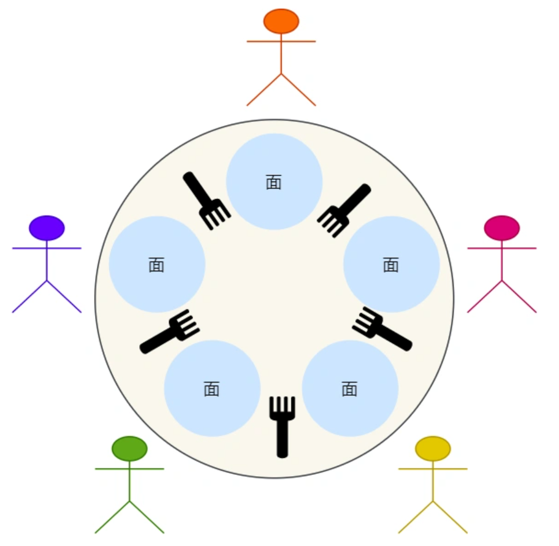

问题描述：

- `5` 个老大哥哲学家，闲着没事做，围绕着一张圆桌吃面；
- 巧就巧在，这个桌子只有 `5` 支叉子，每两个哲学家之间放一支叉子；
- 哲学家围在一起先思考，思考中途饿了就会想进餐；
- 奇葩的是，这些哲学家要两支叉子才愿意吃面，也就是需要拿到左右两边的叉子才进餐；
- 吃完后，会把两支叉子放回原处，继续思考；

那么问题来了，如何保证哲 学家们的动作有序进行，而不会出现有人永远拿不到叉子呢？

> 方案一

我们用信号量的方式，也就是 PV 操作来尝试解决它，代码如下：

```C++
#define N 5				// 哲学家人数
semaphore fork[5];		// 信号量初值为1(叉子个数)

void smart_person(int i) {			// i为哲学家编号0~4
    while(true) {
        think();					// 哲学家思考
        p(fork[i]);					// 去拿左边的叉子
        p(fork[(i + 1) % N]);		 // 去拿右边的叉子
        eat();						// 进餐
        V(fork[i]);					// 放下左边的叉子	
        V(fork[(i + 1) % N]);	 	  // 放下右边的叉子
    }
}
```

上面的程序，好似很自然。拿起叉子用 P 操作，代表有叉子就直接用，没有叉子时就等待其他哲学家放回叉子。

不过，这种解法存在一个极端的问题：**假设五位哲学家同时拿起左边的叉子，桌面上就没有叉子了， 这样就没有人能够拿到他们右边的叉子，也就说每一位哲学家都会在 `P(fork[(i + 1) % N ])` 这条语句阻塞了，很明显这发生了死锁的现象**。

> 方案二

```C++
#define N 5				// 哲学家人数
semaphore fork[5];		// 信号量初值为1(叉子个数)
semaphore mutex;		// 互斥信号量 初始化为1

void smart_person(int i) {			// i为哲学家编号0~4
    while(true) {
        think();					// 哲学家思考
        P(mutex);					// 进入临界区
        p(fork[i]);					// 去拿左边的叉子
        p(fork[(i + 1) % N]);		 // 去拿右边的叉子
        eat();						// 进餐
        V(fork[i]);					// 放下左边的叉子	
        V(fork[(i + 1) % N]);	 	  // 放下右边的叉子
    	V(mutex);					// 离开临界区
    }
}
```

「方案一」会发生同时竞争左边叉子导致死锁的现象，那么我们就在拿叉子前，加个互斥信号量，代码如下：

上面程序中的互斥信号量的作用就在于，**只要有一个哲学家进入了「临界区」，也就是准备要拿叉子时，其他哲学家都不能动，只有这位哲学家用完叉子了，才能轮到下一个哲学家进餐。**

但是该方案虽然能让哲学家们按顺序吃饭，但是每次进餐只能有一位哲学家，而桌面上是有 5 把叉子，按道理是能可以有两个哲学家同时进餐的，所以从效率角度上，这不是最好的解决方案。

> 方案三

方案二使用互斥信号量，会导致只能允许一个哲学家就餐,那就不用信号量了。

另外，方案一的问题在于，会出现所有哲学家同时拿左边刀叉的可能性，那我们就避免哲学家可以同时拿左边的刀叉，采用分支结构，根据哲学家的编号的不同，而采取不同的动作。

**即让偶数编号的哲学家「先拿左边的叉子后拿右边的叉子」，奇数编号的哲学家「先拿右边的叉子后拿左边的叉子」**

```C++
#define N 5				// 哲学家人数
semaphore fork[5];		// 信号量初值为1(叉子个数)

void smart_person(int i) {			// i为哲学家编号0~4
    while(true) {
        think();					// 哲学家思考
        P(mutex);					// 进入临界区
        if (i % 2 == 0) {
            p(fork[i]);					// 先拿左边的叉子
        	p(fork[(i + 1) % N]);		 // 后拿右边的叉子
        } else {
        	p(fork[(i + 1) % N]);		 // 先拿右边的叉子
        	p(fork[i]);					// 后拿左边的叉子
        }
        eat();						// 进餐
        V(fork[i]);					// 放下左边的叉子	
        V(fork[(i + 1) % N]);	 	  // 放下右边的叉子
    }
}
```

上面的程序，在 P 操作时，根据哲学家的编号不同，拿起左右两边叉子的顺序不同。另外，V 操作是不需要分支的，因为 V 操作是不会阻塞的。

该方案即不会出现死锁，也可以两人同时进餐。

> 方案四
>
> 见[哲学家进餐问题](https://xiaolincoding.com/os/4_process/multithread_sync.html#哲学家就餐问题)

#### 3.2 读者-写者问题

著名的问题是「读者-写者」，它为数据库访问建立了一个模型。读者只会读取数据，不会修改数据，而写者既可以读也可以修改数据。

读者-写者的问题描述：

- 「读-读」允许：同一时刻，允许多个读者同时读
- 「读-写」互斥：没有写者时读者才能读，没有读者时写者才能写
- 「写-写」互斥：没有其他写者时，写者才能写

> 方案一（读者优先）

使用信号量的方式来尝试解决：

- 信号量 `wMutex`：控制写操作的互斥信号量，初始值为 1 ；
- 读者计数 `rCount`：正在进行读操作的读者个数，初始化为 0；
- 信号量 `rCountMutex`：控制对 rCount 读者计数器的互斥修改，初始值为 1；

```C++
semaphore wMutex;			// 控制写操作的互斥信号量，初始化为1
int rCount = 0;				// 当前正在读操作的读者的个数，初始化为0
semaphore rCountMutex;		// 控制对rCount的互斥修改，初始化为1

// 写者函数
void writer() {
    while (true) {
        P(wMutex);      // 进入临界区
        write();
        V(wMutex);      // 退出临界区
    }
}

// 读者函数
void reader() {
    while (true) {
        P(rCountMutex);     // 进入临界区
        if (rCount == 0) P(wMutex);     // 如果有读者则阻塞写者
        rCount++;           // 读者计数加一
        V(rCountMutex);     // 离开临界区

        read();

        P(rCountMutex);     // 进入临界区
        rCount--;
        if (rCount == 0) V(wMutex);     // 没有读者了则唤醒写者
        V(rCountMutex);     // 离开临界区
    }
}
```

上面的这种实现，是**读者优先**的策略，因为只要有读者正在读的状态，后来的读者都可以直接进入，如果读者持续不断进入，则写者会处于饥饿状态。

> 方案二（写者优先）

那既然有读者优先策略，自然也有写者优先策略：

- 只要有写者准备要写入，写者应尽快执行写操作，后来的读者就必须阻塞；
- 如果有写者持续不断写入，则读者就处于饥饿；

在方案一的基础上新增如下变量：

- 信号量 `rMutex`：控制读者进入的互斥信号量，初始值为 1；
- 信号量 `wDataMutex`：控制写者写操作的互斥信号量，初始值为 1；
- 写者计数 `wCount`：记录写者数量，初始值为 0；
- 信号量 `wCountMutex`：控制 wCount 互斥修改，初始值为 1；

具体实现如下代码：

```C++
int rCount = 0;				// 当前正在读操作的读者的个数，初始化为0
int wCount = 0;				// 当前正在写操作的写者个数，初始化为0

semaphore rMutex;			// 控制读者进入的互斥信号量，初始化为1
semaphore rCountMutex;		// 控制对rCount的互斥修改，初始化为1

semaphore wCountMutex;      // 控制对rCount的互斥修改，初始化为1
semaphore wDataMutex;       // 控制写者写操作的互斥信号量，初始化为1

// 写者函数
void writer() {
    while (true) {
        P(wCountMutex);     // 进入临界区
        if (wCount == 0) P(rMutex);     // 第一个写者进入如有读者进入则阻塞读者
        wCount++;
        V(wCountMutex);     // 离开临界区

        P(wDataMutex);      // 写者写操作之间互斥，进入临界区
        write();
        V(wDataMutex);      // 离开临界区

        P(wCountMutex);     // 进入临界区
        wCount--;
        if (wCount == 0) V(rMutex);     // 最后一个写者离开了，唤醒读者
        V(wCountMutex);     // 离开临界区
    }
}

// 读者函数
void reader() {
    while (true) {
        P(rMutex);
        P(rCountMutex);     // 进入临界区
        if (rCount == 0) P(wDataMutex);     // 第一个读者进入，若有写者则阻塞写者写操作
        rCount++;           // 读者计数加一
        V(rCountMutex);     // 离开临界区
        V(rMutex);

        read();

        P(rCountMutex);     // 进入临界区
        rCpunt--;
        if (rCount == 0) V(wDataMutex);     // 没有读者了则唤醒写者
        V(rCountMutex);     // 离开临界区
    }
}
```

注意，这里 `rMutex` 的作用，开始有多个读者读数据，它们全部进入读者队列，此时来了一个写者，执行了 `P(rMutex)` 之后，后续的读者由于阻塞在 `rMutex` 上，都不能再进入读者队列，而写者到来，则可以全部进入写者队列，因此保证了写者优先。

同时，第一个写者执行了 `P(rMutex)` 之后，也不能马上开始写，必须等到所有进入读者队列的读者都执行完读操作，通过 `V(wDataMutex)` 唤醒写者的写操作。

> 方案三（公平策略）

既然读者优先策略和写者优先策略都会造成饥饿的现象，那么我们就来实现一下公平策略。

公平策略：

- 优先级相同；
- 写者、读者互斥访问；
- 只能一个写者访问临界区；
- 可以有多个读者同时访问临界资源；

```C++
int rCount = 0;             // 正在进行读操作的读者个数，初始化为0
semaphore rCountMutex;      // 控制对rCount的互斥修改，初始化为1
semaphore wDataMutex;       // 控制写者写操作的互斥信号量，初始化为1
semaphore flag;             // 用于实现公平竞争，初始化为1

// 写者操作
void writer() {
    while (true) {
        P(flag);
        P(wDataMutex);      // 写者写操作之间互斥啊
        write();            // 写数据
        P(wDataMutex);      // 离开临界区
        V(flag);
    }
}

// 读者操作
void reader() {
    while (true) {
        P(flag);
        P(rCountMutex);     // 进入临界区
        if (rCount == 0) P(wDataMutex); // 当地一个读者进入，如果有写者则阻塞写者操作
        rCount++;
        V(rCountMutex)      //离开临界区
        V(flag);
    }
}
```

为什么加了一个信号量 `flag`，就实现了公平竞争？

对比方案一的读者优先策略，可以发现，读者优先中只要后续有读者到达，读者就可以进入读者队列， 而写者必须等待，直到没有读者到达。没有读者到达会导致读者队列为空，即 `rCount==0`，此时写者才可以进入临界区执行写操作。

而这里 `flag` 的作用就是阻止读者的这种特殊权限（特殊权限是只要读者到达，就可以进入读者队列）。

比如：开始来了一些读者读数据，它们全部进入读者队列，此时来了一个写者，执行 `P(falg)` 操作，使得后续到来的读者都阻塞在 `flag` 上，不能进入读者队列，这会使得读者队列逐渐为空，即 `rCount` 减为 0。

这个写者也不能立马开始写（因为此时读者队列不为空），会阻塞在信号量 `wDataMutex` 上，读者队列中的读者全部读取结束后，最后一个读者进程执行 `V(wDataMutex)`，唤醒刚才的写者，写者则继续开始进行写操作。


## 5. 死锁

### 1. 概念

在多线程编程中，我们为了防止多线程竞争共享资源而导致数据错乱，都会在操作共享资源之前加上互斥锁，只有成功获得到锁的线程，才能操作共享资源，获取不到锁的线程就只能等待，直到锁被释放。

那么，当两个线程为了保护两个不同的共享资源而使用了两个互斥锁，那么这两个互斥锁应用不当的时候，可能会造成**两个线程都在等待对方释放锁**，在没有外力的作用下，这些线程会一直相互等待，就没办法继续运行，这种情况就是发生了**死锁**。

### 2. 死锁发生的条件

死锁只有**同时满足**以下四个条件才会发生：

- 互斥条件；
- 持有并等待条件；
- 不可剥夺条件；
- 环路等待条件

> 互斥条件

互斥条件是指**多个线程不能同时使用同一个资源**。

比如下图，如果线程 A 已经持有的资源，不能再同时被线程 B 持有，如果线程 B 请求获取线程 A 已经占用的资源，那线程 B 只能等待，直到线程 A 释放了资源。


> 持有并等待条件

持有并等待条件是指，当线程 A 已经持有了资源 1，又想申请资源 2，而资源 2 已经被线程 C 持有了，所以线程 A 就会处于等待状态，但是**线程 A 在等待资源 2 的同时并不会释放自己已经持有的资源 1**。


> 不可剥夺条件

不可剥夺条件是指，当线程已经持有了资源 ，**在自己使用完之前不能被其他线程获取**，线程 B 如果也想使用此资源，则只能在线程 A 使用完并释放后才能获取。

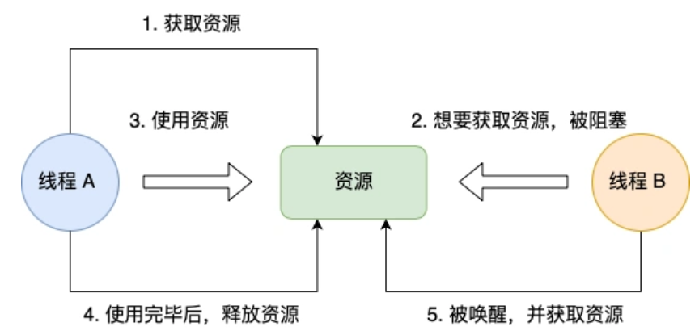

> 环路等待条件

环路等待条件指的是，在死锁发生的时候，**两个线程获取资源的顺序构成了环形链**。

比如，线程 A 已经持有资源 2，而想请求资源 1， 线程 B 已经获取了资源 1，而想请求资源 2，这就形成资源请求等待的环形图。


### 3. 模拟死锁的产生

在Linux编程环境下，首先，我们先创建 2 个线程，分别为线程 A 和 线程 B，然后有两个互斥锁，分别是 mutex_A 和 mutex_B，代码如下

```C++
# include<vector> 
# include<algorithm>
# include<unordered_map>
# include<string>
# include<stack>
// # include<priority_queue>
# include<iostream>
# include<thread>
#include<windows.h>
#include <cstdlib>
using namespace std;

pthread_mutex_t mutex_A = PTHREAD_MUTEX_INITIALIZER;
pthread_mutex_t mutex_B = PTHREAD_MUTEX_INITIALIZER;

//线程函数 A
void *threadA_proc(void *data)
{
    printf("thread A waiting get ResourceA \n");
    pthread_mutex_lock(&mutex_A);
    printf("thread A got ResourceA \n");
    
    Sleep(1);
    
    printf("thread A waiting get ResourceB \n");
    pthread_mutex_lock(&mutex_B);
    printf("thread A got ResourceB \n");

    pthread_mutex_unlock(&mutex_B);
    pthread_mutex_unlock(&mutex_A);
    return (void *)0;
}

//线程函数 B
void *threadB_proc(void *data)
{
    printf("thread B waiting get ResourceB \n");
    pthread_mutex_lock(&mutex_B);
    printf("thread B got ResourceB \n");
    
    Sleep(1);
    
    printf("thread B waiting  get ResourceA \n");
    pthread_mutex_lock(&mutex_A);
    printf("thread B got ResourceA \n");
    
    pthread_mutex_unlock(&mutex_A);
    pthread_mutex_unlock(&mutex_B);
    return (void *)0;
}

int main()
{
    pthread_t tidA, tidB;
    
    //创建两个线程
    pthread_create(&tidA, NULL, threadA_proc, NULL);
    pthread_create(&tidB, NULL, threadB_proc, NULL);
    
    pthread_join(tidA, NULL);
    pthread_join(tidB, NULL);
    
    printf("exit\n");
    
    return 0;
}
```

可以看到，线程 A 函数的过程：

- 先获取互斥锁 A，然后睡眠 1 秒；
- 再获取互斥锁 B，然后释放互斥锁 B；
- 最后释放互斥锁 A；

可以看到，线程 B 函数的过程：

- 先获取互斥锁 B，然后睡眠 1 秒；
- 再获取互斥锁 A，然后释放互斥锁 A；
- 最后释放互斥锁 B；

然后，我们运行这个程序，运行结果如下：

```C++
root@VM-16-12-ubuntu:~# g++ test.cpp -o a.out -pthread
root@VM-16-12-ubuntu:~# ./a.out 

thread B waiting get ResourceB 
thread B got ResourceB 
thread A waiting get ResourceA 
thread A got ResourceA 
thread B waiting  get ResourceA 
thread A waiting get ResourceB 
// 阻塞中。。。
```

可以看到线程 B 在等待互斥锁 A 的释放，线程 A 在等待互斥锁 B 的释放，双方都在等待对方资源的释放，很明显，产生了死锁问题。

### 4. 死锁的解决方案

保证上锁的顺序一致

### 5. 死锁的处理办法

四种方法：

- 鸵鸟策略
- 死锁检测与死锁恢复
- 死锁预防
- 死锁避免

#### 鸵鸟策略

把头埋在沙子里，假装根本没发生问题。

因为解决死锁问题的代价很高，因此鸵鸟策略这种不采取任务措施的方案会获得更高的性能。当发生死锁时不会对用户造成多大影响，或发生死锁的概率很低，可以采用鸵鸟策略。大多数操作系统，包括 Unix，Linux 和 Windows，处理死锁问题的办法仅仅是忽略它。

假设的前提是，这样的问题出现的概率很低。⽐如，在操作系统中，为应对死锁问题，可以采⽤这样的⼀种办法。

当系统发⽣[死锁](时不会对⽤户造成多⼤影响，或系统很少发⽣[死锁]的场合采⽤允许死锁发⽣的鸵⻦算法，这样⼀来可能开销⽐不允许发⽣死锁及检测和解除死锁的⼩。如果[死锁]很⻓时间才发⽣⼀次，⽽系统每周都会因硬件故障、[编译器]错误或操作系统错误⽽崩溃⼀次，那么⼤多数⼯程师不会以性能损失或者易⽤性损失的代价来设计较为复杂的死锁解决策略，来消除死锁。

鸵⻦策略的实质：出现死锁的概率很⼩，并且出现之后处理死锁会花费很⼤的代价，还不如不做处理，OS中这种置之不理的策略称之为鸵⻦策略（也叫鸵⻦算法）。

#### 死锁检测与死锁恢复

> 死锁检测

不是试图阻止死锁，而是当检测到死锁发生时，采取措施进行恢复。

1、每种类型一个资源的死锁检测


上图为资源分配图，其中方框表示资源，圆圈表示进程。资源指向进程表示该资源已经分配给该进程，进程指向资源表示进程请求获取该资源。

图 a 可以抽取出环，如图 b，它满足了环路等待条件，因此会发生死锁。

每种类型一个资源的死锁检测算法是通过检测有向图是否存在环来实现，从一个节点出发进行深度优先搜索，对访问过的节点进行标记，如果访问了已经标记的节点，就表示有向图存在环，也就是检测到死锁的发生。

2、每种类型多个资源的死锁检测


上图中，有三个进程四个资源，每个数据代表的含义如下：

E 向量：资源总量

A 向量：资源剩余量

C 矩阵：每个进程所拥有的资源数量，每一行都代表一个进程拥有资源的数量

R 矩阵：每个进程请求的资源数量

进程 P1 和 P2 所请求的资源都得不到满足，只有进程 P3 可以，让 P3 执行，之后释放 P3 拥有的资源，此时 A = （2，1，0，0） + （0，1，2，0） = (2 2 2 0)。P2 可以执行，执行后释放 P2 拥有的资源，A = (2，2，2，0) + （2，0，0，1）= (4 2 2 1) 。P1 也可以执行。所有进程都可以顺利执行，没有死锁。

算法总结如下：

每个进程最开始时都不被标记，执行过程有可能被标记。当算法结束时，任何没有被标记的进程都是死锁进程。

1. 寻找一个没有标记的进程 Pi，它所请求的资源小于等于 A。

2. 如果找到了这样一个进程，那么将 C 矩阵的第 i 行向量加到 A 中，标记该进程，并转回 1。

3. 如果没有这样一个进程，算法终止。

> 死锁恢复

利用抢占恢复

利用回滚恢复

通过杀死进程恢复

#### 死锁的预防（破坏死锁的四个必要条件之一或某几个）

死锁的预防是保证系统不进⼊死锁状态的⼀种策略。它的基本思想是要求进程申请资源时遵循某种协议，从⽽**打破产⽣死锁的四个必要条件中的⼀个或⼏个**，保证系统不会进⼊死锁状态。

> 打破互斥条件

即允许进程同时访问某些资源。但是，有的资源是不允许被同时访问的，像打印机等等，这是由资源本身的属性所决定的。所以，这种办法并⽆实⽤价值。

> 打破不可抢占条件

即允许进程强⾏从占有者那⾥夺取某些资源。就是说，当⼀个进程已占有了某些资源，它⼜申请新的资源，但不能⽴即被满⾜时，它必须释放所占有的全部资源，以后再重新申请。它所释放的资源可以分配给其它进程。这就相当于该进程占有的资源被隐蔽地强占了。这种预防死锁的⽅法实现起来困难，会降低系统性能。

> 打破占有且申请条件

可以实⾏资源预先分配策略。即进程在运⾏前⼀次性地向系统申请它所需要的全部资源。如果某个进程所需的全部资源得不到满⾜，则不分配任何资源，此进程暂不运⾏。只有当系统能够满⾜当前进程的全部资源需求时，才⼀次性地将所申请的资源全部分配给该进程。由于运⾏的进程已占有了它所需的全部资源，所以不会发⽣占有资源⼜申请资源的现象，因此不会发⽣死锁。

> 打破回环等待条件

实⾏资源有序分配策略。采⽤这种策略，即把资源事先分类编号，按号分配，使进程在申请，占⽤资源时不会形成环路。所有进程对资源的请求必须严格按资源序号递增的顺序提出。进程占⽤了⼩号资源，才能申请⼤号资源，就不会产⽣环路，从⽽预防了死锁。

#### 死锁的避免（银行家算法）

> 安全状态


图 a 的第二列 Has 表示已拥有的资源数，第三列 Max 表示总共需要的资源数，Free 表示还有可以使用的资源数。从图 a 开始出发，先让 B 拥有所需的所有资源（图 b），运行结束后释放 B，此时 Free 变为5（图 c）；接着以同样的方式运行 C 和 A，使得所有进程都能成功运行，因此可以称图 a 所示的状态时安全的。

定义：如果没有死锁发生，并且即使所有进程突然请求对资源的最大需求，也仍然存在某种调度次序能够使得每一个进程运行完毕，则称该**状态是安全**的。

安全状态的检测与死锁的检测类似，因为安全状态必须要求不能发生死锁。下面的银行家算法与死锁检测算法非常类似，可以结合着做参考对比。

> 单个资源的银行家算法

一个小城镇的银行家，他向一群客户分别承诺了一定的贷款额度，算法要做的是判断对请求的满足是否会进入不安全状态，如果是，就拒绝请求；否则予以分配。


上图 c 为不安全状态，因此算法会拒绝之前的请求，从而避免进入图 c 中的状态。

> 多个资源的银行家算法


上图中有五个进程，四个资源。左边的图表示已经分配的资源，右边的图表示还需要分配的资源。最右边的 E、P 以及 A 分别表示：总资源、已分配资源以及可用资源，注意这三个为向量，而不是具体数值，例如 A=(1 0 2 0)，表示 4 个资源分别还剩下 1/0/2/0。 

> 检查一个状态是否安全的算法如下、

- 查找右边的矩阵是否存在一行小于等于向量 A。如果不存在这样的行，那么系统将会发生死锁，状态是不安全的。
- 假若找到这样一行，将该进程标记为终止，并将其已分配资源加到 A 中。
- 重复以上两步，直到所有进程都标记为终止，则状态是安全的。

如果一个状态不是安全的，需要拒绝进入这个状态。


## 6. 互斥锁、自旋锁、速写锁、悲观锁、乐观锁

### 1. 背景

多线程访问共享资源的时候，避免不了资源竞争而导致数据错乱的问题，所以我们通常为了解决这一问题，都会在访问共享资源之前加锁。

最常用的就是互斥锁，当然还有很多种不同的锁，比如自旋锁、读写锁、乐观锁等，不同种类的锁自然适用于不同的场景。

如果选择了错误的锁，那么在一些高并发的场景下，可能会降低系统的性能，这样用户体验就会非常差了。

所以，为了选择合适的锁，我们不仅需要清楚知道加锁的成本开销有多大，还需要分析业务场景中访问的共享资源的方式，再来还要考虑并发访问共享资源时的冲突概率。

针对不同的应用场景，谈一谈「**互斥锁、自旋锁、读写锁、乐观锁、悲观锁**」的选择和使用。

### 2. 互斥锁与自旋锁

最底层的两种就是「互斥锁和自旋锁」，有很多高级的锁都是基于它们实现的，可以认为它们是各种锁的地基。

加锁的目的就是保证共享资源在任意时间里，只有一个线程访问，这样就可以避免多线程导致共享数据错乱的问题。

当已经有一个线程加锁后，其他线程加锁则就会失败，互斥锁和自旋锁对于加锁失败后的处理方式是不一样的：

- **互斥锁**加锁失败后，线程会**释放 CPU** ，给其他线程；
- **自旋锁**加锁失败后，线程会**忙等待**，直到它拿到锁。

#### 2.1 互斥锁

互斥锁是一种「独占锁」，比如当线程 A 加锁成功后，此时互斥锁已经被线程 A 独占了，只要线程 A 没有释放手中的锁，线程 B 加锁就会失败，于是就会释放 CPU 让给其他线程，**既然线程 B 释放掉了 CPU，自然线程 B 加锁的代码就会被阻塞**。

**对于互斥锁加锁失败而阻塞的现象，是由操作系统内核实现的**。当加锁失败时，内核会将线程置为「睡眠」状态，等到锁被释放后，内核会在合适的时机唤醒线程，当这个线程成功获取到锁后，于是就可以继续执行。如下图：


所以，互斥锁加锁失败时，会从用户态陷入到**内核态**，让内核帮我们切换线程，虽然简化了使用锁的难度，但是存在一定的性能开销成本。

那这个开销成本是什么呢？会有**两次线程上下文切换的成本**：

- 当线程加锁失败时，内核会把线程的状态从「运行」状态设置为「睡眠」状态，然后把 CPU 切换给其他线程运行；
- 接着，当锁被释放时，之前「睡眠」状态的线程会变为「就绪」状态，然后内核会在合适的时间，把 CPU 切换给该线程运行。

线程的上下文切换的是什么？当两个线程是属于同一个进程，**因为虚拟内存是共享的，所以在切换时，虚拟内存这些资源就保持不动，只需要切换线程的私有数据、寄存器等不共享的数据。**

上下切换的耗时大概在几十纳秒到几微秒之间，如果锁住的代码执行时间比较短，那可能上下文切换的时间都比你锁住的代码执行时间还要长。

所以，**如果能确定被锁住的代码执行时间很短，就不应该用互斥锁，而应该选用自旋锁，否则使用互斥锁。**

#### 2.2 自旋锁

自旋锁是通过 CPU 提供的 `CAS` 函数（*Compare And Swap*），在「用户态」完成加锁和解锁操作，不会主动产生线程上下文切换，所以**相比互斥锁来说，会快一些，开销也小一些（优点）**。

一般加锁的过程，包含两个步骤：

- 第一步，查看锁的状态，如果锁是空闲的，则执行第二步；
- 第二步，将锁设置为当前线程持有；

CAS 函数就把这两个步骤合并成一条硬件级指令，形成**原子指令**，这样就保证了这两个步骤是不可分割的，要么一次性执行完两个步骤，要么两个步骤都不执行。比如，设锁为变量 lock，整数 0 表示锁是空闲状态，整数 pid 表示线程 ID，那么 CAS(lock, 0, pid) 就表示自旋锁的加锁操作，CAS(lock, pid, 0) 则表示解锁操作。

使用自旋锁的时候，当发生多线程竞争锁的情况，加锁失败的线程会「忙等待」，直到它拿到锁。这里的「忙等待」可以用 `while` 循环等待实现，不过最好是使用 CPU 提供的 `PAUSE` 指令来实现「忙等待」，因为可以减少循环等待时的耗电量。

**不足之处**：

- 自旋锁一直占用CPU，在未获得锁的情况下，一直进行自旋，所以占用着CPU，如果不能在很短的时间内获得锁，无疑会使CPU效率降低；
- 在用自旋锁时有可能造成死锁，当递归调用时有可能造成死锁。

**注意**

在单核 CPU 上，需要抢占式的调度器（即不断通过时钟中断一个线程，运行其他线程）。否则，自旋锁在单 CPU 上无法使用，因为一个自旋的线程永远不会放弃 CPU。

#### 2.3 总结

互斥锁与自旋锁是锁的最基本处理方式，更高级的锁都会选择其中一个来实现，比如读写锁既可以选择互斥锁实现，也可以基于自旋锁实现。

自旋锁与互斥锁使用层面比较相似，但实现层面上完全不同：**当加锁失败时，互斥锁用「线程切换」来应对，自旋锁则用「忙等待」来应对**。

### 3. 读写锁

#### 3.1 概念

读写锁从字面意思我们也可以知道，它由「读锁」和「写锁」两部分构成，如果只读取共享资源用「读锁」加锁，如果要修改共享资源则用「写锁」加锁。所以，**读写锁适用于能明确区分读操作和写操作的场景**。

####  3.2 工作原理

- 当「写锁」没有被线程持有时，多个线程能够并发地持有读锁，这大大提高了共享资源的访问效率，因为「读锁」是用于读取共享资源的场景，所以多个线程同时持有读锁也不会破坏共享资源的数据。
- 但是，一旦「写锁」被线程持有后，读线程的获取读锁的操作会被阻塞，而且其他写线程的获取写锁的操作也会被阻塞。

所以说，**写锁是独占锁**，因为任何时刻只能有一个线程持有写锁，类似互斥锁和自旋锁；**而读锁是共享锁**，因为读锁可以被多个线程同时持有。知道了读写锁的工作原理后，我们可以发现，**读写锁在读多写少的场景，能发挥出优势**。

#### 3.3 特点

- 多个读者可以同时进行读
- 写者必须互斥（只允许一个写者写，也不能读者写者同时进行）
- 根据读者和写者的优先级分为读优先锁和写优先锁

根据实现的不同可以将读写锁分为 读优先锁 和 写优先锁。

> 读优先锁

读优先锁期望的是，读锁能被更多的线程持有，以便提高读线程的并发性，它的工作方式是：当读线程 A 先持有了读锁，写线程 B 在获取写锁的时候，会被阻塞，并且在阻塞过程中，后续来的读线程 C 仍然可以成功获取读锁，最后直到读线程 A 和 C 释放读锁后，写线程 B 才可以成功获取写锁。如下图：


> 写优先锁


读优先锁对于读线程并发性更好，但也不是没有问题。我们试想一下，如果一直有读线程获取读锁，那么写线程将永远获取不到写锁，这就造成了写线程「饥饿」的现象。

写优先锁可以保证写线程不会饿死，但是如果一直有写线程获取写锁，读线程也会被「饿死」。

既然不管优先读锁还是写锁，对方可能会出现饿死问题，那么我们就不偏袒任何一方，搞个「公平读写锁」。

**公平读写锁比较简单的一种方式是：用队列把获取锁的线程排队，不管是写线程还是读线程都按照先进先出的原则加锁即可，这样读线程仍然可以并发，也不会出现「饥饿」的现象。**

互斥锁和自旋锁都是最基本的锁，读写锁可以根据场景来选择这两种锁其中的一个进行实现。


### 4. 乐观锁与悲观锁

#### 4.1 悲观锁 

前面提到的互斥锁、自旋锁、读写锁，都是属于悲观锁。

悲观锁做事比较悲观，它认为**多线程同时修改共享资源的概率比较高，于是很容易出现冲突，所以访问共享资源前，先要上锁**。

#### 4.2 乐观锁

那相反的，如果多线程同时修改共享资源的概率比较低，就可以采用乐观锁。

乐观锁做事比较乐观，它假定冲突的概率很低，它的工作方式是：**先修改完共享资源，再验证这段时间内有没有发生冲突，如果没有其他线程在修改资源，那么操作完成，如果发现有其他线程已经修改过这个资源，就放弃本次操作**。

放弃后如何重试，这跟业务场景息息相关，虽然重试的成本很高，但是冲突的概率足够低的话，还是可以接受的。

可见，乐观锁的心态是，不管三七二十一，先改了资源再说。另外，**乐观锁全程并没有加锁，所以它也叫无锁编程**。

乐观锁的应用举例——在线文档

> 在线文档可以同时多人编辑的，如果使用了悲观锁，那么只要有一个用户正在编辑文档，此时其他用户就无法打开相同的文档了，这用户体验当然不好了。
>
> 那实现多人同时编辑，实际上是用了乐观锁，它允许多个用户打开同一个文档进行编辑，编辑完提交之后才验证修改的内容是否有冲突。
>
> 怎么样才算发生冲突？这里举个例子，比如用户 A 先在浏览器编辑文档，之后用户 B 在浏览器也打开了相同的文档进行编辑，但是用户 B 比用户 A 提交早，这一过程用户 A 是不知道的，当 A 提交修改完的内容时，那么 A 和 B 之间并行修改的地方就会发生冲突。
>
> 服务端要怎么验证是否冲突了呢？通常方案如下：
>
> - 由于发生冲突的概率比较低，所以先让用户编辑文档，但是浏览器在下载文档时会记录下服务端返回的文档版本号；
> - 当用户提交修改时，发给服务端的请求会带上原始文档版本号，服务器收到后将它与当前版本号进行比较，如果版本号一致则修改成功，否则提交失败。
>
> 实际上，我们常见的 **SVN 和 Git** 也是用了乐观锁的思想，先让用户编辑代码，然后提交的时候，通过版本号来判断是否产生了冲突，发生了冲突的地方，需要我们自己修改后，再重新提交。

乐观锁虽然去除了加锁解锁的操作，但是一旦发生冲突，重试的成本非常高，所以**只有在冲突概率非常低，且加锁成本非常高的场景时，才考虑使用乐观锁.


## 7. 协程

协程及其如何实现，如何切换；协程执行的时机

### 定义

协程是用户态的轻量级线程，线程内部调度的基本单位。它是⼀种⽐线程更加轻量级的存在，其开销远小于线程。

正如⼀个进程可以拥有多个线程⼀样，⼀个线程可以拥有多个协程；协程不是被操作系统内核管理，⽽完全是由**程序**所控制。

### 切换情况

协程拥有⾃⼰**寄存器上下⽂和栈**。协程调度切换时，将寄存器上下⽂和栈保存到其他地⽅，在切换回来的时候，恢复先前保存的寄存器上下⽂和栈。

切换者：用户

切换过程：用户（没有陷入内核）

调用栈：用户栈

### 拥有资源

拥有自己的寄存器上下文和栈

### 并发性

同一时间只能执行一个协程，而其他协程处于休眠状态，适合对任务进行分时处理


## 8. 硬件结构

### 1. 中断

#### 1.0 用户态和内核态

> 二者的区别

1. 内核态与⽤户态是操作系统的两种运⾏级别,当程序运⾏在3级特权级上时，就可以称之为运⾏在⽤户态，因为这是最低特权级，是普通的⽤户进程运⾏的特权级，⼤部分⽤户直接⾯对的程序都是运⾏在⽤户态；反之，当程序运⾏在0级特权级上时，就可以称之为运⾏在内核态。
2. 运⾏在⽤户态下的程序不能直接访问操作系统内核数据结构和程序。当我们在系统中执⾏⼀个程序时，⼤部分时间是运⾏在⽤户态下的，在其需要操作系统帮助完成某些它没有权⼒和能⼒完成的⼯作时就会切换到内核态。
3. 这两种状态的主要差别是： 处于⽤户态执⾏时，进程所能访问的内存空间和对象受到限制，其所处于占有的处理机是可被抢占的 ； ⽽处于核⼼态执⾏中的进程，则能访问所有的内存空间和对象，且所占有的处理机是不允许被抢占的。

> 用户态到内核态的转化

1) 系统调⽤

这是⽤户态进程**主动**要求切换到内核态的⼀种⽅式，⽤户态进程通过系统调⽤申请使⽤操作系统提供的服务程序完成⼯作，⽐如fork()实际上就是执⾏了⼀个创建新进程的系统调⽤。⽽系统调⽤的机制其核⼼还是使⽤了操作系统为⽤户特别开放的⼀个中断来实现，例如 Linux 的 int 80h 中断。

2. 异常

当 CPU 在执⾏运⾏在⽤户态下的程序时，发⽣了某些事先不可知的异常，这时会触发由当前运⾏进程切换到**处理此异常的内核相关程序**中，也就转到了内核态，⽐如缺⻚异常。

3. 外围设备的中断

当外围设备完成⽤户请求的操作后，会向 CPU 发出相应的中断信号，这时 CPU 会暂停执⾏下⼀条即将要执⾏的指令转⽽去执⾏与中断信号对应的处理程序，如果先前执⾏的指令是⽤户态下的程序，那么这个转换的过程⾃然也就发⽣了由⽤户态到内核态的切换。⽐如硬盘读写操作完成，系统会切换到硬盘读写的中断处理程序中执⾏后续操作等。

#### 1.1 什么是中断

中断是系统用来响应硬件设备请求的一种机制，操作系统收到硬件的中断请求，会打断正在执行的进程，然后调用内核中的中断处理程序来响应请求。

计算机处于执⾏期间，系统内发⽣了⾮寻常或⾮预期的急需处理事件，CPU暂时中断当前正在执⾏的程序⽽转去执⾏相应的事件处理程序， 处理完毕后返回原来被中断处继续执⾏；

作用：

① 可以使CPU和外设同时⼯作，使系统可以及时地响应外部事件；

② 可以允许多个外设同时⼯作，⼤⼤提⾼了CPU的利⽤率；

③ 可以使CPU及时处理各种软硬件故障；

④ 中断是一种异步的事件处理机制，可以提高系统的并发处理能力。

#### 1.2 硬中断与软中断

中断请求的处理程序应该要短且快，这样才能减少对正常进程运行调度地影响，而且中断处理程序可能会暂时关闭中断，这时如果中断处理程序执行时间过长，可能在还未执行完中断处理程序前，会丢失当前其他设备的中断请求。Linux 系统**为了解决中断处理程序执行过长和中断丢失的问题，将中断过程分成了两个阶段，分别是「上半部和下半部分」**。

- **上半部用来快速处理中断**，一般会暂时关闭中断请求，主要负责处理跟硬件紧密相关或者时间敏感的事情。
- **下半部用来延迟处理上半部未完成的工作**，一般以 **内核线程**的方式运行。

> 常见的网卡接收网络包的例子。
>
> 网卡收到网络包后，会通过**硬件中断**通知内核有新的数据到了，于是内核就会调用对应的中断处理程序来响应该事件，这个事件的处理也是会分成上半部和下半部。
>
> 上部分要做到快速处理，所以只要把网卡的数据读到内存中，然后更新一下硬件寄存器的状态，比如把状态更新为表示数据已经读到内存中的状态值。
>
> 接着，内核会触发一个**软中断**，把一些处理比较耗时且复杂的事情，交给「软中断处理程序」去做，也就是中断的下半部，其主要是需要从内存中找到网络数据，再按照网络协议栈，对网络数据进行逐层解析和处理，最后把数据送给应用程序。

所以，中断处理程序的上部分和下半部可以理解为：

- 上半部由**硬件**触发中断，对应**硬中断**，主要是负责**耗时短**的工作，特点是**快速执行**；
- 下半部由**软件**触发中断，对应**软中断**，主要是负责异步处理上半部未完成的工作，通常都是耗时比较长的事情，特点是**延迟执行**；

还有一个区别，硬中断（上半部）是会打断 CPU 正在执行的任务，然后立即执行中断处理程序，而软中断（下半部）是以内核线程的方式执行，并且每一个 CPU 都对应一个软中断内核线程，名字通常为「ksoftirqd/CPU 编号」，比如 0 号 CPU 对应的软中断内核线程的名字是 `ksoftirqd/0`

#### 1.3 系统中有哪些软中断

在 Linux 系统里，可以通过查看 `cat /proc/softirqs` 的 内容来知晓「软中断」的运行情况，以及 `cat/proc/interrupts` 的 内容来知晓「硬中断」的运行情况。如下所示为一个查看软中断的例子：


每一个 CPU 都有自己对应的不同类型软中断的**累计运行次数**，有 3 点需要注意下。

第一点，要注意第一列的内容，它是代表着软中断的类型，在当前系统里，软中断包括了 10 个类型，分别对应不同的工作类型，比如 `NET_RX` 表示网络接收中断，`NET_TX` 表示网络发送中断、`TIMER` 表示定时中断、`RCU` 表示 RCU 锁中断、`SCHED` 表示内核调度中断。

> （1）除法错误中断
> （2）溢出中断
> （3）单步中断
> （4）断点中断
> （5）中断指令INT n中断

第二点，要注意同一种类型的软中断在不同 CPU 的分布情况，正常情况下，同一种中断在不同 CPU 上的累计次数相差不多，比如该系统里，`NET_RX` 在 CPU0 、CPU1、CPU2、CPU3 上的中断次数基本是同一个数量级，相差不多。

第三点，这些数值是系统运行以来的累计中断次数，数值的大小没什么参考意义，但是系统的**中断次数的变化速率**才是我们要关注的，我们可以使用 `watch -d cat /proc/softirqs` 命令查看中断次数的变化速率。

软中断是以**内核线程**的方式执行的，我们可以用 `ps` 命令可以查看到，下面这个就是一个查到软中断内核线程的结果例子：


可以发现，内核线程的名字外面都有有中括号，这说明 ps 无法获取它们的命令行参数，所以一般来说，名字在中括号里的都可以认为是内核线程。

而且，可以看到有 4 个 `ksoftirqd` 内核线程，这是因为当前的系统 CPU 是 4 核心的，每个 CPU 核心都对应着一个内核线程。

#### 1.4 如何定位软中断 CPU 使用率过高的问题

要想知道当前的系统的软中断情况，我们可以使用 `top` 命令查看，下面是一台服务器上的 top 的数据：


上图中的黄色部分 `si`，就是 **CPU 在软中断上的使用率**，而且可以发现，每个 CPU 使用率都不高，两个 CPU 的使用率虽然只有 3% 和 4% 左右，但是都是用在软中断上了。

另外，也可以看到 CPU 使用率最高的进程也是软中断 `ksoftirqd`，因此可以认为此时系统的开销主要来源于软中断。

如果要知道是哪种软中断类型导致的，我们可以使用 `watch -d cat /proc/softirqs` 命令查看每个软中断类型的中断次数的变化速率。如下图所示：


一般对于网络 I/O 比较高的 Web 服务器，`NET_RX` 网络接收中断的变化速率相比其他中断类型快很多。

如果发现 `NET_RX` 网络接收中断次数的变化速率过快，接下来就可以使用 `sar -n DEV` 查看网卡的网络包接收速率情况，然后分析是哪个网卡有大量的网络包进来。


接着，通过 `tcpdump` 抓包，分析这些包的来源，如果是非法的地址，可以考虑加防火墙，如果是正常流量，则要考虑硬件升级等。

#### 1.5 外中断和异常有什么区别

外中断是指由 **CPU 执行指令以外的事件**引起，如 I/O 完成中断，表示设备输入/输出处理已经完成，处理器能够发送下一个输入/输出请求。此外还有时钟中断、控制台中断等。

而异常是由 **CPU 执行指令的内部事件**引起，如非法操作码、地址越界、算术溢出等。


#### 1.6 异常和中断的区别

中断：

中断是由硬件设备产生的，而它们从物理上说就是电信号，之后，它们通过中断控制器发送给CPU，接着CPU判断收到的中断来自于哪个硬件设备（这定义在内核中），最后，由CPU发送给内核，由内核处理中断。下面这张图显示了中断处理的流程：


异常：

CPU处理程序的时候一旦程序不在内存中，会产生缺页异常；当运行除法程序时，当除数为0时，又会产生除0异常。所以，大家也需要记住的是，异常是由CPU产生的，同时它会发送给内核，要求内核处理这些异常，下面这张图显示了异常处理的流程：


**相同点**

最后都是由CPU发送给内核，由内核去处理

处理程序的流程设计上是相似的

**不同点**

产生源不相同，异常是由CPU产生的，而中断是由硬件设备产生的

内核需要根据是异常还是中断调用不同的处理程序

中断不是时钟同步的，这意味着中断可能随时到来；异常由于是CPU产生的，所以它是时钟同步的

当处理中断时，处于中断上下文中；处理异常时，处于进程上下文中


#### 1.7 中断的实现过程

①中断源发出中断请求;
②判断当前处理机是否允许中断和该中断源是否被屏蔽;
③优先权排队;
④处理机执行完当前指令或当前指令无法执行完，则立即停止当前程序，保护断点地址和处理机当前状态，转入相应的中断服务程序;
⑤执行中断服务程序;
⑥恢复被保护的状态，执行“中断返回”指令回到被中断的程序或转入其他程序。

上述过程中前四项操作是由硬件完成的，后两项是由软件完成的。

中断全过程分简单概括为为5 个阶段：中断请求、中断判优、中断响应、中断处理和中断返回。


## 9. 操作系统的文件管理

### 1. 文件系统的组成

文件系统是操作系统中负责管理持久数据的子系统，说简单点，就是负责把用户的文件存到磁盘硬件中，因为即使计算机断电了，磁盘里的数据并不会丢失，所以可以持久化的保存文件。

文件系统的基本数据单位是文件，它的目的是对磁盘上的文件进行组织管理，那组织的方式不同，就会形成不同的文件系统。

Linux 最经典的一句话是：「**一切皆文件**」，不仅普通的文件和目录，就连块设备、管道、socket 等，也都是统一交给文件系统管理的。

Linux 文件系统会为每个文件分配两个数据结构：**索引节点（\*index node\*）和目录项（\*directory entry\*）**，它们主要用来记录文件的元信息和目录层次结构。

- 索引节点，也就是 *inode*，用来记录文件的元信息，比如 inode 编号、文件大小、访问权限、创建时间、修改时间、**数据在磁盘的位置**等等。**索引节点是文件的唯一标识**，它们之间一一对应，也同样都会被存储在硬盘中，所以**索引节点同样占用磁盘空间**。
- 目录项，也就是 *dentry*，用来记录文件的名字、**索引节点指针**以及与其他目录项的层级关联关系。多个目录项关联起来，就会形成目录结构，但它与索引节点不同的是，**目录项是由内核维护的一个数据结构，不存放于磁盘，而是缓存在内存**。

由于索引节点唯一标识一个文件，而目录项记录着文件的名，所以目录项和索引节点的关系是多对一，也就是说，一个文件可以有多个别字。比如，硬链接的实现就是多个目录项中的索引节点指向同一个文件。

注意，目录也是文件，也是用索引节点唯一标识，和普通文件不同的是，普通文件在磁盘里面保存的是文件数据，而目录文件在磁盘里面保存子目录或文件。

> 目录和目录项的区别

1. 目录是个文件，持久化存储在磁盘；而目录项是内核一个数据结构，缓存在内存。

2. 如果查询目录频繁从磁盘读，效率会很低，所以内核会把**已经读过的目录**用目录项这个数据结构缓存在内存，下次再次读到相同的目录时，只需从内存读就可以，大大提高了文件系统的效率。

注意，目录项这个数据结构不只是表示目录，也是可以表示文件的。

> 文件数据如何存储在磁盘

磁盘读写的最小单位是**扇区**，扇区的大小只有 `512B` 大小，很明显，如果每次读写都以这么小为单位，那这读写的效率会非常低。

所以，文件系统把多个扇区组成了一个**逻辑块**，每次读写的最小单位就是**逻辑块（数据块）**，Linux 中的逻辑块大小为 `4KB`，也就是一次性读写 8 个扇区，这将大大提高了磁盘的读写的效率。

下面这个图就很好的展示了索引节点、目录项以及文件数据的关系：

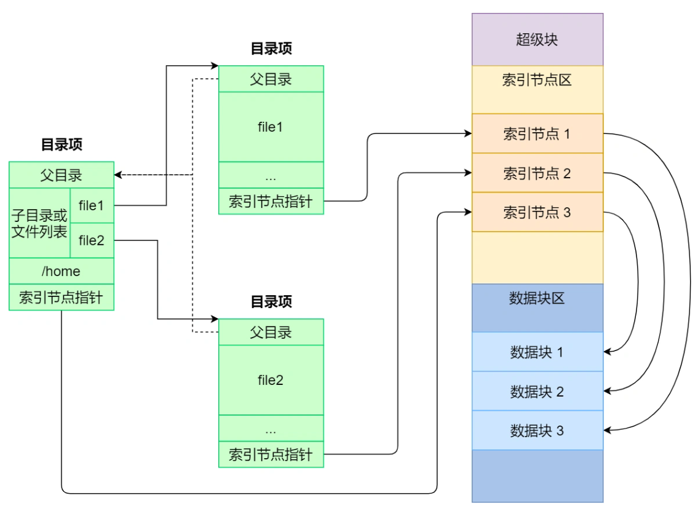

索引节点是存储在硬盘上的数据，那么为了加速文件的访问，通常会把索引节点加载到内存中。

另外，磁盘进行格式化的时候，会被分成三个存储区域，分别是**超级块、索引节点区和数据块区**。

- *超级块*，用来存储文件系统的详细信息，比如块个数、块大小、空闲块等等。
- *索引节点区*，用来存储索引节点；
- *数据块区*，用来存储文件或目录数据；

我们不可能把超级块和索引节点区全部加载到内存，这样内存肯定撑不住，所以只有当需要使用的时候，才将其加载进内存，它们加载进内存的时机是不同的：

- 超级块：当文件系统**挂载**时进入内存；
- 索引节点区：当文件被**访问**时进入内存；

### 2. 虚拟文件系统

文件系统的种类众多，而操作系统希望**对用户提供一个统一的接口**，于是在用户层与文件系统层引入了中间层，这个中间层就称为**虚拟文件系统（\*Virtual File System，VFS\*）。**

VFS 定义了一组所有文件系统都支持的数据结构和标准接口，这样程序员不需要了解文件系统的工作原理，只需要了解 VFS 提供的统一接口即可。

在 Linux 文件系统中，用户空间、系统调用、虚拟机文件系统、缓存、文件系统以及存储之间的关系如下图：


Linux 支持的文件系统根据存储位置的不同，可以把文件系统分为三类：

- *磁盘的文件系统*，它是直接把数据存储在磁盘中，比如 Ext 2/3/4、XFS 等都是这类文件系统。
- *内存的文件系统*，这类文件系统的数据不是存储在硬盘的，而是占用内存空间，我们经常用到的 `/proc` 和 `/sys` 文件系统都属于这一类，读写这类文件，实际上是读写内核中相关的数据。
- *网络的文件系统*，用来访问其他计算机主机数据的文件系统，比如 NFS、SMB 等等。

**文件系统首先要先挂载到某个目录才可以正常使用**，比如 Linux 系统在启动时，会把文件系统挂载到根目录

### 3. 文件的使用（从用户的角度看）


```C++
fd = open(name, flag); # 打开文件
...
write(fd,...);         # 写数据
...
close(fd);             # 关闭文件
```

上面简单的代码是读取一个文件的过程：

- 首先用 `open` 系统调用打开文件，`open` 的参数中包含文件的路径名和文件名。
- 使用 `write` 写数据，其中 `write` 使用 `open` 所返回的**文件描述符**，并不使用文件名作为参数。
- 使用完文件后，要用 `close` 系统调用关闭文件，避免资源的泄露。

我们打开了一个文件后，操作系统会跟踪进程打开的所有文件，所谓的跟踪呢，就是操作系统为每个进程维护一个打开文件表，文件表里的每一项代表「**文件描述符**」，所以说**文件描述符是打开文件的标识**。

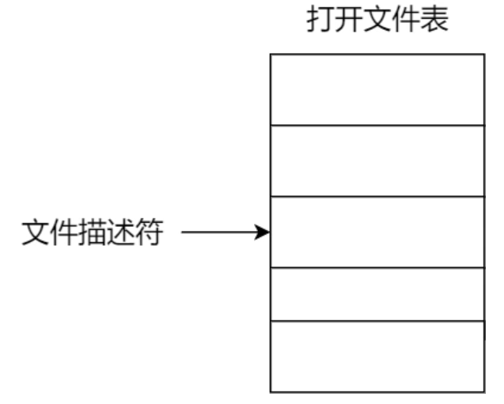

操作系统在打开文件表中维护着打开文件的状态和信息：

- 文件指针：系统跟踪上次读写位置作为当前文件位置指针，这种指针对打开文件的某个进程来说是唯一的；
- 文件打开计数器：文件关闭时，操作系统必须重用其打开文件表条目，否则表内空间不够用。因为多个进程可能打开同一个文件，所以系统在删除打开文件条目之前，必须等待最后一个进程关闭文件，该计数器跟踪打开和关闭的数量，当该计数为 0 时，系统关闭文件，删除该条目；
- 文件磁盘位置：绝大多数文件操作都要求系统修改文件数据，该信息保存在内存中，以免每个操作都从磁盘中读取；
- 访问权限：每个进程打开文件都需要有一个访问模式（创建、只读、读写、添加等），该信息保存在进程的打开文件表中，以便操作系统能允许或拒绝之后的 I/O 请求；

在用户视角里，文件就是一个持久化的数据结构，但操作系统并不会关心用户想存在磁盘上的任何的数据结构，操作系统的视角是如何把文件数据和磁盘块对应起来。

所以，用户和操作系统对文件的读写操作是有差异的，用户习惯以**字节**的方式读写文件，而操作系统则是以**数据块**来读写文件，那屏蔽掉这种差异的工作就是文件系统了。

我们来分别看一下，读文件和写文件的过程：

- 当用户进程从文件读取 1 个字节大小的数据时，文件系统则需要获取字节所在的数据块，再返回数据块对应的用户进程所需的数据部分。
- 当用户进程把 1 个字节大小的数据写进文件时，文件系统则找到需要写入数据的数据块的位置，然后修改数据块中对应的部分，最后再把数据块写回磁盘。

所以说，**文件系统的基本操作单位是数据块**

### 4. 文件的存储

文件的数据是要存储在硬盘上面的，数据在磁盘上的存放方式，就像程序在内存中存放的方式那样，有以下两种：

- 连续空间存放方式
- 非连续空间存放方式

其中，非连续空间存放方式又可以分为「链表方式」和「索引方式」。

不同的存储方式，有各自的特点，重点是要分析它们的存储效率和读写性能，接下来分别对每种存储方式说一下

#### 4.1 连续空间存放方式

连续空间存放方式顾名思义，**文件存放在磁盘「连续的」物理空间中**。这种模式下，文件的数据都是紧密相连，**读写效率很高**，因为一次磁盘寻道就可以读出整个文件。

使用连续存放的方式有一个前提，必须先知道一个文件的大小，这样文件系统才会根据文件的大小在磁盘上找到一块连续的空间分配给文件。

所以，**文件头里需要指定「起始块的位置」和「长度」**，有了这两个信息就可以很好的表示文件存放方式是一块连续的磁盘空间。注意，此处说的文件头，就类似于 Linux 的 inode。


连续空间存放的方式虽然读写效率高，**但是有「磁盘空间碎片」和「文件长度不易扩展」的缺陷。**

如下图，如果文件 B 被删除，磁盘上就留下一块空缺，这时，如果新来的文件小于其中的一个空缺，我们就可以将其放在相应空缺里。**但如果该文件的大小大于所有的空缺，但却小于空缺大小之和，则虽然磁盘上有足够的空缺，但该文件还是不能存放**。当然了，我们可以通过将现有文件进行挪动来腾出空间以容纳新的文件，但是这个在磁盘挪动文件是非常耗时，所以这种方式不太现实。


另外一个缺陷是文件长度扩展不方便，例如上图中的文件 A 要想扩大一下，需要更多的磁盘空间，唯一的办法就只能是挪动的方式，前面也说了，这种方式效率是非常低的。

那么有没有更好的方式来解决上面的问题呢？答案当然有，既然连续空间存放的方式不太行，那么我们就改变存放的方式，使用非连续空间存放方式来解决这些缺陷

#### 4.2 非连续空间存放

> 链表方式

链表的方式存放是**离散的，不用连续的**，于是就可以**消除磁盘碎片**，可大大提高磁盘空间的利用率，同时**文件的长度可以动态扩展**。根据实现的方式的不同，链表可分为「**隐式链表**」和「**显式链接**」两种形式。

文件要以「**隐式链表**」的方式存放的话，**实现的方式是文件头要包含「第一块」和「最后一块」的位置，并且每个数据块里面留出一个指针空间，用来存放下一个数据块的位置**，这样一个数据块连着一个数据块，从链头开始就可以顺着指针找到所有的数据块，所以存放的方式可以是不连续的。


隐式链表的存放方式的**缺点在于无法直接访问数据块，只能通过指针顺序访问文件，以及数据块指针消耗了一定的存储空间**。隐式链接分配的**稳定性较差**，系统在运行过程中由于软件或者硬件错误**导致链表中的指针丢失或损坏，会导致文件数据的丢失。**

如果取出每个磁盘块的指针，把它放在内存的一个表中，就可以解决上述隐式链表的两个不足。那么，这种实现方式是「**显式链接**」，它指**把用于链接文件各数据块的指针，显式地存放在内存的一张链接表中**，该表在整个磁盘仅设置一张，**每个表项中存放链接指针，指向下一个数据块号**。

对于显式链接的工作方式，举个例子，文件 A 依次使用了磁盘块 4、7、2、10 和 12 ，文件 B 依次使用了磁盘块 6、3、11 和 14 。利用下图中的表，可以从第 4 块开始，顺着链走到最后，找到文件 A 的全部磁盘块。同样，从第 6 块开始，顺着链走到最后，也能够找出文件 B 的全部磁盘块。最后，这两个链都以一个不属于有效磁盘编号的特殊标记（如 -1 ）结束。内存中的这样一个表格称为**文件分配表（\*File Allocation Table，FAT\*）**。


由于查找记录的过程是在内存中进行的，因而不仅显著地**提高了检索速度**，而且**大大减少了访问磁盘的次数**。但也正是整个表都存放在内存中的关系，它的主要的缺点是**不适用于大磁盘**。

比如，对于 200GB 的磁盘和 1KB 大小的块，这张表需要有 2 亿项，每一项对应于这 2 亿个磁盘块中的一个块，每项如果需要 4 个字节，那这张表要占用 800MB 内存，很显然 FAT 方案对于大磁盘而言不太合适。

> 索引方式

链表的方式**解决了连续分配的磁盘碎片和文件动态扩展**的问题，但是不能有效支持**直接访问**（FAT除外），索引的方式可以解决这个问题。

索引的实现是为每个文件创建一个「**索引数据块**」，里面存放的是**指向文件数据块的指针列表**，说白了就像书的目录一样，要找哪个章节的内容，看目录查就可以。

另外，**文件头需要包含指向「索引数据块」的指针**，这样就可以通过文件头知道索引数据块的位置，再通过索引数据块里的索引信息找到对应的数据块。

创建文件时，索引块的所有指针都设为空。当首次写入第 i 块时，先从空闲空间中取得一个块，再将其地址写到索引块的第 i 个条目。


索引的方式优点在于：

- 文件的创建、增大、缩小很方便；
- 不会有碎片的问题；
- 支持顺序读写和随机读写；

由于**索引数据也是存放在磁盘块**的，如果文件很小，明明只需一块就可以存放的下，但还是需要额外分配一块来存放索引数据，所以缺陷之一就是存储索引带来的开销。

如果文件很大，大到一个索引数据块放不下索引信息，这时又要如何处理大文件的存放呢？我们可以通过组合的方式，来处理大文件的存取。

先来看看链表 + 索引的组合，这种组合称为「**链式索引块**」，它的实现方式是**在索引数据块留出一个存放下一个索引数据块的指针**，于是当一个索引数据块的索引信息用完了，就可以通过指针的方式，找到下一个索引数据块的信息。那这种方式也会出现前面提到的链表方式的问题，万一某个指针损坏了，后面的数据也就会无法读取了。


还有另外一种组合方式是索引 + 索引的方式，这种组合称为「**多级索引块**」，实现方式是**通过一个索引块来存放多个索引数据块**，一层套一层索引，像极了俄罗斯套娃是吧。

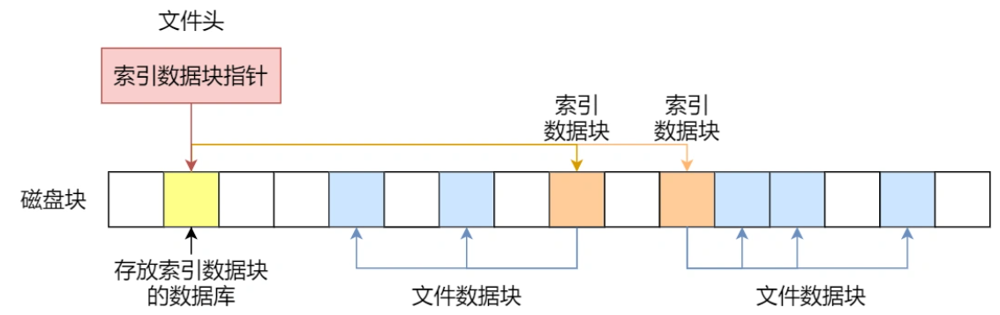

#### 4.2 Unix文件的实现方式

|   方式   |    访问磁盘次数    | 优点                                                         | 缺点                                                         |
| :------: | :----------------: | :----------------------------------------------------------- | :----------------------------------------------------------- |
| 顺序分配 |        1次         | 顺序存取速度快，当文件是定长时可以根据文件的起始位置和记录长度进行随机访问 | 要求连续的存储空间，会产生外部碎片，不利于文件的动态扩充     |
| 链表分配 |        n次         | 无外部碎片，提高了外存空间的利用率，动态增长较方便           | 只能按照文件的指针链顺序访问，查找效率低，指针信息存放消耗内盘或磁盘空间 |
| 索引分配 | m级需访问磁盘m+1次 | 可以随机访问，易于文件的增删                                 | 索引表增加存储空间的开销，索引表的查找策略对文件系统的效率影响较大。 |

### 5. 空闲空间管理

前面说到的文件的存储是针对已经被占用的数据块组织和管理，接下来的问题是，如果我要保存一个数据块，我应该放在硬盘上的哪个位置呢？难道需要将所有的块扫描一遍，找个空的地方随便放吗？

那这种方式效率就太低了，所以针对磁盘的空闲空间也是要引入管理的机制，接下来介绍几种常见的方法：

- 空闲表法
- 空闲链表法
- 位图法

#### 5.1 空闲表法

空闲表法就是为所有空闲空间建立一张表，表内容包括空闲区的第一个块号和该空闲区的块个数，注意，这个方式是**连续分配**的。如下图


当请求分配磁盘空间时，系统依次扫描空闲表里的内容，直到找到一个合适的空闲区域为止。当用户撤销一个文件时，系统回收文件空间。这时，也需顺序扫描空闲表，寻找一个空闲表条目并将释放空间的第一个物理块号及它占用的块数填到这个条目中。

这种方法**仅当有少量的空闲区时才有较好的效果**。因为，如果存储空间中有着大量的小的空闲区，则空闲表变得很大，这样查询效率会很低。另外，这种分配技术适用于**建立连续文件**。

#### 5.2 空闲链表法

我们也可以使用「链表」的方式来管理空闲空间，每一个空闲块里有一个指针指向下一个空闲块，这样也能很方便的找到空闲块并管理起来。如下图：


当创建文件需要一块或几块时，就从链头上依次取下一块或几块。反之，当回收空间时，把这些空闲块依次接到链头上。

这种技术只要在主存中保存一个指针，令它指向第一个空闲块。其特点是**简单，但不能随机访问，工作效率低**，因为每当在链上增加或移动空闲块时需要做很多 I/O 操作，同时**数据块的指针消耗了一定的存储空间。**

**空闲表法和空闲链表法都不适合用于大型文件系统，因为这会使空闲表或空闲链表太大。**

#### 5.3 位图法

位图是利用二进制的一位来表示磁盘中一个盘块的使用情况，磁盘上所有的盘块都有一个二进制位与之对应。

当值为 0 时，表示对应的盘块空闲，值为 1 时，表示对应的盘块已分配。它形式如下：`1111110011111110001110110111111100111 ...`

Linux 文件系统就采用了位图的方式来管理空闲空间，不仅用于数据空闲块的管理，还用于 inode 空闲块的管理，因为 inode 也是存储在磁盘的，自然也要有对其管理。

### 6. 文件系统的结构

如果采用「一个块的位图 + 一系列的块」，外加「一个块的 inode 的位图 + 一系列的 inode 的结构」能表示的最大空间也就 128M，这太少了，现在很多文件都比这个大。

在 Linux 文件系统，把这个结构称为一个**块组**，那么有 N 多的块组，就能够表示 N 大的文件。

下图给出了 Linux Ext2 整个文件系统的结构和块组的内容，文件系统都由大量块组组成，在硬盘上相继排布：


最前面的第一个块是引导块，在系统启动时用于启用引导，接着后面就是一个一个连续的块组了，块组的内容如下：

- *超级块*，包含的是文件系统的重要信息，比如 inode 总个数、块总个数、每个块组的 inode 个数、每个块组的块个数等等。
- *块组描述符*，包含文件系统中各个块组的状态，比如块组中空闲块和 inode 的数目等，每个块组都包含了文件系统中「所有块组的组描述符信息」。
- *数据位图和 inode 位图*， 用于表示对应的数据块或 inode 是空闲的，还是被使用中。
- *inode 列表*，包含了块组中所有的 inode，inode 用于保存文件系统中与各个文件和目录相关的所有元数据。
- *数据块*，包含文件的有用数据。

每个块组里有很多重复的信息，比如**超级块和块组描述符表，这两个都是全局信息，而且非常的重要**，这么做是有两个原因：

- 如果系统崩溃破坏了超级块或块组描述符，有关文件系统结构和内容的所有信息都会丢失。如果有**冗余的副本**，**该信息是可能恢复的**。
- 通过使文件和管理数据尽可能接近，减少了磁头寻道和旋转，这可以提高文件系统的性能。

不过，Ext2 的后续版本采用了**稀疏技术**。该做法是，超级块和块组描述符表不再存储到文件系统的每个块组中，而是只写入到块组 0、块组 1 和其他 ID 可以表示为 3、 5、7 的幂的块组中。

### 7. 目录的存储

基于 Linux 一切皆文件的设计思想，目录其实也是个文件，你甚至可以通过 `vim` 打开它，它也有 inode，inode 里面也是指向一些块。

和普通文件不同的是，**普通文件的块里面保存的是文件数据，而目录文件的块里面保存的是目录里面一项一项的文件信息。**

在目录文件的块中，最简单的保存格式就是**列表**，就是一项一项地将目录下的文件信息（如文件名、文件 inode、文件类型等）列在表里。

列表中每一项就代表该目录下的文件的文件名和对应的 inode，通过这个 inode，就可以找到真正的文件。


通常，第一项是「`.`」，表示当前目录，第二项是「`..`」，表示上一级目录，接下来就是一项一项的文件名和 inode。

如果一个目录有超级多的文件，我们要想在这个目录下找文件，按照列表一项一项的找，效率就不高了。

于是，保存目录的格式改成**哈希表**，对文件名进行哈希计算，把哈希值保存起来，如果我们要查找一个目录下面的文件名，可以通过名称取哈希。如果哈希能够匹配上，就说明这个文件的信息在相应的块里面。

Linux 系统的 ext 文件系统就是采用了哈希表，来保存目录的内容，这种方法的优点是查找非常迅速，插入和删除也较简单，不过需要一些预备措施来避免哈希冲突。

目录查询是通过在磁盘上反复搜索完成，需要不断地进行 I/O 操作，开销较大。所以，为了减少 I/O 操作，把当前使用的文件目录缓存在内存，以后要使用该文件时只要在内存中操作，从而降低了磁盘操作次数，提高了文件系统的访问速度

### 8. 软链接和硬链接

有时候我们希望给某个文件取个别名，那么在 Linux 中可以通过**硬链接（Hard Link）** 和**软链接（Symbolic Link）**的方式来实现，它们都是比较特殊的文件，实现方式也是不相同的。

> 硬链接

硬链接是**多个目录项中的「索引节点」指向一个文件**，也就是指向同一个 inode，但是 inode 是不可能跨越文件系统的，每个文件系统都有各自的 inode 数据结构和列表，所以**硬链接是不可用于跨文件系统的**。由于多个目录项都是指向一个 inode，那么**只有删除文件的所有硬链接以及源文件时，系统才会彻底删除该文件。**


> 软链接

软链接相当于重新创建一个文件，这个文件有**独立的 inode**，但是这个**文件的内容是另外一个文件的路径**，所以访问软链接的时候，实际上相当于访问到了另外一个文件，所以**软链接是可以跨文件系统的**，甚至**目标文件被删除了，链接文件还是在的，只不过指向的文件找不到了而已。**


### 9. 文件I/O

文件的读写方式各有千秋，对于文件的 I/O 分类也非常多，常见的有

- 缓冲与非缓冲 I/O
- 直接与非直接 I/O
- 阻塞与非阻塞 I/O VS 同步与异步 I/O

#### 9.1 缓冲与非缓冲 I/O

文件操作的标准库是可以实现数据的缓存，那么**根据「是否利用标准库缓冲」，可以把文件 I/O 分为缓冲 I/O 和非缓冲 I/O**：

- 缓冲 I/O，利用的是**标准库的缓存**实现文件的加速访问，而标准库再通过系统调用访问文件。
- 非缓冲 I/O，直接通过**系统调用**访问文件，不经过标准库缓存。

这里所说的「缓冲」特指标准库内部实现的缓冲。

比方说，很多程序遇到换行时才真正输出，而换行前的内容，其实就是被标准库暂时缓存了起来，这样做的目的是，减少系统调用的次数，毕竟系统调用是有 CPU 上下文切换的开销的。

#### 9.2 直接与非直接I/O

磁盘 I/O 是非常慢的，所以 Linux 内核为了减少磁盘 I/O 次数，在系统调用后，会把**用户数据拷贝到内核中缓存起来**，这个内核缓存空间也就是「**页缓存**」，只有当缓存满足某些条件的时候，才发起磁盘 I/O 的请求

那么，根据是否 **利用操作系统的缓存**，可以把文件 I/O 分为直接 I/O 与非直接 I/O：

- 直接 I/O，不会发生内核缓存和用户程序之间数据复制，而是直接经过文件系统访问磁盘。
- 非直接 I/O，读操作时，数据从内核缓存中拷贝给用户程序；写操作时，数据从用户程序拷贝给内核缓存，再由内核决定什么时候写入数据到磁盘。

> 如果用了非直接 I/O 进行写数据操作，内核什么情况下才会把缓存数据写入到磁盘？

以下几种场景会触发内核缓存的数据写入磁盘：

- 在调用 `write` 的最后，当发现内核缓存的数据太多的时候，内核会把数据写到磁盘上；
- 用户主动调用 `sync`，内核缓存会刷到磁盘上；
- 当内存十分紧张，无法再分配页面时，也会把内核缓存的数据刷到磁盘上；
- 内核缓存的数据的缓存时间超过某个时间时，也会把数据刷到磁盘上；

#### 9.3 阻塞与非阻塞I/O v.s. 同步异步I/O

> 阻塞I/O

当用户程序执行 `read` ，线程会被阻塞，一直等到内核数据准备好，并把数据从内核缓冲区拷贝到应用程序的缓冲区中，当拷贝过程完成，`read` 才会返回。

注意，**阻塞等待的是「内核数据准备好」和「数据从内核态拷贝到用户态」这两个过程**。过程如下图：


> 非阻塞I/O

非阻塞的 read 请求在数据未准备好的情况下立即返回，可以继续往下执行，此时应用程序不断轮询内核，直到数据准备好，内核将数据拷贝到应用程序缓冲区，`read` 调用才可以获取到结果。过程如下图：


**这里最后一次 read 调用，获取数据的过程，是一个同步的过程，是需要等待的过程。这里的同步指的是内核态的数据拷贝到用户程序的缓存区这个过程。**

> I/O多路复用

应用程序每次轮询内核的 I/O 是否准备好，感觉有点傻乎乎，因为轮询的过程中，应用程序啥也做不了，只是在循环。为了解决这种傻乎乎轮询方式， **I/O 多路复用**技术就出来了，如 select、poll，它是通过 I/O 事件分发，当内核数据准备好时，再以事件通知应用程序进行操作。这个做法大大改善了应用进程对 CPU 的利用率，在没有被通知的情况下，应用进程可以使用 CPU 做其他的事情。

下图是使用 select I/O 多路复用过程。注意，`read` 获取数据的过程（数据从内核态拷贝到用户态的过程），也是一个**同步的过程**，需要等待：


实际上，无论是阻塞 I/O、非阻塞 I/O，还是基于非阻塞 I/O 的多路复用都是**同步调用**。因为它们在 read 调用时，内核将数据从内核空间拷贝到应用程序空间，过程都是需要等待的，也就是说这个过程是同步的，如果内核实现的拷贝效率不高，read 调用就会在这个同步过程中等待比较长的时间。

> 异步I/O

真正的**异步 I/O** 是「内核数据准备好」和「数据从内核态拷贝到用户态」这两个过程都不用等待。

当我们发起 `aio_read` 之后，就立即返回，内核自动将数据从内核空间拷贝到应用程序空间，这个拷贝过程同样是异步的，内核自动完成的，和前面的同步操作不一样，应用程序并不需要主动发起拷贝动作。过程如下图：

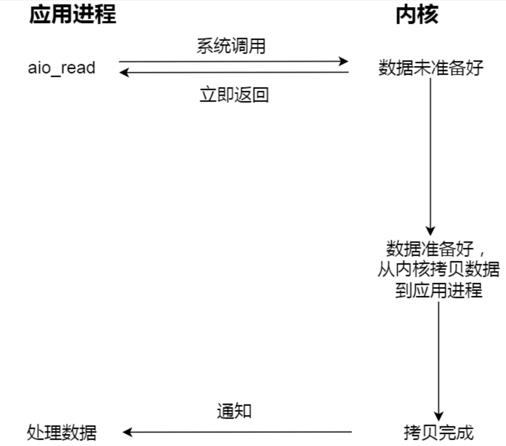

> 总结


I/O 是分为两个过程的：

1. 数据准备的过程
2. 数据从内核空间拷贝到用户进程缓冲区的过程

阻塞 I/O 会阻塞在「过程 1 」和「过程 2」，而非阻塞 I/O 和基于非阻塞 I/O 的多路复用只会阻塞在「过程 2」，所以这三个都可以认为是同步 I/O。

异步 I/O 则不同，「过程 1 」和「过程 2 」都不会阻塞。

> 用故事去理解这几种 I/O 模型

举个你去饭堂吃饭的例子，你好比用户程序，饭堂好比操作系统。

阻塞 I/O 好比，你去饭堂吃饭，但是饭堂的菜还没做好，然后你就一直在那里等啊等，等了好长一段时间终于等到饭堂阿姨把菜端了出来（数据准备的过程），但是你还得继续等阿姨把菜（内核空间）打到你的饭盒里（用户空间），经历完这两个过程，你才可以离开。

非阻塞 I/O 好比，你去了饭堂，问阿姨菜做好了没有，阿姨告诉你没，你就离开了，过几十分钟，你又来饭堂问阿姨，阿姨说做好了，于是阿姨帮你把菜打到你的饭盒里，这个过程你是得等待的。

基于非阻塞的 I/O 多路复用好比，你去饭堂吃饭，发现有一排窗口，饭堂阿姨告诉你这些窗口都还没做好菜，等做好了再通知你，于是等啊等（`select` 调用中），过了一会阿姨通知你菜做好了，但是不知道哪个窗口的菜做好了，你自己看吧。于是你只能一个一个窗口去确认，后面发现 5 号窗口菜做好了，于是你让 5 号窗口的阿姨帮你打菜到饭盒里，这个打菜的过程你是要等待的，虽然时间不长。打完菜后，你自然就可以离开了。

异步 I/O 好比，你让饭堂阿姨将菜做好并把菜打到饭盒里后，把饭盒送到你面前，整个过程你都不需要任何等待。

#### 9.4 同步异步I/O的补充

我们通常会说到同步阻塞IO、同步非阻塞IO，异步IO几种术语

>  什么是阻塞什么是非阻塞

所谓阻塞就是发起读取数据请求的时，当数据还没准备就绪的时候，这时请求是即刻返回，还是在这里等待数据的就绪，如果需要等待的话就是阻塞，反之如果即刻返回就是非阻塞。

> 同步和异步

在IO模型里面如果请求方从发起请求到数据最后完成的这一段过程中都需要自己参与，那么这种我们称为同步请求；反之，如果应用发送完指令后就不再参与过程了，只需要等待最终完成结果的通知，那么这就属于异步。

> 同步阻塞和同步非阻塞

他们不同的只是发起读取请求的时候一个请求阻塞，一个请求不阻塞，但是相同的是，他们都需要应用自己监控整个数据完成的过程。

> 异步非阻塞

而为什么只有异步非阻塞 而没有异步阻塞呢，因为异步模型下请求指定发送完后就即刻返回了，没有任何后续流程了，所以它注定不会阻塞，所以也就只会有异步非阻塞模型了。

## 10. 惊群效应

惊群效应及其避免（等待队列只唤醒一个，但是这是内核后来的做法）

早期内核如何处理惊群效应。如果用锁的话该怎么实现呢——如果监听的事件是在文件上，那么就可以获取文件描述符上的锁，每个进程操作前应该检查其锁标记。

### 1. 概念

> 操作系统中的惊群效应

惊群现象就是多进程（多线程）在同时阻塞等待同一个事件的时候（休眠状态），如果等待的这个事件发生，那么他就会唤醒等待的所有进程（或者线程），但是最终却只可能有一个进程（线程）获得这个时间的“控制权”，对该事件进行处理，而其他进程（线程）获取“控制权”失败且有了性能损失，但只能重新进入休眠状态，这种现象和性能浪费就叫做惊群。

> 举个例子

当你往一群鸽子中间扔一块食物，虽然最终只有一个鸽子抢到食物，但所有鸽子都会被惊动来争夺，没有抢到食物的鸽子只好回去继续睡觉， 等待下一块食物到来。这样，每扔一块食物，都会惊动所有的鸽子，即为惊群。

语义分析：食物只有一块，最终只有一个鸽子抢到，但是惊动了所有鸽子，每个鸽子都跑过来，消耗了每个鸽子的能量。

### 2. 惊群的坏处及性能消耗

1. 系统对用户进程/线程频繁地做无效的调度，上下文切换系统性能大打折扣。

2. 为了确保只有一个线程得到资源，用户必须对资源操作进行加锁保护，进一步加大了系统开销。

分析：

1. 上下文切换（context  switch）过高会导致cpu像搬运工，频繁地在寄存器和运行队列之间奔波，更多的时间花在了进程（线程）切换，而不是在真正工作的进程（线程）上面。直接的消耗包括cpu寄存器要保存和加载（例如程序计器）、系统调度器的代码需要执行。间接的消耗在于多核cache之间的共享数据。
2. 通过锁机制解决惊群效应是一种方法，在任意时刻只让一个进程（线程）处理等待的事件。但是锁机制也会造成cpu等资源的消耗和性能损耗。目前一些常见的服务器软件有的是通过锁机制解决的，比如nginx（它的锁机制是默认开启的，可以关闭）；还有些认为惊群对系统性能影响不大，没有去处理，比如lighttpd。

### 3. 惊群效应发生的几种情况

#### 3.1 accept惊群（新版内核已解决）

> 概念

主进程创建了socket、bind、listen之后，fork()出来多个进程，每个子进程都开始循环处理（accept）这个listen_fd。每个进程都阻塞在accept上，当一个新的连接到来时候，所有的进程都会被唤醒，但是其中只有一个进程会接受成功，其余皆失败，重新休眠。

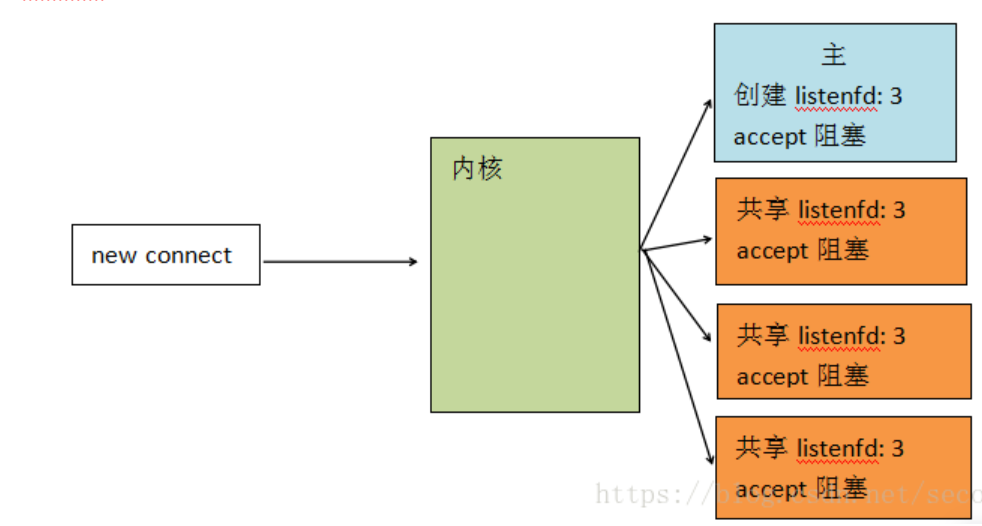

由上图所示：

1. 主线程创建了监听描述符listenfd = 3
2. 主线程fork 三个子进程共享listenfd=3
3. 当有新连接进来时，内核进行处理

在内核2.6之前，所有进程accept都会惊醒，但只有一个可以accept成功，其他返回EGAIN。

> 新版内核的解决

在内核2.6及之后，解决了惊群，在内核中增加了一个**互斥等待变量**。

当内核接收到一个客户连接后，只会唤醒等待队列上的第一个进程（线程）,所以如果服务器采用accept阻塞调用方式，在最新的linux系统中已经没有“惊群效应”了

#### 3.2 epoll惊群

> fork之前创建epollfd（新版内核已解决）

1. 主进程创建listenfd, 创建epollfd
2. 主进程fork多个子进程
3. 每个子进程把listenfd加到epollfd中
4. 当一个连接进来时，会触发epoll惊群，多个子进程的epoll同时会触发

这里的epoll惊群跟accept惊群是类似的，**共享一个epollfd**, 加锁或标记解决。在新版本的epoll中已解决。但在内核2.6及之前是存在的。


> fork之后创建epollfd（新版内核未解决）

1. 主进程创建listendfd

2. 主进程创建多个子进程

3. 每个子进程创建自已的epollfd

4. 每个子进程把listenfd加入到epollfd中

5. 当一个连接进来时，会触发epoll惊群，多个子进程epoll同时会触发

因为每个子进程的epoll是不同的epoll, 虽然listenfd是同一个，但新连接过来时, accept会触发惊群，但内核不知道该发给哪个监听进程，因为**不是同一个epoll。**所以这种惊群内核并没有处理。惊群还是会出现。

> 为什么内核处理了accept的惊群和epoll的第一种惊群，却不处理epoll_wait的惊群

accept确实应该只能被一个进程调用成功，内核很清楚这一点。但epoll不一样，他监听的文件描述符，除了可能后续被accept调用外，还有可能是其他网络IO事件的，而其他IO事件是否只能由一个进程处理，是不一定的，内核不能保证这一点，这是一个由用户决定的事情，例如可能一个文件会由多个进程来读写。所以，对epoll的惊群内核不予处理。

#### 3.3 Nginx惊群的解决

nginx惊群，其实就是上面的问题(fork之后创建epollfd)，下面看看nginx是怎么处理惊群的

在nginx中使用的epoll，是在创建进程后创建的epollfd。因此会出现上面的惊群问题。即每个子进程worker都会惊醒。该流程如下：

| 1    | 主进程创建listenfd                                  |                                               |
| ---- | --------------------------------------------------- | --------------------------------------------- |
| 2    | 主进程fork多个子进程                                |                                               |
| 3    | 每个子进程创建自己的epollfd                         |                                               |
| 4    | 获取accept锁，只有一个子进程把listenfd加入epollfd中 | 同一个时间只有一个进程会把listenfd加入epoll中 |
| 5    | 循环监听                                            |                                               |

> Nginx主动解决惊群的流程：


> 总结

nginx采用互斥锁和主动的方法，避免了惊群，使得nginx中并无惊群

1. nginx里采用了主动的方法去把监听描述符放到epoll中或从epoll移出（这个是nginx的精髓所在，因为大部份的并发架构都是被动的）；
2. nginx中用采互斥锁去解决谁来accept问题，保证了同一时刻，只有一个worker接收新连接（所以nginx并没有惊群问题）；
3. nginx根据自已的载负（最大连接的7/8）情况，决定去不去抢锁，简单方便地解决负载，防止进程因业务太多而导致所有业务都不及时处理。

#### 3.4 线程池惊群

在多线程设计中，经常会用到互斥和条件变量的问题。当一个线程解锁并通知其他线程的时候，就会出现惊群的现象。

1. pthread_mutex_lock/pthread_mutex_unlock：线程互斥锁的加锁及解锁函数；
2. pthread_cond_wait：线程池中的消费者线程等待线程条件变量被通知；
3. pthread_cond_signal/pthread_cond_broadcast：**生产者线程通知线程池中的某个或一些消费者线程池，接收处理任务；**

这里的惊群现象出现在3里，pthread_cond_signal，语义上看，是通知一个线程。调用此函数后，系统会唤醒在相同条件变量上等待的一个或多个线程（可参看手册）。如果通知了多个线程，则发生了惊群。

> 解决方法

1. 所有线程共用一个锁，每个线程有自已的条件变量
2. pthread_cond_signal通知时，定向通知某个线程的条件变量，不会出现惊群


## 11. 零拷贝

### 0. 背景

磁盘可以说是计算机系统最慢的硬件之一，读写速度相差内存 10 倍以上，所以针对优化磁盘的技术非常的多，比如零拷贝、直接 I/O、异步 I/O 等等，这些优化的目的就是为了提高系统的吞吐量，另外操作系统内核中的磁盘高速缓存区，可以有效的减少磁盘的访问次数。

### 1. 直接内存访问（Direct Memory Access）技术

> 没有DMA技术之前的I/O过程

- CPU 发出对应的指令给磁盘控制器，然后返回；

- 磁盘控制器收到指令后，于是就开始准备数据，会把数据放入到磁盘控制器的内部缓冲区中，然后产生一个**中断**；

- CPU 收到中断信号后，停下手头的工作，接着把磁盘控制器的缓冲区的数据一次一个字节地读进自己的寄存器，然后再把寄存器里的数据写入到内存，而在数据传输的期间 CPU 是无法执行其他任务的。

    

    整个数据的传输过程，都要需要 CPU 亲自参与搬运数据的过程，而且这个过程，CPU 是不能做其他事情的。

    简单的搬运几个字符数据那没问题，但是如果我们用千兆网卡或者硬盘传输大量数据的时候，都用 CPU 来搬运的话，肯定忙不过来。

    > DMA技术
    >
    > 进行 I/O 设备和内存的数据传输的时候，数据搬运的工作全部交给 DMA 控制器，而 CPU 不再参与任何与数据搬运相关的事情，这样 CPU 就可以去处理别的事务。

    

具体过程：

- 用户进程调用 read 方法，向操作系统发出 I/O 请求，请求读取数据到自己的内存缓冲区中，进程进入阻塞状态；
- 操作系统收到请求后，进一步将 I/O 请求发送 DMA，然后让 CPU 执行其他任务；
- DMA 进一步将 I/O 请求发送给磁盘；
- 磁盘收到 DMA 的 I/O 请求，把数据从**磁盘**读取到**磁盘控制器的缓冲区**中，当磁盘控制器的缓冲区被读满后，向 DMA 发起中断信号，告知自己缓冲区已满；
- DMA 收到磁盘的信号，将磁盘控制器缓冲区中的数据拷贝到**内核缓冲区**中，此时不占用 CPU，CPU 可以执行其他任务；
- 当 DMA 读取了足够多的数据，就会发送中断信号给 CPU；
- CPU 收到 DMA 的信号，知道数据已经准备好，于是将数据从**内核拷贝到用户空间**，系统调用返回；

整个**数据传输的过程**，CPU 不再参与数据搬运的工作，而是**全程由 DMA 完成**，但是 CPU 在这个过程中也是必不可少的，因为传输什么数据，从哪里传输到哪里，都需要 CPU 来告诉 DMA 控制器。

早期 DMA 只存在在主板上，如今由于 I/O 设备越来越多，数据传输的需求也不尽相同，所以每个 I/O 设备里面都有自己的 DMA 控制器

### 2. 传统的文件传输

传统 I/O 的工作方式是，数据读取和写入是从用户空间到内核空间来回复制，而内核空间的数据是通过操作系统层面的 I/O 接口从磁盘读取或写入。代码通常如下，一般会需要两个系统调用：

```C++
read(file, tmp_buf, len);
write(socket, tmp_buf, len);
```

这两行代码的过程：


首先，期间共**发生了 4 次用户态与内核态的上下文切换**，因为发生了两次系统调用，一次是 `read()` ，一次是 `write()`，每次系统调用都得先从用户态切换到内核态，等内核完成任务后，再从内核态切换回用户态。

上下文切换到成本并不小，一次切换需要耗时几十纳秒到几微秒，虽然时间看上去很短，但是在高并发的场景下，这类时间容易被累积和放大，从而影响系统的性能。

其次，还**发生了 4 次数据拷贝**，其中两次是 DMA 的拷贝，另外两次则是通过 CPU 拷贝的，下面说一下这个过程：

- *第一次拷贝*，把**磁盘上（磁盘缓冲区）**的数据拷贝到**操作系统内核的缓冲区**里，这个拷贝的过程是通过 DMA 搬运的。
- *第二次拷贝*，把**内核缓冲区**的数据拷贝到**用户的缓冲区**里，于是我们应用程序就可以使用这部分数据了，这个拷贝到过程是由 CPU 完成的。
- *第三次拷贝*，把刚才拷贝到用户的缓冲区里的数据，再拷贝到**内核的 socket 的缓冲区**里，这个过程依然还是由 CPU 搬运的。
- *第四次拷贝*，把内核的 socket 缓冲区里的数据，拷贝到**网卡的缓冲区**里，这个过程又是由 DMA 搬运的。

综上所述，我们只是搬运一份数据，结果却搬运了 4 次，过多的数据拷贝无疑会消耗 CPU 资源，大大降低了系统性能。

这种简单又传统的文件传输方式，存在冗余的上文切换和数据拷贝，在高并发系统里是非常糟糕的，多了很多不必要的开销，会严重影响系统性能。

所以，**要想提高文件传输的性能，就需要减少「用户态与内核态的上下文切换」和「内存拷贝」的次数**。

### 3. 优化文件传输的性能

> 如何减少 用户态与内核态的上下文切换 的次数呢？

读取磁盘数据的时候，之所以要发生上下文切换，这是因为**用户空间没有权限操作磁盘或网卡，内核的权限最高，这些操作设备的过程都需要交由操作系统内核来完成**，所以一般要通过内核去完成某些任务的时候，就需要使用操作系统提供的**系统调用函数**。而一次系统调用必然会发生 2 次上下文切换：首先从用户态切换到内核态，当内核执行完任务后，再切换回用户态交由进程代码执行。

所以，**要想减少上下文切换到次数，就要减少系统调用的次数**。

> 如何减少「数据拷贝」的次数？

在前面我们知道了，传统的文件传输方式会历经 4 次数据拷贝，而且这里面，「从内核的读缓冲区拷贝到用户的缓冲区里，再从用户的缓冲区里拷贝到 socket 的缓冲区里」，这个过程是没有必要的。

因为文件传输的应用场景中，**在用户空间我们并不会对数据再加工**，所以数据实际上可以不用搬运到用户空间，因此**用户的缓冲区是没有必要存在的**。

### 4. 零拷贝（不涉及 CPU 拷贝数据）

零拷贝就是一种避免 CPU 将数据从一块存储拷贝到另外一块存储的技术。零拷贝技术可以减少数据拷贝和共享总线操作的次数。零拷贝技术实现的方式通常有 2 种：

- mmap + write
- sendfile

#### 4.1 mmap + write

`read()` 系统调用的过程中会把内核缓冲区的数据拷贝到用户的缓冲区里，于是为了减少这一步开销，我们可以用 `mmap()` 替换 `read()` 系统调用函数。

```C++
buf = mmap(file, len);
write(sockfd, buf, len);
```

`mmap()` 系统调用函数会直接把内核缓冲区里的数据**映射**到用户空间，这样，操作系统内核与用户空间就不需要再进行任何的数据拷贝操作。


具体过程如下：

- 应用进程调用了 `mmap()` 后，DMA 会把磁盘的数据拷贝到内核的缓冲区里。接着，**应用进程跟操作系统内核「共享」这个缓冲区**；
- 应用进程再调用 `write()`，操作系统直接将**内核缓冲区的数据拷贝到 socket 缓冲区**中，这一切都发生在**内核态**，由 CPU 来搬运数据；
- 最后，把内核的 socket 缓冲区里的数据，拷贝到网卡的缓冲区里，这个过程是由 DMA 搬运的。

我们可以得知，通过使用 `mmap()` 来代替 `read()`， 可以减少一次数据拷贝的过程。

但这还不是最理想的零拷贝，因为仍然需要通过 CPU 把内核缓冲区的数据拷贝到 socket 缓冲区里，而且仍然需要 4 次上下文切换，因为系统调用还是 2 次。

#### 4.2 sendfile

Linux内核版本2.1中提供了一个专门发送文件的系统调用函数sendfile()，其函数形式为：

```C++
#include <sys/socket.h>
ssize_t sendfile(int out_fd, int in_fd, off_t *offset, size_t count);
```

它的前两个参数分别是目的端和源端的文件描述符，后面两个参数是源端的偏移量和复制数据的长度，返回值是实际复制数据的长度。

首先，它可以替代前面的 `read()` 和 `write()` 这两个系统调用，这样就可以减少一次系统调用，也就减少了 2 次上下文切换的开销。

其次，该系统调用，可以直接把内核缓冲区里的数据拷贝到 socket 缓冲区里，不再拷贝到用户态，这样就只有 2 次上下文切换，和 3 次数据拷贝。如下图：


#### 4.3 支持 SG-DMA 的sendfile() [真正完全的零拷贝]

但是这还不是真正的零拷贝技术，如果网卡支持 SG-DMA（*The Scatter-Gather Direct Memory Access*）技术（和普通的 DMA 有所不同），我们可以进一步减少通过 CPU 把内核缓冲区里的数据拷贝到 socket 缓冲区的过程。

可以在linux系统中通过下面命令查看网卡是否支持scatter-gather特性：

```C++
$ ethtool -k eth0 | grep scatter-gather
scatter-gather: on
```

从 Linux 内核 `2.4` 版本开始起，对于支持网卡支持 SG-DMA 技术的情况下， `sendfile()` 系统调用的过程发生了点变化，具体过程如下：

- 第一步，通过 DMA 将磁盘上的数据拷贝到内核缓冲区里；
- 第二步，缓冲区描述符和数据长度传到 socket 缓冲区，这样网卡的 SG-DMA 控制器就可以直接将内核缓存中的数据拷贝到网卡的缓冲区里，此过程不需要将数据从操作系统内核缓冲区拷贝到 socket 缓冲区中，这样就减少了一次数据拷贝；

所以这个过程只进行了两次数据拷贝：


这就是所谓的**零拷贝（\*Zero-copy\*）技术，因为我们没有在内存层面去拷贝数据，也就是说全程没有通过 CPU 来搬运数据，所有的数据都是通过 DMA 来进行传输的。**。

零拷贝技术的文件传输方式相比传统文件传输的方式，减少了 2 次上下文切换和数据拷贝次数，**只需要 2 次上下文切换和数据拷贝次数，就可以完成文件的传输，而且 2 次的数据拷贝过程，都不需要通过 CPU，2 次都是由 DMA 来搬运。**

所以，总体来看，**零拷贝技术可以把文件传输的性能提高至少一倍以上**。

#### 4.4 使用零拷贝技术的项目

Kafka 这个开源项目，就利用了「零拷贝」技术，从而大幅提升了 I/O 的吞吐率，这也是 Kafka 在处理海量数据时非常快的原因之一。

如果追溯 Kafka 文件传输的代码会发现，最终它调用了 Java NIO 库里的 `transferTo` 方法：

```java
@Overridepublic 
long transferFrom(FileChannel fileChannel, long position, long count) throws IOException { 
    return fileChannel.transferTo(position, count, socketChannel);
}
```

如果 Linux 系统支持 `sendfile()` 系统调用，那么 `transferTo()` 实际上最后就会使用到 `sendfile()` 系统调用函数。

另外，Nginx 也支持零拷贝技术，一般默认是开启零拷贝技术，这样有利于提高文件传输的效率，是否开启零拷贝技术的配置如下：

```nginx
http {
...
    sendfile on
...
}
```

sendfile 配置的具体意思:

- 设置为 on 表示，使用零拷贝技术来传输文件：sendfile ，这样只需要 2 次上下文切换，和 2 次数据拷贝。
- 设置为 off 表示，使用传统的文件传输技术：read + write，这时就需要 4 次上下文切换，和 4 次数据拷贝。

当然，要使用 sendfile，Linux 内核版本必须要 2.1 以上的版本.

#### 4.5 附-C++中的 emplace_back()

C++中，vector的一个成员函数**emplace_back()**很好地**体现了零拷贝技术**，它跟push_back()函数一样可以将一个元素插入容器尾部，区别在于：使用push_back()函数需要**调用拷贝构造函数和转移构造函数**，而使用emplace_back()插入的元素**原地构造**，不需要触发拷贝构造和转移构造，效率更高。举个例子：

```C++
#include <vector>
#include <string>
#include <iostream>
using namespace std;
struct Person {
    string name;
    int age;
    //初始构造函数
    Person(string p_name, int p_age): name(std::move(p_name)), age(p_age) {
        cout << "I have been constructed" << endl;
    }
    //拷贝构造函数
    Person(const Person& other): name(std::move(other.name)), age(other.age) {
        cout << "I have been copy constructed" << endl;
    }
    //转移构造函数
    Person(Person&& other): name(std::move(other.name)), age(other.age) {
        cout << "I have been moved" << endl;
    }
};
int main() {
    vector<Person> e;
    cout << "emplace_back:" << endl;
    e.emplace_back("Jane", 23); //不用构造类对象
    vector<Person> p;
    cout << "push_back:"<< endl;
    p.push_back(Person("Mike", 36));
    return 0; 
}

// 输出结果：
// emplace_back:
// I have been constructed
// push_back:
// I have been constructed
// I am being moved.
```


### 5. PageCache的作用

> 背景

前面说的文件传输过程，其中第一步都是先需要先把磁盘文件数据拷贝「内核缓冲区」里，这个「内核缓冲区」实际上是**磁盘高速缓存（\*PageCache\*）**。由于零拷贝使用了 PageCache 技术，可以使得零拷贝进一步提升了性能，我们接下来看看 PageCache 是如何做到这一点的。

读写磁盘相比读写内存的速度慢太多了，所以我们应该想办法把「读写磁盘」替换成「读写内存」。于是，我们会通过 DMA 把磁盘里的数据搬运到内存里，这样就可以用读内存替换读磁盘。但是，内存空间远比磁盘要小，内存注定只能拷贝磁盘里的一小部分数据。那问题来了，选择哪些磁盘数据拷贝到内存呢？

> PageCache的作用

因为程序运行的时候具有「局部性」，所以通常刚被访问的数据在短时间内再次被访问的概率很高，于是我们可以用 **PageCache 来缓存最近被访问的数据**，当空间不足时淘汰最久未被访问的缓存。所以，读磁盘数据的时候，优先在 PageCache 找，如果数据存在则可以直接返回；如果没有，则从磁盘中读取，然后缓存在 PageCache 中。

还有一点，读取磁盘数据的时候，需要找到数据所在的位置，但是对于机械磁盘来说，就是通过磁头旋转到数据所在的扇区，再开始「顺序」读取数据，但是旋转磁头这个物理动作是非常耗时的，为了降低它的影响，**PageCache 使用了「预读功能」**。

比如，假设 read 方法每次只会读 `32 KB` 的字节，虽然 read 刚开始只会读 0 ～ 32 KB 的字节，但内核会把其后面的 32～64 KB 也读取到 PageCache，这样后面读取 32～64 KB 的成本就很低，如果在 32～64 KB 淘汰出 PageCache 前，进程读取到它了，收益就非常大。

所以，PageCache 的优点主要是两个：

- 缓存最近被访问的数据；
- 预读功能；

这两个做法，将大大提高读写磁盘的性能。

> PageCache的劣势

**在传输大文件（GB 级别的文件）的时候，PageCache 会不起作用，那就白白浪费 DMA 多做的一次数据拷贝，造成性能的降低，即使使用了 PageCache 的零拷贝也会损失性能**

这是因为如果有很多 GB 级别文件需要传输，每当用户访问这些大文件的时候，内核就会把它们载入 PageCache 中，于是 PageCache 空间很快被这些大文件占满。另外，由于文件太大，可能某些部分的文件数据被再次访问的概率比较低，这样就会带来 2 个问题：

- PageCache 由于长时间被大文件占据，其他「热点」的小文件可能就无法充分使用到 PageCache，于是这样磁盘读写的性能就会下降了；
- PageCache 中的大文件数据，由于没有享受到缓存带来的好处，但却耗费 DMA 多拷贝到 PageCache 一次；

所以，针对大文件的传输，不应该使用 PageCache，也就是说不应该使用零拷贝技术，因为可能由于 PageCache 被大文件占据，而导致「热点」小文件无法利用到 PageCache，这样在高并发的环境下，会带来严重的性能问题。

### 6. 大文件的传输方式

> 直接I/O

对于最初的例子，当调用 read 方法读取文件时，进程实际上会阻塞在 read 方法调用，因为要等待磁盘数据的返回，如下图：


具体过程：

- 当调用 read 方法时，会阻塞着，此时内核会向磁盘发起 I/O 请求，磁盘收到请求后，便会寻址，当磁盘数据准备好后，就会向内核发起 I/O 中断，告知内核磁盘数据已经准备好；
- 内核收到 I/O 中断后，就将数据从磁盘控制器缓冲区拷贝到 PageCache 里；
- 最后，内核再把 PageCache 中的数据拷贝到用户缓冲区，于是 read 调用就正常返回了。

> 异步I/O

对于阻塞的问题，可以用异步 I/O 来解决，它工作方式如下图：


它把读操作分为两部分：

- 前半部分，内核向磁盘发起读请求，但是可以**不等待数据就位就可以返回**，于是进程此时可以处理其他任务；
- 后半部分，当内核将磁盘中的数据拷贝到进程缓冲区后，进程将接收到内核的**通知**，再去处理数据；

而且，我们可以发现，异步 I/O 并没有涉及到 PageCache，所以使用异步 I/O 就意味着要绕开 PageCache。

绕开 PageCache 的 I/O 叫直接 I/O，使用 PageCache 的 I/O 则叫缓存 I/O。通常，对于磁盘，异步 I/O 只支持直接 I/O。

前面也提到，大文件的传输不应该使用 PageCache，因为可能由于 PageCache 被大文件占据，而导致「热点」小文件无法利用到 PageCache。

> 大文件的传输

**在高并发的场景下，针对大文件的传输的方式，应该使用「异步 I/O + 直接 I/O」来替代零拷贝技术**。

直接 I/O 应用场景常见的两种：

- 应用程序已经实现了磁盘数据的缓存，那么可以不需要 PageCache 再次缓存，减少额外的性能损耗。在 MySQL 数据库中，可以通过参数设置开启直接 I/O，默认是不开启；
- 传输大文件的时候，由于大文件难以命中 PageCache 缓存，而且会占满 PageCache 导致「热点」文件无法充分利用缓存，从而增大了性能开销，因此，这时应该使用直接 I/O。

另外，由于直接 I/O 绕过了 PageCache，就无法享受内核的这两点的优化：

- 内核的 I/O 调度算法会缓存尽可能多的 I/O 请求在 PageCache 中，最后「**合并**」成一个更大的 I/O 请求再发给磁盘，这样做是为了减少磁盘的寻址操作；
- 内核也会「**预读**」后续的 I/O 请求放在 PageCache 中，一样是为了减少对磁盘的操作；

于是，传输大文件的时候，使用「异步 I/O + 直接 I/O」了，就可以无阻塞地读取文件了。

> 总结

所以，传输文件的时候，我们要根据文件的大小来使用不同的方式：

- 传输大文件的时候，使用「异步 I/O + 直接 I/O」；
- 传输小文件的时候，则使用「零拷贝技术」；

在 nginx 中，我们可以用如下配置，来根据文件的大小来使用不同的方式：

```nginx
location /video/ { 
    sendfile on;	# 零拷贝
    aio on; 	    # 异步I/O
    directio 1024m; # 直接I/O
}
```


## 12. 五种IO模型与I/O多路复用

### 1. 最基本的Socket模型

服务器的程序要先跑起来，然后等待客户端的连接和数据。

> 服务端的 Socket 编程

服务端首先调用 `socket()` 函数，创建网络协议为 IPv4，以及传输协议为 TCP 的 Socket ，接着调用 `bind()` 函数，给这个 Socket 绑定一个 **IP 地址和端口**，绑定这两个的目的是什么？

- 绑定端口的目的：当内核收到 TCP 报文，通过 TCP 头里面的端口号，来找到我们的应用程序，然后把数据传递给我们。
- 绑定 IP 地址的目的：一台机器是可以有多个网卡的，每个网卡都有对应的 IP 地址，当绑定一个网卡时，内核在收到该网卡上的包，才会发给我们；

绑定完 IP 地址和端口后，就可以调用 `listen()` 函数进行监听，此时对应 TCP 状态图中的 `listen`，如果我们要判定服务器中一个网络程序有没有启动，可以通过 `netstat` 命令查看对应的端口号是否有被监听。

服务端进入了监听状态后，通过调用 `accept()` 函数，来从内核获取客户端的连接，如果没有客户端连接，则会阻塞等待客户端连接的到来。

> 客户端发起连接过程

客户端在创建好 Socket 后，调用 `connect()` 函数发起连接，该函数的参数要指明服务端的 IP 地址和端口号，然后万众期待的 TCP 三次握手就开始了。

在 TCP 连接的过程中，服务器的内核实际上为每个 Socket 维护了两个队列：

- 一个是还没完全建立连接的队列，称为 **TCP 半连接队列**，这个队列都是没有完成三次握手的连接，此时服务端处于 `syn_rcvd` 的状态；
- 一个是一件建立连接的队列，称为 **TCP 全连接队列**，这个队列都是完成了三次握手的连接，此时服务端处于 `established` 状态；

当 TCP 全连接队列不为空后，服务端的 `accept()` 函数，就会从内核中的 TCP 全连接队列里拿出一个已经完成连接的 Socket 返回应用程序，后续数据传输都用这个 Socket。

注意，监听的 Socket 和真正用来传数据的 Socket 是两个：

- 一个叫作**监听 Socket**；
- 一个叫作**已连接 Socket**；

连接建立后，客户端和服务端就开始相互传输数据了，双方都可以通过 `read()` 和 `write()` 函数来读写数据。

至此， TCP 协议的 Socket 程序的调用过程就结束了，整个过程如下图：


读写 Socket 的方式，好像读写文件一样。因为基于 Linux 一切皆文件的理念，在内核中 Socket 也是以「文件」的形式存在的，也是有对应的文件描述符。

### 2. 服务更多的用户

前面提到的 TCP Socket 调用流程是最简单、最基本的，它基本只能一对一通信，因为使用的是同步阻塞的方式，当服务端在还没处理完一个客户端的网络 I/O 时，或者 读写操作发生阻塞时，其他客户端是无法与服务端连接的。

> 提问-服务器单机理论最大能连接多少个客户端？

可如果我们服务器只能服务一个客户，那这样就太浪费资源了，于是我们要改进这个网络 I/O 模型，以支持更多的客户端。

 TCP 连接是由**四元组**唯一确认的，这个四元组就是：**本机IP, 本机端口, 对端IP, 对端端口**。

对于 IPv4，客户端的 IP 数最多为 2 的 32 次方，客户端的端口数最多为 2 的 16 次方，也就是**服务端单机最大 TCP 连接数约为 2 的 48 次方**。这个理论值相当“丰满”，但是服务器肯定承载不了那么大的连接数，主要会受两个方面的限制：

1. **文件描述符**，Socket 实际上是一个文件，也就会对应一个文件描述符。在 Linux 下，单个进程打开的文件描述符数是有限制的，没有经过修改的值一般都是 1024，不过我们可以通过 ulimit 增大文件描述符的数目；
2. **系统内存**，每个 TCP 连接在内核中都有对应的数据结构，意味着每个连接都是会占用一定内存的；

> 那如果服务器的内存只有 2 GB，网卡是千兆的，能支持并发 1 万请求吗？

并发 1 万请求，也就是经典的 C10K 问题 ，C 是 Client 单词首字母缩写，C10K 就是单机同时处理 1 万个请求的问题。

从硬件资源角度看，对于 2GB 内存千兆网卡的服务器，如果每个请求处理占用不到 200KB 的内存和 100Kbit 的网络带宽就可以满足并发 1 万个请求。

不过，要想真正实现 C10K 的服务器，要考虑的地方在于服务器的网络 I/O 模型，效率低的模型，会加重系统开销，从而会离 C10K 的目标越来越远

### 3. 多进程模型

基于最原始的阻塞网络 I/O， 如果服务器要支持多个客户端，其中比较传统的方式，就是使用**多进程模型**，也就是为每个客户端分配一个进程来处理请求。

服务器的**主进程负责监听客户的连接**，一旦与客户端连接完成，accept() 函数就会返回一个「已连接 Socket」，这时就通过 `fork()` 函数创建一个子进程，实际上就把父进程所有相关的东西都**复制**一份，包括文件描述符、内存地址空间、程序计数器、执行的代码等。

这两个进程刚复制完的时候，几乎一摸一样。不过，会根据**返回值**来区分是父进程还是子进程，如果返回值是 0，则是子进程；如果返回值是其他的整数，就是父进程。

正因为子进程会**复制父进程的文件描述符**，于是就可以直接使用「已连接 Socket 」和客户端通信了，

可以发现，**子进程不需要关心「监听 Socket」，只需要关心「已连接 Socket」；父进程则相反，将客户服务交给子进程来处理，因此父进程不需要关心「已连接 Socket」，只需要关心「监听 Socket」。**

下面这张图描述了从连接请求到连接建立，父进程创建不同的子进程为不同的客户端服务。


另外，当「子进程」退出时，实际上内核里还会保留该进程的一些信息，也是会占用内存的，如果不做好“回收”工作，就会变成**僵尸进程**，随着僵尸进程越多，会慢慢耗尽我们的系统资源。

因此，父进程要“善后”好自己的孩子，怎么善后呢？那么有两种方式可以在子进程退出后回收资源，分别是调用 `wait()` 和 `waitpid()` 函数。

这种用多个进程来应付多个客户端的方式，在应对 100 个客户端还是可行的，但是当客户端数量高达一万时，肯定扛不住的，因为每产生一个进程，必会占据一定的系统资源，而且进程间上下文切换的“包袱”是很重的，性能会大打折扣。

进程的上下文切换不仅包含了虚拟内存、栈、全局变量等用户空间的资源，还包括了内核堆栈、寄存器等内核空间的资源。

### 4. 多线程模型

因为进程间上下文切换的开销很大，那就搞个比较轻量级的模型来应对多用户的请求 —— **多线程模型**。

线程是运行在进程中的一个“逻辑流”，单进程中可以运行多个线程，同进程里的线程可以共享进程的部分资源的，比如文件描述符列表、进程空间、代码、全局数据、堆、共享库等，这些共享些资源在上下文切换时是不需要切换，而只需要切换线程的私有数据、寄存器等不共享的数据，因此同一个进程下的线程上下文切换的开销要比进程小得多。

当服务器与客户端 TCP 完成连接后，通过 `pthread_create()` 函数创建线程，然后将**「已连接 Socket」的文件描述符**传递给线程函数，接着在线程里和客户端进行通信，从而达到**并发处理**的目的。

如果每来一个连接就创建一个线程，线程运行完后，还得操作系统还得销毁线程，虽说线程切换的上写文开销不大，但是如果频繁创建和销毁线程，系统开销也是不小的。

那么，我们可以使用**线程池**的方式来避免线程的频繁创建和销毁，所谓的线程池，就是提前创建若干个线程，这样当由新连接建立时，将这个已连接的 Socket 放入到一个队列里，然后线程池里的线程负责从队列中取出已连接 Socket 进程处理。


需要注意的是，这个队列是全局的，每个线程都会操作，为了避免多线程竞争，线程在操作这个队列前要加锁。

上面基于进程或者线程模型的，其实还是有问题的。新到来一个 TCP 连接，就需要分配一个进程或者线程，那么如果要达到 C10K，意味着要一台机器维护 1 万个连接，相当于要维护 1 万个进程/线程，操作系统就算死扛也是扛不住的。

### 5. I/O多路复用

既然为每个请求分配一个进程/线程的方式不合适，那有没有可能只使用一个进程来维护多个 Socket 呢？答案是有的，那就是 **I/O 多路复用**技术：


一个进程虽然任一时刻只能处理一个请求，但是处理每个请求的事件时，耗时控制在 1 毫秒以内，这样 1 秒内就可以处理上千个请求，把时间拉长来看，多个请求复用了一个进程，这就是多路复用，这种思想很类似一个 CPU 并发多个进程，所以也叫做**时分多路复用**。

我们熟悉的 select/poll/epoll 内核提供给用户态的多路复用系统调用，**进程可以通过一个系统调用函数从内核中获取多个事件**。

select/poll/epoll 是如何获取网络事件的呢？在获取事件时，先把所有连接（文件描述符）传给内核，再由内核返回产生了事件的连接，然后在用户态中再处理这些连接对应的请求即可。

select/poll/epoll 这是三个多路复用接口，都能实现 C10K 吗？接下来，我们分别说说它们。

### 6. select/poll

> select

select 实现多路复用的方式是，将已连接的 Socket 都放到一个**文件描述符集合**，然后调用 select 函数将文件描述符集合**拷贝**到内核里，让内核来检查是否有网络事件产生，检查的方式很粗暴，就是通过**遍历**文件描述符集合的方式，当检查到有事件产生后，将此 Socket 标记为可读或可写， 接着再把整个文件描述符集合**拷贝**回用户态里，然后用户态还需要再通过**遍历**的方法找到可读或可写的 Socket，然后再对其处理。

所以，对于 select 这种方式，需要进行 **2 次「遍历」文件描述符集合**，一次是在内核态里，一个次是在用户态里 ，而且还会发生 **2 次「拷贝」文件描述符集合**，先从用户空间传入内核空间，由内核修改后，再传出到用户空间中。

select 使用固定长度的 BitsMap，表示文件描述符集合，而且所支持的文件描述符的个数是有限制的，在 Linux 系统中，由内核中的 FD_SETSIZE 限制， 默认最大值为 `1024`，只能监听 0~1023 的文件描述符。

select()的工作过程分析图示：


select()的缺点：


> poll

poll 不再用 BitsMap 来存储所关注的文件描述符，取而代之用动态数组，以链表形式来组织，突破了 select 的文件描述符个数限制，当然还会受到系统文件描述符限制。


但是 poll 和 select 并没有太大的本质区别，**都是使用「线性结构」存储进程关注的 Socket 集合，因此都需要遍历文件描述符集合来找到可读或可写的 Socket，时间复杂度为 O(n)，而且也需要在用户态与内核态之间拷贝文件描述符集合**，这种方式随着并发数上来，性能的损耗会呈指数级增长。

> 总结

select 和 poll 并没有本质区别，它们内部都是使用「线性结构」来存储进程关注的 Socket 集合。

在使用的时候，首先需要把关注的 Socket 集合通过 select/poll 系统调用**从用户态拷贝到内核态**，然后由内核检测事件，当有网络事件产生时，内核需要遍历进程关注 Socket 集合，找到对应的 Socket，并设置其状态为可读/可写，然后把整个 Socket 集合**从内核态拷贝到用户态**，用户态还要继续遍历整个 Socket 集合找到可读/可写的 Socket，然后对其处理。

很明显发现，select 和 poll 的缺陷在于，当客户端越多，也就是 Socket 集合越大，Socket 集合的遍历和拷贝会带来很大的开销，因此也很难应对 C10K。

### 7. epoll

先复习下 epoll 的用法。如下的代码中，先用epoll_create 创建一个 epoll 对象 epfd，再通过 epoll_ctl 将需要监视的 socket 添加到epfd中，最后调用 epoll_wait 等待数据。

```C++
int s = socket(AF_INET, SOCK_STREAM, 0);
bind(s, ...);
listen(s, ...)

int epfd = epoll_create(...);
epoll_ctl(epfd, ...); //将所有需要监听的socket添加到epfd中

while(1) {
    int n = epoll_wait(...);
    for(接收到数据的socket){
        //处理
    }
}
```

epoll 通过两个方面，很好解决了 select/poll 的问题。


*第一点*，epoll 在内核里使用**红黑树来跟踪进程所有待检测的文件描述字**，把需要监控的 socket 通过 `epoll_ctl()` 函数加入内核中的红黑树里，红黑树是个高效的数据结构，增删改一般时间复杂度是 `O(logn)`。而 select/poll 内核里没有类似 epoll 红黑树这种保存所有待检测的 socket 的数据结构，所以 **select/poll 每次操作时都传入整个 socket 集合给内核**，而 epoll 因为在内核维护了红黑树，可以保存所有待检测的 socket ，所以只需要传入一个待检测的 socket，减少了内核和用户空间大量的数据拷贝和内存分配。

*第二点*， epoll 使用**事件驱动**的机制，内核里**维护了一个链表来记录就绪事件**，当某个 socket 有事件发生时，通过**回调函数**内核会将其加入到这个就绪事件列表中，当用户调用 `epoll_wait()` 函数时，只会返回有事件发生的文件描述符的个数，不需要像 select/poll 那样轮询扫描整个 socket 集合，大大提高了检测的效率。


epoll 的方式即使监听的 Socket 数量越多的时候，效率也不会大幅度降低，能够同时监听的 Socket 的数目也非常的多，上限就是系统定义的进程能打开的最大文件描述符个数。因而，**epoll 被称为解决 C10K 问题的利器**。

### 8. 边缘触发与水平触发

epoll 支持两种事件触发模式，分别是**边缘触发（edge-triggered，ET）和 水平触发（level-triggered，LT）**。

- 使用边缘触发模式时，当被监控的 Socket 描述符上有可读事件发生时，**服务器端只会从 epoll_wait 中苏醒一次**，即使进程没有调用 read 函数从内核读取数据，也依然只苏醒一次，因此我们程序要保证一次性将内核缓冲区的数据读取完；
- 使用水平触发模式时，当被监控的 Socket 上有可读事件发生时，**服务器端不断地从 epoll_wait 中苏醒，直到内核缓冲区数据被 read 函数读完才结束**，目的是告诉我们有数据需要读取；

> 举例
>
> 你的快递被放到了一个快递箱里，如果快递箱只会通过短信通知你一次，即使你一直没有去取，它也不会再发送第二条短信提醒你，这个方式就是边缘触发；如果快递箱发现你的快递没有被取出，它就会不停地发短信通知你，直到你取出了快递，它才消停，这个就是水平触发的方式。

两者的区别就是水平触发的意思是只要满足事件的条件，比如内核中有数据需要读，就一直不断地把这个事件传递给用户；而边缘触发的意思是只有第一次满足条件的时候才触发，之后就不会再传递同样的事件了

如果使用水平触发模式，当内核通知文件描述符可读写时，接下来还可以继续去检测它的状态，看它是否依然可读或可写。所以在收到通知后，没必要一次执行尽可能多的读写操作。

如果使用边缘触发模式，I/O 事件发生时只会通知一次，而且我们不知道到底能读写多少数据，所以在收到通知后应尽可能地读写数据，以免错失读写的机会，因此我们会**循环**从文件描述符读写数据。那么如果文件描述符是阻塞的，没有数据可读写时，进程会阻塞在读写函数那里，程序就没办法继续往下执行。所以，**边缘触发模式一般和非阻塞 I/O 搭配使用**，程序会一直执行 I/O 操作，直到系统调用（如 `read` 和 `write`）返回错误，错误类型为 `EAGAIN` 或 `EWOULDBLOCK`。

> 效率对比

一般来说，边缘触发的效率比水平触发的效率要高，因为边缘触发可以减少 epoll_wait 的系统调用次数，系统调用也是有一定的开销的的，毕竟也存在上下文的切换。

select/poll 只有水平触发模式，epoll 默认的触发模式是水平触发，但是可以根据应用场景设置为边缘触发模式。

> 注意
>
> epoll 支持边缘触发和水平触发的方式，而 select/poll 只支持水平触发，一般而言，边缘触发的方式会比水平触发的效率高。

## 13. 原子操作如何实现

**处理器使用基于对缓存加锁或总线加锁的方式来实现多处理器之间的原子操作。**

首先处理器会自动保证**基本的内存操作**的原子性。处理器保证从系统内存中读取或者写入一个字节是原子的，意思是当一个处理器读取一个字节时，其他处理器不能访问这个字节的内存地址。但是复杂的内存操作处理器是不能自动保证其原子性的，比如跨总线宽度、跨多个缓存行和跨页表的访问。但是，处理器提供**总线锁定**和**缓存锁定**两个机制来保证复杂内存操作的原子性。

> 1. 总线锁保证原子性

如果多个处理器同时对共享变量进行读改写操作（i++就是经典的读改写操作），那么共享变量就会被多个处理器同时进行操作，这样读改写操作就不是原子的，操作完之后共享变量的值会和期望的不一致。举个例子，如果i=1，我们进行两次i++操作，我们期望的结果是3，但是有可能结果是2，如下图所示。


原因可能是多个处理器同时从各自的缓存中读取变量i，分别进行加1操作，然后分别写入系统内存中。那么，想要保证读改写共享变量的操作是原子的，就必须保证CPU1读改写共享变量的时候，CPU2不能操作缓存了该共享变量内存地址的缓存。

处理器使用总线锁就是来解决这个问题的。所谓总线锁就是使用处理器提供的一个 LOCK＃信号，当一个处理器在总线上输出此信号时，其他处理器的请求将被阻塞住，那么该处理器可以独占共享内存。

> 2. 使用缓存锁保证原子性

在同一时刻，我们只需保证对某个内存地址的操作是原子性即可，但总线锁定把CPU和内存之间的通信锁住了，这使得锁定期间，其他处理器不能操作其他内存地址的数据，所以总线锁定的开销比较大，目前处理器在某些场合下使用缓存锁定代替总线锁定来进行优化。

所谓“缓存锁定”是指内存区域如果被缓存在处理器的缓存行中，并且在Lock操作期间被锁定，那么当它执行锁操作回写到内存时，处理器不在总线上声言LOCK＃信号，而是修改内部的内存地址，并允许它的**缓存一致性**机制来保证操作的原子性，因为**缓存一致性机制会阻止同时修改由两个以上处理器缓存的内存区域数据**，当其他处理器回写已被锁定的缓存行的数据时，会使缓存行无效，在如上图所示的例子中，当CPU1修改缓存行中的 i 时使用了缓存锁定，那么CPU2就不能使用同时缓存 i 的缓存行。

但是有两种情况下处理器不会使用缓存锁定。

第一种情况是：当操作的数据不能被缓存在处理器内部，或操作的数据跨多个缓存行（cache line）时，则处理器会调用总线锁定。

第二种情况是：有些处理器不支持缓存锁定。对于Intel 486和Pentium处理器，就算锁定的内存区域在处理器的缓存行中也会调用总线锁定。


进程管理

C++11的线程 /锁；

在实际情况中文件相互引用也会造成死锁 -> 链接时候的头文件引用情况

网络系统：   

else

32位机的寻址空间

服务器端口未打开怎么通知客户端，客户端在哪一阶段发现服务器端口未打开


# 5. 数据库

## 1. 关系型数据库和非关系型型数据库

### 1. 概念

关系型数据库（RDBMS）的存储数据就是一张张**表**，每张表都包含数据之间的关系。

1. Oracle数据库 （老大，最挣钱的数据库） 

2. MySQL数据库 （最流行中型数据库）

3. SQL server数据库 （Windows上最好的数据库） 

4. PostgreSQL（功能最强大的开源数据库） 

5. SQLite（最流行的嵌入式数据库） 

非关系型数据库也叫NOSQL，采用**键值对**的形式进行存储。它的读写性能很高，易于扩展，可分为内存型数据库以及文档型数据库

1. Redis（最好的缓存数据库） 

2. MongoDB（最好的文档型数据库） 

3. Elasticsearch（最好的搜索服务） 

4. Cassandra（最好的列式数据库） 

5. HBase（优秀的分布式、列式数据库）

### 2. 二者的特点与区别

>  关系型数据库

- 容易理解。因为它采用了关系模型来组织数据。
- 可以保持数据的一致性。
- 数据更新的开销比较小。
- 支持复杂查询（带where子句的查询）

> 非关系型数据库

- 不需要经过SQL层的解析，读写效率高。
- 基于键值对，数据的扩展性很好。
- 可以支持多种类型数据的存储，如图片，文档等等。

适用非关系型数据库的场景：

- 数据模型比较简单；
- 需要灵活性更强的IT系统；
- 对数据库性能要求较高；
- 不需要高度的[数据一致性](https://baike.baidu.com/item/数据一致性/9895547)；
- 对于给定key，比较容易映射复杂值的环境。

> 二者的区别


## 2. InnoDB引擎与MyISAM引擎

### 1. MyISAM引擎

MyIASM是MySQL默认的引擎，但是它没有提供对数据库事务的⽀持，也不⽀持⾏级锁和外键，因此当INSERT(插⼊)或UPDATE(更新)数据时即写操作需要锁定整个表，效率便会低⼀些。不过和Innodb不同，MyIASM中存储了表的⾏数，于是SELECT COUNT(*) FROM TABLE时只需要直接读取已经保存好的值⽽不需要进⾏全表扫描。如果表的读操作远远多于写操作且不需要数据库事务的⽀持，那么MyIASM也是很好的选择。

### 2. InnoDB引擎

Innodb是 MySQL 默认的事务型存储引擎，它提供了对数据库ACID事务的⽀持，并且实现了SQL标准的四种隔离级别（默认级别是可重复读(REPEATABLE READ)。在可重复读隔离级别下，通过多版本并发控制(MVCC)+ 间隙锁(Next-Key Locking)防止幻读），该引擎还提供了⾏级锁和外键约束，它的设计⽬标是处理大容量数据库系统，它本身其实就是基于MySQL后台的完整数据库系统，MySQL运⾏时Innodb会在内存中建⽴缓冲池，⽤于缓冲数据和索引。

但是该引擎不⽀持FULLTEXT类型的索引，⽽且它没有保存表的⾏数，当SELECTCOUNT(*) FROM TABLE时需要扫描全表。当需要使⽤数据库事务时，该引擎当然是⾸选。由于锁的粒度更⼩，写操作不会锁定全表，所以在并发较⾼时，使⽤Innodb引擎会提升效率。但是使⽤⾏级锁也不是绝对的，如果在执⾏⼀个SQL语句时MySQL不能确定要扫描的范围，InnoDB表同样会锁全表。

### 3. 区别

- 事务: InnoDB 是事务型的，可以使用 Commit 和 Rollback 语句。
- 并发: MyISAM 只支持表级锁，而 InnoDB 支持表级锁和行级锁。
- 外键: InnoDB 支持外键。
- 备份: InnoDB 支持在线热备份。
- 崩溃恢复: MyISAM 崩溃后发生损坏的概率比 InnoDB 高很多，而且恢复的速度也更慢。
- 其它特性: MyISAM 支持压缩表和空间数据索引。

### 4. 适用场景

⼤尺⼨的数据集趋向于选择InnoDB引擎，因为它⽀持**事务处理和故障恢复**。数据库的⼤⼩决定了故障恢复的时间⻓短，InnoDB可以利⽤**事务⽇志**进⾏数据恢复，这会⽐较快。主键查询在InnoDB引擎下也会相当快，不过需要注意的是如果主键太⻓也会导致性能问题。

⼤批的INSERT语句(在每个INSERT语句中写⼊多⾏，批量插⼊)在MyISAM下会快⼀些，但是UPDATE语句在InnoDB下则会更快⼀些，尤其是在并发量⼤的时候。

MyISAM适合： 插入不频繁，查询非常频繁，如果执行大量的SELECT且不涉及事务操作，MyISAM是更好的选择。

InnoDB适合： 可靠性要求比较高，或者要求事务操作； 表的更新和查询都相当的频繁， 大量的INSERT或UPDATE

## 3 索引

### 1. 什么是索引

数据库中，索引的定义就是帮助存储引擎快速获取数据的一种数据结构，形象的说就是**索引是数据的目录**。

所谓的存储引擎，说白了就是如何存储数据、如何为存储的数据建立索引和如何更新、查询数据等技术的实现方法。MySQL 存储引擎有 MyISAM 、InnoDB、Memory，其中 **InnoDB 是在 MySQL 5.5 之后成为默认的存储引擎**。

> 下面是MySQL的结构图，索引和数据位于存储引擎中


> 如何查看索引是否生效

可以在索引命令前加`explain`，查看是否走了索引和走了哪种索引


### 2. 索引的分类

要对索引进行分类，要清楚这些索引的使用和实现方式，然后再针对有相同特点的索引归为一类。

我们可以按照四个角度来分类索引。

- 按「数据结构」分类：**B+tree索引、Hash索引、Full-text索引**。
- 按「物理存储」分类：**聚簇索引（主键索引）、二级索引（辅助索引）**。
- 按「字段特性」分类：**主键索引、唯一索引、普通索引、前缀索引**。
- 按「字段个数」分类：**单列索引、联合索引**。

接下来，按照这些角度来说说各类索引的特点

#### 2.1 按数据结构分类（B+树重点）

从数据结构的角度来看，MySQL 常见索引有 B+Tree 索引、HASH 索引、Full-Text 索引。

**每一种存储引擎支持的索引类型不一定相同**，下表总结了 MySQL 常见的存储引擎 InnoDB、MyISAM 和 Memory 分别支持的索引类型。

|               |                    InnoDB引擎                    | MyISAM引擎 | Memory引擎 |
| :------------ | :----------------------------------------------: | :--------: | :--------: |
| B+Tree索引    |                       支持                       |    支持    |    支持    |
| Hash索引      | 不支持Hash索引，但内存结构中有一个自适应hash索引 |   不支持   |    支持    |
| Full-Text索引 |                MySQL5.6版本后支持                |    支持    |   不支持   |

InnoDB 是在 MySQL 5.5 之后成为默认的 MySQL 存储引擎，B+Tree 索引类型也是 MySQL 存储引擎采用最多的索引类型。

在创建表时，InnoDB 存储引擎会根据不同的场景选择不同的列作为索引：

- 如果有主键，默认会使用主键作为聚簇索引的索引键（key）；
- 如果没有主键，就选择第一个不包含 NULL 值的唯一列作为聚簇索引的索引键（key）；
- 在上面两个都没有的情况下，InnoDB 将自动生成一个隐式自增 id 列作为聚簇索引的索引键（key）；

其它索引都属于辅助索引（Secondary Index），也被称为二级索引或非聚簇索引。**创建的主键索引和二级索引默认使用的是 B+Tree 索引**。

> InnoDB 与 MYSQL 中利用B+树索引的不同


> 简单例子，说明一下 B+Tree 索引在存储数据中的具体实现。

创建一张商品表，id为主键

```sql
CREATE TABLE `product`  (
  `id` int(11) NOT NULL,
  `product_no` varchar(20)  DEFAULT NULL,
  `name` varchar(255) DEFAULT NULL,
  `price` decimal(10, 2) DEFAULT NULL,
  PRIMARY KEY (`id`) USING BTREE
) CHARACTER SET = utf8 COLLATE = utf8_general_ci ROW_FORMAT = Dynamic;
```

商品表中有以下数据


这些行数据，存储在 B+Tree 索引时是长什么样子的？

B+Tree 是一种多叉树，叶子节点才存放数据，非叶子节点只存放索引，而且每个节点里的数据是**按主键顺序存放**的。每一层父节点的索引值都会出现在下层子节点的索引值中，因此在叶子节点中，包括了所有的索引值信息，并且每一个叶子节点都指向下一个叶子节点，形成一个链表。

主键索引的 B+Tree 如图所示：


> 通过主键查询商品数据的过程

比如，我们执行了主键索引查询 id 号为 5 的商品。查询过程是这样的，B+Tree 会自顶向下逐层进行查找：

- 将 5 与根节点的索引数据 (1，10，20) 比较，5 在 1 和 10 之间，所以根据 B+Tree的搜索逻辑，找到第二层的索引数据 (1，4，7)；
- 在第二层的索引数据 (1，4，7)中进行查找，因为 5 在 4 和 7 之间，所以找到第三层的索引数据（4，5，6）；
- 在叶子节点的索引数据（4，5，6）中进行查找，然后我们找到了索引值为 5 的行数据。

**数据库的索引和数据都是存储在硬盘的**，我们可以把**读取一个节点当作一次磁盘 I/O 操作**。那么上面的整个查询过程一共经历了 3 个节点，也就是进行了 3 次 I/O 操作。

B+Tree 存储千万级的数据只需要 3-4 层高度就可以满足，这意味着从千万级的表查询目标数据最多需要 3-4 次磁盘 I/O，所以**B+Tree 相比于 B 树和二叉树来说，最大的优势在于查询效率很高，因为即使在数据量很大的情况，查询一个数据的磁盘 I/O 依然维持在 3-4次**

> 通过二级索引查询商品数据的过程

主键索引的 B+Tree 和二级索引的 B+Tree 区别如下：

- 主键索引的 B+Tree 的叶子节点存放的是实际数据，所有**完整的用户记录都存放在主键索引的 B+Tree 的叶子节点里**；
- **二级索引的 B+Tree 的叶子节点存放的是主键值，而不是实际数据**。

这里将前面的商品表中的 product_no （商品编码）字段设置为二级索引，那么二级索引的 B+Tree 如下图，其中非叶子的 key 值是 product_no（图中橙色部分），叶子节点存储的数据是主键值（图中绿色部分）。


使用二级索引查询数据语句如下

```SQl
select * from product where product_no = '0002';
```

会先检二级索引中的 B+Tree 的索引值（商品编码，product_no），找到对应的叶子节点，然后获取主键值，然后再通过主键索引中的 B+Tree 树查询到对应的叶子节点，然后获取整行数据。**这个过程叫「回表」，也就是说要查两个 B+Tree 才能查到数据**。如下图：


不过，当查询的数据是能在二级索引的 B+Tree 的叶子节点里查询到，这时就不用再查主键索引查，比如下面这条查询语句

```sql
select id from product where product_no = '0002';
```

**这种在二级索引的 B+Tree 就能查询到结果的过程就叫作「覆盖索引」，也就是只需要查一个 B+Tree 就能找到数据。**

> 为什么选择B+Tree作为索引的数据结构

B+Tree 相比于 B 树、二叉树或 Hash 索引结构的优势在哪儿：

1. B+Tree vs B Tree（数据开销小且适合一定范围的顺序查找）

B+Tree 只在叶子节点存储数据，而 B 树 的非叶子节点也要存储数据，所以 B+Tree 的单个节点的数据量更小，在相同的磁盘 I/O 次数下，就能查询更多的节点。

另外，B+Tree 叶子节点采用的是双链表连接，适合 MySQL 中常见的基于范围的顺序查找，而 B 树无法做到这一点。

2. B+Tree vs 二叉树（查询复杂度）

对于有 N 个叶子节点的 B+Tree，其搜索复杂度为`O(logdN)`，其中 d 表示节点允许的最大子节点个数为 d 个。

在实际的应用当中， d 值是大于100的，这样就保证了，即使数据达到千万级别时，B+Tree 的高度依然维持在 3~4 层左右，也就是说一次数据查询操作只需要做 3~4 次的磁盘 I/O 操作就能查询到目标数据。

而二叉树的每个父节点的儿子节点个数只能是 2 个，意味着其搜索复杂度为 `O(logN)`，这已经比 B+Tree 高出不少，因此二叉树检索到目标数据所经历的磁盘 I/O 次数要更多。

3. B+Tree vs Hash（基于范围的查询）

Hash 在做等值查询的时候效率贼快，搜索复杂度为 O(1)。

但是 Hash 表不适合做范围查询，它更适合做等值的查询，这也是 B+Tree 索引要比 Hash 表索引有着更广泛的适用场景的原因。

#### 2.2 按物理存储分类

从物理存储的角度来看，索引分为聚簇索引（主键索引）、二级索引（辅助索引）。

这两个区别在前面也提到了：

- 主键索引的 B+Tree 的叶子节点存放的是实际数据，所有完整的用户记录都存放在主键索引的 B+Tree 的叶子节点里；
- 二级索引的 B+Tree 的叶子节点存放的是主键值，而不是实际数据。

所以，在查询时使用了二级索引，如果查询的数据能在二级索引里查询的到，那么就不需要回表，这个过程就是**覆盖索引**。如果查询的数据不在二级索引里，就会先检索二级索引，找到对应的叶子节点，获取到主键值后，然后再检索主键索引，就能查询到数据了，这个过程就是**回表**。

#### 2.3 按字段特性分类

> 主键索引

主键索引就是建立在主键字段上的索引，通常在创建表的时候一起创建，一张表最多只有一个主键索引，索引列的值不允许有空值。

在创建表时，创建主键索引的方式如下：

```sql
CREATE TABLE table_name  (
  ....
  PRIMARY KEY (index_column_1) USING BTREE
);
```

> 唯一索引

唯一索引建立在 UNIQUE 字段上的索引，一张表可以有多个唯一索引，索引列的值必须唯一，但是允许有空值。

在创建表时，创建唯一索引的方式如下

```sql
CREATE TABLE table_name  (
  ....
  UNIQUE KEY(index_column_1,index_column_2,...) 
);
```

如果要在建表后创建唯一索引

```sql
CREATE UNIQUE INDEX index_name
ON table_name(index_column_1,index_column_2,...); 
```

> 普通索引

普通索引就是建立在普通字段上的索引，既不要求字段为主键，也不要求字段为 UNIQUE。

在创建表时，创建普通索引的方式如下：

```sql
CREATE TABLE table_name  (
  ....
  INDEX(index_column_1,index_column_2,...) 
);
```

如果要在建表后创建普通索引

```sql
CREATE INDEX index_name
ON table_name(index_column_1,index_column_2,...); 
```

> 前缀索引

前缀索引是指对字符类型字段的前几个字符建立的索引，而不是在整个字段上建立的索引，前缀索引可以建立在字段类型为 char、 varchar、binary、varbinary 的列上。

**使用前缀索引的目的是为了减少索引占用的存储空间，提升查询效率。**

在创建表时，创建前缀索引的方式如下：

```sql
CREATE TABLE table_name(
    column_list,
    INDEX(column_name(length))
);
```

建表后创建前缀索引

```sql
CREATE INDEX index_name
ON table_name(column_name(length)); 
```

#### 2.4 按字段个数分类

从字段个数的角度来看，索引分为单列索引、联合索引（复合索引）。

- 建立在单列上的索引称为单列索引，比如主键索引；
- 建立在多列上的索引称为联合索引；

> 联合索引

通过将多个字段组合成一个索引，该索引就被称为联合索引。比如将商品表中的 product_no 和 name 字段组合成联合索引`(product_no, name)`，创建联合索引的方式如下：

```sql
create index index_productno_name on pruduct(productno, name);
```

联合索引的B+Tree：


可以看到，联合索引的非叶子节点用两个字段的值作为 B+Tree 的 key 值。当在联合索引查询数据时，先按 product_no 字段比较，在 product_no 相同的情况下再按 name 字段比较。

也就是说，联合索引查询的 B+Tree 是先按 product_no 进行排序，然后在 product_no 相同的情况再按 name 字段排序。因此，使用联合索引时，存在**最左匹配原则**，也就是按照最左优先的方式进行索引的匹配。

> 比如，如果创建了一个 `(a, b, c)` 联合索引，如果查询条件是以下这几种，就可以匹配上联合索引：
>
> - where a=1；
> - where a=1 and b=2 and c=3；
> - where a=1 and b=2；
>
> 需要注意的是，因为有查询优化器，所以 a 字段在 where 子句的顺序并不重要。
>
> 但是，如果查询条件是以下这几种，因为不符合最左匹配原则，所以就无法匹配上联合索引，联合索引就会失效:
>
> - where b=2；
> - where c=3；
> - where b=2 and c=3；
>
> 上面这些查询条件之所以会失效，是因为`(a, b, c)` 联合索引，是先按 a 排序，在 a 相同的情况再按 b 排序，在 b 相同的情况再按 c 排序。所以，**b 和 c 是全局无序，局部相对有序的**，这样在没有遵循最左匹配原则的情况下，是无法利用到索引的。

举联合索引（a，b）的例子，该联合索引的 B+ Tree 如下：


> 可以看到，a 是全局有序的（1, 2, 2, 3, 4, 5, 6, 7 ,8），而 b 是全局是无序的（12，7，8，2，3，8，10，5，2）。因此，直接执行`where b = 2`这种查询条件没有办法利用联合索引的，**利用索引的前提是索引里的 key 是有序的**。
>
> 只有在 a 相同的情况才，b 才是有序的，比如 a 等于 2 的时候，b 的值为（7，8），这时就是有序的，这个有序状态是局部的，因此，执行`where a = 2 and b = 7`是 a 和 b 字段能用到联合索引的，也就是联合索引生效了。
>
> 但是，如果执行`where a > 1 and b = 2`时，a 字段能用到联合索引，而 b 字段用不到联合索引。**因为 a 的值此时是一个范围，不是固定的，在这个范围内 b 值不是有序的，因此 b 字段用不上联合索引**。

综上所述，**联合索引的最左匹配原则，在遇到范围查询（>、<、between、like 包括like '林%'这种）的时候，就会停止匹配，也就是范围列可以用到联合索引，但是范围列后面的列无法用到联合索引**。

现在我们知道，对于联合索引（a, b），在执行 `select * from table where a > 1 and b = 2` 语句的时候，只有 a 字段能用到索引，那在联合索引的 B+Tree 找到第一个满足条件的主键值（ID 为 2）后，还需要判断其他条件是否满足（看 b 是否等于 2），那是在联合索引里判断？还是回主键索引去判断呢？

- 在 MySQL 5.6 之前，只能从 ID2 （主键值）开始一个个回表，到「主键索引」上找出数据行，再对比 b 字段值。
- 而 MySQL 5.6 引入的**索引下推优化**（index condition pushdown)，可以在联合索引遍历过程中，对联合索引中包含的字段先做判断，直接过滤掉不满足条件的记录，减少回表次数。

当你的查询语句的执行计划里，出现了 Extra 为 `Using index condition`，那么说明使用了索引下推的优化。

另外，建立联合索引时的字段顺序，对索引效率也有很大影响。越靠前的字段被用于索引过滤的概率越高，实际开发工作中**建立联合索引时，要把区分度大的字段排在前面，这样区分度大的字段越有可能被更多的 SQL 使用到**。

 区分度就是某个字段 column 不同值的个数「除以」表的总行数，计算公式如下：


比如，性别的区分度就很小，不适合建立索引或不适合排在联合索引列的靠前的位置，而 UUID 这类字段就比较适合做索引或排在联合索引列的靠前的位置。

因为如果索引的区分度很小，假设字段的值分布均匀，那么无论搜索哪个值都可能得到一半的数据。在这些情况下，还不如不要索引，因为 MySQL 还有一个查询优化器，查询优化器发现某个值出现在表的数据行中的百分比（惯用的百分比界线是"30%"）很高的时候，它一般会忽略索引，进行全表扫描。

> 一个小例子

针对下面这条 SQL，怎么通过索引来提高查询效率呢

```sql
select * from order where status = 1 order by create_time asc
```

但是更好的方式给 status 和 create_time 列建立一个联合索引，因为这样可以避免 MySQL 数据库发生文件排序。

因为在查询时，如果只用到 status 的索引，但是这条语句还要对 create_time 排序，这时就要用文件排序 filesort，也就是在 SQL 执行计划中，Extra 列会出现 Using filesort。

所以，要利用索引的有序性，在 status 和 create_time 列建立联合索引，这样根据 status 筛选后的数据就是按照 create_time 排好序的，避免在文件排序，提高了查询效率。

### 3. 适用/不适用创建索引的场景

> 为什么要使用索引

- 通过创建唯一性索引，可以保证数据库表中每一行数据的唯一性。
- 可以大大加快数据的检索速度，这也是创建索引的最主要的原因。
- 帮助服务器避免排序和临时表
- 将随机IO变为顺序IO。
- 可以加速表和表之间的连接，特别是在实现数据的参考完整性方面特别有意义。

> 索引的缺点

索引最大的好处是提高查询速度，但是索引也是有缺点的，比如：

- 需要占用物理空间，数量越大，占用空间越大；
- 创建索引和维护索引要耗费时间，这种时间随着数据量的增加而增大；
- 会降低表的增删改的效率，因为每次增删改索引，B+ 树为了维护索引有序性，都需要进行动态维护。

所以，索引不是万能钥匙，它也是根据场景来使用的。

> 适用索引的场景

- 字段有唯一性限制的，比如商品编码；
- ⼀张表⼀般都要建主键，所以主键索引⼏乎是每张表必备的；
- 选择性⾼的列，也就是重复度低的列。⽐如⼥⼦学校学⽣表中的性别列，所有数据的值都是⼥，这样的列就不适合建索引。⽐如学⽣表中的⾝份证号列，选择性就很⾼，就适合建索引。
- 经常用于 `WHERE` 查询条件的字段，这样能够提高整个表的查询速度，如果查询条件不是一个字段，可以建立联合索引。
- 经常用于 `GROUP BY` 和 `ORDER BY` 的字段，这样在查询的时候就不需要再去做一次排序了，因为我们都已经知道了建立索引之后在 B+Tree 中的记录都是排序好的。

> 不适合索引的场景

- `WHERE` 条件，`GROUP BY`，`ORDER BY` 里用不到的字段；索引的价值是快速定位，如果起不到定位的字段通常是不需要创建索引的，因为索引是会占用物理空间的。
- 字段中存在大量重复数据，不需要创建索引，比如性别字段，只有男女，如果数据库表中，男女的记录分布均匀，那么无论搜索哪个值都可能得到一半的数据。在这些情况下，还不如不要索引，因为 MySQL 还有一个**查询优化器**，查询优化器发现某个值出现在表的数据行中的百分比很高的时候（一般为30%），它一般会忽略索引，进行全表扫描。
- 表数据太少的时候，不需要创建索引，甚至会造成性能浪费；
- **经常更新的字段不用创建索引**，比如不要对电商项目的用户余额建立索引，因为索引字段频繁修改，由于要维护 B+Tree的有序性，那么就需要频繁的重建索引，这个过程是会影响数据库性能的.
- ⼀张表上不要建太多的索引。和上⼀条的原因类似，如果⼀张表上的索引太多，会严重影响数据增删改的性能。也会耗费很⼤的磁盘空间。

### 4. 为什么不对表中的每一列创建一个索引呢？

- 当对表中的数据进行增加、删除和修改的时候，**索引也要动态的维护**，这样就降低了数据的维护速度。
- **索引需要占物理空间**，除了数据表占数据空间之外，每一个索引还要占一定的物理空间，如果要建立簇索引，那么需要的空间就会更大。
- **创建索引和维护索引要耗费时间**，这个时间随着数据量的增加而增加。

### 5. 建立和使用索引的注意事项

- 在经常需要搜索的列上建立索引，可以加快搜索的速度；
- 在经常使用在where子句中的列上面创建索引，加快条件的判断速度。
- 将打算加索引的列设置为 NOT NULL，否则将导致引擎放弃使用索引而进行全表扫描
- 在经常需要排序的列上创建索引，因为索引已经排序，这样查询可以利用索引的排序，加快排序查询时间
- 避免where子句中对字段施加函数，这会造成无法命中索引
- 在中到大型表索引都是非常有效的，但是特大型表的维护开销会很大，不适合建索引，建议用逻辑索引
- 在经常用到连续的列上，这些列主要是由一些外键，可以加快连接的速度
- 与业务无关时多使用逻辑主键，也就是自增主键在使用InnoDB时使用与业务无关的自增主键作为主键，即使用逻辑主键，而不要使用业务主键。
- 删除长期未使用的索引，不用的索引的存在会造成不必要的性能损耗
- 在使用limit offset查询缓存时，可以借助索引来提高性能。

### 6. 索引失效的场景

#### 6.0 背景-索引的存储结构

索引的存储结构跟 MySQL 使用哪种**存储引擎**有关，因为存储引擎就是负责将数据持久化在磁盘中，而不同的存储引擎采用的索引数据结构也会不相同。

**MySQL 默认的存储引擎是 InnoDB**，它采用 **B+Tree** 作为索引的数据结构。

在创建表时，InnoDB 存储引擎默认会创建一个主键索引，也就是聚簇索引，其它索引都属于二级索引。

MySQL 的 MyISAM 存储引擎支持多种索引数据结构，比如 B+ 树索引、R 树索引、Full-Text 索引。MyISAM 存储引擎在创建表时，创建的主键索引默认使用的是 B+ 树索引。

虽然，InnoDB 和 MyISAM 都支持 B+ 树索引，但是它们数据的存储结构实现方式不同。不同之处在于：

- InnoDB 存储引擎：B+ 树索引的叶子节点保存数据本身；
- MyISAM 存储引擎：B+ 树索引的叶子节点保存数据的物理地址；

> 例子-两种存储引擎索引的存储结构的区别

这里有一张 t_user 表，其中 id 字段为主键索引，其他都是普通字段。


如果使用的是 **MyISAM 存储引擎**，B+ 树索引的叶子节点保存**数据的物理地址**，即**用户数据的指针**，如下图：


如果使用的是 InnoDB 存储引擎， B+ 树索引的叶子节点保存数据本身，如下图所示：


InnoDB 存储引擎根据索引类型不同，分为聚簇索引（上图就是聚簇索引）和二级索引。它们区别在于，**聚簇索引的叶子节点存放的是实际数据，所有完整的用户数据都存放在聚簇索引的叶子节点；而二级索引的叶子节点存放的是主键值，而不是实际数据**。

如果将 name 字段设置为普通索引，那么这个二级索引长下图这样，叶子节点仅存放主键值。


> 接下来举几个查询语句，说下查询过程是怎么选择用哪个索引类型的

在我们使用「主键索引」字段作为条件查询的时候，如果要查询的数据都在「聚簇索引」的叶子节点里，那么就会在「聚簇索引」中的 B+ 树检索到对应的叶子节点，然后直接读取要查询的数据。如下面这条语句：

```sql
// id 字段为主键索引
select * from t_user where id=1;
```

在我们使用「二级索引」字段作为条件查询的时候，如果要查询的数据都在「聚簇索引」的叶子节点里，那么需要检索两颗B+树：

- 先在「二级索引」的 B+ 树找到对应的叶子节点，获取主键值；
- 然后用上一步获取的主键值，在「聚簇索引」中的 B+ 树检索到对应的叶子节点，然后获取要查询的数据。

上面的过程叫**回表**,查询语句如下：

```sql
// name 字段为二级索引
select * from t_user where name="林某";
```

在我们使用「二级索引」字段作为条件查询的时候，如果要查询的数据在「二级索引」的叶子节点，那么只需要在「二级索引」的 B+ 树找到对应的叶子节点，然后读取要查询的数据，这个过程叫做**覆盖索引**。如下面这条语句：

```sql
// name 字段为二级索引
select id from t_user where name="林某";
```

上面这些查询语句的条件都用到了索引列，所以在查询过程都用上了索引。

但是并不意味着，查询条件用上了索引列，就查询过程就一定都用上索引，接下来我们再一起看看哪些情况会导致索引失效，而发生全表扫描。

#### 6.1 对索引使用左或者左右模糊匹配

当我们使用左或者左右模糊匹配的时候，也就是 `like %xx` 或者 `like %xx%` 这两种方式都会造成索引失效。

比如下面的 like 语句，查询 name 后缀为「林」的用户，执行计划中的 type=ALL 就代表了全表扫描，而没有走索引。

```sql
// name 字段为二级索引
select * from t_user where name like '%林';
```


如果是查询 name 前缀为林的用户，那么就会走索引扫描，执行计划中的 type=range 表示走索引扫描，key=index_name 看到实际走了 index_name 索引

```sql
// name 字段为二级索引
select * from t_user where name like '林%';
```


> 为什么 like 关键字左或者左右模糊匹配无法走索引呢？

**因为索引 B+ 树是按照「索引值」有序排列存储的，只能根据前缀进行比较。**

举个例子，下面这张二级索引图，是以 name 字段有序排列存储的。


假设我们要查询 name 字段前缀为「林」的数据，也就是 `name like '林%'`，扫描索引的过程：

- 首节点查询比较：林这个字的拼音大小比首节点的第一个索引值中的陈字大，但是比首节点的第二个索引值中的周字小，所以选择去节点2继续查询；
- 节点 2 查询比较：节点2的第一个索引值中的陈字的拼音大小比林字小，所以继续看下一个索引值，发现节点2有与林字前缀匹配的索引值，于是就往叶子节点查询，即叶子节点4；
- 节点 4 查询比较：节点4的第一个索引值的前缀符合林字，于是就读取该行数据，接着继续往右匹配，直到匹配不到前缀为林的索引值。

如果使用 `name like '%林'` 方式来查询，因为查询的结果可能是「陈林、张林、周林」等之类的，所以不知道从哪个索引值开始比较，于是就只能通过全表扫描的方式来查询.

#### 6.2 对索引使用函数

有时候我们会用一些 MySQL 自带的函数来得到我们想要的结果，这时候要注意了，如果查询条件中对索引字段使用函数，就会导致索引失效。

比如下面这条语句查询条件中对 name 字段使用了 LENGTH 函数，执行计划中的 type=ALL，代表了全表扫描：

```sql
// name 为二级索引
select * from t_user where length(name)=6;
```


> 为什么对索引使用函数，就无法走索引了呢？

因为索引保存的是索引字段的**原始值**，而不是经过函数计算后的值，自然就没办法走索引了。

不过，从 MySQL 8.0 开始，索引特性增加了函数索引，即可以针对函数计算后的值建立一个索引，也就是说该索引的值是函数计算后的值，所以就可以通过扫描索引来查询数据。

举个例子，我通过下面这条语句，对 length(name) 的计算结果建立一个名为 idx_name_length 的索引。

```sql
alter table t_user add key idx_name_length ((length(name)));
```

然后我再用下面这条查询语句，这时候就会走索引了。

```sql
select * from t_user where length(name) = 6;
```


#### 6.3 对索引进行表达式计算

在查询条件中对索引进行表达式计算，也是无法走索引的。

比如，下面这条查询语句，执行计划中 type = ALL，说明是通过全表扫描的方式查询数据的：

```sql
explain select * from t_user where id + 1 = 10;
```


但是，如果把查询语句的条件改成 where id = 10 - 1，这样就不是在索引字段进行表达式计算了，于是就可以走索引查询了。


> 为什么对索引进行表达式计算，就无法走索引了呢？

原因跟对索引使用函数差不多。

因为**索引保存的是索引字段的原始值**，而不是 id + 1 表达式计算后的值，所以无法走索引，只能通过把索引字段的取值都取出来，然后依次进行表达式的计算来进行条件判断，因此采用的就是全表扫描的方式。

有的同学可能会说，这种对索引进行简单的表达式计算，在代码特殊处理下，应该是可以做到索引扫描的，比方将 id + 1 = 10 变成 id = 10 - 1。

是的，是能够实现，但是 MySQL 还是偷了这个懒，没有实现。

我的想法是，可能也是因为，表达式计算的情况多种多样，每种都要考虑的话，代码可能会很臃肿，所以干脆将这种索引失效的场景告诉程序员，让程序员自己保证在查询条件中不要对索引进行表达式计算。

#### 6.4 对索引隐式类型转换

如果索引字段是字符串类型，但是在条件查询中，输入的参数是整型的话，你会在执行计划的结果发现这条语句会走全表扫描。

我在原本的 t_user 表增加了 phone 字段，是二级索引且类型是 varchar。


然后在条件查询中，用整型作为输入参数，此时执行计划中 type = ALL，所以是通过全表扫描来查询数据的。

```sql
select * from t_user where phone = 1300000001;
```


但是如果索引字段是整型类型，查询条件中的输入参数即使字符串，是不会导致索引失效，还是可以走索引扫描。

我们再看第二个例子，id 是整型，但是下面这条语句还是走了索引扫描的。

```sql
 explain select * from t_user where id = '1';
```


> 为什么第一个例子索引失效，第二个不会呐

要明白这个原因，首先我们要知道 **MySQL 的数据类型转换规则**是什么？就是看 MySQL 是会将字符串转成数字处理，还是将数字转换成字符串处理。

《mysql45讲》有一个简单的测试方式，就是通过 select “10” > 9 的结果来知道MySQL 的数据类型转换规则是什么：

- 如果规则是 MySQL 会自动将「字符串」转换成「数字」，就相当于 select 10 > 9，这个就是数字比较，所以结果应该是 1；
- 如果规则是 MySQL 会将自动「数字」转换成「字符串」，就相当于 select "10" > "9"，这个是字符串比较，字符串比较大小是逐位从高位到低位逐个比较（按ascii码） ，那么"10"字符串相当于 “1”和“0”字符的组合，所以先是拿 “1” 字符和 “9” 字符比较，因为 “1” 字符比 “9” 字符小，所以结果应该是 0。

MySQL中该例的结果为：


说明 **MySQL 在遇到字符串和数字比较的时候，会自动把字符串转为数字，然后再进行比较**。

所以对于前面的例子一中的查询语句，之所以会走全表扫描

```sql
//例子一的查询语句
select * from t_user where phone = 1300000001;
```

这是因为 phone 字段为字符串，所以 MySQL 要会自动把字符串转为数字，所以这条语句相当于

```sql
select * from t_user where CAST(phone AS signed int) = 1300000001;
```

可以看到，**CAST 函数是作用在了 phone 字段，而 phone 字段是索引，也就是对索引使用了函数！而前面我们也说了，对索引使用函数是会导致索引失效的**。

对于例子二的查询语句，之所以会走索引扫描

```sql
//例子二的查询语句
select * from t_user where id = "1";
```

这时因为字符串部分是输入参数，也就需要将字符串转为数字，所以这条语句相当于：

```sql
select * from t_user where id = CAST("1" AS signed int);
```

可以看到，索引字段并没有用任何函数，CAST 函数是用在了输入参数，因此是可以走索引扫描的。

#### 6.5 联合索引非最左匹配

**多个普通字段组合在一起创建的索引就叫做联合索引**，也叫组合索引。

创建联合索引时，我们需要注意创建时的顺序问题，因为联合索引 (a, b, c) 和 (c, b, a) 在使用的时候会存在差别。

联合索引要能正确使用需要遵循**最左匹配原则**，也就是按照最左优先的方式进行索引的匹配。

比如，如果创建了一个 `(a, b, c)` 联合索引，如果查询条件是以下这几种，就可以匹配上联合索引：

- where a=1；
- where a=1 and b=2 and c=3；
- where a=1 and b=2；

需要注意的是，因为有查询优化器，所以 a 字段在 where 子句的顺序并不重要。

但是，如果查询条件是以下这几种，因为不符合最左匹配原则，所以就无法匹配上联合索引，联合索引就会失效:

- where b=2；
- where c=3；
- where b=2 and c=3；

> 有一个比较特殊的查询条件：where a = 1 and c = 3 ，符合最左匹配吗？

这种其实严格意义上来说是属于索引截断，不同版本处理方式也不一样。

MySQL 5.5 的话，前面 a 会走索引，在联合索引找到主键值后，开始回表，到主键索引读取数据行，然后再比对 c 字段的值。

从 MySQL 5.6 之后，有一个**索引下推功能**，可以在索引遍历过程中，对索引中包含的字段先做判断，直接过滤掉不满足条件的记录，减少回表次数。

大概原理是：截断的字段会被下推到存储引擎层进行条件判断（因为 c 字段的值是在 `(a, b, c)` 联合索引里的），然后过滤出符合条件的数据后再返回给 Server 层。由于在引擎层就过滤掉大量的数据，无需再回表读取数据来进行判断，减少回表次数，从而提升了性能。

比如下面这条 where a = 1 and c = 0 语句，我们可以从执行计划中的 Extra=Using index condition 使用了索引下推功能。


> 为什么联合索引不遵循最左匹配原则就会失效？

原因是，在联合索引的情况下，数据是按照索引第一列排序，第一列数据相同时才会按照第二列排序。

也就是说，如果我们想使用联合索引中尽可能多的列，查询条件中的各个列必须是联合索引中从最左边开始连续的列。如果我们仅仅按照第二列搜索，肯定无法走索引。

#### 6.6 where子句中的or

在 WHERE 子句中，如果在 OR 前的条件列是索引列，而在 OR 后的条件列不是索引列，那么索引会失效。

举个例子，比如下面的查询语句，id 是主键，age 是普通列，从执行计划的结果看，是走了全表扫描。

```sql
select * from t_user where id = 1 or age = 18;
```

这是因为 OR 的含义就是两个只要满足一个即可，因此只有一个条件列是索引列是没有意义的，只要有条件列不是索引列，就会进行全表扫描。

要解决办法很简单，将 age 字段设置为索引即可。


可以看到 type=index merge， index merge 的意思就是对 id 和 age 分别进行了扫描，然后将这两个结果集进行了合并，这样做的好处就是避免了全表扫描。

#### 6.7 一个小思考题


> 题目1


这四条模糊匹配的查询语句，第一条和第二条都会走索引扫描，而且都是选择扫描**二级索引**（index_name），第二条查询语句的执行计划结果图：


而第三和第四条会发生索引失效，执行计划的结果 type= ALL，代表了全表扫描，第三条查询语句的执行计划结果图：


> 题目2

题目 2 的数据库表特别之处在于，只有两个字段，一个是主键索引 id，另外一个是二级索引 name。


针对题目 2 的数据表，第一条和第二条模糊查询语句也是一样可以走索引扫描，第二条查询语句的执行计划如下，Extra 里的 Using index 说明用上了覆盖索引：


第三条查询语句的执行计划（第四条也是一样的结果）：


从执行计划的结果中，可以看到 key=index_name，也就是说用上了二级索引，而且从 Extra 里的 Using index 说明用上了覆盖索引。

这是为什么呢？

首先，这张表的字段没有「非索引」字段，所以 `select *` 相当于 `select id,name`，然后**这个查询的数据都在二级索引的 B+ 树，因为二级索引的 B+ 树的叶子节点包含「索引值+主键值」，所以查二级索引的 B+ 树就能查到全部结果了，这个就是覆盖索引。**

但是执行计划里的 type 是 `index`，这代表着是通过全扫描二级索引的 B+ 树的方式查询到数据的，也就是遍历了整颗索引树。

而第一和第二条查询语句的执行计划中 type 是 `range`，表示对索引列进行范围查询，也就是利用了索引树的有序性的特点，通过查询比较的方式，快速定位到了数据行。

所以，type=range 的查询效率会比 type=index 的高一些。

> 为什么选择全扫描二级索引树，而不扫描聚簇索引树呢？

因为二级索引树的记录东西很少，就只有「索引列+主键值」，而聚簇索引记录的东西会更多，比如聚簇索引中的叶子节点则记录了主键值、事务 id、用于事务和 MVCC 的回滚指针以及所有的剩余列。

其次，这个 select * 不用执行回表操作。

所以， MySQL 优化器认为直接遍历二级索引树要比遍历聚簇索引树的成本要小的多，因此 MySQL 选择了「全扫描二级索引树」的方式查询数据

> 为什么这个数据表加了非索引字段，执行同样的查询语句后，怎么变成走的是全表扫描呢？

加了其他字段后，`select * from t_user where name like "%xx";` 要查询的数据就不能只在二级索引树里找了，得需要**回表**操作才能完成查询的工作，再加上是**左模糊匹配**，**无法利用索引树的有序性来快速定位数据**，所以得在二级索引树逐一遍历，获取主键值后，再到聚簇索引树检索到对应的数据行，这样实在太累了。

所以，优化器认为上面这样的查询过程的成本实在太高了，所以直接选择全表扫描的方式来查询数据。

> 总结

使用左模糊匹配（like "%xx"）并不一定会走全表扫描，关键还是看数据表中的字段。

如果数据库表中的字段只有主键+二级索引，那么即使使用了左模糊匹配，也不会走全表扫描（type=all），而是走全扫描二级索引树(type=index)。

**再说一个相似的情况**，我们都知道联合索引要遵循最左匹配才能走索引，但是如果数据库表中的字段都是索引的话，即使查询过程中，没有遵循最左匹配原则，也是走全扫描二级索引树(type=index)，比如下图


### 7. 索引相关的规则

**最左前缀原则  MySQL有哪些索引相关的规则 -> 只知道联合索引中最左前缀原则**

> 在使用索引规则的时候会有一个前置条件——索引的类型一般是联合索引
> 为什么要使用联合索引，是因为数据的增删改都会维护索引，所以过多的索引在方便我们快速查询的时候，同时还会带来一部分的性能问题。这时就需要使用到联合索引了，联合索引既能减少索引的数量，又能满足我们查询的需求

#### 1. 全值匹配规则

在where条件的判断中，根据联合索引的顺序来查询，同时条件必须是等于。

举个例子，假如我们有一张表，主键就是id，还有name，age，email这些字段，假如我们建立了一个name和age的联合索引，那么在查询的时候，使用select * from table where name = ‘张三’ and age = 20; 这样的查询语句就能使用到全值匹配规则；

#### 2. 最左侧列匹配规则

最左侧列匹配法则指的是查询从索引的最左列开始，并且不跳过索引中的列。如果跳跃某一列，索引将会部分失效(后面的字段[索引失效](https://so.csdn.net/so/search?q=索引失效&spm=1001.2101.3001.7020))

还是以上面的表为例，假设我们按照name，age，email的顺序的顺序建立了一个联合索引，要满足最左侧列匹配规则的话，我们在进行查询的时候，就必须以name作为where条件的开头，下面举几个例子：

select * from table where name = ‘张三’ and age = 20; 这种语句就能使用到我们的规则，因为是以最左侧列作为开始查询条件；

select * from table where age = 20 and email = ‘XXX@163.com’; 这种的语句就无法使用最左侧列匹配规则，因为必须要以name作为查询的初始条件；

select * from table where name = ‘张三’ and email = ‘XXX@163.com’; 这条语句只有name能在索引中使用，而email无法使用到索引；


我们的联合索引页中包含了联合索引中的字段和表的主键，同时索引页向下指向我们的数据页，数据页存储的就是具体的数据，**索引页中只是多个数据页的最小主键值的记录**，数据页和数据页之间组成双向链表，里面的数据之间组成单向链表

数据页中的数据都是有顺序的，排序方式会按照联合索引中的字段来排序，如图所示，张三那条数据就排在李四那条数据之前，排过序的数据在最后的查询过程中就可以基于二分查找快速定位到具体的位置，那么**如果我们查询的条件不是按照联合索引的顺序，或者是中间查询字段出现了断层，就会破坏索引本身维护的结构，导致无法使用索引或者部分使用到索引；**

#### 3. 最左前缀规则

这个规则一般使用在**模糊搜索**的场景中，假设我们的查询语句是 select * from table where name like ‘%三’; 此时我们是没法使用到索引的，而如果我们的SQL是 select * from table where name like ‘张%’; 这样就可以使用到索引，我们需要**保证在模糊查询中最左侧不使用%;**

#### 4. 范围查找规则

如果where条件中有范围查询的话，只有最左侧列才能使用到索引

select * from table where name > ‘张三’ and name < ‘王五’; 这条语句是可以使用到我们的联合索引的，在数据页中，直接找到name等于张三和王五的数据页，然后直接取范围内的数据即可，而如果SQL是 select * from table where name > ‘张三’ and age < 32; 这样的话，前面的name范围查询可以使用到索引，后面的age就没法使用到索引了；

> 另一个例子

```sql
explain select * from tb_user where profession = '软件工程' and age > 30 and status = '0';
```


当范围查询使用> 或 < 时，走联合索引了，但是索引的长度为49，就说明范围查询右边的status字段是没有走索引的。

#### 5. 等值匹配+范围匹配原则

这条规则其实是对上面一个规则的补全，如果非要根据非最左侧列进行范围查询，并且想要使用索引，还有一个办法，就是**保证使用范围查询的列之前的字段都是等值匹配**的，比如 select * from table where name = ‘张三’ and age > 18; 这么做的话数据页中会先根据name精确定位到一些数据，再对这些数据进行范围查询，这样就能使用索引了。

redis

## 4. redis的基本概念

### 1. 概念

Redis是一种键值型的NoSql数据库，这里有两个关键字：

> 其中键值型，是指Redis中存储的数据都是以key-value对的形式存储，而value的形式多种多样，可以是字符串.数值.甚至json;
> 而NoSql则是相对于传统关系型数据库而言，有很大差异的一种数据库。对于存储的数据，没有类似Mysql那么严格的约束，比如唯一性，是否可以为null等等。

其次与传统数据库不同的是Redis的数据库是存在内存中，所以读写速度非常快，因此 Redis被广泛应用于**缓存**方向。

除此之外，Redis也经常用来做分布式锁，Redis提供了多种数据类型来支持不同的业务场景。除此之外，Redis 支持事务持久化、LUA脚本、LRU驱动事件、多种集群方案。

### 2. Redis的优点

1 、 访 问 速 度 快 ， 因 为 数 据 存 在 内 存 中 （**根本原因**）， 类 似 于 Java 中 的 HashMap 或 者 C++ 中 的 哈 希 表 （ 如unordered_map/unordered_set），这两者的优势就是查找和操作的时间复杂度都是O(1)

2、数据类型丰富且高效，支持String，list，set，sorted set，hash这五种数据类型

3、支持事务，Redis中的操作都是原子性，换句话说就是对数据的更改要么全部执行，要么全部不执行，这就是原子性的定义

4、特性丰富：Redis可用于缓存，消息，按key设置过期时间，过期后将会自动删除。

５、Redis 采⽤了多路复⽤机制，使其在⽹络 IO 操作中能并发处理⼤量的客户端请求，实现⾼吞吐率。


## 5. redis的数据结构及数据类型

### 1. RedisObject

Redis中的任意数据类型的键和值都会被封装为一个RedisObject，也叫做Redis对象，源码如下：


> 11种编码方式（即11种数据类型）

| **编号** | **编码方式**            | **说明**               |
| -------- | ----------------------- | ---------------------- |
| 0        | OBJ_ENCODING_RAW        | raw编码动态字符串      |
| 1        | OBJ_ENCODING_INT        | long类型的整数的字符串 |
| 2        | OBJ_ENCODING_HT         | hash表（字典dict）     |
| 3        | OBJ_ENCODING_ZIPMAP     | 已废弃                 |
| 4        | OBJ_ENCODING_LINKEDLIST | 双端链表               |
| 5        | OBJ_ENCODING_ZIPLIST    | 压缩列表               |
| 6        | OBJ_ENCODING_INTSET     | 整数集合               |
| 7        | OBJ_ENCODING_SKIPLIST   | 跳表                   |
| 8        | OBJ_ENCODING_EMBSTR     | embstr的动态字符串     |
| 9        | OBJ_ENCODING_QUICKLIST  | 快速列表               |
| 10       | OBJ_ENCODING_STREAM     | Stream流               |

> 五种数据结构

| **数据类型** | **编码方式**                                       |
| ------------ | -------------------------------------------------- |
| OBJ_STRING   | int、embstr、raw                                   |
| OBJ_LIST     | LinkedList和ZipList(3.2以前)、QuickList（3.2以后） |
| OBJ_SET      | intset、HT                                         |
| OBJ_ZSET     | ZipList、HT、SkipList                              |
| OBJ_HASH     | ZipList、HT                                        |

### 2. 11种数据结构

#### 2.1 简单动态字符串(Simple Dynamic String，SDS)

Redis没有直接使用C语言传统的字符串，而是自己构建了一种名为简单动态字符串（Simple dynamic string，SDS）的抽象类型，并将SDS用作Redis的默认字符串表示。

其实SDS等同于C语言中的char ，但它可以存储任意二进制数据，不能像C语言字符串那样以字符 '\0' 来标识字符串的结束，因此它必然有个长度字段。（C语言字符串的问题：获取字符串长度需要通过运算；非二进制安全；不可修改）

其value是字符串，不过根据字符串的格式不同，又可以分为3类：

* string：普通字符串
* int：整数类型，可以做自增.自减操作
* float：浮点类型，可以做自增.自减操作

> 底层结构


> 优点

- 获取字符串长度的时间复杂度为O(1)
- 支持动态扩容
- 减少内存分配次数
- 二进制安全

#### 2.2 IntSet

IntSet是Redis中set集合的一种实现方式，基于整数数组来实现，并且具备长度可变、有序等特征。

> 底层结构


> 特点

Intset可以看做是特殊的整数数组，具备一些特点：

①Redis会确保Intset中的元素唯一、有序

②具备类型升级机制，可以节省内存空间

③底层采用二分查找方式来查询

④Intset适合数据量不是很大的情况下

#### 2.3 字典Dict

Redis是一个键值型（Key-Value Pair）的数据库，我们可以根据键实现快速的增删改查。而键与值的映射关系正是通过Dict来实现的。Dict类似HashTable，底层是数组加链表来解决哈希冲突;Dict包含两个哈希表，ht[0]平常用，ht[1]用来rehash

Dict由三部分组成，分别是：哈希表（DictHashTable）、哈希节点（DictEntry）、字典（Dict）:


> Dict的扩容与收缩

- Dict中的HashTable就是**数组结合单向链表**的实现，当集合中元素较多时，必然导致哈希冲突增多，链表过长，则查询效率会大大降低。

    Dict在每次新增键值对时都会检查**负载因子**（LoadFactor = used/size） ，满足以下两种情况时会触发**哈希表扩容**：

    1. 哈希表的 LoadFactor >= 1，并且服务器没有执行 BGSAVE 或者 BGREWRITEAOF 等后台进程；

    2. 哈希表的 LoadFactor > 5 ；

- Dict除了扩容以外，每次删除元素时，也会对负载因子做检查，当LoadFactor < 0.1 时，会做哈希表收缩。

> rehash

不管是扩容还是收缩，必定会创建新的哈希表，导致哈希表的size和sizemask变化，而key的查询与sizemask有关。因此必须对哈希表中的每一个key重新计算索引，插入新的哈希表，这个过程称为**rehash**。过程是这样的:

①计算新hash表的realeSize，值取决于当前要做的是扩容还是收缩：

- 如果是扩容，则新size为第一个大于等于dict.ht[0].used + 1的2^n
- 如果是收缩，则新size为第一个大于等于dict.ht[0].used的2^n （不得小于4）

②按照新的realeSize申请内存空间，创建dictht，并赋值给dict.ht[1]

③设置dict.rehashidx = 0，标示开始rehash

④将dict.ht[0]中的每一个dictEntry都rehash到dict.ht[1]

⑤将dict.ht[1]赋值给dict.ht[0]，给dict.ht[1]初始化为空哈希表，释放原来的dict.ht[0]的内存

> 渐进式Rehash

Dict的rehash并不是一次性完成的。试想一下，如果Dict中包含数百万的entry，要在一次rehash完成，极有可能导致主线程阻塞。因此Dict的rehash是分多次、渐进式的完成，因此称为**渐进式rehash**。流程如下：

①计算新hash表的size，值取决于当前要做的是扩容还是收缩：

- 如果是扩容，则新size为第一个大于等于dict.ht[0].used + 1的2^n
- 如果是收缩，则新size为第一个大于等于dict.ht[0].used的2^n （不得小于4）

②按照新的size申请内存空间，创建dictht，并赋值给dict.ht[1]

③设置dict.rehashidx = 0，标示开始rehash

④**每次执行新增、查询、修改、删除操作时**，都检查一下dict.rehashidx是否大于-1，如果是则将dict.ht[0].table[rehashidx]的entry链表rehash到dict.ht[1]，并且将**rehashidx++**。直至dict.ht[0]的所有数据都rehash到dict.ht[1]

⑤将dict.ht[1]赋值给dict.ht[0]，给dict.ht[1]初始化为空哈希表，释放原来的dict.ht[0]的内存

⑥将rehashidx赋值为-1，代表rehash结束

⑦在rehash过程中，新增操作，则直接写入ht[1]，查询、修改和删除则会在dict.ht[0]和dict.ht[1]依次查找并执行。这样可以确保ht[0]的数据只减不增，随着rehash最终为空。


#### 2.4 ZipList(压缩链表，为了节省内存空间)

**ZipList** 是一种特殊的“双端链表”（不是真正意义上的链表，但具备了很多双端链表的特点） ，由一系列特殊编码的连续内存块组成。可以在任意一端进行压入/弹出操作, 并且该操作的时间复杂度为 O(1)。


> 特性

①压缩列表的可以看做一种连续内存空间的"双向链表"

②列表的节点之间不是通过指针连接，而是记录上一节点和本节点长度来寻址，内存占用较低

③如果列表数据过多，导致链表过长，可能影响查询性能

④增或删较大数据时有可能发生连续更新问题

#### 2.5 QuickList

> QuickList的特点：

•是一个节点为ZipList的双端链表

•节点采用ZipList，解决了传统链表的内存占用问题

•控制了ZipList大小，解决连续内存空间申请效率问题

•中间节点可以压缩，进一步节省了内存


#### 2.6 SkipList

SkipList（跳表）首先是链表，但与传统链表相比有几点差异：

- 元素按照升序排列存储
- 节点可能包含多个指针，指针跨度不同。


> 特点

- 跳跃表是一个双向链表，每个节点都包含score和ele值
- 节点按照score值**排序**，score值一样则按照ele字典排序
- 每个节点都可以包含多层指针，层数是1到32之间的随机数
- 不同层指针到下一个节点的跨度不同，层级越高，跨度越大
- 增删改查效率与红黑树基本一致，实现却更简单

> SkipList与红黑数的比较（skiplist和 红黑树性能分析）

1.

首先，**红黑树是平衡二叉树**。红黑树在每个节点增加一个存储位表示节点的颜色,可以是红或黑。通过对任何一条从根到叶子的路径上各个节点着色的方式的限制,红黑树确保没有一条路径会比其它路径长出两倍。因此,红黑树是平衡二叉树。

2.性能分析

[深度分析redis跳表与红黑树性能](https://wenku.baidu.com/view/132f02437b3e0912a21614791711cc7931b7787c.html)

总结：Redis中的有序集合ZSet的核心操作有这样几个：

- 插入、删除、查找一个数据
- 按照区间查找数据
- 迭代输出有序序列

其中，插入、删除、查找以及迭代输出有序序列这几个操作，红黑树也可以完成，时间复杂度跟跳表是一样的。

但是，按照区间来这个操作，红黑树的效率没有跳表高。对于按照区间查找数据这个操作，跳表可以做到O(Iogn)的时间复杂度定位区间的起点，然后在**原始链表中顺序往后遍历**就可以，非常高效。而在红黑树上，找到指定范围的小值以后，还须要以中序遍历的顺序继续寻找其他不超过大值的节点。若是不对平衡树进行必需的改造，这里的中序遍历并不容易实现

3.为什么用跳表而不是红黑树？

1. 在作**范围查找**的时候，平衡树比skiplist操作要复杂。在平衡树上，找到指定范围的小值以后，还须要以中序遍历的顺序继续寻找其他不超过大值的节点。若是不对平衡树进行必需的改造，这里的中序遍历并不容易实现。而在skiplist上进行范围查找很简单，只须要在找到小值以后，对第1层链表进行若干步的遍历就能够实现。
2. 平衡树的插入和删除操做可能引起**子树的调整，逻辑复杂**，而skiplist的插入和删除只须要修改相邻节点的指针，操作简单又快速。
3. 从**内存占用**上来讲，skiplist比平衡树更灵活一些。通常来讲，平衡树每一个节点包含2个指针（分别指向左右子树），而skiplist每一个节点包含的指针数目平均为1/(1-p)，具体取决于参数p的大小。若是像Redis里的实现同样，取p=1/4，那么平均每一个节点包含1.33个指针，比平衡树更有优势。
4. 从**算法实现难度**上来比较，skiplist比平衡树要简单得多。
5. 查找单个key，skiplist和平衡树的时间复杂度都为O(log n)，大致相同；而哈希表在保持较低的哈希值冲突几率的前提下，查找时间复杂度接近O(1)，性能更高一些。因此日常使用的各类Map或dictionary结构，大都是基于哈希表实现的。 

### 3. 五种数据类型

#### 3.1 string

String是Redis中最常见的数据存储类型：

- 其基本编码方式是**RAW**，基于简单动态字符串（SDS）实现，存储上限为512mb。
- 如果存储的SDS长度小于44字节，则会采用**EMBSTR**编码，此时object head与SDS是一段连续空间。申请内存时只需要调用一次内存分配函数，效率更高。
- 如果存储的字符串是整数值(因为数字可以直接转成二进制位(比特位)，节省内存)，并且大小在LONG_MAX范围内，则会采用**INT**编码：直接将数据保存在RedisObject的ptr指针位置（刚好8字节），不再需要SDS了。


> 使用场景

**缓存对象**

使用 String 来缓存对象有两种方式：

- 直接缓存整个对象的 JSON，命令例子： `SET user:1 '{"name":"xiaolin", "age":18}'`。
- 采用将 key 进行分离为 user:ID:属性，采用 MSET 存储，用 MGET 获取各属性值，命令例子： `MSET user:1:name xiaolin user:1:age 18 user:2:name xiaomei user:2:age 20`。

**常规计数**

因为 Redis 处理命令是单线程，所以执行命令的过程是**原子**的。因此 String 数据类型适合计数场景，比如计算访问次数、点赞、转发、库存数量等等。

**分布式锁**

**共享session信息**

#### 3.2 List

Redis的List类型可以从首、尾操作列表中的元素。哪一个数据类型能满足上述特征？

- LinkedList ：普通链表，可以从双端访问，内存占用较高，内存碎片较多
- ZipList ：压缩列表，可以从双端访问，内存占用低，存储上限低
- QuickList：LinkedList + ZipList，可以从双端访问，内存占用较低，包含多个ZipList，存储上限高

在3.2版本之前，Redis采用ZipList和LinkedList来实现List，当元素数量小于512并且元素大小小于64字节时采用ZipList编码，超过则采用LinkedList编码。

在3.2版本之后，Redis统一采用**QuickList**来实现List：


> 使用场景——消息队列

消息队列在存取消息时，必须要满足三个需求，分别是**消息保序、处理重复的消息和保证消息可靠性**。

Redis 的 **List** 和 **Stream** 两种数据类型，就可以满足消息队列的这三个需求。我们先来了解下基于 List 的消息队列实现方法，后面在介绍 Stream 数据类型时候，在详细说说 Stream。

**1、如何满足消息保序需求？**

List 本身就是按先进先出的顺序对数据进行存取的，所以，如果使用 List 作为消息队列保存消息的话，就已经能满足消息保序的需求了。List 可以使用 LPUSH + RPOP （或者反过来，RPUSH+LPOP）命令实现消息队列。


- 生产者使用 `LPUSH key value[value...]` 将消息插入到队列的头部，如果 key 不存在则会创建一个空的队列再插入消息。
- 消费者使用 `RPOP key` 依次读取队列的消息，先进先出。

不过，在消费者读取数据时，有一个潜在的性能风险点。

在生产者往 List 中写入数据时，List 并不会主动地通知消费者有新消息写入，如果消费者想要及时处理消息，就需要在程序中不停地调用 `RPOP` 命令（比如使用一个while(1)循环）。如果有新消息写入，RPOP命令就会返回结果，否则，RPOP命令返回空值，再继续循环。

所以，即使没有新消息写入List，消费者也要不停地调用 RPOP 命令，这就会导致消费者程序的 CPU 一直消耗在执行 RPOP 命令上，带来不必要的性能损失。

为了解决这个问题，Redis提供了 BRPOP 命令。**BRPOP命令也称为阻塞式读取，客户端在没有读到队列数据时，自动阻塞，直到有新的数据写入队列，再开始读取新数据**。和消费者程序自己不停地调用RPOP命令相比，这种方式能节省CPU开销。

**2、如何处理重复的消息？**

消费者要实现重复消息的判断，需要 2 个方面的要求：

- 每个消息都有一个全局的 ID。
- 消费者要记录已经处理过的消息的 ID。当收到一条消息后，消费者程序就可以对比收到的消息 ID 和记录的已处理过的消息 ID，来判断当前收到的消息有没有经过处理。如果已经处理过，那么，消费者程序就不再进行处理了。

但是 **List 并不会为每个消息生成 ID 号，所以我们需要自行为每个消息生成一个全局唯一ID**，生成之后，我们在用 LPUSH 命令把消息插入 List 时，需要在消息中包含这个全局唯一 ID。

**3、如何保证消息可靠性？**

当消费者程序从 List 中读取一条消息后，List 就不会再留存这条消息了。所以，如果消费者程序在处理消息的过程出现了故障或宕机，就会导致消息没有处理完成，那么，消费者程序再次启动后，就没法再次从 List 中读取消息了。

为了留存消息，List 类型提供了 `BRPOPLPUSH` 命令，这个命令的**作用是让消费者程序从一个 List 中读取消息，同时，Redis 会把这个消息再插入到另一个 List（可以叫作备份 List）留存**。

这样一来，如果消费者程序读了消息但没能正常处理，等它重启后，就可以从备份 List 中重新读取消息并进行处理了。

总结：

- 消息保序：使用 LPUSH + RPOP；
- 阻塞读取：使用 BRPOP；
- 重复消息处理：生产者自行实现全局唯一 ID；
- 消息的可靠性：使用 BRPOPLPUSH

**List 作为消息队列有什么缺陷？**

**List 不支持多个消费者消费同一条消息**，因为一旦消费者拉取一条消息后，这条消息就从 List 中**删除**了，无法被其它消费者再次消费。

要实现一条消息可以被多个消费者消费，那么就要将多个消费者组成一个**消费组**，使得多个消费者可以消费同一条消息，但是 **List 类型并不支持消费组的实现**。

这就要说起 Redis 从 5.0 版本开始提供的 Stream 数据类型了，Stream 同样能够满足消息队列的三大需求，而且它还支持「消费组」形式的消息读取。

#### 3.3 Set

Set是Redis中的单列集合，满足下列特点：

- 不保证有序性   不需要排序，也不保证元素插入的顺序与保存的顺序一致
- 保证元素唯一
- 可以求交集、并集、差集

可以看出，Set对查询元素的效率要求非常高，思考一下，什么样的数据结构可以满足？

HashTable，也就是Redis中的Dict，不过Dict是双列集合（可以存键、值对）

- 为了查询效率和唯一性，set采用HT编码（Dict）。Dict中的key用来存储元素，value统一为null。
- 当存储的所有数据都是整数，并且元素数量不超过set-max-intset-entries时，Set会采用IntSet编码，以节省内存


> 使用场景

集合的主要几个特性，**无序、不可重复、支持并交差**等操作。

因此 Set 类型比较适合用来**数据去重和保障数据的唯一性**，还可以用来统计多个集合的交集、错集和并集等，当我们存储的数据是无序并且需要去重的情况下，比较适合使用集合类型进行存储。

但是要提醒一下，这里有一个潜在的风险。**Set 的差集、并集和交集的计算复杂度较高，在数据量较大的情况下，如果直接执行这些计算，会导致 Redis 实例阻塞**。

在主从集群中，为了避免主库因为 Set 做聚合计算（交集、差集、并集）时导致主库被阻塞，我们可以选择一个**从库**完成聚合统计，或者把数据返回给客户端，由客户端来完成聚合统计。

#### 3.4 ZSet

ZSet也就是SortedSet，其中每一个元素都需要指定一个score值和member值：

- 可以根据score值排序后
- member必须唯一
- 可以根据member查询分数

因此，zset底层数据结构必须满足**键值存储、键必须唯一、可排序**这几个需求。之前学习的哪种编码结构可以满足？

- SkipList：可以排序，并且可以同时存储score和ele值（member）
- HT（Dict）：可以键值存储，并且可以根据key找value

但是他们几个仍有缺陷：

- INTSET（不是键值对形式） 
- SKIPLIST（无法保证根据某个值找另一个值，不能高效的根据member去查score ）　
- HT（本身是乱序的，无法排序）


当元素数量不多时，HT和SkipList的优势不明显，而且更耗内存。因此zset还会采用ZipList结构来节省内存，不过需要同时满足两个条件：

①元素数量小于zset_max_ziplist_entries，默认值128

②每个元素都小于zset_max_ziplist_value字节，默认值64

**但是ziplist本身没有排序功能，而且没有键值对的概念，因此需要有zset通过编码实现：**

- nZipList是连续内存，因此score和element是紧挨在一起的两个entry， element在前，score在后
- nscore越小越接近队首，score越大越接近队尾，按照score值升序排列


> 使用场景

Zset 类型（Sorted Set，有序集合） 可以根据元素的权重来排序，我们可以自己来决定每个元素的权重值。比如说，我们可以根据元素插入 Sorted Set 的时间确定权重值，先插入的元素权重小，后插入的元素权重大。

在面对需要展示最新列表、排行榜等场景时，如果数据更新频繁或者需要分页显示，可以优先考虑使用 Sorted Set。

#### 3.5 Hash

Hash结构与Redis中的Zset非常类似：

- 都是键值存储
- 都需求根据键获取值
- 键必须唯一

区别如下：

- zset的键是member，值是score(Score将来要用于排序，所以要是数值型)；hash的键和值都是任意值;
- zset要根据score排序；hash则无需排序

因此，Hash底层采用的编码与Zset也基本一致，只需要把排序有关的SkipList去掉即可：

- Hash结构默认采用ZipList编码，用以节省内存。 ZipList中相邻的两个entry 分别保存field和value


- 当数据量较大时，Hash结构会转为HT编码，也就是Dict，触发条件有两个：

    ①ZipList中的元素数量超过了hash-max-ziplist-entries（默认512）

    ②ZipList中的任意entry大小超过了hash-max-ziplist-value（默认64字节）


> 使用场景--缓存对象

Hash 类型的 （key，field， value） 的结构与对象的（对象id， 属性， 值）的结构相似，也可以用来存储对象。

我们以用户信息为例，它在关系型数据库中的结构是这样的：


```properties
# 存储一个哈希表uid:1的键值
> HSET uid:1 name Tom age 15
2
# 存储一个哈希表uid:2的键值
> HSET uid:2 name Jerry age 13
2
# 获取哈希表用户id为1中所有的键值
> HGETALL uid:1
1) "name"
2) "Tom"
3) "age"
4) "15"
```

Redis Hash的存储结构如下图：


在介绍 String 类型的应用场景时有所介绍，String + Json也是存储对象的一种方式，那么存储对象时，到底用 String + json 还是用 Hash 呢？

一般对象用 String + Json 存储，对象中某些频繁变化的属性可以考虑抽出来用 Hash 类型存储。

#### Redis中数据结构与数据类型之间的关系


## 6. Redis的持久化机制（解决数据丢失问题）

Redis是一个支持持久化的内存数据库，通过持久化机制**把内存中的数据同步到硬盘文件来保证数据持久化**。当Redis重启后通过把硬盘文件重新加载到内存，就能达到恢复数据的目的。

很多时候我们需要持久化数据也就是将内存中的数据写入到硬盘里面，大部分原因是为了之后**重用数据（比如重启机 器、机器故障之后回复数据），或者是为了防止系统故障而将数据备份到一个远程位置**。

实现：单独创建fork()一个子进程，将当前父进程的数据库数据复制到子进程的内存中，然后由子进程写入到临时文件中，持久化的过程结束了，再用这个临时文件替换上次的快照文件，然后子进程退出，内存释放。

Redis共有两种持久化机制，分别是AOF日志和RDB快照。Redis会默认开启RDB快照。

### 1. RDB 持久化

RDB全称Redis Database Backup file（Redis数据备份文件），也被叫做Redis数据快照。简单来说就是**把内存中的所有数据都记录到磁盘**中。当Redis实例故障重启后，从磁盘读取快照文件，恢复数据。快照文件称为RDB文件，默认是保存在当前运行目录。

#### 1.1 执行时机

RDB持久化在四种情况下会执行：

- 执行save命令
- 执行bgsave命令
- Redis停机时
- 触发RDB条件时

**1）save命令**

执行下面的命令，可以立即执行一次RDB：


save命令会导致主进程执行RDB，这个过程中其它所有命令都会被阻塞。只有在数据迁移时可能用到。

由Redis主进程来执行RDB，会阻塞所有命令（适合在redis服务停机之前）

**2）bgsave命令**

下面的命令可以异步执行RDB：


这个命令执行后会开启独立进程完成RDB，主进程可以持续处理用户请求，不受影响。

\#异步持久化-开启子进程执行RDB，避免主进程受到影响(适合在redis运行的过程中去做)，对主进程几乎0阻塞

**3）停机时**

Redis停机时会执行一次save命令，实现RDB持久化。

**4）触发RDB条件**

Redis内部有触发RDB的机制，可以在redis.conf文件中找到，格式如下：

```properties
# 900秒内，如果至少有1个key被修改，则执行bgsave ， 如果是save "" 则表示禁用RDB
save 900 1  
save 300 10  
save 60 10000 
```

RDB的其它配置也可以在redis.conf文件中设置：

```properties
# 是否压缩 ,建议不开启，压缩也会消耗cpu，磁盘的话不值钱
rdbcompression yes

# RDB文件名称
dbfilename dump.rdb  

# 文件保存的路径目录
dir ./ 
```

#### 1.2 RDB原理

bgsave开始时会fork主进程得到子进程，子进程共享主进程的内存数据。完成fork后读取内存数据并写入 RDB 文件。

fork采用的是copy-on-write技术：

- 当主进程执行读操作时，访问共享内存；
- 当主进程执行写操作时，则会拷贝一份数据，执行写操作。


#### 1.3 总结

RDB方式bgsave的基本流程？

- fork主进程得到一个子进程，共享内存空间
- 子进程读取内存数据并写入新的RDB文件
- 用新RDB文件**替换**旧的RDB文件

RDB会在什么时候执行？save 60 1000代表什么含义？

- 默认是服务停止时
- 代表60秒内至少执行1000次修改则触发RDB

RDB的缺点？

- RDB执行**间隔时间长**，两次RDB之间写入数据有丢失的风险
- fork子进程、压缩、写出RDB文件都**比较耗时**


### 2. AOF持久化

AOF**持久化的实时性更好**，因此已成为主流的持久化方案。

#### 2.1 原理

AOF全称为Append Only File（追加文件）。Redis处理的每一个写命令都会记录在AOF文件，可以看做是命令日志文件。


#### 2.2 AOF的配置

AOF默认是关闭的，需要修改redis.conf配置文件来开启AOF：

```properties
# 是否开启AOF功能，默认是no
appendonly yes
# AOF文件的保存位置和RDB文件的位置相同，都是通过dir参数设置的
# AOF文件的名称
appendfilename "appendonly.aof"
```

AOF的命令记录的频率也可以通过redis.conf文件来配：

```properties
# 表示每次有数据修改发生时都会写入AOF文件,这样会严重降低Redis的速度
appendfsync always 
# 写命令执行完先放入AOF缓冲区，然后表示每隔1秒将缓冲区数据写到AOF文件，是默认方案
appendfsync everysec 
# 写命令执行完先放入AOF缓冲区，由操作系统决定何时将缓冲区内容写回磁盘
appendfsync no
```

三种刷盘策略的对比


#### 2.3 AOF文件重写

原理：

> 在执行 BGREWRITEAOF 命令时，Redis 服务器会维护一个 AOF **重写缓冲区**，该缓冲区会在子进程创建新AOF文件期间，记录服务器执行的所有写命令。当子进程完成创建AOF文件的工作之后，服务器会将重写缓冲区中的所有内容 追加到新AOF文件的末尾，使得新旧两个AOF文件所保存的数据库状态一致。最后，服务器用新的AOF文件替换旧的 AOF文件，以此来完成AOF文件重写操作。

因为是记录命令，AOF文件会比RDB文件大的多。而且AOF会记录对同一个key的多次写操作，但只有最后一次写操作才有意义。通过执行**bgrewriteaof**命令，可以让AOF文件执行重写功能，用最少的命令达到相同效果。


> 如图，AOF原本有三个命令，但是`set num 123 和 set num 666`都是对num的操作，第二次会覆盖第一次的值，因此第一个命令记录下来没有意义。
>
> 所以重写命令后，AOF文件内容就是：`mset name jack num 666`

Redis也会在触发阈值时自动去重写AOF文件。阈值也可以在redis.conf中配置：

```properties
# AOF文件比上次文件 增长超过多少百分比则触发重写
auto-aof-rewrite-percentage 100
# AOF文件体积最小多大以上才触发重写 
auto-aof-rewrite-min-size 64mb 
```


### 3. AOF 与 RDB 的对比


### 4. Redis采取的持久化方案

Redis 4.0 开始支持 **RDB 和 AOF 的混合持久化**（默认关闭，可以通过配置项 aof-use-rdb-preamble 开启）。

如果把混合持久化打开，**AOF 重写的时候就直接把 RDB 的内容写到 AOF 文件开头**。这样做的好处是可以结合 RDB 和 AOF 的优点, 快速加载同时避免丢失过多的数据。当然缺点也是有的， AOF 里面的RDB 部分是压缩格式不再是 AOF 格式，可读性较差

## 7. Redis的缓存问题（解决数据一致性问题）

### 1. Redis缓存的作用

没有使用缓存：


使用Redis缓存：

标准的操作方式就是查询数据库之前先查询缓存，如果缓存数据存在，则直接从缓存中返回，如果缓存数据不存在，再查询数据库，然后将数据存入redis。


### 2. 缓存更新策略

缓存更新是redis为了节约内存而设计出来的一个东西，主要是因为内存数据宝贵，当我们向redis插入太多数据，此时就可能会导致缓存中的数据过多，所以redis会对部分数据进行更新，或者把他叫为淘汰更合适。

**内存淘汰：**redis自动进行，当redis内存达到咱们设定的max-memery的时候，会自动触发淘汰机制，淘汰掉一些不重要的数据(可以自己设置策略方式)

**超时剔除：**当我们给redis设置了过期时间ttl之后，redis会将超时的数据进行删除，方便继续使用缓存

**主动更新：**我们可以手动调用方法把缓存删掉，通常用于**解决缓存和数据库不一致问题**


### 3. 主动更新的策略

由于我们的**缓存的数据源来自于数据库**,而数据库的**数据是会发生变化的**,因此,如果当数据库中**数据发生变化,而缓存却没有同步**,此时就会有**一致性问题存在**,其后果是:

用户使用缓存中的过时数据,就会产生类似多线程数据安全问题,从而影响业务,产品口碑等;怎么解决呢？有如下几种方案

Cache Aside Pattern 人工编码方式：缓存调用者在更新完数据库后再去更新缓存，也称之为双写方案

Read/Write Through Pattern : 由系统本身完成，数据库与缓存的问题交由系统本身去处理

Write Behind Caching Pattern ：调用者只操作缓存，其他线程去异步处理数据库，实现最终一致


> Cache Aside Pattern 人工编码方式

操作缓存和数据库时有三个问题需要考虑：

1. 删除缓存还是更新缓存？

* 更新缓存：每次更新数据库都更新缓存，无效写操作较多
* **删除缓存**：更新数据库时让缓存失效，查询时再更新缓存

那么假设我们每次操作数据库后，都操作缓存，但是中间如果没有人查询，那么这个更新动作实际上只有最后一次生效，中间的更新动作意义并不大，我们可以把缓存删除，等待再次查询时，将缓存中的数据加载出来

2. 如何保证缓存与数据库的操作的同时成功或失败(即原子性)？

* 单体系统，将缓存与数据库操作放在一个事务（事务具有原子性）
* 分布式系统，利用TCC等分布式事务方案

3. 先操作缓存还是先操作数据库？（其实两种方案都可能发生线程安全问题，但是方案二相对来说发生问题的可能性要低很多）

* 先删除缓存，再操作数据库
* **先操作数据库，再删除缓存**

应当是先操作数据库，再删除缓存，原因在于，如果选择第一种方案，在两个线程并发来访问时，假设线程1先来，他先把缓存删了；  此时线程2过来，他查询缓存数据并不存在，此时他写入缓存，当他写入缓存后，线程1再执行更新动作时，实际上写入的就是旧的数据，新的数据被旧数据覆盖了。（**主要原因是线程2的写缓存是微秒级别的，他的速度要远快于线程1更新数据库的操作**）


所以缓存更新策略的最佳实践方案：

1. 低一致性需求：使用Redis自带的内存淘汰机制

2. 高一致性需求：主动更新，并以超时剔除作为兜底方案

读操作：

- 缓存命中则直接返回
- 缓存未命中则查询数据库，并写入缓存，设定超时时间

写操作：

- 先写数据库，然后再删除缓存
- 要确保数据库与缓存操作的原子性

> 延迟双删

背景：

在我们访问redis时，redis中的数据可能不是热点数据，即此时数据库的更新操作已经完成，但是还没有同步到redis中

解决：

延时双删方案执行步骤
1.删除redis
2.更新数据库
3.延时500毫秒
4.删除redis

问题一：为何要延时500毫秒？
这是为了我们在第二次删除redis之前能完成数据库的更新操作。
假象一下，如果没有第三步操作时，有很大概率，在两次删除redis操作执行完毕之后，数据库的数据还没有更新，（因为redis缓存操作的速度是要比数据库的操作速度快很多）此时若有请求访问数据，便会出现数据库与redis中数据不一致问题。

问题二: 为何要两次删除redis?
如果我们没有第二次删除操作，此时有请求访问数据，有可能是访问的之前未做修改的redis数据，删除操作执行后，redis为空，有请求进来时，便会去访问数据库，此时数据库中的数据已是更新后的数据，保证了数据的一致性

### 4. 缓存穿透

缓存穿透 ：缓存穿透是指**客户端请求的数据在缓存中和数据库中都不存在**，这样缓存永远不会生效，这些请求都会打到数据库。

危害：数据库能够承载的并发不如redis这么高，如果大量的请求同时过来访问这种不存在的数据，这些请求就都会访问到数据库，可能造成数据库崩溃。


常见的解决方案有两种：


#### 缓存空对象

思路分析：简单的解决方案就是哪怕这个数据在数据库中也不存在，我们也把这个数据存入到redis中去，这样，下次用户过来访问这个不存在的数据，那么在redis中也能找到这个数据就不会进入到缓存了。

* 优点：实现简单，维护方便
* 缺点：
    * 额外的内存消耗（可以为null对象设置一个TTL）
    * 可能造成短期的不一致

#### 布隆过滤

思路分析：布隆过滤器其实采用的是哈希思想来解决这个问题，通过一个庞大的二进制数组（bitmap），走哈希思想去判断当前这个要查询的这个数据是否存在（0/1）.如果布隆过滤器判断存在，则放行，这个请求会去访问redis，哪怕此时redis中的数据过期了，但是数据库中一定存在这个数据，在数据库中查询出来这个数据后，再将其放入到redis中。假设布隆过滤器判断这个数据不存在，则直接返回。

这种方式优点在于节约内存空间，存在误判，误判原因在于：布隆过滤器走的是哈希思想，只要哈希思想，就可能存在哈希冲突。

* 优点：内存占用较少，没有多余key
* 缺点：
    * 实现复杂
    * 存在误判可能（布隆过滤拒绝的数据库中一定不存在，但是放行的也有可能不存在）

#### 其他解决方案

* 缓存null值
* 布隆过滤
* 增强id的复杂度，避免被猜测id规律
* 做好数据的基础格式校验
* 加强用户权限校验
* 做好热点参数的限流

### 5. 缓存雪崩

#### 概念

**缓存雪崩**是指在同一时段(1)大量的缓存key同时失效或者(2)Redis服务宕机，导致大量请求到达数据库，带来巨大压力


#### 解决方案

- 给不同的Key的TTL添加随机值(解决大量的缓存key同时失效)
- 利用Redis**集群**（哨兵机制监控）提高服务的可用性(解决宕机问题)
- 给缓存业务添加降级限流策略(解决宕机问题)
- 给业务添加多级缓存（浏览器缓存，Nginx反向代理缓存等等）

### 6. 缓存击穿

#### 概念

**缓存击穿问题**也叫热点Key问题，就是一个被**高并发访问**并且**缓存重建业务较复杂**的key突然失效了，无数的请求访问会在瞬间给数据库带来巨大的冲击。


#### 解决方案

> 互斥锁

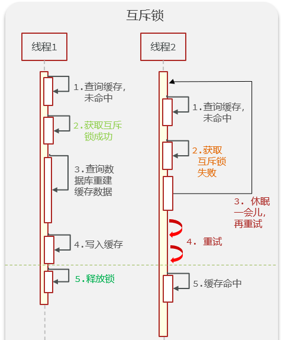

> 逻辑过期


> 两种解决方式的联系与区别

两种方式都是去解决key重建过程复杂。互斥锁保证了一致性，逻辑过期保证了数据的可用性。


### 7. 如何保证数据库与缓存数据的一致性

1. 本地缓存同步：当前微服务的数据库数据与缓存数据同步，可以直接在数据库修改时加入对Redis的修改逻辑，保证一致。
2. 跨服务缓存同步：服务A调用了服务B，并对查询结果缓存。服务B数据库修改，可以通过MQ通知服务A，服务A修改Redis缓存数据
3. 通用方案：使用Canal框架，伪装成MySQL的salve节点，监听MySQL的binLog变化，然后修改Redis缓存数据


## 8. 消息队列相关

### 0. 概念

什么是消息队列：字面意思就是存放消息的队列。最简单的消息队列模型包括3个角色：

* 消息队列：存储和管理消息，也被称为消息代理（Message Broker）
* 生产者：发送消息到消息队列
* 消费者：从消息队列获取消息并处理消息


这里我们可以使用一些现成的mq，比如kafka，rabbitmq等等，但是呢，如果没有安装mq，我们也可以直接使用redis提供的mq方案，降低我们的部署和学习成本。

### 1. Reddis与专业的消息队列中间件的区别

#### 1.1 Reddis作消息队列

Redis提供了三种不同的方式来实现消息队列：

- list结构：基于List结构模拟消息队列
- PubSub：基本的点对点消息模型
- Stream：比较完善的消息队列模型

为什么选用Redis做消息队列 -> 简单易部署，并发要求低   [面试题：用Redis实现一个消息队列](https://www.jianshu.com/p/f64567b7b66f)

> 利用List实现消息队列

而Redis的list数据结构是一个**双向链表**，很容易模拟出队列效果。

队列是入口和出口不在一边，因此我们可以利用：LPUSH 结合 RPOP、或者 RPUSH 结合 LPOP来实现。
不过要注意的是，当队列中没有消息时RPOP或LPOP操作会返回null，并不像JVM的阻塞队列那样会阻塞并等待消息。因此这里应该**使用BRPOP或者BLPOP来实现阻塞效果**。

基于List的消息队列有哪些优缺点？
优点：

* 利用Redis存储，不受限于JVM内存上限
* 基于Redis的持久化机制，数据安全性有保证
* 可以满足消息有序性

缺点：

* 无法避免消息丢失
* 只支持单消费者


#### 1.2 专业的MQ中间件


kafka是以**吞吐量高**而闻名，**不过其数据稳定性一般，而且无法保证消息有序性**。

RabbitMQ基于面向并发的语言Erlang开发，吞吐量不如Kafka，但是对中小公司来讲够用了。而且**消息可靠性较好，并且消息延迟极低，集群搭建比较方便**。**支持多种协议，并且有各种语言的客户端，比较灵活**。Spring对RabbitMQ的支持也比较好，使用起来比较方便。

#### 1.3 二者的区别

Redis可以用作队列，而且性能很高，部署维护也很轻量，但缺点是无法严格保数据的完整性（个人认为这就是业界有争议要不要使用Redis当作队列的地方）。而使用专业的队列中间件，可以严格保证数据的完整性，但缺点是，部署维护成本高。

针对 Redis 是否适合做消息队列，关键看业务场景：

- 如果业务场景足够简单，对于数据丢失不敏感，而且消息积压概率比较小的情况下，例如发短信、发通知的场景把 Redis 当作队列是完全可以的。
- 如果业务有海量消息，消息积压的概率比较大，并且不能接受数据丢失，例如交易、支付等场景还是用kafka，rabbitmq等专业的消息队列中间件。


### 2. RabbitMQ如何保证消息不丢失

RabbitMQ针对消息传递过程中可能发生问题的各个地方，给出了针对性的解决方案：

> 生产者发送消息时可能因为网络问题导致消息没有到达交换机

RabbitMQ提供了publisher confirm机制

- 生产者发送消息后，可以编写ConfirmCallback函数
- 消息成功到达交换机后，RabbitMQ会调用ConfirmCallback通知消息的发送者，返回ACK
- 消息如果未到达交换机，RabbitMQ也会调用ConfirmCallback通知消息的发送者，返回NACK
- 消息超时未发送成功也会抛出异常

> 消息到达交换机后，如果未能到达队列，也会导致消息丢失

RabbitMQ提供了publisher return机制

- 生产者可以定义ReturnCallback函数
- 消息到达交换机，未到达队列，RabbitMQ会调用ReturnCallback通知发送者，告知失败原因

> 消息到达队列后，MQ宕机也可能导致丢失消息

RabbitMQ提供了持久化功能，集群的主从备份功能

- 消息持久化，RabbitMQ会将交换机、队列、消息持久化到磁盘，宕机重启可以恢复消息
- 镜像集群，仲裁队列，都可以提供主从备份功能，主节点宕机，从节点会自动切换为主，数据依然在

> 消息投递给消费者后，如果消费者处理不当，也可能导致消息丢失

SpringAMQP基于RabbitMQ提供了**消费者确认机制、消费者重试机制，消费者失败处理策略**：

- 消费者的确认机制：
    - 消费者处理消息成功，未出现异常时，Spring返回ACK给RabbitMQ，消息才被移除
    - 消费者处理消息失败，抛出异常，宕机，Spring返回NACK或者不返回结果，消息不被移除
- 消费者重试机制：
    - 默认情况下，消费者处理失败时，消息会再次回到MQ队列，然后投递给其它消费者。Spring提供的消费者重试机制，则是在处理失败后不返回NACK，而是直接在消费者本地重试。多次重试都失败后，则按照消费者失败处理策略来处理消息。避免了消息频繁入队带来的额外压力。
- 消费者失败策略：
    - 当消费者多次本地重试失败时，消息默认会丢弃。
    - Spring提供了Republish策略，在多次重试都失败，耗尽重试次数后，将消息重新投递给指定的异常交换机，并且会携带上异常栈信息，帮助定位问题。

### 3. RabbitMQ如何避免消息堆积

消息堆积问题产生的原因往往是因为消息发送的速度超过了消费者消息处理的速度。因此解决方案无外乎以下三点：

- 提高消费者处理速度
- 增加更多消费者
- 增加队列消息存储上限

1）提高消费者处理速度

消费者处理速度是由业务代码决定的，所以我们能做的事情包括：

- 尽可能优化业务代码，提高业务性能
- 接收到消息后，开启线程池，并发处理多个消息

优点：成本低，改改代码即可

缺点：开启线程池会带来额外的性能开销，对于高频、低时延的任务不合适。推荐任务执行周期较长的业务。

2）增加更多消费者

一个队列绑定多个消费者，共同争抢任务，自然可以提供消息处理的速度。

优点：能用钱解决的问题都不是问题。实现简单粗暴

缺点：问题是没有钱。成本太高

3）增加队列消息存储上限

在RabbitMQ的1.8版本后，加入了新的队列模式：**Lazy Queue**

这种队列不会将消息保存在内存中，而是在收到消息后直接写入磁盘中，理论上没有存储上限。可以解决消息堆积问题。

优点：磁盘存储更安全；存储无上限；避免内存存储带来的Page Out问题，性能更稳定；

缺点：磁盘存储受到IO性能的限制，消息时效性不如内存模式，但影响不大。


### 4. RabbitMQ如何保证消息的有序性？

其实RabbitMQ是队列存储，天然具备先进先出的特点，只要消息的发送是有序的，那么理论上接收也是有序的。不过当一个队列绑定了多个消费者时，可能出现消息轮询投递给消费者的情况，而消费者的处理顺序就无法保证了。

因此，要保证消息的有序性，需要做的下面几点：

- 保证消息发送的有序性
- 保证一组有序的消息都发送到同一个队列
- 保证一个队列只包含一个消费者


### 5. 如何防止MQ消息被重复消费？

消息重复消费的原因多种多样，不可避免。所以只能从消费者端入手，只要能保证消息处理的幂等性就可以确保消息不被重复消费。

而幂等性的保证又有很多方案：

- 给每一条消息都添加一个唯一id，在本地记录消息表及消息状态，处理消息时基于数据库表的id唯一性做判断
- 同样是记录消息表，利用消息状态字段实现基于乐观锁的判断，保证幂等
- 基于业务本身的幂等性。比如根据id的删除、查询业务天生幂等；新增、修改等业务可以考虑基于数据库id唯一性、或者乐观锁机制确保幂等。本质与消息表方案类似。


### 6. 如何保证RabbitMQ的高可用？

要实现RabbitMQ的高可用无外乎下面两点：

- 做好交换机、队列、消息的持久化
- 搭建RabbitMQ的镜像集群，做好主从备份。当然也可以使用仲裁队列代替镜像集群。


### 7. 使用MQ可以解决哪些问题？

- 解耦合：将几个业务关联的微服务调用修改为基于MQ的异步通知，可以解除微服务之间的业务耦合。同时还提高了业务性能。

- 流量削峰：将突发的业务请求放入MQ中，作为缓冲区。后端的业务根据自己的处理能力从MQ中获取消息，逐个处理任务。流量曲线变的平滑很多

- 延迟队列（异步）：基于RabbitMQ的死信队列或者DelayExchange插件，可以实现消息发送后，延迟接收的效果。

- ⽇志处理 - 解决⼤量⽇志传输。 

- 消息通讯 - 消息队列⼀般都内置了⾼效的通信机制，因此也可以⽤在纯的消息通 

    讯。⽐如实现点对点消息队列，或者聊天室等。

## 9. 关系型数据库的四大特性（ACID特性）

ACID，原子性(Atomicity)、一致性(Consistency)、隔离性(Isolation)、持久性(Durability)

### 1. 原子性

原子性是指一个事务是一个不可分割的工作单位，**其中的操作要么都做，要么都不做**。

> 如何保证原子性

主要是利用 Innodb 的**undo log**。 **undo log**名为回滚日志，是实现原子性的关键，当事务回滚时能够撤销所有已经成功执行的 SQL语句，他需要记录你要回滚的相应日志信息。 例如

- 当你delete一条数据的时候，就需要记录这条数据的信息，回滚的时候，insert这条旧数据
- 当你update一条数据的时候，就需要记录之前的旧值，回滚的时候，根据旧值执行update操作
- 当年insert一条数据的时候，就需要这条记录的主键，回滚的时候，根据主键执行delete操作

**undo log**记录了这些回滚需要的信息，当事务执行失败或调用了**rollback**，导致事务需要回滚，便可以利用**undo log**中的信息将数据回滚到修改之前的样子。

### 2. 一致性

一致性是指事务执行前后，数据处于一种合法的状态，这种状态是语义上的而不是语法上的。 那什么是合法的数据状态呢？这个状态是满足预定的约束就叫做合法的状态，再通俗一点，这状态是由你自己来定义的。**满足这个状态，数据就是一致的，不满足这个状态，数据就是不一致的！**

> 数据库如何保证一致性

**从数据库层面**，数据库通过原子性、隔离性、持久性来保证一致性。也就是说ACID四大特性之中，C(一致性)是目的，A(原子性)、I(隔离性)、D(持久性)是手段，是为了保证一致性，数据库提供的手段。数据库必须要实现AID三大特性，才有可能实现一致性。例如，原子性无法保证，显然一致性也无法保证。

**从应用层面**，通过代码判断数据库数据是否有效，然后决定回滚还是提交数据！


### 3. 隔离性

隔离性是指**多个事务并发执行的时候，事务内部的操作与其他事务是隔离的**，并发执行的各个事务之间不能互相干扰。


### 4. 一致性

根据定义，**持久性是指事务一旦提交，它对数据库的改变就应该是永久性的**。接下来的其他操作或故障不应该对其有任何影响。

> 数据库如何保证持久性

主要是利用Innodb的**redo log**重写日志。

正如之前说的，MySQL是先把磁盘上的数据加载到内存中，在内存中对数据进行修改，再写回到磁盘上。如果此时突然宕机，内存中的数据就会丢失。 怎么解决这个问题？ 简单啊，事务提交前直接把数据写入磁盘就行啊。 这么做有什么问题？

- 只修改一个页面里的一个字节，就要将整个页面刷入磁盘，太浪费资源了。毕竟一个页面16kb大小，只改其中一点点东西，就要将16kb的内容刷入磁盘，听着也不合理。
- 毕竟一个事务里的SQL可能牵涉到多个数据页的修改，而这些数据页可能不是相邻的，也就是属于随机IO。显然操作随机IO，速度会比较慢。

于是，采用**redo log**解决上面的问题。当做数据修改的时候，不仅在内存中操作，还会在**redo log**中记录这次操作。当事务提交的时候，会将**redo log**日志进行刷盘(**redo log**一部分在内存中，一部分在磁盘上)。当数据库宕机重启的时候，会将redo log中的内容恢复到数据库中，再根据**undo log**和**binlog**内容决定回滚数据还是提交数据。

> 采用redo log的好处

好处就是将**redo log**进行刷盘比对数据页刷盘效率高，具体表现如下：

**redo log**体积小，毕竟只记录了哪一页修改了啥，因此体积小，刷盘快。

**redo log**是一直往末尾进行追加，属于顺序IO。效率显然比随机IO来的快。

## 10. 如何解决数据库的高并发

1. 在web服务框架中加入缓存。在服务器与数据库层之间加入缓存层，将高频访问的数据存入缓存中，减少数据库的读取负担。
2. 增加数据库索引，进而提高查询速度。（不过索引太多会导致速度变慢，并且数据库的写入会导致索引的更新，也会导致速度变慢）
3. 主从读写分离，让主服务器负责写，从服务器负责读。
4. 将数据库进行拆分，使得数据库的表尽可能小，提高查询的速度。
5. 使用分布式架构，分散计算压力。

## 11. 数据库的隔离级别

### 1. 数据库并发事务会带来哪些问题

数据库并发会带来**脏读、幻读、丢弃更改、不可重复读**这四个常见问题，其中：

**脏读**：

1、在事务A执行过程中，事务A对数据资源进行了修改，事务B读取了事务A修改后的数据。

2、由于某些原因，事务A并没有完成提交，发生了RollBack操作，则事务B读取的数据就是脏数据。

这种读取到另一个事务未提交的数据的现象就是脏读(Dirty Read)。


**不可重复读**：

事务B读取了两次数据资源，在这两次读取的过程中事务A修改了数据，导致事务B在这两次读取出来的数据不一致。

这种在同一个事务中，前后两次读取的数据不一致的现象就是不可重复读(Nonrepeatable Read)。


**幻读**：

事务B前后两次读取同一个范围的数据，在事务B两次读取的过程中事务A新增了数据，导致事务B后一次读取到前一次查询没有看到的行。

幻读和不可重复读有些类似，但是幻读强调的是数据范围的增减，而不是单条数据的更新。


**更新丢失：**

第一类：

事务A和事务B都对数据进行更新，但是事务A由于某种原因事务回滚了，把已经提交的事务B的更新数据给覆盖了。这种现象就是第一类更新丢失。


第二类：

其实跟第一类更新丢失有点类似，也是两个事务同时对数据进行更新，但是事务A的更新把已提交的事务B的更新数据给覆盖了。这种现象就是第二类更新丢失。


### 2. 事务隔离

为了解决以上的问题，主流的关系型数据库都会提供四种事务的隔离级别。事务隔离级别从低到高分别是：读未提交、读已提交(不可重复读)、可重复读、串行化。**事务隔离级别等级越高，越能保证数据的一致性和完整性，但是执行效率也越低**。所以在设置数据库的事务隔离级别时需要做一下权衡，**MySQL默认是可重复读的级别**。


> 读未提交

读未提交(Read Uncommitted)，是最低的隔离级别，所有的事务都可以看到其他未提交的事务的执行结果。只能防止第一类更新丢失，不能解决脏读，可重复读，幻读，所以很少应用于实际项目。

例如：比如对于一个数A原来50修改为100，但是我还没有提交修改，另一个事务看到这个修改，而这个时候原事务发生了回滚，这时候A还是50，但是另一个事务看到的A是100

> 读已提交(不可重复读)

读已提交(Read Committed)， 在该隔离级别下，一个事务的更新操作结果只有在**该事务提交之后，另一个事务才可能读取到同一笔数据更新后的结果**。可以防止脏读和第一类更新丢失，但是不能解决可重复读和幻读的问题。

例如：对于一个数A原来是50，然后提交修改成100，这个时候另一个事务在A提交修改之前，读取的A是50，刚读取完，A就被修改成100，这个时候另一个事务再进行读取发现A就突然变成100了；

> 可重复读

可重复读(Repeatable Read)，MySQL默认的隔离级别。在该隔离级别下，一个事务多次读同一个数据，在这个事务还没结束时，其他事务不能访问该数据(包括了读写)，这样就可以在同一个事务内两次读到的数据是一样的。可以防止脏读、不可重复读、第一类更新丢失、第二类更新丢失的问题，不过还是会出现幻读。

例如：对于一个数A读取的话一直是A，前后两次读取的A是一致的。但是这阻止不了新增数据（即解决不了幻读的问题）。

> 串行化

串行化(Serializable)，这是最高的隔离级别。它要求事务序列化执行，事务只能一个接着一个地执行，不能并发执行。在这个级别，可以解决上面提到的所有并发问题，但可能导致大量的超时现象和锁竞争，通常不会用这个隔离级别。

### 3. MySQL的InnoDB采取的隔离级别

MySQL默认是可重复读的级别，但是与与 SQL 标准不同的地方在于InnoDB 存储引擎在 REPEATABLE-READ（可重读）事务隔离级别 下使用的是**Next-Key Lock** **锁**算法，因此可以避免幻读的产生，这与其他数据库系统(如SQL Server)是不同的。所以 说InnoDB 存储引擎的默认支持的隔离级别是 REPEATABLE-READ（可重读） 已经可以完全保证事务的隔离性要 求，即达到了 SQL标准的SERIALIZABLE(可串行化)隔离级


###  


​	


写一个MySQL语句 -> 类似 牛客185. 部门工资前三高的所有员工

levelDB

多个任务直接有依赖关系，通过什么数据结构描述这个关系？——图（拓扑结构）

# 6. 设计模式

## 1. 六大设计原则

（1）单⼀职责原则SRP（Single Responsibility Principle）：说⼀个类只提供⼀种功能和仅有⼀个引起它变化的因素。

（2）开放封闭原则OCP（Open Close Principle）：对⼀个类来说，对它的内部修改是封闭的，对它的扩展是开放的。即⾯对需求，对程序的改动可以通过增加代码来完成，但是不能改动现有的代码。

（3）⾥⽒替换原则LSP（Liskov Substitution Principle）：⼀个软件实体如果使⽤的是⼀个基类，那么⼀定适⽤于其派⽣类。即在软件中，把基类替换成派⽣类，程序的⾏为没有变化。

（4）依赖倒转原则DIP（Dependence Inversion Principle）：抽象不应该依赖细节，细节应该依赖抽象。即针对接⼝编程，不要对实现编程。

（5）迪⽶特原则/合成复用原则CRP（Composite Reuse Principle）：如果两个类不直接通信，那么这两个类就不应当发⽣直接的相互作⽤。如果⼀个类需要调⽤另⼀个类的某个⽅法的话，可以通过第三个类转发这个调⽤。（多⽤组合设计类，少⽤继承。）

（6）接⼝隔离原则ISP（Interface Segregation Principle）：建⽴单⼀接⼝，不要建⽴庞⼤臃肿的接⼝，尽量细化接口，接⼝中的⽅法尽量少。也就是说，我们要为各个类建⽴专⽤的接⼝，⽽不要试图去建⽴⼀个很庞⼤的接⼝供所有依赖它的类去调⽤。

> 单一职责原则和接口隔离原则的区别

- 单⼀职责原则注重的是**职责**；⽽接⼝隔离原则注重对**接⼝依赖的隔离**。
- 单⼀职责原则主要是**约束类**，其次才是接⼝和⽅法，它针对的是程序中的**实现和细节**； ⽽接⼝隔离原则主要**约束接⼝**，主要针对抽象，针对程序**整体框架的构建**。

## 2. 设计模式的分类

**创造型模式**：**单例模式**、**⼯⼚模式**、建造者模式、原型模式

**结构型模式**：适配器模式、桥接模式、外观模式、组合模式、**装饰模式**、享元模式、代理模式

**⾏为型模式**：责任链模式、命令模式、解释器模式、迭代器模式、中介者模式、备忘录模式、**观察者模式**、状态模式、策略模式、模板⽅法模式、访问者模式。

## 3. 单例模式

> 有两种——懒汉和饿汉：
>
> 饿汉：饿了就饥不择⻝了，所以在单例类定义的时候就进⾏实例化。
>
> 懒汉：顾名思义，不到万不得已就不会去实例化类，也就是在第⼀次⽤到的类实例的时候才会去实例化。

### 0. 适用场景

（1）系统只需要⼀个实例对象，或者考虑到资源消耗的太⼤⽽只允许创建⼀个对象。

（2）客户调⽤类的单个实例只允许使⽤⼀个公共访问点，除了该访问点之外不允许通过其它⽅式访问该实例（就是共有的静态⽅法）。

### 1. 饿汉模式（线程安全）

在最开始的时候静态对象就已经创建完成，设计⽅法是类中包含⼀个静态成员指针，该指针指向该类的⼀个对象，提供⼀个公有的静态成员⽅法，返回该对象指针，为了使得对象唯⼀，**构造函数设为私有**。

```C++
class SingleInstance {
public:
    static SingleInstance* GetInstance() {
        static SingleInstance ins;
        return &ins;
    }
    ~SingleInstance(){};
private:
    //涉及到创建对象的函数都设置为private
    SingleInstance() { std::cout<<"SingleInstance() 饿汉"<<std::endl; }
    SingleInstance(const SingleInstance& other) {};
    SingleInstance& operator=(const SingleInstance& other) {return *this;}
};
int main(){
    //因为不能创建对象所以通过静态成员函数的⽅法返回静态成员变量
    SingleInstance* ins = SingleInstance::GetInstance();
    return 0; 
}
//输出结果 
SingleInstance() 饿汉
```


### 2. 懒汉模式（线程安全需要加锁）

尽可能晚地创建这个对象的实例，即在单例类第⼀次被引⽤的时候就将⾃⼰初始化，C++ 很多地⽅都有类型的思想，⽐如写时拷⻉，晚绑定等。

```C++
class SingleInstance {
public:
    static SingleInstance* GetInstance() {
        if (ins == nullptr) {
            pthread_mutex_lock(&mutex);
            if (ins == nullptr) ins = new SingleInstance();
            pthread_mutex_unlock(&mutex);
        }
        return ins;
    }
    ~SingleInstance(){};
    //互斥锁
    static pthread_mutex_t mutex;
private:
    //静态成员
    static SingleInstance* ins;
    //涉及到创建对象的函数都设置为private
    SingleInstance() { std::cout<<"SingleInstance() 懒汉"<<std::endl; }
    SingleInstance(const SingleInstance& other) {};
    SingleInstance& operator=(const SingleInstance& other) { return *this; }
};
//懒汉式 静态变量需要定义
SingleInstance* SingleInstance::ins = nullptr;
pthread_mutex_t SingleInstance::mutex;

int main(){
    //因为不能创建对象所以通过静态成员函数的⽅法返回静态成员变ᰁ
    SingleInstance* ins = SingleInstance::GetInstance();
    delete ins;
    return 0; 
}
//输出结果
SingleInstance() 懒汉
```

## 4. 工厂模式

### 1. 简单⼯⼚模式

就是建⽴⼀个⼯⼚类，对实现了同⼀接⼝的⼀些类进⾏实例的创建。简单⼯⼚模式的实质是**由⼀个⼯⼚类根据传⼊的参数，动态决定应该创建哪⼀个产品类（这些产品类继承⾃⼀个⽗类或接⼝）的实例**。

```C++
//产品类（抽象类，不能实例化）
class Product{
public:
    Product(){};
    virtual void show() = 0; //纯虚函数
};
class productA : public Product{
public:
    productA(){};
    void show(){ std::cout << "product A create!" << std::endl; };
    ~productA(){};
};
class productB : public Product{
public:
    productB(){};
    void show(){ std::cout << "product B create!" << std::endl; };
    ~productB(){};
};
class simpleFactory{ // ⼯⼚类
public:
    simpleFactory(){};
    Product* product(const string str){
        if (str == "productA") return new productA();
        if (str == "productB") return new productB();
        return NULL;
    };
};
int main(){
    simpleFactory obj; // 创建⼯⼚
    Product* pro; // 创建产品
    pro = obj.product("productA");
    pro->show(); // product A create!
    delete pro;
    pro = obj.product("productB");
    pro->show(); // product B create!
    delete pro;
    return 0; 
}
// 输出结果
product A create!
product B create!
```

工厂模式⽬的就是代码解耦，如果我们不采⽤⼯⼚模式，如果要创建产品 A、B，通常做法采⽤ switch...case语句，那么想⼀想后期添加更多的产品进来，我们不是要添加更多的switch...case 吗？这样就很麻烦，⽽且也不符合设计模式中的开放封闭原则。

### 2. 抽象⼯⼚模式

为了进⼀步解耦，在简单⼯⼚的基础上发展出了抽象⼯⼚模式，即连⼯⼚都抽象出来，实现了进⼀步代码解耦。

```C++
// 产品类（抽象类，不能实例化）
class Product{
public:
    Product(){}
    virtual void show() = 0; //纯虚函数
};
// 工厂类（抽象类，不能实例化）
class Factory{
public:
    virtual Product* CreateProduct() = 0;//纯虚函数
};
//产品A
class ProductA:public Product{
public:
    ProductA(){}
    void show(){ std::cout<<"product A create!"<<std::endl; };
};
//产品B
class ProductB:public Product{
public:
    ProductB(){}
    void show(){ std::cout<<"product B create!"<<std::endl; };
};
//⼯⼚类A，只⽣产A产品
class FactorA: public Factory{
public:
    Product* CreateProduct(){
        Product* product_ = nullptr;
        product_ = new ProductA();
        return product_;
    }
};
//⼯⼚类B，只⽣产B产品
class FactorB: public Factory{
public:
    Product* CreateProduct(){
        Product* product_ = nullptr;
        product_ = new ProductB();
        return product_;
    }
};
int main(){
    // 调⽤产品A的⼯⼚来⽣产A产品
    Product* product_ = nullptr;
    auto MyFactoryA = new FactorA();
    product_ = MyFactoryA->CreateProduct();
    product_->show();
    delete product_;
    // 调⽤产品B的⼯⼚来⽣产B产品
    auto MyFactoryB=new FactorB();
    product_ = MyFactoryB->CreateProduct();
    product_->show();
    delete product_;
    return 0; 
}
// 输出结果
product A create!
product B create!
```

## 5. 观察者模式

### 1. 两种角色

观察者模式：定义⼀种 **⼀（被观察类）对多（观察类）** 的关系，让多个观察对象同时监听⼀个被观察对象，被观察对象状态发⽣变化时，会通知所有的观察对象，使他们能够更新⾃⼰的状态。

观察者模式中存在两种⻆⾊：

观察者：内部包含被观察者对象，当被观察者对象的状态发⽣变化时，更新⾃⼰的状态。（接收通知更新状态）

被观察者：内部包含了所有观察者对象，当状态发⽣变化时通知所有的观察者更新⾃⼰的状态。（发送通知）

### 2. 应⽤场景

- 当⼀个对象的改变需要同时改变其他对象，且不知道具体有多少对象有待改变时，应该考虑使⽤观察者模式；
- ⼀个抽象模型有两个⽅⾯，其中⼀⽅⾯依赖于另⼀⽅⾯，这时可以⽤观察者模式将这两者封装在独⽴的对象中使它们各⾃独⽴地改变和复⽤。

### 3. 实现例子

```C++
class Subject;
//观察者 基类 （内部实例化了被观察者的对象sub）
class Observer {
protected:
    string name;
    Subject *sub;
public:
    Observer(string name, Subject *sub) {
        this->name = name;
        this->sub = sub;
    }
    virtual void update() = 0;
};
class StockObserver : public Observer {
public:
    StockObserver(string name, Subject *sub) : Observer(name, sub){}
    void update();
};
class NBAObserver : public Observer {
public:
    NBAObserver(string name, Subject *sub) : Observer(name, sub){}
    void update();
};
//被观察者 基类 （内部存放了所有的观察者对象，以便状态发⽣变化时，给观察者发通知）
class Subject {
protected:
    std::list<Observer *> observers;
public:
    string action; //被观察者对象的状态
    virtual void attach(Observer *) = 0;
    virtual void detach(Observer *) = 0;
    virtual void notify() = 0;
};
class Secretary : public Subject {
    void attach(Observer *observer) {
        observers.push_back(observer);
    }
    void detach(Observer *observer) {
        list<Observer *>::iterator iter = observers.begin();
        while (iter != observers.end()) {
            if ((*iter) == observer) {
                observers.erase(iter);
                return;
            }
            ++iter;
        }
    }
    void notify() {
        list<Observer *>::iterator iter = observers.begin();
        while (iter != observers.end()) {
            (*iter)->update();
            ++iter;
        }
    }
};
void StockObserver::update() {
    cout << name << " 收到消息：" << sub->action << endl;
    if (sub->action == "⽼板来了!") {
        cout << "我⻢上关闭股票，装做很认真⼯作的样⼦！" << endl;
    }
}
void NBAObserver::update() {
    cout << name << " 收到消息：" << sub->action << endl;
    if (sub->action == "⽼板来了!") {
        cout << "我⻢上关闭 NBA,装做很认真⼯作的样⼦!" << endl;
    }
}
int main() {
    Subject *BOSS = new Secretary();
    Observer *xa = new NBAObserver("xa", BOSS);
    Observer *xb = new NBAObserver("xb", BOSS);
    Observer *xc = new StockObserver("xc", BOSS);
    BOSS->attach(xa);
    BOSS->attach(xb);
    BOSS->attach(xc);
    BOSS->action = "去吃饭了！";
    BOSS->notify();
    cout << endl;
    BOSS->action = "⽼板来了!";
    BOSS->notify();
    return 0; 
}
// 输出结果
xa 收到消息：去吃饭了！
xb 收到消息：去吃饭了！
xc 收到消息：去吃饭了！

xa 收到消息：⽼板来了!
我⻢上关闭 NBA,装做很认真⼯作的样⼦!
xb 收到消息：⽼板来了!
我⻢上关闭 NBA,装做很认真⼯作的样⼦!
xc 收到消息：⽼板来了!
我⻢上关闭股票，装做很认真⼯作的样⼦！
```

## 6. 装饰器模式

装饰器模式（Decorator Pattern）允许向⼀个现有的对象添加新的功能，同时⼜不改变其结构。

这种类型的设计模式属于结构型模式，它是作为现有的类的⼀个包装。

如下例子中，代码没有改变 Car 类的内部结构，还为其增加了新的功能，这就是装饰器模式的作⽤。

```C++
//抽象构件类 Transform (变形⾦刚)
class Transform{
public:
    virtual void move() = 0;
};
//具体构件类Car
class Car : public Transform{
public:
    Car() {
        std::cout << "变形⾦刚是⼀辆⻋！" << endl;
    }
    void move() {
        std::cout << "在陆地上移动。" << endl;
    }
};
//抽象装饰类
class Changer : public Transform{
public:
    Changer(shared_ptr<Transform> transform) {
        this->transform = transform;
    }
    void move() {
        transform->move();
    }
private:
    shared_ptr<Transform> transform;
};
//具体装饰类Robot
class Robot : public Changer{
public:
    Robot(shared_ptr<Transform> transform) : Changer(transform) {
        std::cout << "变成机器⼈!" << std::endl;
    }
    void say() {
        std::cout << "说话!" << std::endl;
    }
};
//具体装饰类AirPlane
class Airplane : public Changer{
public:
    Airplane(shared_ptr<Transform> transform) : Changer(transform){
        std::cout << "变成⻜机!" << std::endl;
    }
    void say(){
        std::cout << "在天空⻜翔!" << std::endl;
    } 
};
int main(void) {
    shared_ptr<Transform> camaro = make_shared<Car>();
    camaro->move();
    std::cout << "--------------" << endl;
    shared_ptr<Robot> bumblebee = make_shared<Robot>(camaro);
    bumblebee->move();
    bumblebee->say();
    std::cout << "--------------" << endl;
    shared_ptr<Airplane> plane = make_shared<Airplane> (camaro);
    plane->move();
    plane->say();
    return 0; 
}
// 输出结果
变形⾦刚是⼀辆⻋！
在陆地上移动。
--------------
变成机器⼈!
在陆地上移动。
说话!
--------------
变成⻜机!
在陆地上移动。
在天空⻜翔!
```


# 7. ELSE

## 1. 常用的linux命令


1-ls-列出文件list

List列出当前路径下的文件与文件夹。

> ls 常用参数：
> -l：列出文件的详细信息
> -a：all，列出所有文件，包括隐藏文件
> 注：参数可以叠加使用，如-la表示列出所有文件及其详细信息

2-cd：切换目录change directory

```shell
## cd用法
cd /home		# 切换/进入home目录
cd ..			# 到上一目录（父目录）
cd ../..		# 到父目录的父目录
cd .			# 进入当前目录（其实啥都不做）
```

3-复制 copy

> cp 常用参数：
> -i：interactive mode，若有同名文件，会询问是否覆盖（如果没这个参数，会不提示，直接覆盖）
> -r：recursive copy，复制文件夹时连同子文件（夹）一起复制，如果是对文件夹进行操作，一定要带这个参数

```shel
## cp用法
cp -ir sourceDir/ home/targetDir/	# 把当前路径下的sourceDir文件夹复制到home目录下，取名为targetDir，且带参数-i和-r
```

4-mv 移动

即剪切操作。源文件会被删除。

> mv 参数：
> -i： interactive mode，同cp的-i参数，若覆盖会询问

```shell
## mv用法
mv -i sourceFile /home/targetFile	# 把当前目录下的sourceFile剪切到/home目录下并命名为targetFile
```

5-rm 移除/删除

> rm 参数：
> -i：interactive，同上，若覆盖，先询问
> -r：recursive mode，删除所有子文件（夹）

```shell
## rm用法
rm Dir/	# 删除Dir文件夹（错误示例，会报错）
rm -r Dir/	# 删除Dir文件夹（正确，对文件夹操作一定要带-r）
```

6-mkdir 创建文件夹

```shell
## mkdir用法
mkdir newDir/	# 在当前路径创建一个空文件夹newDir/
```

7-rmdir-移除文件夹

```shell
## rmdir用法
rmdir oldDir/	# 在当前路径删除oldDir文件夹及其子文件（夹）
```

8-chown 更改所有者

> chown 参数：
> -R： 同-r，recursive

```bash
## chown用法
chown user -R myDir/	# 把文件夹myDir的所有者改成user
```

9-chmod 更改文件的权限模式

文件权限模式针对三类对象：当前用户user（这里也是文件的所有者），组group，其他用户other。
文件权限有读Read，写Write，执行Execute。

> chmod参数：
> u: user，权限对象为当前用户（这里是所有者）
> g：group，权限对象为所有者和组
> o：other，权限对象为其他用户
> r：read = 4，读权限
> w：write = 2，写权限
> e：execute = 1，执行权限
> +：u/g/o与r/w/e组合使用，加入
> -：删除
> =：设置
> 4：仅读
> 5：仅读+执行
> 6：仅读+写
> 7：读+写+执行

```shell
## chmod用法
chmod 754 myDir/	# 当前用户（所有者）可读+写+执行，组group可读+执行，其他用户可读
chmod g+w myDir/	# 为组group添加写write权限
chmod -R 777 myDir/ # 给myDir/及其所有子目录添加所有权限
ls -n # 可以查看当前目录下各子目录的文件权限
```

10-find

> find 常用参数：
> -name：根据文件名查找
> -mtime n：n为数字，表示找出在n天前的当天被更改过的文件（0表示今天）
> -mtime +n：查找在n天前（不包括n天当天）被改过的文件
> -mtime -n：查找在n天之内（包括n天当天）被改过的文件
> -size +/-：查找比XXsize大/小的文件

```bash
find 常用参数：
-name：根据文件名查找
-mtime n：n为数字，表示找出在n天前的当天被更改过的文件（0表示今天）
-mtime +n：查找在n天前（不包括n天当天）被改过的文件
-mtime -n：查找在n天之内（包括n天当天）被改过的文件
-size +/-：查找比XXsize大/小的文件

## find用法
find /home -name myFile		# 在/home目录下查找文件名为myFile的文件（注：myFile也可以搭配正则表达式使用）
find /home -name *.txt		# 在/home目录下查找以txt为后缀的文件
find /home -mtime 0			# 在/home目录下查找今天内被改过的文件
find /home -mtime +1		# 在/home目录下查找昨天之前（不包括昨天）被改过的文件
find /home -mtime -1		# 在/home目录下查找昨天至今（即昨天和今天）被改过的文件
find /home -size +100M		# 在/home目录下查找大于100MB的文件，注意c表示byte
```

11-管道

将前一个命令的输出结果像管道一样传递给后一个命令作为输入

```bash
## 管道|用法
ls | find -name myFile	# 列出当前路径的文件（夹）并查找名字为“myFile”的，打印出来
```

12-grep 按行查找并匹配

> grep参数：
> -r：recursive，查找所有子文件（夹）
> -n：number，显示行号
> -w：word，完整匹配整个单词
> -i：insensitive search，忽略大小写
> -l：显示文件名称，而非匹配到的行的内容
> -v：反向选择，显示出没匹配到的行的内容

```bash
## grep用法

grep -i mystring file.txt	# 忽略大小写，在file.txt中查找并打印出有“mystring”的行
ls -l | grep -i mystring	# 在ls -l的输出中把有“mystring”的行打印出来（忽略大小写）
ps -ef | grep 进程号		  # 查询该进程详细信息
```

13-tar：打包，压缩，解压

>  tar常用参数
> -jcv：压缩
> -jxv：解压

```bash
## tar用法

tar -jcv myDir/		# 压缩myDir文件夹
tar -jxv DownloadDir.tar.gz myDir/	# 解压DownloadDir.tar.gz到当前文件夹下，并命令为myDir
```

> 注意-.tar与.tar.gz的区别

**.tar：**

 **只打包，不压缩文件。**

 **解包：tar xvf Name.tar**

 **打包：tar cvf Name.tar dirName**

**.gz:**

 **只压缩，不打包文件**

 **解压：gunzip Name.gz**

 **解压2：gzip -d Name.gz**

 **压缩：gzip Name**

**.tar.gz:**

 **打包压缩文件**

 **解包： tar zxvf Name.tar.gz**

 **打包：tar zcvf Name.tar.gz dirName**

14-cat 打印文件内容

```bash
## cat用法
cat myFile	# 显示myFile
```

15-ps：查看进程process select

> ps 常用参数：
> -A：显示所有进程
> -a：不与terminal有关的所有进程
> -u：有效用户的相关进程
> -x：一般与-a一起用，列出完整的进程信息
> -l：long，详细列出PID的信息

```bash
## ps用法
ps Aux 	# 查看系统所有的进程数据
ps ax	
ps -ef | grep 进程号		  # 查询该进程详细信息
```

16-kill-杀死进程

> kill常用参数：
> -SIGHUP：启动被终止的进程
> -SIGINT：相当于ctrl+c，中断进程
> -SIGKILL：强制中断进程
> -SIGTERM：以正常的结束进程方式来终止进程
> -SIGSTOP：相当于ctrl+z，暂停进程

```bash
## kill用法
kill -SIGKILL 10876	# 强制中断PID=10876的进程（PID可以通过ps查到，有时可以加上| grep进行筛选）
```

17-pwd：显示工作目录print work directory

```bash
# pwd用法
pwd	# 显示当前路径的具体位置
```

18-tree 显示当前目录下文件的树结构

19-bg查看后端运行的进程 background

```bash
bg #会显示后端进程的号码
kill %1 #强制杀死1号进程
```

20-touch创建新文件

```bash
touch new_file.txt # 创建一个new_file.txt文件
```

21-查看文件大小

```bash
du -h #打印当前目录下所有子目录与子文件夹的大小
du -sh * # 打印当前目录下所有文件夹的大小
du -h --max-depth=0 #打印当前目录的大小
du -h --max-depth=1 #打印当前目录下所有子目录的大小 
df -h # 查看磁盘占用的空间
```

22-vim命令

```bash
vim 文件名		# 进入vim模式
按i进入编辑模式，按esc返回查看模式
shift+两下Z	## 保存并退出
# 输入:q，按下回车就可以不保存退出。
# 要保存修改并退出，输入:wq，按回车执行即可。
```

23-tmux 一款优秀的终端复用软件

```bash
tmux new -s name  # 创建一个name的tmux
tmux a it name    # 进入name终端
按住Ctrl+B后再按D   # 退出当前tmux终端 
```

24-查看程序打开的文件

方法一：

```bash
1. 找出进程的PID
ps -aux|[grep] programe-name
2. 查找文件描述符
cd /proc/$PID/fd
3. 得到文件描述符指向的实际文件,即当前进程打开的文件
ls -l
```

方法二：

```bash
1.找出进程的PID
lsof -p $PID
2.查看文件对应的进程：
lsof file-name
```

#lsof命令用法：

```bash
lsof -c abc 显示abc进程现在打开的文件 
lsof abc 显示开启文件abc的进程 
lsof -i :22 显示22端口现在运行什么程序 
lsof -g gid 显示归属gid的进程情况 
lsof +d /usr/local/ 显示目录下被进程开启的文件 
lsof +D /usr/local/ 同上，但是会搜索目录下的目录，时间较长 
lsof -d 4 显示使用fd为4的进程 
lsof -i 用以显示符合条件的进程情况 
lsof -s 列出打开文件的大小，如果没有大小，则留下空白
lsof -u username 以UID，列出打开的文件
```

#查看网络状态：

```bash
lsof -Pnl +M -i4 显示ipv4服务及监听端情况
```


## 2. Linux查看进程的方法

### 1. ps aux

```bash
ps aux
```

ps命令用于报告当前系统的进程状态。可以搭配kill指令随时中断、删除不必要的程序。ps命令是最基本同时也是非常强大的进程查看命令，使用该命令可以确定有哪些进程正在运行和运行的状态、进程是否结束、进程有没有僵死、哪些进程占用了过多的资源等等，总之大部分信息都是可以通过执行该命令得到的。

- a：显示当前终端下的所有进程信息，包括其他用户的进程。
- u：使用以用户为主的格式输出进程信息。
- x：显示当前用户在所有终端下的进程。


**上图中各字段解释：**

- USER：启动该进程的用户账号名称 PID：该进程的ID号，在当前系统中是唯一的 %CPU：CPU占用的百分比 %MEM：内存占用的百分比
- VSZ：占用虚拟内存（swap空间）的大小 RSS：占用常驻内存（物理内存）的大小
- TTY：该进程在哪个终端上运行。“？”表未知或不需要终端 STAT：显示了进程当前的状态，如S（休眠）、R（运行）、Z（僵死）、<（高优先级）、N（低优先级）、s（父进程）、+（前台进程）。对处于僵死状态的进程应予以手动终止。
- START：启动该进程的时间 TIME：该进程占用CPU时间 COMMAND：启动该进程的命令的名称

**总结：ps aux 是以简单列表的形式显示出进程信息。**

### 2. ps -elf

```bash
ps -elf
```

- -e：显示系统内的所有进程信息。
- -l：使用长（long）格式显示进程信息。
- -f：使用完整的（full）格式显示进程信息。


上图字段解释： 大部分跟第一种一样，PPID为父进程的PID。

### 3. top

以全屏交互式的界面显示进程排名，及时跟踪包括CPU、内存等系统资源占用情况，默认情况下每三秒刷新一次，其作用基本类似于Windows系统中的任务管理器。


上图解释：

- Tasks（系统任务）信息：total，总进程数；running，正在运行的进程数；sleeping，休眠的进程数；stopped，中止的进程数；zombie，僵死无响应的进程数。
- CPU信息：us，用户占用；sy，内核占用；ni，优先级调度占用；id，空闲CPU；wa，I/O等待占用；hi，硬件中断占用；si，软件中断占用；st，虚拟化占用。了解空闲的CPU百分比，主要看%id部分。
- Mem（内存）信息：total，总内存空间；used，已用内存；free，空闲内存；buffers，缓存区域。
- Swap（交换空间）信息：total，总交换空间；used，已用交换空间；free，空闲交换空间；cached，缓存空间。

### 4. pstree -aup

以树状图的方式展现进程之间的派生关系，显示效果比较直观。 -a：显示每个程序的完整指令，包含路径，参数或是常驻服务的标示； -c：不使用精简标示法； -G：使用VT100终端机的列绘图字符； -h：列出树状图时，特别标明现在执行的程序； -H<程序识别码>：此参数的效果和指定”-h”参数类似，但特别标明指定的程序； -l：采用长列格式显示树状图； -n：用程序识别码排序。预设是以程序名称来排序； -p：显示程序识别码； -u：显示用户名称；


nginx负载均衡

共享内存的实现

压测工具（webbench的使用和原理）

工厂模式

单例模式

渲染管线

防止重复提交多个请求的方法

如何防止对网页的爬取（比如小说网的小说）

一个程序能产生随机数，利用一个接口读取随机数中第K大的数，怎么实现？如果数据很多怎么实现？

怎么查看cpu占用率？

makefile /shell脚本

git  一个分支同步另一个分支的一个commit  什么命令

linux命令 把服务器的一个文件拷贝到本地

帧同步与状态同步

描述调用main函数、实例化类，调用类中的成员函数，这一系列操作中程序的执行过程。

大型文件编译的方法 -> 说了make，CMakeLists，scons

看一下muduo库：muduo库中你觉得最巧妙的设计

（注）之后将C:\Users\35144\AppData\Roaming\Typora\typora-user-images里面的文档图片改为跟文档相同目录下


